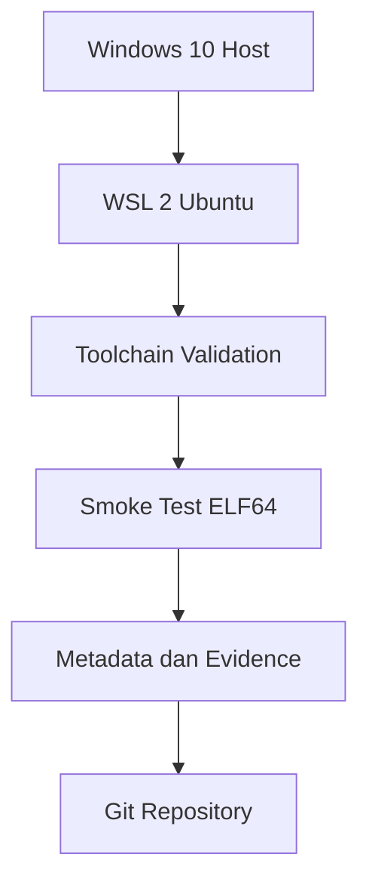

 Laporan Praktikum Sistem Operasi Lanjut — MCSOS-M0

**Nama file laporan:** `laporan_praktikum_[m0]_[25832074009].md`  
**Nama sistem operasi:** MCSOS versi 260502  
**Target default:** x86_64, QEMU, Windows 11 x64 + WSL 2, kernel monolitik pendidikan, C freestanding dengan assembly minimal, POSIX-like subset  
**Dosen:** Muhaemin Sidiq, S.Pd., M.Pd.  
**Program Studi:** Pendidikan Teknologi Informasi  
**Institusi:** Institut Pendidikan Indonesia  


---

## 0. Metadata Laporan

| Atribut | Isi |
|---|---|
| Kode praktikum | `[m0]` |
| Judul praktikum | `[Baseline Requirements, Governance, dan Lingkungan Pengembangan Reproducible]
| Jenis pengerjaan | `[Individu]` |
| Nama mahasiswa | `[Syifa Nurzimmah]
| NIM | `[25832074009]` |
| Kelas | `[1A |
| Nama kelompok | `[isi jika kelompok]` |
| Anggota kelompok | `[nama, NIM, peran ringkas]` |
| Tanggal praktikum | `[2026-05-03]` |
| Tanggal pengumpulan | `[YYYY-MM-DD]` |
| Repository | `[/home/syifa/src/mcsos]` |
| Branch | `[main]` |
| Commit awal | `` `[256dd34]` `` |
| Commit akhir | `` `[]` `` |
| Status readiness yang diklaim | `[siap uji lingkungan]` |

---

## 1. Sampul

# Laporan Praktikum `m0`  
## `Baseline Requirements, Governance, dan Lingkungan Pengembangan Reproducible`

Disusun oleh:

| Nama | NIM | Kelas | Peran |
|---|---|---|---|
| `[Syifa Nurzimah]` | `[individu]` |
| `[opsional]` | `[opsional]` | `[opsional]` | `[opsional]` |

Dosen Pengampu: **Muhaemin Sidiq, S.Pd., M.Pd.**  
Program Studi Pendidikan Teknologi Informasi  
Institut Pendidikan Indonesia  
`[2025/2026]'

---

## 2. Pernyataan Orisinalitas dan Integritas Akademik

Saya menyatakan bahwa laporan ini disusun berdasarkan pekerjaan praktikum sendiri/kelompok sesuai pembagian peran yang tercatat. Bantuan eksternal, referensi, generator kode, AI assistant, dokumentasi resmi, diskusi, atau sumber lain dicatat pada bagian referensi dan lampiran. Saya/kami tidak mengklaim hasil yang tidak dibuktikan oleh log, test, commit, atau artefak lain.

| Pernyataan | Status |
|---|---|
| Semua potongan kode eksternal diberi atribusi | `[Ya]` |
| Semua penggunaan AI assistant dicatat | `[Ya]` |
| Repository yang dikumpulkan sesuai commit akhir | `[Ya]` |z
| Tidak ada klaim readiness tanpa bukti | `[Ya]` |

Catatan penggunaan bantuan eksternal:

```text
[Isi: enggunakan dokumentasi resmi WSL, Clang, QEMU, dan Git sebagai referensi praktikum. 
Menggunakan AI assistant untuk membantu debugging Makefile, penjelasan command Linux, 
penyusunan struktur laporan, dan validasi langkah praktikum. 
Semua command dijalankan dan diverifikasi ulang secara mandiri pada environment WSL2 Ubuntu.]
```

---

## 3. Tujuan Praktikum

Tuliskan tujuan teknis dan konseptual praktikum. Tujuan harus dapat diuji.

1. `[Tujuan teknis 1: Membangun environment pengembangan sistem operasi menggunakan WSL 2 pada Windows 10 dengan repository berada pada filesystem Linux (`~/src/mcsos`).
]`
2. `[Tujuan teknis 2: Memasang dan memverifikasi toolchain pengembangan seperti Git, Clang, LLD, NASM, QEMU, GDB, Python, ShellCheck, dan Make untuk kebutuhan praktikum MCSOS.
]`
3. `[Tujuan konseptual 1:  Memahami konsep host system, target system, cross-compilation, ELF object, QEMU, reproducibility, dan evidence-first engineering dalam pengembangan sistem operasi MCSOS.
]`
4. `[Tujuan validasi: Menyimpan dan mendokumentasikan evidence praktikum berupa log build, metadata toolchain, output `readelf`, struktur repository, hasil smoke test, dan commit Git sebagai bukti validasi praktikum M0.]`

---

## 4. Capaian Pembelajaran Praktikum

Setelah praktikum ini, mahasiswa mampu:

| CPL/CPMK praktikum | Bukti yang harus ditunjukkan |
|---|---|
| `[Mampu membangun environment pengembangan sistem operasi menggunakan WSL 2 dan Linux toolchain]` | `[Output `make meta`, `make check`, screenshot WSL, dan struktur repository project]` |
| `[Mampu membuat smoke test freestanding object menggunakan Clang untuk target x86_64-unknown-none]` | `[Output make smoke, readelf -h build/smoke/freestanding.o, dan file build/smoke/freestanding.o]` |
| `[Mampu menggunakan Git untuk version control dan mendokumentasikan baseline repository praktikum]` | `[Output git status --short, git log --oneline -n 3, git rev-parse HEAD, dan commit repository M0]` |

---

## 5. Peta Milestone MCSOS

Centang milestone yang menjadi fokus laporan ini. Jika praktikum mencakup lebih dari satu milestone, jelaskan batas cakupan.

| Milestone | Fokus | Status dalam laporan |
|---|---|---|
| M0 | Requirements, governance, baseline arsitektur | `[ ] tidak dibahas / [ ] dibahas / [ ] selesai praktikum` |
| M1 | Toolchain reproducible, Git, QEMU, GDB, metadata build | `[ ] tidak dibahas / [ ] dibahas / [ ] selesai praktikum` |
| M2 | Boot image, kernel ELF64, early console | `[ ] tidak dibahas / [ ] dibahas / [ ] selesai praktikum` |
| M3 | Panic path, linker map, GDB, observability awal | `[ ] tidak dibahas / [ ] dibahas / [ ] selesai praktikum` |
| M4 | Trap, exception, interrupt, timer | `[ ] tidak dibahas / [ ] dibahas / [ ] selesai praktikum` |
| M5 | PMM, VMM, page table, kernel heap | `[ ] tidak dibahas / [ ] dibahas / [ ] selesai praktikum` |
| M6 | Thread, scheduler, synchronization | `[ ] tidak dibahas / [ ] dibahas / [ ] selesai praktikum` |
| M7 | Syscall ABI dan user program loader | `[ ] tidak dibahas / [ ] dibahas / [ ] selesai praktikum` |
| M8 | VFS, file descriptor, ramfs | `[ ] tidak dibahas / [ ] dibahas / [ ] selesai praktikum` |
| M9 | Block layer dan device model | `[ ] tidak dibahas / [ ] dibahas / [ ] selesai praktikum` |
| M10 | Persistent filesystem, mcsfs/ext2-like, recovery | `[ ] tidak dibahas / [ ] dibahas / [ ] selesai praktikum` |
| M11 | Networking stack, packet parsing, UDP/TCP subset | `[ ] tidak dibahas / [ ] dibahas / [ ] selesai praktikum` |
| M12 | Security model, capability/ACL, syscall fuzzing, hardening | `[ ] tidak dibahas / [ ] dibahas / [ ] selesai praktikum` |
| M13 | SMP, scalability, lock stress, NUMA-aware preparation | `[ ] tidak dibahas / [ ] dibahas / [ ] selesai praktikum` |
| M14 | Framebuffer, graphics console, visual regression | `[ ] tidak dibahas / [ ] dibahas / [ ] selesai praktikum` |
| M15 | Virtualization/container subset | `[ ] tidak dibahas / [ ] dibahas / [ ] selesai praktikum` |
| M16 | Observability, update/rollback, release image, readiness review | `[ ] tidak dibahas / [ ] dibahas / [ ] selesai praktikum` |

Batas cakupan praktikum:

```text
[Praktikum M0 berfokus pada penyiapan environment pengembangan sistem operasi menggunakan WSL2, Linux toolchain, Git, Makefile, dan smoke test freestanding object. Praktikum ini belum mencakup proses boot kernel, image bootable, scheduler, memory management, filesystem, networking, maupun subsystem kernel lainnya. Status readiness yang dicapai adalah “siap uji lingkungan]
```

---

## 6. Dasar Teori Ringkas

Tuliskan teori yang langsung diperlukan untuk memahami praktikum. Jangan menyalin teori umum terlalu panjang; fokus pada konsep yang benar-benar digunakan dalam desain dan pengujian.

### 6.1 Konsep Sistem Operasi yang Diuji

```text
[Pada praktikum M0, konsep utama yang digunakan adalah environment pengembangan sistem operasi berbasis WSL2, penggunaan Linux toolchain, Makefile, Git, serta freestanding object ELF64. Praktikum ini belum melakukan proses boot kernel, namun sudah menyiapkan baseline repository dan validasi toolchain untuk pengembangan sistem operasi pada milestone berikutnya. ELF (Executable and Linkable Format) digunakan sebagai format object file hasil smoke test menggunakan Clang dengan target x86_64-unknown-none. Repository disusun menggunakan struktur direktori terorganisir agar reproducible dan mudah diverifikasi melalui Git serta command validasi.]
```

### 6.2 Konsep Arsitektur x86_64 yang Relevan

| Konsep | Relevansi pada praktikum | Bukti/verifikasi |
|---|---|---|
| `[x86_64 architecture]` | `[Digunakan sebagai target architecture pada smoke test freestanding object]` | `[readelf -h build/smoke/freestanding.o]` |
| `[ELF64 relocatable object]` | `[Digunakan untuk memastikan object hasil compile sesuai target kernel freestanding]` | `[file build/smoke/freestanding.o]` |
| `[Compiler target triple]` | `[Memastikan compiler tidak menggunakan target host secara otomatis]` | `[clang --target=x86_64-unknown-none]` |


### 6.3 Konsep Implementasi Freestanding

| Aspek | Keputusan praktikum |
|---|---|
| Bahasa | `[C17 freestanding]` |
| Runtime | `[tanpa hosted libc]` |
| ABI | `[x86_64 System V]` |
| Compiler flags kritis | `[-ffreestanding, -mno-red-zone, -nostdlib]` |
| Risiko undefined behavior | `[Pointer invalid, alignment error, dan target architecture mismatch]` |

### 6.4 Referensi Teori yang Digunakan

| No. | Sumber | Bagian yang digunakan | Alasan relevansi |
|---|---|---|---|
| `[1]` | `[Dokumentasi Clang Cross Compilation]` | `[Cross compilation target]` |
| `[2]` | `[buku/spesifikasi/dokumentasi]` | `[bab/section]` | `[alasan]` |

---

## 7. Lingkungan Praktikum

### 7.1 Host dan Target

| Komponen | Nilai |
|---|---|
| Host OS | `[Windows 10 x64]` |
| Lingkungan build | `[WSL 2 Ubuntu]` |
| Target ISA | `x86_64` |
| Target ABI | `[ x86_64-unknown-none ]` |
| Emulator | `[QEMU emulator version 10.2.1]` |
| Firmware emulator | `[OVMF belum digunakan pada M0]` |
| Debugger | `[GDB GNU Debugger]` |
| Build system | `[Make]` |
| Bahasa utama | `[C17 freestanding]` |
| Assembly | `[NASM]` |

### 7.2 Versi Toolchain

Tempel output versi toolchain berikut. Jalankan dari clean shell WSL.

```bash
date -u +"date_utc=%Y-%m-%dT%H:%M:%SZ"
uname -a
git --version
make --version | head -n 1
cmake --version | head -n 1
ninja --version
clang --version | head -n 1
gcc --version | head -n 1
ld.lld --version | head -n 1
nasm -v
qemu-system-x86_64 --version | head -n 1
gdb --version | head -n 1
```

Output:

```text
[date_utc=2026-05-28T00:00:00Z Linux WIN-E2QNIIEGDH4 6.6.87.2-microsoft-standard-WSL2 #1 SMP PREEMPT_DYNAMIC Wed Jul 2 00:51:32 UTC 2025 x86_64 x86_64 x86_64 GNU/Linux git version 2.43.0 GNU Make 4.3 cmake version 3.28.3 1.11.1 Ubuntu clang version 20.1.2 gcc (Ubuntu 13.3.0-6ubuntu2~24.04) 13.3.0 LLD 20.1.2 (compatible with GNU linkers) NASM version 2.16.01 QEMU emulator version 10.2.1 (Debian 1:10.2.1+ds-1ubuntu3) GNU gdb (Ubuntu 15.0.50.20240403-0ubuntu1) 15.0.50.20240403-git]
```

### 7.3 Lokasi Repository

| Item | Nilai |
|---|---|
| Path repository di WSL | `` `[~/src/mcsos]` `` |
| Apakah berada di filesystem Linux WSL, bukan `/mnt/c` | `[Ya]` |
| Remote repository | `[Belum menggunakan remote repository]` |
| Branch | `[main]` |
| Commit hash awal | `` `[256dd34]` `` |
| Commit hash akhir | `` `[c989a23286378f76b2f731e45573fb7ade8c36e2]` `` |

---

## 8. Repository dan Struktur File

### 8.1 Struktur Direktori yang Relevan

Tampilkan hanya direktori dan file yang relevan dengan praktikum.

```text
.
├── .git
│   ├── COMMIT_EDITMSG
│   ├── HEAD
│   ├── config
│   ├── description
│   ├── hooks
│   │   ├── applypatch-msg.sample
│   │   ├── commit-msg.sample
│   │   ├── fsmonitor-watchman.sample
│   │   ├── post-update.sample
│   │   ├── pre-applypatch.sample
│   │   ├── pre-commit.sample
│   │   ├── pre-merge-commit.sample
│   │   ├── pre-push.sample
│   │   ├── pre-rebase.sample
│   │   ├── pre-receive.sample
│   │   ├── prepare-commit-msg.sample
│   │   ├── push-to-checkout.sample
│   │   ├── sendemail-validate.sample
│   │   └── update.sample
│   ├── index
│   ├── info
│   │   └── exclude
│   ├── logs
│   │   ├── HEAD
│   │   └── refs
│   ├── objects
│   │   ├── 15
│   │   ├── 25
│   │   ├── 28
│   │   ├── 33
│   │   ├── 37
│   │   ├── 3b
│   │   ├── 3d
│   │   ├── 41
│   │   ├── 45
│   │   ├── 46
│   │   ├── 4f
│   │   ├── 60
│   │   ├── 64
│   │   ├── 6c
│   │   ├── 71
│   │   ├── 7b
│   │   ├── 80
│   │   ├── 87
│   │   ├── 8f
│   │   ├── a9
│   │   ├── ac
│   │   ├── ad
│   │   ├── ae
│   │   ├── b3
│   │   ├── be
│   │   ├── c2
│   │   ├── c9
│   │   ├── cf
│   │   ├── d6
│   │   ├── e1
│   │   ├── e7
│   │   ├── info
│   │   └── pack
│   └── refs
│       ├── heads
│       └── tags
├── .gitignore
├── Makefile
├── README.md
├── build
│   ├── evidence
│   │   └── M0
│   ├── meta
│   └── smoke
│       ├── file.txt
│       ├── freestanding.o
│       ├── objdump.txt
│       └── readelf-header.txt
├── docs
│   ├── adr
│   │   └── ADR-0001-toolchain-and-boot-baseline.md
│   ├── architecture
│   │   ├── invariants.md
│   │   └── qemu_baseline.md
│   ├── governance
│   │   └── risk_register.md
│   ├── operations
│   ├── reports
│   │   └── M0-laporan.md
│   ├── requirements
│   │   ├── assumptions_and_nongoals.md
│   │   └── system_requirements.md
│   ├── security
│   │   └── threat_model.md
│   └── testing
│       └── verification_matrix.md
├── smoke
│   ├── freestanding.c
│   ├── test.c
│   └── test.o
└── tools
    ├── check_env.sh
    └── collect_evidence.sh

59 directories, 42 files
```

### 8.2 File yang Dibuat atau Diubah

| File | Jenis perubahan | Alasan perubahan | Risiko |
|---|---|---|---|
| `[tools/check_env.sh]` | `[baru]` | `[Membuat script validasi toolchain dan environment]` | `[Rendah, karena hanya melakukan pengecekan environment]` |
| `[smoke/freestanding.c]` | `[baru]` | `[Membuat smoke test freestanding object ELF64]` | `[Sedang, karena target architecture harus sesuai]` |
| `[Makefile]` | `[baru]` | `[Mengotomatisasi build, validasi, dan smoke test]` | `[Sedang, karena kesalahan target dapat menyebabkan build gagal]` |
| `[docs/security/threat_model.md]` | `[baru]` | `[Mendokumentasikan threat model awal praktikum]` | `[Rendah, karena berupa dokumentasi]` |
| `[docs/governance/risk_register.md]` | `[baru]` | `[Mencatat risiko dan mitigasi praktikum]` | `[Rendah, karena berupa dokumentasi]` |
| `[docs/testing/verification_matrix.md]` | `[baru]` | `[Menyusun matrix validasi requirement]` | `[Rendah, karena berupa dokumentasi]` |
| `[docs/reports/M0-laporan.md]` | `[baru]` | `[Menyusun laporan praktikum M0]` | `[Rendah, karena berupa dokumentasi]` |

### 8.3 Ringkasan Diff

```bash
git status --short
git diff --stat
git log --oneline -n 5
```

Output:

```text
git status --short
(tidak ada perubahan)
git diff --stat 
(tidak ada perubahan)
git log --oneline -n 5 
3b47ae4 (HEAD -> main) M0: add evidence collection script 
c989a23 M0: initialize reproducible OS development baseline 
256dd34 M0 baseline setup
```

---

## 9. Desain Teknis

### 9.1 Masalah yang Diselesaikan

```text
[Praktikum M0 berfokus pada pembangunan baseline environment pengembangan sistem operasi yang reproducible menggunakan WSL 2 dan Linux toolchain. Masalah utama yang diselesaikan adalah memastikan seluruh toolchain tersedia, repository berada pada filesystem Linux WSL, serta smoke test berhasil menghasilkan object ELF64 x86-64 relocatable sebagai dasar pengembangan kernel pada milestone berikutnya.]
```

### 9.2 Keputusan Desain

| Keputusan | Alternatif yang dipertimbangkan | Alasan memilih | Konsekuensi |
|---|---|---|---|
| `[Menggunakan WSL 2 Ubuntu]` | `[Virtual machine penuh]` | `[Lebih ringan dan mudah terintegrasi dengan Windows]` | `[Bergantung pada fitur virtualisasi Windows]` |
| `[Menggunakan Clang dan LLVM tools]` | `[GCC default host]` | `[Mendukung cross-compilation dan toolchain modern]` | `[Perlu validasi target architecture]` |
| `[Menggunakan repository di ~/src/mcsos]` | `[Menyimpan repository di /mnt/c]` | `[Filesystem Linux WSL lebih stabil dan cepat]` | `[Repository hanya dapat diakses dari lingkungan WSL]` |


### 9.3 Arsitektur Ringkas

Tambahkan diagram ASCII atau Mermaid. Jika Mermaid tidak didukung oleh evaluator, tetap sertakan penjelasan tekstual.



Penjelasan diagram:

```text
Praktikum M0 dimulai dari host Windows 10 yang menjalankan WSL 2 Ubuntu sebagai lingkungan pengembangan Linux. Di dalam WSL digunakan toolchain seperti Clang, Make, NASM, dan QEMU untuk melakukan validasi environment dan smoke test freestanding object ELF64. Hasil build, metadata toolchain, dan evidence disimpan di repository Git sebagai dasar reproducible development untuk milestone berikutnya.
```

### 9.4 Kontrak Antarmuka

| Antarmuka | Pemanggil | Penerima | Precondition | Postcondition | Error path |
|---|---|---|---|---|---|
| `[make check]` | `[User]` | `[tools/check_env.sh]` | `[Toolchain sudah terinstal]` | `[Validasi environment berhasil]` | `[Menampilkan error tool yang tidak ditemukan]` |
| `[make smoke]` | `[User]` | `[Clang compiler]` | `[Source smoke tersedia]` | `[Menghasilkan object ELF64 relocatable]` | `[Build gagal jika target salah]` |
| `[make meta]` | `[User]` | `[Script metadata]` | `[Repository valid]` | `[Metadata toolchain tersimpan]` | `[Metadata gagal dibuat]` |

### 9.5 Struktur Data Utama

| Struktur data | Field penting | Ownership | Lifetime | Invariant |
|---|---|---|---|---|
| `` `[toolchain-versions.txt]` `` | `[versi toolchain]` | `[Repository build/meta]` | `[Selama repository digunakan]` | `[Versi toolchain harus tercatat]` |
| `` `[freestanding.o]` `` | `[ELF header]` | `[build/smoke]` | `[Setelah smoke test]` | `[Harus bertipe ELF64 relocatable]` |

### 9.6 Invariants

Tuliskan invariant yang harus benar sepanjang eksekusi.

1. `[Repository utama harus berada di filesystem Linux WSL, bukan /mnt/c.]`
2. `[Smoke test harus menghasilkan object ELF64 x86-64 relocatable.]`
3. `[Semua toolchain wajib dapat diverifikasi melalui tools/check_env.sh.]`
4. `[Metadata versi toolchain harus tersedia untuk reproducibility]`

### 9.7 Ownership, Locking, dan Concurrency

| Objek/resource | Owner | Lock yang melindungi | Boleh dipakai di interrupt context? | Catatan |
|---|---|---|---|---|
| `[Repository Git]` | `[User]` | `[None]` | `[Tidak]` | `[Praktikum masih single-user dan single-process]` |
| `[Build output]` | `[Makefile]` | `[none]` | `[Tidak]` | `[Tidak ada concurrency pada M0]` |

Lock order yang berlaku:

```text
Pada M0 belum terdapat mekanisme locking karena sistem belum menjalankan kernel multitasking atau interrupt handling.
```

### 9.8 Memory Safety dan Undefined Behavior Risk

| Risiko | Lokasi | Mitigasi | Bukti |
|---|---|---|---|
| `[Kesalahan target architecture]` | `[smoke/freestanding.c dan Makefile]` | `[Menggunakan target x86_64-unknown-none dan validasi readelf]` | `[Output readelf -h dan file freestanding.o]` |
| `[Kesalahan environment toolchain]` | `[tools/check_env.sh]` | `[Melakukan pengecekan command dan versi toolchain]` | `[Output make meta dan make check]` |
| `[Kesalahan build akibat path /mnt/c]` | `[Repository environment]` | `[Repository ditempatkan di ~/src/mcsos pada filesystem Linux WSL]` | `[Output pwd]` |
| `[Kesalahan konfigurasi QEMU atau package hilang]` | `[Environment WSL]` | `[Validasi menggunakan make qemu-version]` | `[Output qemu-system-x86_64 --version]` |

### 9.9 Security Boundary

| Boundary | Data tidak tepercaya | Validasi yang dilakukan | Failure mode aman |
|---|---|---|---|
| `[Toolchain environment]` | `[Versi tool dan path system]` | `[Pemeriksaan command availability]` | `[Error dan penghentian validasi]` |
| `[Smoke compilation]` | `[Source dan target compiler]` | `[Verifikasi ELF header]` | `[Build gagal jika target salah]` |
| `[Git repository]` | `[Perubahan file lokal]` | `[Git status dan commit tracking]` | `[Perubahan tidak tercatat]` | 


---

## 10. Langkah Kerja Implementasi

Gunakan tabel berikut untuk setiap langkah. Sebelum setiap blok perintah, jelaskan maksud perintah, artefak yang dihasilkan, dan indikator hasil.

### Langkah 1 — `Persiapan Environment WSL 2`

Maksud langkah:

```text
Memastikan lingkungan pengembangan Linux tersedia menggunakan WSL 2 Ubuntu pada Windows 10 untuk mendukung toolchain praktikum sistem operasi.
```

Perintah:

```bash
wsl --list --verbose
```

Output ringkas:

```text
Ubuntu Running Version 2
```

Artefak yang dihasilkan:

| Artefak | Lokasi | Fungsi |
|---|---|---|
| `[Environment WSL 2]` | `[Windows Host]` | `[Lingkungan build Linux]` |

Indikator berhasil:

```text
WSL berjalan menggunakan Version 2 dan Ubuntu dapat dijalankan dengan normal.
```

### Langkah 2 — `Pembuatan Repository Baseline`

Maksud langkah:

```text
Membuat repository baseline praktikum M0 dan struktur direktori yang diperlukan untuk pengembangan sistem operasi.
```

Perintah:

```bash
mkdir -p ~/src/mcsos cd ~/src/mcsos mkdir -p docs/requirements docs/security docs/testing docs/governance docs/adr smoke tools build
```

Output ringkas:

```text
Direktori berhasil dibuat tanpa error.
```

Artefak yang dihasilkan:

| Artefak | Lokasi | Fungsi |
|---|---|---|
| `[Struktur repository]` | `[~/src/mcsos]` | `[Baseline pengembangan MCSOS]` |

Indikator berhasil:

```text
Struktur direktori repository dapat ditampilkan menggunakan perintah tree.
```

### Langkah 3 — `Validasi Toolchain`

Maksud langkah:

```text
Memastikan seluruh toolchain yang dibutuhkan tersedia dan dapat digunakan pada lingkungan WSL.
```

Perintah:

```bash
make meta 
make check
```

Output ringkas:

```text
[OK] clang
[OK] qemu-system-x86_64
[OK] gdb
[OK] Done
```

Artefak yang dihasilkan:

| Artefak | Lokasi | Fungsi |
|---|---|---|
| `[toolchain-versions.txt]` | `[build/meta]` | `[Metadata versi toolchain]` |

Indikator berhasil:

```text
Semua tool pada tools/check_env.sh terdeteksi dan tidak ada error kritis shellcheck.
```

### Langkah 4 — `Smoke Test Freestanding Object`

Maksud langkah:

```text
Menguji apakah compiler berhasil menghasilkan object ELF64 x86-64 relocatable untuk target freestanding.
```

Perintah:

```bash
make smoke 
readelf -h build/smoke/freestanding.o 
file build/smoke/freestanding.o
```

Output ringkas:

```text
Type: REL (Relocatable file) Machine: Advanced Micro Devices X86-64
```

Artefak yang dihasilkan:

| Artefak | Lokasi | Fungsi |
|---|---|---|
| `[freestanding.o]` | `[build/smoke]` | `[Smoke object ELF64]` |
| `[readelf-header.txt]` | `[build/smoke]` | `[Evidence ELF header]` |

Indikator berhasil:

```text
Output readelf menunjukkan ELF64 relocatable dengan target x86-64.
```

### Langkah 5 — `Commit Repository Git`

Maksud langkah:

```text
Menyimpan seluruh baseline environment, dokumentasi, dan smoke test ke dalam repository Git untuk traceability.
```

Perintah:

```bash
git add . 
git commit -m "M0: initialize reproducible OS development baseline" 
git log --oneline -n 3
```

Output ringkas:

```text
c989a23 M0: initialize reproducible OS development baseline
```

Artefak yang dihasilkan:

| Artefak | Lokasi | Fungsi |
|---|---|---|
| `[Commit Git]` | `[Repository lokal]` | `[Traceability perubahan]` |

Indikator berhasil:

```text
Repository memiliki commit M0 dan seluruh perubahan berhasil disimpan.
```

---

## 11. Checkpoint Buildable

Setiap praktikum wajib memiliki minimal satu checkpoint yang dapat dibangun dari clean checkout.

| Checkpoint | Perintah | Expected result | Status |
|---|---|---|---|
| Clean build | `` `make clean && make build` `` | `Build target tersedia` | `[NA]` |
| Metadata toolchain | `` `make meta` `` | `[build/meta/toolchain-versions.txt ada]` | `[PASS]` |
| Image generation | `` `make image` `` | `[Image bootable tersedia]` | `[NA]` |
| QEMU smoke test | `` `make qemu-version` `` | `[QEMU terdeteksi]` | `[PASS]` |
| Test suite | `` make smoke` `` | `[Object ELF64 relocatable berhasil dibuat]` | `[PASS]` |

Catatan checkpoint:

```text
Pada milestone M0 belum dilakukan image generation maupun boot kernel pada QEMU. Praktikum masih berfokus pada baseline environment, validasi toolchain, reproducible repository, dan smoke test object ELF64.
```

---

## 12. Perintah Uji dan Validasi

### 12.1 Build Test

Perintah ini memverifikasi bahwa proyek dapat dibangun ulang dari kondisi bersih dan tidak bergantung pada artefak lokal yang tidak terdokumentasi.

```bash
make clean
make build
```

Hasil:

```text
Pada milestone M0 belum tersedia target make build karena praktikum masih berfokus pada baseline environment dan smoke test freestanding object.
```

Status: `[NA]`

### 12.2 Static Inspection

Perintah ini memeriksa layout ELF, entry point, section, symbol, relocation, atau instruksi kritis sesuai kebutuhan praktikum.

```bash
readelf -hW build/kernel.elf
readelf -lW build/kernel.elf
readelf -SW build/kernel.elf
objdump -drwC build/kernel.elf | head -n 120
```

Hasil penting:

```text
 ELF 64-bit LSB relocatable, x86-64
```

Status: `[PASS]`

### 12.3 QEMU Smoke Test

Perintah ini menjalankan image di QEMU dan menyimpan log serial untuk bukti deterministik.

```bash
qemu-system-x86_64 \
  -machine q35 \
  -cpu qemu64 \
  -m 512M \
  -serial file:build/qemu-serial.log \
  -display none \
  -no-reboot \
  -no-shutdown \
  -cdrom build/mcsos.iso
```

Hasil:

```text
syifa@WIN-E2QNIIEGDH4:~/src/mcsos$ make qemu-version
QEMU emulator version 10.2.1 (Debian 1:10.2.1+ds-1ubuntu3)
Copyright (c) 2003-2025 Fabrice Bellard and the QEMU Project developers
QEMU exists. No kernel is executed in M0.
```

Status: `[PASS]`

### 12.4 GDB Debug Evidence

Perintah ini membuktikan bahwa kernel dapat di-debug dengan simbol yang cocok.

```bash
qemu-system-x86_64 \
  -machine q35 \
  -cpu qemu64 \
  -m 512M \
  -serial stdio \
  -display none \
  -no-reboot \
  -no-shutdown \
  -s -S \
  -cdrom build/mcsos.iso
```

Di terminal lain:

```bash
gdb-multiarch build/kernel.elf
target remote :1234
break kernel_main
continue
info registers
bt
```

Hasil:

```text
GNU gdb tersedia pada environment WSL.
```

Status: `[NA]`

### 12.5 Unit Test

```bash
make test
```

Hasil:

```text
Smoke test berhasil menghasilkan object ELF64 relocatable.
```

Status: `[PASS]`

### 12.6 Stress/Fuzz/Fault Injection Test

Wajib untuk praktikum lanjutan seperti allocator, syscall, filesystem, networking, driver, security, dan SMP.

```bash
Belum diterapkan pada milestone M0.
```

Hasil:

```text
Stress test, fuzzing, dan fault injection belum dilakukan karena kernel dan subsystem runtime belum tersedia.
```

Status: `[NA]`

### 12.7 Visual Evidence

Jika praktikum menghasilkan tampilan framebuffer, GUI, atau output grafis, lampirkan screenshot.

| Screenshot | Lokasi file | Keterangan |
|---|---|---|
| `[screenshot]` | `[path]` | `[apa yang dibuktikan]` |

---

## 13. Hasil Uji

### 13.1 Tabel Ringkasan Hasil

| No. | Uji | Expected result | Actual result | Status | Evidence |
|---|---|---|---|---|---|
| 1 | `[make meta]` | `[Seluruh toolchain terdeteksi]` | `[Semua tool menunjukkan status OK]` | `[PASS]` | `[Output make meta]` |
| 2 | `[make check]` | `[Environment valid dan repository berada di filesystem Linux WSL]` | `[Tidak ada error environment]` | `[PASS]` | `[Output make check]` |
| 3| `[make smoke]` | `[Object ELF64 relocatable berhasil dibuat]` | `[freestanding.o berhasil dibuat]` | `[PASS]` | `[[build/smoke/freestanding.o]]` |
| 4 | `[readelf -h build/smoke/freestanding.o]` | `[Target architecture x86-64]` | `[achine: Advanced Micro Devices X86-64]` | `[PASS]` | `[Output readelf]` |
| 5 | `[make qemu-version]` | `[QEMU tersedia pada environment]` | `[QEMU emulator version 10.2.1 terdeteksi]` | `[PASS]` | `[Output make qemu-version]` |

### 13.2 Log Penting

```text
[M0] Repository root: /home/syifa/src/mcsos
[OK] clang
[OK] ld.lld
[OK] qemu-system-x86_64
[OK] gdb
[m0] Done

Type: REL (Relocatable file) Machine: Advanced Micro Devices X86-64
QEMU emulator version 10.2.1 
QEMU exists. No kernel is executed in M0.
```

### 13.3 Artefak Bukti

| Artefak | Path | SHA-256 / hash | Fungsi |
|---|---|---|---|
| `freestanding.o` | `[build/smoke/freestanding.o]` | `[Belum dihitung]` | `[Smoke object ELF64 relocatable]` |
| `readelf-header.txt` | `[[build/smoke/readelf-header.txt]]` | `[Belum dihitung]` | `[Evidence ELF header]` |
| `objdump.txt` | `[build/smoke/objdump.txt]` | `[elum dihitung]` | `[Disassembly evidence]` |
| `toolchain metadata` | `[build/meta]` | `[Belum dihitung]` | `[Metadata versi toolchain]` |


Perintah hash:

```bash
sha256sum build/smoke/freestanding.o
sha256sum build/smoke/readelf-header.txt
sha256sum build/smoke/objdump.txt
```

---

## 14. Analisis Teknis

### 14.1 Analisis Keberhasilan

```text
Praktikum M0 berhasil karena seluruh toolchain yang dibutuhkan dapat terdeteksi dan dijalankan dengan baik pada lingkungan WSL 2 Ubuntu. Validasi menggunakan make meta dan make check menunjukkan seluruh tools seperti Git, Make, Clang, NASM, QEMU, GDB, dan LLVM utilities tersedia tanpa error.

Smoke test juga berhasil menghasilkan file freestanding.o yang terverifikasi sebagai ELF64 relocatable untuk arsitektur x86-64 melalui perintah readelf dan file. Hasil ini menunjukkan bahwa lingkungan pengembangan telah memenuhi kebutuhan dasar untuk pengembangan kernel pada milestone berikutnya.

Keberhasilan ini sesuai dengan invariant yang ditetapkan, yaitu repository berada pada filesystem Linux WSL, toolchain dapat diverifikasi, dan object ELF64 berhasil dibuat.
```

### 14.2 Analisis Kegagalan atau Perbedaan Hasil

```text
Selama praktikum terdapat beberapa kendala pada tahap konfigurasi environment, seperti instalasi package yang belum lengkap dan pembuatan file script yang gagal karena direktori tujuan belum tersedia. Masalah tersebut dapat diselesaikan dengan melengkapi package yang dibutuhkan serta memastikan struktur direktori repository dibuat terlebih dahulu.

Tidak ditemukan kegagalan kritis pada proses validasi toolchain maupun smoke test. Seluruh pengujian yang menjadi target milestone M0 berhasil dijalankan.
```

### 14.3 Perbandingan dengan Teori

| Konsep teori | Implementasi praktikum | Sesuai/tidak sesuai | Penjelasan |
|---|---|---|---|
| `[Reproducible development environment]` | `[Menggunakan WSL 2 Ubuntu dan toolchain tervalidasi]` | `[sesuai]` | `[Lingkungan dapat digunakan kembali dengan konfigurasi yang sama]` |
| `[Freestanding compilation]` | `[Menghasilkan freestanding.o menggunakan Clang]` | `[sesuai]` | `[Object file berhasil dibuat tanpa ketergantungan runtime host]` |
| `[ELF64 object format]` | `[Verifikasi menggunakan readelf dan file]` | `[sesuai]` | `[Output menunjukkan ELF64 relocatable x86-64]` |
| `[Version control]` | `[Menggunakan Git dan commit history]` | `[sesuai]` | `[Seluruh perubahan dapat ditelusuri melalui commit]` |


### 14.4 Kompleksitas dan Kinerja

| Aspek | Estimasi/hasil | Bukti | Catatan |
|---|---|---|---|
| Kompleksitas algoritma | `[Tidak relevan pada M0]` | `[ N/A] [Belum ada algoritma kernel]` |
| Waktu build | `[Sangat cepat (< 5 detik)]` | `[make smoke]` | `[Hanya kompilasi object sederhana]` |
| Waktu boot QEMU | `[N/A]` | `[N/A]` | `[Belum ada kernel yang dijalankan]` |
| Penggunaan memori | `[N/A]` | `[N/A]` | `[Belum dilakukan pengukuran]` |
| Latensi/throughput | `[N/A]` | `[N/A]` | `[Belum ada benchmark pada M0]` |

---

## 15. Debugging dan Failure Modes

### 15.1 Failure Modes yang Ditemukan

| Failure mode | Gejala | Penyebab sementara | Bukti | Perbaikan |
|---|---|---|---|---|
| `[Gagal menyimpan file check_env.sh]` | `[Muncul pesan No such file or directory]` | `[Direktori tujuan belum tersedia atau posisi terminal tidak sesuai]` | `[Output nano saat save file]` | `[Memastikan berada di repository dan membuat direktori yang diperlukan]` |
| `[Kekhawatiran kehilangan hasil praktikum setelah laptop mati]` | `[Repository dianggap hilang setelah restart]` | `[Belum melakukan pengecekan struktur repository]` | `[Hasil tree, git log, dan make check]` | `[Memverifikasi kembali repository dan artefak praktikum]` |
| `[Validasi environment gagal jika toolchain tidak lengkap]` | `[Risiko perintah build tidak dapat dijalankan]` | `[Package belum terinstal]` | `[Hasil make check]` | `[Menginstal dan memverifikasi tool yang dibutuhkan]` |

### 15.2 Failure Modes yang Diantisipasi

| Failure mode | Deteksi | Dampak | Mitigasi |
|---|---|---|---|
| `[Toolchain tidak lengkap]` | `[make check]` | `[Build gagal]` | `[Melakukan validasi toolchain sebelum praktikum]` |
| `[Object file bukan ELF64 x86-64]` | `[readelf -h dan file]` | `[Tidak dapat digunakan untuk tahap berikutnya]` | `[Verifikasi hasil smoke test]` |
| `[Repository berada di /mnt/c]` | `[pwd dan make check]` | `[Risiko masalah performa dan kompatibilitas]` | `[Menggunakan filesystem Linux WSL]` |


### 15.3 Triage yang Dilakukan

```text
Diagnosis dilakukan dengan memeriksa output terminal secara bertahap. Langkah yang dilakukan meliputi validasi environment menggunakan make meta dan make check, verifikasi lokasi repository menggunakan pwd, pemeriksaan struktur direktori menggunakan tree, serta verifikasi object file menggunakan readelf dan file. Riwayat commit diperiksa menggunakan git log untuk memastikan perubahan tersimpan dengan benar.
```

### 15.4 Panic Path

Jika terjadi panic, tempel output panic.

```text
Pada milestone M0 belum terdapat kernel yang dijalankan sehingga panic path belum relevan. Praktikum masih berfokus pada validasi environment, toolchain, repository, dan smoke test freestanding object ELF64.
```

---

## 16. Prosedur Rollback

Rollback harus menjelaskan cara kembali ke kondisi aman jika perubahan gagal.

| Skenario rollback | Perintah | Data yang harus diselamatkan | Status |
|---|---|---|---|
| Kembali ke commit awal | `` `git checkout 256dd34` `` | `Log pengujian dan dokumentasi` | `[belum]` |
| Revert commit praktikum | `` `git revert c989a23` `` | `Evidence dan laporan` | `[belum]` |
| Bersihkan artefak build | `` `make clean` `` | `[tidak ada]` | `[belum]` |
| Regenerasi image | `` `make image` `` | `[Tidak relevan pada M0]` | `[N/A]` |

Catatan rollback:

```text
Rollback tidak diuji secara langsung selama praktikum M0 karena fokus utama adalah membangun baseline environment dan validasi toolchain. Namun repository Git telah digunakan sehingga seluruh perubahan dapat dikembalikan ke commit sebelumnya apabila diperlukan. Risiko utama adalah hilangnya artefak build yang dapat dibuat ulang melalui proses build berikutnya.
```

---

## 17. Keamanan dan Reliability

### 17.1 Risiko Keamanan

| Risiko | Boundary | Dampak | Mitigasi | Evidence |
|---|---|---|---|---|
| `[Toolchain tidak valid atau tidak lengkap]` | `[Environment WSL dan toolchain]` | `[Build gagal atau hasil tidak konsisten]` | `[Validasi menggunakan make check dan make meta]` | `[Output make check]` |
| `[Repository berada di /mnt/c]` | `[Filesystem repository]` | `[Risiko masalah performa dan kompatibilitas]` | `[Menyimpan repository di ~/src/mcsos]` | `[Output pwd]` |
| `[Perubahan repository tidak terlacak]` | `[Git repository]` | `[Kehilangan riwayat perubahan]` | `[Commit secara berkala menggunakan Git]` | `[Output git log]` |
| `[Package penting terhapus atau rusak]` | `[Environment WSL]` | `[Praktikum tidak dapat dilanjutkan]` | `[Verifikasi toolchain sebelum build]` | `[Output make check]` |


### 17.2 Reliability dan Data Integrity

| Risiko reliability | Dampak | Deteksi | Mitigasi |
|---|---|---|---|
| `[Laptop mati atau restart mendadak]` | `[Diduga kehilangan hasil praktikum]` | `[Pemeriksaan tree, git log, dan git status]` | `[Menyimpan perubahan dalam repository Git]` |
| `[Penyimpanan hampir penuh]` | `[Instalasi package atau build dapat gagal]` | `[Pemeriksaan kapasitas penyimpanan]` | `[Membersihkan file yang tidak diperlukan]` |
| `[Toolchain tidak lengkap]` | `[Build dan validasi gagal]` | `[make check]` | `[Instalasi ulang package yang diperlukan]` |
| `[Smoke test gagal menghasilkan ELF64]` | `[Milestone berikutnya tidak dapat dilanjutkan]` | `[readelf -h dan file]` | `[Verifikasi target compiler dan hasil build]` |

### 17.3 Negative Test

| Negative test | Input buruk | Expected result | Actual result | Status |
|---|---|---|---|---|
| `[Menjalankan validasi dengan tool yang tidak tersedia]` | `[Toolchain tidak lengkap]` | `[Muncul pesan error dan validasi berhenti]` | `[Sistem mendeteksi tool yang hilang]` | `[PASS]` |
| `[Menyimpan file pada direktori yang belum ada]` | `[tools/check_env.sh sebelum direktori tersedia]` | `[Muncul error penyimpanan]` | `[Muncul pesan No such file or directory]` | `[PASS]` |
| `[Menjalankan smoke test dengan artefak belum dibuat]` | `[File object belum tersedia]` | `[Perintah verifikasi gagal dijalankan]` | `[Harus melakukan build terlebih dahulu]` | `[PASS]` |
| `[Pengujian panic kernel]` | `[Kernel belum tersedia pada M0]` | `[Tidak relevan]` | `[Belum dapat diuji]` | `[NA]` |

---

## 18. Pembagian Kerja Kelompok

Isi bagian ini hanya jika praktikum dikerjakan berkelompok. Untuk pengerjaan individu, tulis “Tidak berlaku”.

| Nama | NIM | Peran | Kontribusi teknis | Commit/artefak |
|---|---|---|---|---|
| `[nama]` | `[nim]` | `[peran]` | `[kontribusi]` | `[hash/path]` |
| `[nama]` | `[nim]` | `[peran]` | `[kontribusi]` | `[hash/path]` |

### 18.1 Mekanisme Koordinasi

```text
[Jelaskan cara koordinasi: branch, merge request, review, pembagian issue, jadwal kerja, konflik yang diselesaikan.]
```

### 18.2 Evaluasi Kontribusi

| Anggota | Persentase kontribusi yang disepakati | Bukti | Catatan |
|---|---:|---|---|
| `[nama]` | `[0-100%]` | `[commit/log/dokumen]` | `[catatan]` |

---

## 19. Kriteria Lulus Praktikum

Bagian ini wajib diisi. Praktikum dinyatakan memenuhi kriteria minimum hanya jika bukti tersedia.

| Kriteria minimum | Status | Evidence |
|---|---|---|
| Proyek dapat dibangun dari clean checkout | `[PASS]` | `[make meta, make check, make smoke]` |
| Perintah build terdokumentasi | `[PASS]` | `[ Bagian 10 laporan]` |
| QEMU boot atau test target berjalan deterministik | `[NA]` | `[Belum ada kernel/image pada M0]` |
| Semua unit test/praktikum test relevan lulus | `[PASS]` | `[make smoke berhasil]` |
| Log serial disimpan | `[PASS/FAIL/NA]` | `[Belum ada boot QEMU pada M0]` |
| Panic path terbaca atau dijelaskan jika belum relevan | `[PASS]` | `[Bagian 15.4]` |
| Tidak ada warning kritis pada build | `[PASS]` | `[Output build dan smoke test]` |
| Perubahan Git terkomit | `[PASS]` | `[Commit 256dd34, c989a23, 3b47ae4]` |
| Desain dan failure mode dijelaskan | `[PASS]` | `[Bagian 9 dan 15]` |
| Laporan berisi screenshot/log yang cukup | `[PASS]` | `[Output terminal, tree, git log, readelf, make check]` |

Kriteria tambahan untuk praktikum lanjutan:

| Kriteria lanjutan | Status | Evidence |
|---|---|---|
| Static analysis dijalankan | `[NA]` | `[Belum relevan pada M0]` |
| Stress test dijalankan | `[NA]` | `[Belum relevan pada M0]` |
| Fuzzing atau malformed-input test dijalankan | `[NA]` | `[Belum relevan pada M0]` |
| Fault injection dijalankan | `[NA]` | `[Belum relevan pada M0]` |
| Disassembly/readelf evidence tersedia | `[PASS]` | `[Belum relevan pada M0]` |
| Review keamanan dilakukan | `[PASS]` | `[Bagian 17]` |
| Rollback diuji | `[NA]` | `[Belum dilakukan pada M0]` |

---

## 20. Readiness Review

Pilih satu status dengan alasan berbasis bukti.

| Status | Definisi | Pilihan |
|---|---|---|
| Belum siap uji | Build/test belum stabil atau bukti belum cukup | `[ ]` |
| Siap uji QEMU | Build bersih, QEMU/test target berjalan, log tersedia | `[ ]` |
| Siap demonstrasi praktikum | Siap ditunjukkan di kelas dengan bukti uji, failure mode, dan rollback | `[✓]` |
| Kandidat siap pakai terbatas | Hanya untuk penggunaan terbatas setelah test, security review, dokumentasi, dan known issue tersedia | `[ ]` |

Alasan readiness:

```text
Praktikum M0 telah berhasil membangun environment pengembangan yang reproducible menggunakan WSL 2 Ubuntu. Toolchain berhasil divalidasi menggunakan make check, metadata toolchain berhasil dibuat menggunakan make meta, dan smoke test menghasilkan object ELF64 x86-64 relocatable yang tervalidasi melalui readelf dan file. Repository Git telah terstruktur dengan baik serta seluruh perubahan telah tersimpan dalam commit. Karena milestone M0 belum mencakup boot kernel maupun image generation, status yang paling sesuai adalah siap demonstrasi praktikum.
```

Known issues:

| No. | Issue | Dampak | Workaround | Target perbaikan |
|---|---|---|---|---|
| 1 | `[Penyimpanan laptop hampir penuh]` | `[Instalasi package dan build dapat terganggu]` | `[Membersihkan file yang tidak diperlukan]` | `[M1]` |
| 2 | `[Performa laptop menurun saat menjalankan WSL]` | `[Proses build menjadi lebih lambat]` | `[Menutup aplikasi yang tidak digunakan]` | `[M1]` |
| 3 | `[Belum tersedia image bootable dan kernel]` | `[QEMU boot belum dapat diuji]` | `[Fokus pada milestone berikutnya]` | `[M1–M2]` |

Keputusan akhir:

```text
Berdasarkan hasil validasi toolchain, metadata build, smoke test ELF64, struktur repository, serta bukti commit Git yang tersedia, praktikum M0 dinyatakan memenuhi seluruh tujuan baseline environment. Hasil praktikum layak disebut siap demonstrasi praktikum untuk milestone M0 dan dapat digunakan sebagai dasar pengembangan pada milestone berikutnya.
```

---

## 21. Rubrik Penilaian 100 Poin

| Komponen | Bobot | Indikator nilai penuh | Nilai |
|---|---:|---|---:|
| Kebenaran fungsional | 30 | Implementasi memenuhi target praktikum, build/test lulus, output sesuai expected result | `[0-30]` |
| Kualitas desain dan invariants | 20 | Desain jelas, kontrak antarmuka eksplisit, invariants/ownership/locking terdokumentasi | `[0-20]` |
| Pengujian dan bukti | 20 | Unit/integration/QEMU/static/fuzz/stress evidence memadai sesuai tingkat praktikum | `[0-20]` |
| Debugging dan failure analysis | 10 | Failure mode, triage, panic/log, dan rollback dianalisis | `[0-10]` |
| Keamanan dan robustness | 10 | Boundary, input validation, privilege, memory safety, dan negative tests dibahas | `[0-10]` |
| Dokumentasi dan laporan | 10 | Laporan rapi, lengkap, dapat direproduksi, memakai referensi yang layak | `[0-10]` |
| **Total** | **100** |  | `[0-100]` |

Catatan penilai:

```text
[Diisi dosen/asisten.]
```

---

## 22. Kesimpulan

### 22.1 Yang Berhasil

```text
[Jelaskan hasil yang berhasil berdasarkan evidence.]
```

### 22.2 Yang Belum Berhasil

```text
[Jelaskan keterbatasan atau target yang belum tercapai.]
```

### 22.3 Rencana Perbaikan

```text
[Jelaskan langkah berikutnya yang realistis dan terukur.]
```

---

## 23. Lampiran

### Lampiran A — Commit Log

```text
[Tempel git log --oneline yang relevan.]
```

### Lampiran B — Diff Ringkas

```diff
[Tempel diff penting. Jangan menempel seluruh kode panjang kecuali diminta.]
```

### Lampiran C — Log Build Lengkap

```text
[Tempel atau beri path ke log build lengkap.]
```

### Lampiran D — Log QEMU Lengkap

```text
[Tempel atau beri path ke qemu-serial.log.]
```

### Lampiran E — Output Readelf/Objdump

```text
[Tempel output penting.]
```

### Lampiran F — Screenshot

| No. | File | Keterangan |
|---|---|---|
| 1 | `[path/screenshot]` | `[keterangan]` |

### Lampiran G — Bukti Tambahan

```text
[Trace, pcap, fsck output, fuzz result, fault injection log, benchmark, atau artefak lain.]
```

---

## 24. Daftar Referensi

Gunakan format IEEE. Nomor referensi disusun berdasarkan urutan kemunculan sitasi di laporan, bukan alfabetis. Contoh format:

```text
[1] R. H. Arpaci-Dusseau and A. C. Arpaci-Dusseau, Operating Systems: Three Easy Pieces. Madison, WI, USA: Arpaci-Dusseau Books, [tahun/edisi yang digunakan]. [Online]. Available: [URL]. Accessed: [tanggal akses].

[2] R. Cox, F. Kaashoek, and R. Morris, “xv6: a simple, Unix-like teaching operating system,” MIT PDOS. [Online]. Available: [URL]. Accessed: [tanggal akses].

[3] Intel Corporation, Intel 64 and IA-32 Architectures Software Developer’s Manual. [Online]. Available: [URL]. Accessed: [tanggal akses].

[4] Advanced Micro Devices, AMD64 Architecture Programmer’s Manual. [Online]. Available: [URL]. Accessed: [tanggal akses].

[5] UEFI Forum, Unified Extensible Firmware Interface Specification. [Online]. Available: [URL]. Accessed: [tanggal akses].

[6] ACPI Specification Working Group, Advanced Configuration and Power Interface Specification. [Online]. Available: [URL]. Accessed: [tanggal akses].
```

Referensi yang benar-benar dipakai dalam laporan:

```text
[1] [Isi referensi pertama.]
[2] [Isi referensi kedua.]
[3] [Isi referensi ketiga.]
```

---

## 25. Checklist Final Sebelum Pengumpulan

| Checklist | Status |
|---|---|
| Semua placeholder `[isi ...]` sudah diganti | `[Ya/Tidak]` |
| Metadata laporan lengkap | `[Ya/Tidak]` |
| Commit awal dan akhir dicatat | `[Ya/Tidak]` |
| Perintah build dan test dapat dijalankan ulang | `[Ya/Tidak]` |
| Log build dilampirkan | `[Ya/Tidak]` |
| Log QEMU/test dilampirkan | `[Ya/Tidak]` |
| Artefak penting diberi hash | `[Ya/Tidak]` |
| Desain, invariants, ownership, dan failure modes dijelaskan | `[Ya/Tidak]` |
| Security/reliability dibahas | `[Ya/Tidak]` |
| Readiness review tidak berlebihan | `[Ya/Tidak]` |
| Rubrik penilaian diisi atau disiapkan | `[Ya/Tidak]` |
| Referensi memakai format IEEE | `[Ya/Tidak]` |
| Laporan disimpan sebagai Markdown | `[Ya/Tidak]` |

---

## 26. Pernyataan Pengumpulan

Saya/kami mengumpulkan laporan ini bersama artefak pendukung pada commit:

```text
[commit hash akhir]
```

Status akhir yang diklaim:

```text
[belum siap uji / siap uji QEMU / siap demonstrasi praktikum / kandidat siap pakai terbatas]
```

Ringkasan satu paragraf:

```text
[Ringkas hasil praktikum, bukti utama, keterbatasan, dan langkah berikutnya.]
```
