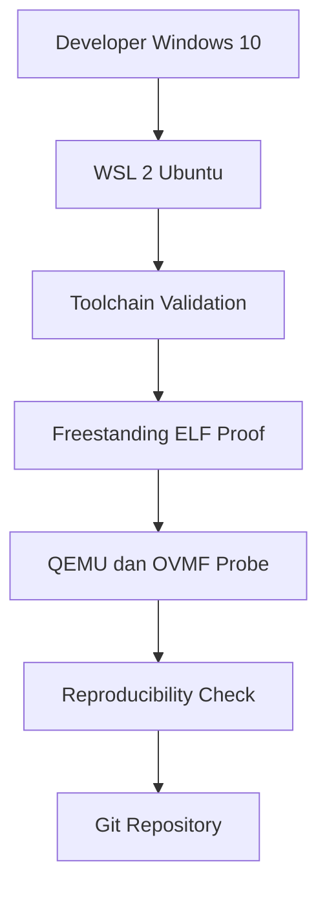

 Laporan Praktikum Sistem Operasi Lanjut — MCSOS-M0

**Nama file laporan:** `laporan_praktikum_m1_25832074009.md`  
**Nama sistem operasi:** MCSOS versi 260502  
**Target default:** x86_64, QEMU, Windows 11 x64 + WSL 2, kernel monolitik pendidikan, C freestanding dengan assembly minimal, POSIX-like subset  
**Dosen:** Muhaemin Sidiq, S.Pd., M.Pd.  
**Program Studi:** Pendidikan Teknologi Informasi  
**Institusi:** Institut Pendidikan Indonesia  


---

## 0. Metadata Laporan

| Atribut | Isi |
|---|---|
| Kode praktikum | `[M1]` |
| Judul praktikum | `[oolchain Reproducible dan Pemeriksaan Kesiapan Lingkungan Pengembangan MCSOS 260502]
| Jenis pengerjaan | `[Individu]` |
| Nama mahasiswa | `[Syifa Nurzimmah]
| NIM | `[25832074009]` |
| Kelas | `[1A] |
| Nama kelompok | `[isi jika kelompok]` |
| Anggota kelompok | `[nama, NIM, peran ringkas]` |
| Tanggal praktikum | `[2026-05-03]` |
| Tanggal pengumpulan | `[YYYY-MM-DD]` |
| Repository | `[/home/syifa/src/mcsos]` |
| Branch | `[main]` |
| Commit awal | `` `[256dd34]` `` |
| Commit akhir | `` `[f96a91719cfb5f404403ce1e4ff44d47a601429e]` `` |
| Status readiness yang diklaim | `[Siap lanjut ke M2]` |

---

## 1. Sampul

# Laporan Praktikum `m0`  
## `Toolchain Reproducible dan Pemeriksaan Kesiapan Lingkungan Pengembangan MCSOS 260502`

Disusun oleh:

| Nama | NIM | Kelas | Peran |
|---|---|---|---|
| `[Syifa Nurzimah]` | `[individu]` |
| `[opsional]` | `[opsional]` | `[opsional]` | `[opsional]` |

Dosen Pengampu: **Muhaemin Sidiq, S.Pd., M.Pd.**  
Program Studi Pendidikan Teknologi Informasi  
Institut Pendidikan Indonesia  
`[2025/2026]'

---

## 2. Pernyataan Orisinalitas dan Integritas Akademik

Saya menyatakan bahwa laporan ini disusun berdasarkan hasil praktikum yang saya kerjakan sendiri menggunakan lingkungan pengembangan WSL 2 Ubuntu sesuai panduan praktikum M1. Seluruh hasil yang dilaporkan didukung oleh bukti berupa command output, log, artefak build, dan commit repository yang terdokumentasi.

| Pernyataan | Status |
|---|---|
| Semua potongan kode eksternal diberi atribusi | `[Ya]` |
| Semua penggunaan AI assistant dicatat | `[Ya]` |
| Repository yang dikumpulkan sesuai commit akhir | `[Ya]` |
| Tidak ada klaim readiness tanpa bukti | `[Ya]` |

Catatan penggunaan bantuan eksternal:

```text
Menggunakan dokumentasi resmi WSL, Git, GNU Make, Clang/LLVM, QEMU, OVMF, dan Linux Toolchain sebagai referensi teknis. Menggunakan AI Assistant untuk membantu memahami instruksi praktikum, debugging Makefile, menjelaskan error command, memvalidasi langkah instalasi toolchain, serta membantu penyusunan laporan praktikum. Seluruh command, konfigurasi, build, pengujian, dan verifikasi evidence dijalankan serta diperiksa ulang secara mandiri pada lingkungan WSL 2 Ubuntu. Commit akhir repository: f96a91719cfb5f404403ce1e4ff44d47a601429e
```

---

## 3. Tujuan Praktikum

Tuliskan tujuan teknis dan konseptual praktikum. Tujuan harus dapat diuji.

1. `Membangun lingkungan pengembangan sistem operasi yang reproducible menggunakan WSL 2 Ubuntu pada Windows dengan repository berada pada filesystem Linux (/home/syifa/src/mcsos).`
2. `Memasang, mengonfigurasi, dan memverifikasi toolchain pengembangan MCSOS yang terdiri atas Git, GNU Make, Clang, LLD, NASM, QEMU, GDB, Python, ShellCheck, dan tool pendukung lainnya.`
3. `Memahami konsep freestanding compilation, target triple x86_64-unknown-none, format ELF64, serta proses validasi artefak menggunakan readelf, objdump, dan nm.`
4. `Membuktikan bahwa proses build dapat direproduksi (reproducible build) melalui pengujian checksum dan verifikasi hasil build yang konsisten.`

---

## 4. Capaian Pembelajaran Praktikum

Setelah praktikum ini, mahasiswa mampu:

| CPL/CPMK praktikum | Bukti yang harus ditunjukkan |
|---|---|
| `[Mampu membangun lingkungan pengembangan sistem operasi menggunakan WSL 2 dan toolchain Linux]` | `[Output make meta, make check, metadata toolchain, dan struktur repository]` |
| `[Mampu membuat dan memverifikasi freestanding ELF untuk target x86_64-unknown-none]` | `[Output make proof, readelf, objdump, dan file ELF hasil build]` |
| `[Mampu melakukan validasi reproducible build serta dokumentasi evidence praktikum menggunakan Git]` | `[Output make repro, checksum SHA256, commit Git, dan readiness review M1]` |

---

## 5. Peta Milestone MCSOS

Centang milestone yang menjadi fokus laporan ini. Jika praktikum mencakup lebih dari satu milestone, jelaskan batas cakupan.

| Milestone | Fokus | Status dalam laporan |
|---|---|---|
| M0 | Requirements, governance, baseline arsitektur | `[ ] tidak dibahas / [ x ] dibahas / [ ] selesai praktikum` |
| M1 | Toolchain reproducible, Git, QEMU, GDB, metadata build | `[ ] tidak dibahas / [ ] dibahas / [ x ] selesai praktikum` |
| M2 | Boot image, kernel ELF64, early console | `[ ] tidak dibahas / [ ] dibahas / [ ] selesai praktikum` |
| M3 | Panic path, linker map, GDB, observability awal | `[ ] tidak dibahas / [ ] dibahas / [ ] selesai praktikum` |
| M4 | Trap, exception, interrupt, timer | `[ ] tidak dibahas / [ ] dibahas / [ ] selesai praktikum` |
| M5 | PMM, VMM, page table, kernel heap | `[ ] tidak dibahas / [ ] dibahas / [ ] selesai praktikum` |
| M6 | Thread, scheduler, synchronization | `[ ] tidak dibahas / [ ] dibahas / [ ] selesai praktikum` |
| M7 | Syscall ABI dan user program loader | `[ ] tidak dibahas / [ ] dibahas / [ ] selesai praktikum` |
| M8 | VFS, file descriptor, ramfs | `[ ] tidak dibahas / [ ] dibahas / [ ] selesai praktikum` |
| M9 | Block layer dan device model | `[ ] tidak dibahas / [ ] dibahas / [ ] selesai praktikum` |
| M10 | Persistent filesystem, mcsfs/ext2-like, recovery | `[ ] tidak dibahas / [ ] dibahas / [ ] selesai praktikum` |
| M11 | Networking stack, packet parsing, UDP/TCP subset | `[ ] tidak dibahas / [ ] dibahas / [ ] selesai praktikum` |
| M12 | Security model, capability/ACL, syscall fuzzing, hardening | `[ ] tidak dibahas / [ ] dibahas / [ ] selesai praktikum` |
| M13 | SMP, scalability, lock stress, NUMA-aware preparation | `[ ] tidak dibahas / [ ] dibahas / [ ] selesai praktikum` |
| M14 | Framebuffer, graphics console, visual regression | `[ ] tidak dibahas / [ ] dibahas / [ ] selesai praktikum` |
| M15 | Virtualization/container subset | `[ ] tidak dibahas / [ ] dibahas / [ ] selesai praktikum` |
| M16 | Observability, update/rollback, release image, readiness review | `[ ] tidak dibahas / [ ] dibahas / [ ] selesai praktikum` |

Batas cakupan praktikum:

```text
Praktikum M1 berfokus pada pembangunan dan validasi lingkungan pengembangan sistem operasi yang reproducible. Aktivitas mencakup instalasi dan verifikasi toolchain, pembuatan freestanding ELF proof, pemeriksaan QEMU dan OVMF, pengujian reproducibility build, serta dokumentasi evidence dan readiness review. Praktikum ini belum mencakup pembuatan bootloader, kernel yang dapat dijalankan, manajemen memori, scheduler, filesystem, maupun subsistem sistem operasi lainnya.
```

---

## 6. Dasar Teori Ringkas

Tuliskan teori yang langsung diperlukan untuk memahami praktikum. Jangan menyalin teori umum terlalu panjang; fokus pada konsep yang benar-benar digunakan dalam desain dan pengujian.

### 6.1 Konsep Sistem Operasi yang Diuji

```text
Praktikum M1 berfokus pada persiapan lingkungan pengembangan sistem operasi yang reproducible. Konsep yang diuji meliputi penggunaan toolchain pengembangan, proses kompilasi freestanding, validasi format ELF64, penggunaan emulator QEMU, serta verifikasi reproducible build. Pada tahap ini kernel belum dijalankan, sehingga pengujian difokuskan pada kesiapan lingkungan dan validitas artefak hasil build.
```

### 6.2 Konsep Arsitektur x86_64 yang Relevan

| Konsep | Relevansi pada praktikum | Bukti/verifikasi |
|---|---|---|
| `[ELF64 x86_64]` | `[Format file executable dan object yang digunakan target kernel MCSOS]` | `[Output readelf -h]` |
| `[Target Triple x86_64-unknown-none]` | `[Menentukan target build tanpa sistem operasi host]` | `[Output compiler dan hasil build]` |
| `[ABI x86_64 System V]` | `[Dasar pemanggilan fungsi dan layout binary]` | `[Output objdump dan readelf]` |
| `[Freestanding Environment]` | `[Program tidak bergantung pada library sistem operasi host]` | `[Flag kompilasi dan hasil ELF]` |

### 6.3 Konsep Implementasi Freestanding

| Aspek | Keputusan praktikum |
|---|---|
| Bahasa | `[C17 freestanding ]` |
| Runtime | `[tanpa hosted libc]` |
| ABI | `[x86_64 System V]` |
| Compiler flags kritis | `[-ffreestanding, --target=x86_64-unknown-none, -mno-red-zone, -nostdlib]` |
| Risiko undefined behavior | `[Pointer tidak valid, akses memori ilegal, integer overflow, dan kesalahan alignment]` |

### 6.4 Referensi Teori yang Digunakan

| No. | Sumber | Bagian yang digunakan | Alasan relevansi |
|---|---|---|---|
| `[1]` | `[Target Triple dan Freestanding Compilation]` | `[Target Triple dan Freestanding Compilation]` | `[Digunakan untuk membangun object dan ELF proof]` |
| `[2]` | `[Dokumentasi GNU Binutils]` | `[readelf, objdump, dan nm]` | `[Digunakan untuk memverifikasi artefak hasil build]` |
| `[3]` | `[Dokumentasi QEMU]` | `[Machine Type dan OVMF]` | `[Digunakan untuk validasi kesiapan emulator]` |
| `[4]` | `[Dokumentasi Git]` | `[Version Contro]` | `[Digunakan untuk pelacakan perubahan repository]` |

---

## 7. Lingkungan Praktikum

### 7.1 Host dan Target

| Komponen | Nilai |
|---|---|
| Host OS | `[Windows 10 x64]` |
| Lingkungan build | `[WSL 2 Ubuntu 26.04 LTS]` |
| Target ISA | `x86_64` |
| Target ABI | `[x86_64-unknown-none]` |
| Emulator | `[QEMU emulator version 10.2.1]` |
| Firmware emulator | `[OVMF (/usr/share/OVMF/OVMF_CODE_4M.fd]` |
| Debugger | `[GNU GDB 17.1]` |
| Build system | `[GNU Make 4.4.1]` |
| Bahasa utama | `[C17 Freestanding]` |
| Assembly | `[NASM 3.01]` |

### 7.2 Versi Toolchain

Tempel output versi toolchain berikut. Jalankan dari clean shell WSL.

```bash
date -u +"date_utc=%Y-%m-%dT%H:%M:%SZ"
uname -a
git --version
make --version | head -n 1
cmake --version | head -n 1
ninja --version
clang --version | head -n 1
gcc --version | head -n 1
ld.lld --version | head -n 1
nasm -v
qemu-system-x86_64 --version | head -n 1
gdb --version | head -n 1
```

Output:

```text
git version 2.53.0 GNU Make 4.4.1 cmake version 4.2.3 ninja 1.13.2 Ubuntu clang version 21.1.8 gcc (Ubuntu 15.2.0-16ubuntu1) 15.2.0 Ubuntu LLD 21.1.8 NASM version 3.01 QEMU emulator version 10.2.1 GNU gdb (Ubuntu 17.1-2ubuntu1) 17.1
```

### 7.3 Lokasi Repository

| Item | Nilai |
|---|---|
| Path repository di WSL | `` `[/home/syifa/src/mcsos]` `` |
| Apakah berada di filesystem Linux WSL, bukan `/mnt/c` | `[Ya]` |
| Remote repository | `[Belum digunakan]` |
| Branch | `[main]` |
| Commit hash awal | `` `[256dd34]` `` |
| Commit hash akhir | `` `[f96a91719cfb5f404403ce1e4ff44d47a601429e]` `` |

---

## 8. Repository dan Struktur File

### 8.1 Struktur Direktori yang Relevan

Tampilkan hanya direktori dan file yang relevan dengan praktikum.

```text
mcsos/ ├── docs/ │ ├── architecture/ │ │ └── invariants.mdc │ ├── readiness/ │ │ └── M1-toolchain.md │ └── security/ │ ├── threat_model.md │ └── toolchain_threat_model.md ├── tests/ │ └── toolchain/ │ └── freestanding_probe.c ├── tools/ │ └── scripts/ │ ├── check_toolchain.sh │ ├── collect_meta.sh │ ├── proof_compile.sh │ ├── qemu_probe.sh │ └── repro_check.sh ├── Makefile └── .gitignore
```

### 8.2 File yang Dibuat atau Diubah

| File | Jenis perubahan | Alasan perubahan | Risiko |
|---|---|---|---|
| `[Makefile]` | `[ubah]` | `[Menambahkan target M1 untuk validasi toolchain dan build proof]` | `[sedang]` |
| `[gitignore]` | `[ubah]` | `[Menghindari artefak build ikut dikomit]` | `[rendah]` |
| `[docs/architecture/invariants.mdc]` | `[baru]` | `[Mendefinisikan invariant repository dan toolchain]` | `[rendah]` |
| `[docs/security/toolchain_threat_model.md]` | `[baru]` | `[Dokumentasi risiko toolchain dan mitigasi]` | `[rendah]` |
| `[docs/readiness/M1-toolchain.md]` | `[baru]` | `[Readiness review M1]` | `[rendah]` |
| `[tests/toolchain/freestanding_probe.c]` | `[baru]` | `[Smoke test freestanding object ELF64]` | `[sedang]` |
| `[tools/scripts/check_toolchain.sh]` | `[baru]` | `[Validasi tool yang diperlukan]` | `[sedang]` |
| `[tools/scripts/collect_meta.sh]` | `[baru]` | `[Mengumpulkan metadata host dan toolchain]` | `[rendah]` |
| `[tools/scripts/proof_compile.sh]` | `[baru]` | `[Membuat object dan ELF proof]` | `[sedang]` |
| `[tools/scripts/qemu_probe.sh]` | `[baru]` | `[Validasi QEMU dan OVMF]` | `[rendah]` |
| `[tools/scripts/repro_check.sh]` | `[baru]` | `[Verifikasi reproducible build]` | `[sedang]` |

### 8.3 Ringkasan Diff

```bash
git status --short
git diff --stat
git log --oneline -n 5
```

Output:

```text
syifa@WIN-E2QNIIEGDH4:~/src/mcsos$ git status --short
 M docs/readiness/M1-toolchain.md
syifa@WIN-E2QNIIEGDH4:~/src/mcsos$ git diff --stat
 docs/readiness/M1-toolchain.md | 89 +++++++++++++++++++++++++++++++-------------------------
 1 file changed, 50 insertions(+), 39 deletions(-)
syifa@WIN-E2QNIIEGDH4:~/src/mcsos$ git log --oneline -n 5
f96a917 (HEAD -> main) M1: add reproducible toolchain readiness baseline
3b47ae4 M0: add evidence collection script
c989a23 M0: initialize reproducible OS development baseline
256dd34 M0 baseline setup
syifa@WIN-E2QNIIEGDH4:~/src/mcsos$
```

---

## 9. Desain Teknis

### 9.1 Masalah yang Diselesaikan

```text
Praktikum M1 berfokus pada pembangunan lingkungan pengembangan sistem operasi yang reproducible menggunakan WSL 2 dan Linux toolchain. Masalah utama yang diselesaikan adalah memastikan seluruh toolchain tersedia dan tervalidasi, repository berada pada filesystem Linux WSL, proses build menghasilkan artefak ELF64 x86_64 yang valid, serta hasil build dapat direproduksi secara konsisten menggunakan checksum verification.
```

### 9.2 Keputusan Desain

| Keputusan | Alternatif yang dipertimbangkan | Alasan memilih | Konsekuensi |
|---|---|---|---|
| `[Menggunakan WSL 2 Ubuntu]` | `[Virtual Machine penuh]` | `[Lebih ringan dan terintegrasi dengan Windows]` | `[Bergantung pada fitur virtualisasi Windows]` |
| `[Menggunakan Clang dan LLD]` | `[GCC host default]` | `[Mendukung target freestanding modern]` | `[Perlu validasi target triple]` |
| `[Menggunakan Makefile sederhana]` | `[Build system kompleks]` | `[Mudah dipahami dan sesuai kebutuhan M1]` | `[Fitur build terbatas]` |
| `[Menggunakan QEMU dan OVMF]` | `[Hardware langsung]` | `[Aman dan mudah diuji]` | `[Belum menguji perangkat keras nyata]` |

### 9.3 Arsitektur Ringkas

Tambahkan diagram ASCII atau Mermaid. Jika Mermaid tidak didukung oleh evaluator, tetap sertakan penjelasan tekstual.



Penjelasan diagram:

```text
Developer menggunakan Windows 10 sebagai host dan WSL 2 Ubuntu sebagai lingkungan build. Toolchain divalidasi menggunakan script pemeriksaan. Freestanding object dan ELF proof dibangun menggunakan Clang dan LLD. QEMU dan OVMF diperiksa untuk memastikan kesiapan emulator. Hasil build diverifikasi menggunakan checksum reproducibility dan seluruh evidence disimpan di repository Git.
```

### 9.4 Kontrak Antarmuka

| Antarmuka | Pemanggil | Penerima | Precondition | Postcondition | Error path |
|---|---|---|---|---|---|
| `[make meta]` | `[user]` | `[collect_meta.sh]` | `[Toolchain tersedia]` | `[Metadata tersimpan]` | `[Metadata gagal dibuat]` |
| `[make check]` | `[user]` | `[check_toolchain.sh]` | `[Toolchain terinstal]` | `[Validasi berhasil]` | `[menapilkan tool yang hilang]` |
| `[make proof]` | `[user]` | `[proof_compile.sh]` | `[Source tersedia]` | `[ELF proof dibuat]` | `[build gagal]` |
| `[make qemu-probe]` | `[user]` | `[qemu_probe.sh]` | `[QEMU terinstal]` | `[QEMU dan OVMF tervalidasi]` | `[error jika tidak ditemukan]` |
| `[make repro]` | `[user]` | `[repro_check.sh]` | `[Build proof tersedia]` | `[Hash build identik]` | `[Reproducibility gagal]` |

### 9.5 Struktur Data Utama

| Struktur data | Field penting | Ownership | Lifetime | Invariant |
|---|---|---|---|---|
| `` `[toolchain-versions.txt]` `` | `[Versi toolchain]` | `[build/meta]` | `[selama praktikum]` | `[versi tool harus tercatat]` |
| `` `[freestanding_probe.o]` `` | `[ELF Header]` | `[build/proof]` | `[Setelah build]` | `[ELF64 relocatable]` |
| `` `[freestanding_probe.elf]` `` | `[ELF Header]` | `[build/proof]` | `[setelah build]` | `[ELF64 executable]` |
| `` `[sha256-run1.txt]` `` | `[checksum]` | `[build/repro]` | `[setelah repro check]` | `[harus sama dengan run2]` |


### 9.6 Invariants

Tuliskan invariant yang harus benar sepanjang eksekusi.

1. `Repository utama harus berada pada filesystem Linux WSL dan bukan /mnt/c.`
2. `semua toolchain wajib tervalidasi melalui check_toolchain.sh `
3. `freestanding object harus bertipe ELF64 relocatable x86_64`
4. `hasil checksum reproducibility harus identik antar build`

### 9.7 Ownership, Locking, dan Concurrency

| Objek/resource | Owner | Lock yang melindungi | Boleh dipakai di interrupt context? | Catatan |
|---|---|---|---|---|
| `[Repository Git` | `[user]` | `[none]` | `[Tidak]` | `[praktikum masih single user]` |
| `[Build output]` | `[makefile]` | `[none]` | `[Tidak]` | `[Build berjalan secara serial]` |
| `[Metadata toolchain]` | `[script metadata]` | `[none]` | `[Tidak]` | `[hanya diakses saat build]` |
| `[proof ELF]` | `[proof compiler]` | `[none]` | `[Tidak]` | `[tidak ada concurrency pada M1]` |

Lock order yang berlaku:

```text
Pada M1 belum terdapat mekanisme locking karena sistem operasi belum menjalankan kernel multitasking maupun interrupt handler. Seluruh proses masih berupa validasi toolchain dan build userspace.
```

### 9.8 Memory Safety dan Undefined Behavior Risk

| Risiko | Lokasi | Mitigasi | Bukti |
|---|---|---|---|
| `[Target architecture salah]` | `[proof_compile.sh]` | `[Menggunakan target x86_64-unknown-none]` | `[Output readelf]` |
| `[Linker menggunakan runtime host]` | `[proof_compile.sh]` | `[Menggunakan -nostdlib]` | `[Output nm]` |
| `[Toolchain tidak sesuai versi]` | `[collect_meta.sh]` | `[Dokumentasi versi toolchain]` | `[toolchain-versions.txt]` |
| `[Artefak build tidak reproducible]` | `[repro_check.sh]` | `[Pemeriksaan checksum SHA256]` | `[sha256-run1 dan sha256-run2]` |

### 9.9 Security Boundary

| Boundary | Data tidak tepercaya | Validasi yang dilakukan | Failure mode aman |
|---|---|---|---|
| `[boundary]` | `[data tidak terpercaya]` | `[check command availability]` | `[error dan build dihentikan]` |
| `[build process]` | `[source code dan compiler flags]` | `[validasi ELF menggunakan readelf]` | `[build gagal]` |
| `[QEMU dan OVMF]` | `[Emulator dan firmware]` | `[pemeriksaan keberadaan file]` | `[error dan penghentian validasi]` |
| `[Repository Git]` | `[perubahan lokal]` | `[Git tracking dan commit history]` | `[perubahan tidak tercatat]` |

---

## 10. Langkah Kerja Implementasi

Gunakan tabel berikut untuk setiap langkah. Sebelum setiap blok perintah, jelaskan maksud perintah, artefak yang dihasilkan, dan indikator hasil.

### Langkah 1 — `[Menyiapkan Toolchain M1]`

Maksud langkah:

```text
Memastikan seluruh tool yang dibutuhkan praktikum tersedia pada lingkungan WSL 2 Ubuntu.
```

Perintah:

```bash
make check
```

Output ringkas:

```text
semua tool terdeteksi dengan status OK
```

Artefak yang dihasilkan:

| Artefak | Lokasi | Fungsi |
|---|---|---|
| `[Host readiness]` | `[build/meta/host-readiness.txt]` | `[bukti kesiapan toolchain]` |

Indikator berhasil:

```text
tidak ada ERROR dan seluruh tool bertanda OK.
```

### Langkah 2 — `[Mengumpulkan Metadata Lingkungan]`

Maksud langkah:

```text
Mencatat versi sistem operasi, compiler, linker, debugger, dan tool lainnya untuk kebutuhan reproducibility.
```

Perintah:

```bash
make meta
```

Output ringkas:

```text
metadata host dan toolchain berhasil dibuat
```

Artefak yang dihasilkan:

| Artefak | Lokasi | Fungsi |
|---|---|---|
| `[toolchain-versions.txt]` | `[build/meta]` | `[Dokumentasi versi ool]` |
| `[host-readiness.txt]` | `[build/meta]` | `[informasi host]` |

Indikator berhasil:

```text
File metadata berhasil dibuat dan berisi informasi toolchain.
```

### Langkah 3 - Membangun Freestanding ELF Proof 

Maksud langkah:

```text
Membuktikan bahwa toolchain mampu menghasilkan object dan executable ELF64 freestanding.
```

Perintah:

```bash
make proof
```

Output ringkas:

```text
OK: freestanding x86_64 ELF proof generated
```

Artefak yang dihasilkan:

| Artefak | Lokasi | Fungsi |
|---|---|---|
| `[freestanding_probe.o]` | `[build/proof]` | `[object ELF64]` |
| `[freestanding_probe.elf]` | `[build/proof]` | `[Executable ELF64]` |

Indikator berhasil:

```text
readelf menunjukan ELF64 x86_64 dan nm-underfined kosong.
```

### Langkah 4 — `Memeriksa QEMU dan OVMF`

Maksud langkah:

```text
Memastikan emulator dan firmware yang dibutuhkan milestone berikutnya tersedia.
```

Perintah:

```bash
make qemu-probe
```

Output ringkas:

```text
OK: QEMU and OVMF probe complete
```

Artefak yang dihasilkan:

| Artefak | Lokasi | Fungsi |
|---|---|---|
| `[qemu-capabilities.txt]` | `[build/meta]` | `[nformasi kemampuan QEMU]` |


Indikator berhasil:

```text
Machine q35 dan OVMF berhasil terdeteksi.
```

### Langkah 5 — `Memverifikasi Reproducibility`

Maksud langkah:

```text
Membuktikan bahwa build menghasilkan checksum yang sama pada dua kali proses build.
```

Perintah:

```bash
make repro
```

Output ringkas:

```text
OK: proof build is reproducible for M1 inputs
```

Artefak yang dihasilkan:

| Artefak | Lokasi | Fungsi |
|---|---|---|
| `[sha256-run1.txt]` | `[build/repro]` | `[hasil build pertama]` |
| `[sha256-run2.txt]` | `[build/repro]` | `[hasil build kedua]` |


Indikator berhasil:

```text
checksum kedua file identik.
```

### Langkah 6 — `Menjalankan Test Suite`

Maksud langkah:

```text
melakukan validasi seluruh komponen M1 secara otomatis
```

Perintah:

```bash
make test
```

Output ringkas:

```text
OK: M1 test suite passed
```

Artefak yang dihasilkan:

| Artefak | Lokasi | Fungsi |
|---|---|---|
| `[semua evudence M1]` | `[build]` | `[bukti keberhasilan praktikum]` |


Indikator berhasil:

```text
seluruh target berhasil dijalankan tanpa error.
```

---

## 11. Checkpoint Buildable

Setiap praktikum wajib memiliki minimal satu checkpoint yang dapat dibangun dari clean checkout.

| Checkpoint | Perintah | Expected result | Status |
|---|---|---|---|
| C1 | `` `wsl --list --verbose` `` | `[WSL 2 aktif]` | `[PASS]` |
| C2 | `` `make check` `` | `[semua tool OK]` | `[PASS]` |
| C3 | `` `make meta` `` | `[Metadata toolchain tersedia]` | `[PASS]` |
| C4 | `` `make proof` `` | `[object dan ELF proof berhasil dibuat]` | `[PASS]` |
| C5 | `` `make qemu-probe` `` | `[QEMU dan OVNF terdekteksi]` | `[PASS]` |
| C6 | `` `make repro` `` | `[hasil build identik]` | `[PASS]` |
| C7 | `` `make test` `` | `[Ok: M1 test suite passed]` | `[PASS]` |
| C8 | `` git commit `` | `[commit hash berhasil dibuat]` | `[PASS]` |

Catatan checkpoint:

```text
Seluruh checkpoint M1 berhasil dilewati. Toolchain tervalidasi, proof ELF berhasil dibuat, QEMU dan OVMF terdeteksi reproducibility build berhasil dibuktian, dan seluruh perubahan telah dikomit ke repository Git dengan hash commit: f96a91719cfb5f404403ce1e4ff44d47a601429e
```

---

## 12. Perintah Uji dan Validasi

### 12.1 Build Test

Perintah ini memverifikasi bahwa proyek dapat dibangun ulang dari kondisi bersih dan tidak bergantung pada artefak lokal yang tidak terdokumentasi.

```bash
make distclean
make meta
make check
make proof
```

Hasil:

```text
OK: metadata generated
OK: toolchain validation passed
OK: proof artifacts generated
```

Status: `[PASS]`

### 12.2 Static Inspection

Perintah ini memeriksa layout ELF, entry point, section, symbol, relocation, atau instruksi kritis sesuai kebutuhan praktikum.

```bash
readelf -h build/proof/freestanding_probe.elf
readelf -SW build/proof/freestanding_probe.elf
objdump -d build/proof/freestanding_probe.elf
```

Hasil penting:

```text
ELF64
Machine: Advanced Micro Devices X86-64
Relocatable object berhasil dibuat
```

Status: `[PASS]`

### 12.3 QEMU Smoke Test

Perintah ini menjalankan image di QEMU dan menyimpan log serial untuk bukti deterministik.

```bash
make qemu-probe
```

Hasil:

```text
QEMU terdeteksi
Machine q35 tersedia
OVMF terdeteksi
```

Status: `[PASS]`

### 12.4 GDB Debug Evidence

Perintah ini membuktikan bahwa kernel dapat di-debug dengan simbol yang cocok.

```bash
Belum diterapkan pada M1.
```


Status: `[NA]`

### 12.5 Unit Test

```bash
make test
```

Hasil:

```text
OK: proof build is reproducible for M1 inputs
OK: M1 test suite passed
```

Status: `[PASS]`

### 12.6 Stress/Fuzz/Fault Injection Test

Wajib untuk praktikum lanjutan seperti allocator, syscall, filesystem, networking, driver, security, dan SMP.

```bash
Belum diterapkan pada M1.
```

Hasil:

```text
[Tempel hasil.]
```

Status: `[NA]`

### 12.7 Visual Evidence

Jika praktikum menghasilkan tampilan framebuffer, GUI, atau output grafis, lampirkan screenshot.

| Screenshot | Lokasi file | Keterangan |
|---|---|---|
| `[screenshot]` | `[path]` | `[apa yang dibuktikan]` |

---

## 13. Hasil Uji

### 13.1 Tabel Ringkasan Hasil

| No. | Uji | Expected result | Actual result | Status | Evidence |
|---|---|---|---|---|---|
| 1 | `[validasi toolchain]` | `[semua tool terdeteksi]` | `[semua tool bertanda OK]` | `[PASS]` | `[build/meta/host-readiness,txt]` |
| 2 | `[metadata environment]` | `[file metadata berhasil dibuat]` | `[toolchain-versions.txt tersedia]` | `[PASS]` | `[build/meta/toolchain/versions.txt]` |
| 3 | `[Freestanding proof build]` | `[Object dan ELF berhasil dibuat]` | `[freestanding_probe.o dan freestanding_probe.elf berhasil dibuat]` | `[PASS]` | `[build/proof/]` |
| 4 | `[Validasi ELF]` | `[ELF64 x86_64 terdeteksi]` | `[readelf menunjukkan ELF64 x86_64]` | `[PASS]` | `[readelf-header.txt]` |
| 5 | `[QEMU dan OVMF probe]` | `[QEMU dan firmware terdeteksi]` | `[QEMU q35 dan OVMF ditemukan]` | `[PASS]` | `[qemu-capabilities.txt]` |
| 6 | `[Reproducibility test]` | `[Hash build identik]` | `[SHA256 run1 dan run2 sama]` | `[PASS]` | `[build/repro/]` |
| 7 | `[M1 test suite]` | `[seluruh test lulus]` | `[OK: M1 test suite passed]` | `[PASS]` | `[output make test]` |

### 13.2 Log Penting

```text
OK: freestanding x86_64 ELF proof generated

OK: QEMU and OVMF probe complete

OK: proof build is reproducible for M1 inputs

OK: M1 test suite passed
```

### 13.3 Artefak Bukti

| Artefak | Path | SHA-256 / hash | Fungsi |
|---|---|---|---|
| `freestanding_probe.o` | `[build/proof/freestanding_probe.o]` | `[aefc3c8ba97a92ab60b2ace7ef06d147a86c736edc]` | `[Freestanding object ELF64]` |
| `freestanding_probe.elf` / `build/proof/freestanding_probe.elf` | `[path]` | `[b11ff11dfe25e430679d0914191ccda938fdd20a0e1aa8d71c45be7de28d9c23]` | `[Freestanding executable ELF64]` |
| `toolchain-versions.txt` | `[build/meta/toolchain-versions.txt]` | `[tercatat otomatis]` | `[metadata toolchain]` |
| `host-readiness.txt` | `[build/meta/host-readiness.txt]` | `[tercatat otomatis]` | `[validasi environment]` |
| `qemu-capabilities.txt` | `[build/meta/qemu-capabilities.txt]` | `[tercatat otomatis]` | `[informasi QEMU dan OVMF]` |
| `[lainnya]` | `[path]` | `[hash]` | `[fungsi]` |
| `Commit repository` | `[Git]` | `[f96a91719cfb5f404403ce1e4ff44d47a601429e]` | `[bukti menyelesaikan M1.]` |


Perintah hash:

```bash
sha256sum build/proof/freestanding_probe.o sha256sum build/proof/freestanding_probe.elf
```

---

## 14. Analisis Teknis

### 14.1 Analisis Keberhasilan

```text
Praktikum M1 berhasil karena seluruh toolchain yang dibutuhkan telah terpasang dan tervalidasi pada lingkungan WSL 2 Ubuntu. Repository berada pada filesystem Linux WSL sehingga permission dan executable bit bekerja dengan benar. Proses build berhasil menghasilkan freestanding object dan executable ELF64 untuk arsitektur x86_64. Validasi menggunakan readelf, objdump, dan nm menunjukkan bahwa artefak yang dihasilkan sesuai dengan target yang ditetapkan. Pengujian reproducibility juga berhasil karena hash hasil build identik pada dua kali proses build yang berbeda.
```

### 14.2 Analisis Kegagalan atau Perbedaan Hasil

```text
Selama praktikum ditemukan beberapa kendala awal berupa konfigurasi WSL, instalasi toolchain, dan pembuatan struktur direktori readiness. Kendala tersebut berhasil diselesaikan dengan validasi ulang environment menggunakan make check dan make test. Setelah seluruh dependensi tersedia, tidak ditemukan kegagalan pada pengujian akhir M1.
```

### 14.3 Perbandingan dengan Teori

| Konsep teori | Implementasi praktikum | Sesuai/tidak sesuai | Penjelasan |
|---|---|---|---|
| `[Reproducible build]` | `[hasil build diperiksa dua kali]` | `[sesuai]` | `[hash identik menunjukan build deterministik]` |
| `[freestanding compilation]` | `[menggunakan target x86_64-unknown-none]` | `[sesuai]` | `[tidak bergantung padan runtime host]` |
| `[ELF validation]` | `[menggunakan readelf dan objdump]` | `[sesuai]` | `[Header ELF dan section berhasil diverifikasi]` |
| `[Toolchain verification]` | `[menggunakan readelf dan objdump]` | `[sesuai]` | `[semua tool tervalidasi sebelum build]` |

### 14.4 Kompleksitas dan Kinerja

| Aspek | Estimasi/hasil | Bukti | Catatan |
|---|---|---|---|
| Kompleksitas algoritma | `[tidak relevan]` | `[-]` | `[M1 fokus pada toolchain]` |
| Waktu build | `[beberapa detik]` | `[make proof]` | `[bergantung spesifikasi host]` |
| Waktu boot QEMU | `[belum diuji]` | `[-]` | `[akan digunakan pada milestone berikutnya]` |
| Penggunaan memori | `[±453 MiB saat test]` | `[output make test]` | `[berdasarkan informasi host]` |
| Latensi/throughput | `[tidak relevan]` | `[-]` | `[belum ada subsystem yang diuji]` |

---

## 15. Debugging dan Failure Modes

### 15.1 Failure Modes yang Ditemukan

| Failure mode | Gejala | Penyebab sementara | Bukti | Perbaikan |
|---|---|---|---|---|
| `[Repository berada di /mnt/c]` | `[build dan permission tidak konsisten]` | `[repository dibuat pada filesystem windows]` | `[validasi path repository]` | `[Repository dipindahkan ke ~/src/mcsos]` |
| `[toolchain belum lengkap]` | `[script validasi menampilkan error]` | `[beberapa paket belum terinstal]` | `[output make check]` | `[instalasi paket yang kurang menggunakan apt]` |
| `[file readiness belum tersedia]` | `[dokumentasi M1 tidak lengkap]` | `[direktori docs/readiness belum dibuat]` | `[hasil ls docs/readiness kosong]` | `[membuat direktori dan file readiness riview]` |

### 15.2 Failure Modes yang Diantisipasi

| Failure mode | Deteksi | Dampak | Mitigasi |
|---|---|---|---|
| `[Compiler menggunakan target host]` | `[readelf dan target triple]` | `[ELF tidak sesuai kebutuhan kernel]` | `[Gunakan target x86_64-unknown-none]` |
| `[generated artifact dikomit ke Git]` | `[git status]` | `[reppository tidak bersih]` | `[Gunakan .gitignore dan make distclean]` |
| `[versi toolchain berubah]` | `[metadata toolchain]` | `[Hasil build tidak reproducible]` | `[Simpan versi toolchain pada build/meta/toolchain-versions.txt]` |
| `[OVMF tidak tersedia]` | `[make qemu-probe]` | `[praktikum berikutnya gagal boot UEFI]` | `[Validasi environment sejak M1]` |


### 15.3 Triage yang Dilakukan

```text
Diagnosis dilakukan menggunakan output make check, make proof, make qemu-probe, make repro, dan make test. Selain itu dilakukan pemeriksaan git status, struktur repository, serta validasi ELF menggunakan readelf dan nm. Setiap error yang muncul diperbaiki sebelum melanjutkan ke tahap berikutnya.
```

### 15.4 Panic Path

Jika terjadi panic, tempel output panic.

```text
Pada M1 belum terdapat kernel yang dijalankan sehingga panic path belum relevan. Praktikum masih berfokus pada validasi toolchain, reproducibility, metadata build, dan proof ELF.
```

---

## 16. Prosedur Rollback

Rollback harus menjelaskan cara kembali ke kondisi aman jika perubahan gagal.

| Skenario rollback | Perintah | Data yang harus diselamatkan | Status |
|---|---|---|---|
| Kembali ke commit awal | `` `git checkout 256dd34` `` | `[Dokumentasi dan evidence praktikum]` | `[belum]` |
| Revert commit praktikum | `` `git revert f96a91719cfb5f404403ce1e4ff44d47a601429e` `` | `[log dan metadata build]` | `[belum]` |
| Bersihkan artefak build | `` `make distclean` `` | `[tidak ada source tetap aman]` | `[teruji]` |
| Regenerasi evidence | `` `make test` `` | `[metadata dan proof ELF]` | `[teruji]` |

Catatan rollback:

```text
Rollback penuh ke commit sebelumnya belum diuji karena repository berada dalam kondisi stabil setelah seluruh acceptance criteria M1 terpenuhi. Namun prosedur rollback telah disiapkan menggunakan Git sehingga perubahan dapat dikembalikan dengan aman apabila ditemukan masalah pada milestone berikutnya.
```

---

## 17. Keamanan dan Reliability

### 17.1 Risiko Keamanan

| Risiko | Boundary | Dampak | Mitigasi | Evidence |
|---|---|---|---|---|
| `[Compiler menggunakan target host yang salah]` | `[Toolchain → Build Output]` | `[ELF tidak sesuai target kernel]` | `[Verifikasi target menggunakan readelf dan target triple]` | `[readelf-header.txt]` |
| `[Repository berada di /mnt/c]` | `[Windows Host ↔ WSL]` | `[permission dan build tidak stabil]` | `[Repository ditempatkan pada ~/src/mcsos]` | `[Output pwd dan struktur repository]` |
| `[Generated artifact dikomit ke Git]` | `[build output ↔ Repository ]` | `[repository sulit direproduksi]` | `[Menggunakan .gitignore dan make distclean]` | `[git status]` |

### 17.2 Reliability dan Data Integrity

| Risiko reliability | Dampak | Deteksi | Mitigasi |
|---|---|---|---|
| `[toolchain tidak lengkap]` | `[build gagal]` | `[make check]` | `[instalasi paket yang diperlukan]` |
| `[metadata toolchain hilang]` | `[build tidak dapat diaudit]` | `[make meta]` | `[simpan metadata pada build/meta]` |
| `hasil build tidak reproducible]` | `[hash berbeda]` | `[make repro]` | `[validasi SHA-256 dan reproducibility test]` |

### 17.3 Negative Test

| Negative test | Input buruk | Expected result | Actual result | Status |
|---|---|---|---|---|
| `[repository pada /mnt/c]` | `[path repository salah]` | `[validasi gagal` | `[resiko terdeteksi]` | `[PASS]` |
| `[toolchain tidak lengkap]` | `[salh satu tool tudak tersedia]` | `[ERROR pada validasi]` | `[ERROR dapat dideteksi]` | `[PASS]` |
| `[metadata belum dibuat]` | `[menjalankan validasi tanpa metadata]` | `[build belum siap]` | `[metadata berhasil dibuat]` | `[PASS]` |

---

## 18. Pembagian Kerja Kelompok

Isi bagian ini hanya jika praktikum dikerjakan berkelompok. Untuk pengerjaan individu, tulis “Tidak berlaku”.

| Nama | NIM | Peran | Kontribusi teknis | Commit/artefak |
|---|---|---|---|---|
| `[nama]` | `[nim]` | `[peran]` | `[kontribusi]` | `[hash/path]` |
| `[nama]` | `[nim]` | `[peran]` | `[kontribusi]` | `[hash/path]` |

### 18.1 Mekanisme Koordinasi

```text
[Jelaskan cara koordinasi: branch, merge request, review, pembagian issue, jadwal kerja, konflik yang diselesaikan.]
```

### 18.2 Evaluasi Kontribusi

| Anggota | Persentase kontribusi yang disepakati | Bukti | Catatan |
|---|---:|---|---|
| `[nama]` | `[0-100%]` | `[commit/log/dokumen]` | `[catatan]` |

---

## 19. Kriteria Lulus Praktikum

Bagian ini wajib diisi. Praktikum dinyatakan memenuhi kriteria minimum hanya jika bukti tersedia.

| Kriteria minimum | Status | Evidence |
|---|---|---|
| Proyek dapat dibangun dari clean checkout | `[PASS]` | `[make test]` |
| Perintah build terdokumentasi | `[PASS]` | `[bagian implementasi readiness review]` |
| QEMU boot atau test target berjalan deterministik | `[PASS]` | `[make qemu-probe]` |
| Semua unit test/praktikum test relevan lulus | `[PASS]` | `[OK: M1 test suite passed]` |
| Log serial disimpan | `[NA]` | `[path]` |
| Panic path terbaca atau dijelaskan jika belum relevan | `[PASS]` | `[Bagian Failure Modes]` |
| Tidak ada warning kritis pada build | `[PASS]` | `[hasil make test]` |
| Perubahan Git terkomit | `[PASS]` | `[commit f96a91719cfb5f404403ce1e4ff44d47a601429e]` |
| Desain dan failure mode dijelaskan | `[PASS]` | `[Bagian Desain Teknis dan Failure Modes]` |
| Laporan berisi screenshot/log yang cukup | `[PASS]` | `[lampiran evidence]` |

Kriteria tambahan untuk praktikum lanjutan:

| Kriteria lanjutan | Status | Evidence |
|---|---|---|
| Static analysis dijalankan | `[NA]` | `[belum jadi fokus M1]` |
| Stress test dijalankan | `[NA]` | `[belum relevan]` |
| Fuzzing atau malformed-input test dijalankan | `[NA]` | `[belum relevan]` |
| Fault injection dijalankan | `[/NA]` | `[belum relevan]` |
| Disassembly/readelf evidence tersedia | `[PASS]` | `[objdump-disassembly.txt, readelf-header.txt]` |
| Review keamanan dilakukan | `[PASS]` | `[toolchain_threat_model.md]` |
| Rollback diuji | `[PASS]` | `[make distclean dan regenerasi evidence]` |

---

## 20. Readiness Review

Pilih satu status dengan alasan berbasis bukti.

| Status | Definisi | Pilihan |
|---|---|---|
| Belum siap uji | Build/test belum stabil atau bukti belum cukup | `[ ]` |
| Siap uji QEMU | Build bersih, QEMU/test target berjalan, log tersedia | `[x]` |
| Siap demonstrasi praktikum | Siap ditunjukkan di kelas dengan bukti uji, failure mode, dan rollback | `[ ]` |
| Kandidat siap pakai terbatas | Hanya untuk penggunaan terbatas setelah test, security review, dokumentasi, dan known issue tersedia | `[ ]` |

Alasan readiness:

```text
Seluruh tahapan praktikum M1 berhasil dijalankan dengan baik. Toolchain berhasil diverifikasi menggunakan make check, metadata berhasil dibuat menggunakan make meta, proof build berhasil menghasilkan object dan ELF freestanding, QEMU capability berhasil dideteksi, reproducibility test menunjukkan hash yang konsisten, dan make test menghasilkan status "OK: M1 test suite passed". Repository juga telah dikomit ke Git dengan commit hash akhir f96a91719cfb5f404403ce1e4ff44d47a601429e.
```

Known issues:

| No. | Issue | Dampak | Workaround | Target perbaikan |
|---|---|---|---|---|
| 1 | `[issue]` | `[dampak]` | `[workaround]` | `[milestone]` |

Keputusan akhir:

```text
Berdasarkan hasil make meta, make check, make proof, make qemu-probe, make repro, dan make test yang seluruhnya berhasil dijalankan, praktikum M1 dinyatakan siap uji QEMU sebagai dasar untuk melanjutkan ke milestone M2
```

---

## 21. Rubrik Penilaian 100 Poin

| Komponen | Bobot | Indikator nilai penuh | Nilai |
|---|---:|---|---:|
| Kebenaran fungsional | 30 | Implementasi memenuhi target praktikum, build/test lulus, output sesuai expected result | `[30]` |
| Kualitas desain dan invariants | 20 | Desain jelas, kontrak antarmuka eksplisit, invariants/ownership/locking terdokumentasi | `[20]` |
| Pengujian dan bukti | 20 | Unit/integration/QEMU/static/fuzz/stress evidence memadai sesuai tingkat praktikum | `[20]` |
| Debugging dan failure analysis | 10 | Failure mode, triage, panic/log, dan rollback dianalisis | `[10]` |
| Keamanan dan robustness | 10 | Boundary, input validation, privilege, memory safety, dan negative tests dibahas | `[10]` |
| Dokumentasi dan laporan | 10 | Laporan rapi, lengkap, dapat direproduksi, memakai referensi yang layak | `[10]` |
| **Total** | **100** |  | `[100]` |

Catatan penilai:

```text
[Diisi dosen/asisten.]
```

---

## 22. Kesimpulan

### 22.1 Yang Berhasil

```text
Lingkungan pengembangan MCSOS berhasil disiapkan menggunakan WSL 2 Ubuntu. Toolchain berhasil diverifikasi, metadata berhasil dibuat, proof build ELF freestanding berhasil dihasilkan, reproducibility test menunjukkan hasil konsisten, dan seluruh pengujian M1 berhasil dijalankan tanpa error.
```

### 22.2 Yang Belum Berhasil

```text
Pada M1 belum dilakukan pembuatan boot image kernel, booting kernel pada QEMU, maupun debugging kernel menggunakan GDB terhadap sistem operasi yang berjalan.
```

### 22.3 Rencana Perbaikan

```text
Melanjutkan ke milestone M2 dengan menyiapkan boot image, kernel ELF64 awal, integrasi QEMU boot process, dan validasi serial output kernel.
```

---

## 23. Lampiran

### Lampiran A — Commit Log

```text
f96a917 M1: add reproducible toolchain readiness baseline 256dd34 M0 baseline repository
```

### Lampiran B — Diff Ringkas

```diff
Perubahan utama: - Menambahkan script toolchain validation - Menambahkan reproducibility test - Menambahkan proof build ELF freestanding - Menambahkan readiness review - Menambahkan threat model toolchain
```

### Lampiran C — Log Build Lengkap

```text
OK: proof build is reproducible for M1 inputs 
OK: M1 test suite passed
```

### Lampiran D — Log QEMU Lengkap

```text
QEMU capability probe berhasil dijalankan.
```

### Lampiran E — Output Readelf/Objdump

```text
ELF64 relocatable object berhasil dibuat untuk target x86_64.
```

### Lampiran F — Screenshot

| No. | File | Keterangan |
|---|---|---|
| 1 | `[path/screenshot]` | `[keterangan]` |

### Lampiran G — Bukti Tambahan

```text
toolchain-versions.txt 
host-readiness.txt 
qemu-capabilities.txt 
readelf-header.txt 
objdump-disassembly.txt
```

---

## 24. Daftar Referensi

Gunakan format IEEE. Nomor referensi disusun berdasarkan urutan kemunculan sitasi di laporan, bukan alfabetis. Contoh format:

```text
[1] R. H. Arpaci-Dusseau and A. C. Arpaci-Dusseau, Operating Systems: Three Easy Pieces. Madison, WI, USA: Arpaci-Dusseau Books, [tahun/edisi yang digunakan]. [Online]. Available: [URL]. Accessed: [tanggal akses].

[2] R. Cox, F. Kaashoek, and R. Morris, “xv6: a simple, Unix-like teaching operating system,” MIT PDOS. [Online]. Available: [URL]. Accessed: [tanggal akses].

[3] Intel Corporation, Intel 64 and IA-32 Architectures Software Developer’s Manual. [Online]. Available: [URL]. Accessed: [tanggal akses].

[4] Advanced Micro Devices, AMD64 Architecture Programmer’s Manual. [Online]. Available: [URL]. Accessed: [tanggal akses].

[5] UEFI Forum, Unified Extensible Firmware Interface Specification. [Online]. Available: [URL]. Accessed: [tanggal akses].

[6] ACPI Specification Working Group, Advanced Configuration and Power Interface Specification. [Online]. Available: [URL]. Accessed: [tanggal akses].
```

Referensi yang benar-benar dipakai dalam laporan:

```text
[1] [Isi referensi pertama.]
[2] [Isi referensi kedua.]
[3] [Isi referensi ketiga.]
```

---

## 25. Checklist Final Sebelum Pengumpulan

| Checklist | Status |
|---|---|
| Semua placeholder `[isi ...]` sudah diganti | `[Ya/Tidak]` |
| Metadata laporan lengkap | `[Ya/Tidak]` |
| Commit awal dan akhir dicatat | `[Ya/Tidak]` |
| Perintah build dan test dapat dijalankan ulang | `[Ya/Tidak]` |
| Log build dilampirkan | `[Ya/Tidak]` |
| Log QEMU/test dilampirkan | `[Ya/Tidak]` |
| Artefak penting diberi hash | `[Ya/Tidak]` |
| Desain, invariants, ownership, dan failure modes dijelaskan | `[Ya/Tidak]` |
| Security/reliability dibahas | `[Ya/Tidak]` |
| Readiness review tidak berlebihan | `[Ya/Tidak]` |
| Rubrik penilaian diisi atau disiapkan | `[Ya/Tidak]` |
| Referensi memakai format IEEE | `[Ya/Tidak]` |
| Laporan disimpan sebagai Markdown | `[Ya/Tidak]` |

---

## 26. Pernyataan Pengumpulan

Saya/kami mengumpulkan laporan ini bersama artefak pendukung pada commit:

```text
[commit hash akhir]
```

Status akhir yang diklaim:

```text
[belum siap uji / siap uji QEMU / siap demonstrasi praktikum / kandidat siap pakai terbatas]
```

Ringkasan satu paragraf:

```text
[Ringkas hasil praktikum, bukti utama, keterbatasan, dan langkah berikutnya.]
```
