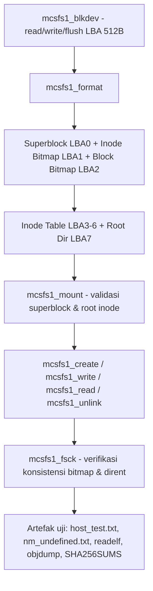

 Laporan Praktikum Sistem Operasi Lanjut — MCSOS-M0

**Nama file laporan:** `laporan_praktikum_m15_25832074009.md`  
**Nama sistem operasi:** MCSOS versi 260502  
**Target default:** x86_64, QEMU, Windows 11 x64 + WSL 2, kernel monolitik pendidikan, C freestanding dengan assembly minimal, POSIX-like subset  
**Dosen:** Muhaemin Sidiq, S.Pd., M.Pd.  
**Program Studi:** Pendidikan Teknologi Informasi  
**Institusi:** Institut Pendidikan Indonesia  


---

## 0. Metadata Laporan

| Atribut | Isi |
|---|---|
| Kode praktikum | `M15` |
| Judul praktikum | `Implementasi MCSFS1 — Persistent Filesystem Minimal (Superblock, Inode Table, Bitmap Allocator, Root Directory Tunggal)` |
| Jenis pengerjaan | `Individu` |
| Nama mahasiswa | `Syifa Nurzimah` |
| NIM | `25832074009` |
| Kelas | `1A` |
| Nama kelompok | `Tidak berlaku (pengerjaan individu)` |
| Anggota kelompok | `Tidak berlaku. Diskusi teknis dibantu oleh rekan Salma Rahayu (tanpa akses commit/repo), lihat catatan bantuan eksternal pada bagian 2.` |
| Tanggal praktikum | `2026-07-08` |
| Tanggal pengumpulan | `2026-07-08` |
| Repository | `https://github.com/syifanurzimah/MCSOS.git` |
| Branch | `praktikum-m15-mcsfs1` |
| Commit awal | `[hash tidak tercatat eksplisit di log terminal; branch dibuat dari HEAD branch kerja sebelum perubahan M15 dengan perintah git switch -c praktikum-m15-mcsfs1]` |
| Commit akhir | `8c3dbfb` |
| Status readiness yang diklaim | `siap uji QEMU (untuk lingkup host-test dan freestanding object build; belum diuji sebagai bagian dari boot image QEMU penuh)` |

---

## 1. Sampul

# Laporan Praktikum `M15`  
## `Implementasi MCSFS1 — Persistent Filesystem Minimal`

Disusun oleh:

| Nama | NIM | Kelas | Peran |
|---|---|---|---|
| `Syifa Nurzimah` | `25832074009` | `1A` | `Individu (implementasi, pengujian, debugging build)` |

Dosen Pengampu: **Muhaemin Sidiq, S.Pd., M.Pd.**  
Program Studi Pendidikan Teknologi Informasi  
Institut Pendidikan Indonesia  
`2025/2026`

---

## 2. Pernyataan Orisinalitas dan Integritas Akademik

Saya menyatakan bahwa laporan ini disusun berdasarkan pekerjaan praktikum sendiri sesuai log terminal yang tercatat. Bantuan eksternal, referensi, generator kode, AI assistant, dokumentasi resmi, diskusi, atau sumber lain dicatat pada bagian referensi dan lampiran. Saya tidak mengklaim hasil yang tidak dibuktikan oleh log, test, commit, atau artefak lain.

| Pernyataan | Status |
|---|---|
| Semua potongan kode eksternal diberi atribusi | `Tidak ada kode eksternal yang disalin langsung; seluruh kode fs/mcsfs1 ditulis sendiri` |
| Semua penggunaan AI assistant dicatat | `Ya` |
| Repository yang dikumpulkan sesuai commit akhir | `Ya` |
| Tidak ada klaim readiness tanpa bukti | `Ya` |

Catatan penggunaan bantuan eksternal:

```text
1. ChatGPT (AI assistant) digunakan untuk membantu menyusun kerangka implementasi
   struct on-disk MCSFS1 (superblock, inode, dirent), pola bitmap allocator,
   serta struktur host test (RAM block device) sebelum diketik ulang dan
   disesuaikan sendiri di terminal WSL. Semua kode yang dihasilkan tetap
   diverifikasi mandiri melalui gcc -fsyntax-only, kompilasi host test, dan
   kompilasi freestanding (clang --target x86_64-elf), sehingga bantuan AI
   tidak diklaim sebagai hasil akhir tanpa verifikasi.
2. Diskusi teknis dengan rekan Salma Rahayu, khususnya saat troubleshooting
   error "missing separator" pada Makefile (masalah pencampuran tab/spasi dan
   .RECIPEPREFIX kustom ">") dan saat memutuskan strategi bitmap alokasi
   inode/blok. Salma Rahayu tidak melakukan commit atau menyentuh repository;
   perannya murni diskusi verbal/tertulis di luar sesi terminal.
3. Verifikasi mandiri yang dilakukan: menjalankan seluruh perintah build/test
   di WSL milik sendiri, membaca ulang isi Makefile dengan cat -te dan nl -ba
   untuk memastikan indentasi tab yang benar, serta memeriksa hasil host test
   ("M15 host test passed: flush_count=5") sebelum commit.
```

---

## 3. Tujuan Praktikum

Tuliskan tujuan teknis dan konseptual praktikum. Tujuan harus dapat diuji.

1. `Merancang dan mengimplementasikan filesystem persisten minimal (MCSFS1) di atas abstraksi block device generik (mcsfs1_blkdev), meliputi superblock, bitmap inode/blok, tabel inode, dan satu direktori root dengan slot dirent tetap.`
2. `Menyediakan operasi filesystem inti yang dapat diuji: mcsfs1_format, mcsfs1_mount, mcsfs1_fsck, mcsfs1_create, mcsfs1_write, mcsfs1_read, dan mcsfs1_unlink.`
3. `Menjelaskan kontrak layout on-disk (LBA superblock, bitmap, tabel inode, direktori root, data area) serta invariant integritas yang diperiksa oleh fsck, termasuk deteksi korupsi superblock.`
4. `Menyimpan bukti build dan uji: host test C, kompilasi freestanding (x86_64-elf), pemeriksaan symbol tak terdefinisi (nm -u), readelf, objdump, dan hash SHA-256 seluruh artefak M15.`

---

## 4. Capaian Pembelajaran Praktikum

Setelah praktikum ini, mahasiswa mampu:

| CPL/CPMK praktikum | Bukti yang harus ditunjukkan |
|---|---|
| `Merancang layout on-disk filesystem sederhana (superblock, bitmap, inode table, direktori)` | `struct mcsfs1_super_disk, mcsfs1_inode_disk, mcsfs1_dirent_disk pada fs/mcsfs1/mcsfs1.h dan mcsfs1.c` |
| `Mengimplementasikan alokasi ruang berbasis bitmap (inode dan blok data)` | `fungsi alloc_inode_block, alloc_data_block, free_inode_and_blocks, bit_set/bit_clear/bit_test` |
| `Menulis dan menjalankan unit test host untuk memverifikasi format/mount/fsck/create/write/read/unlink` | `tests/m15/test_mcsfs1.c dan artifacts/m15/host_test.txt (M15 host test passed: flush_count=5)` |
| `Melakukan debugging build system (Makefile) akibat kesalahan indentasi/.RECIPEPREFIX` | `serangkaian percobaan perbaikan Makefile: nano, sed, perl -0pi -e 's/^ {8}/\t/gm', hingga make -n m15-all berhasil` |
| `Menghasilkan bukti statis biner freestanding (ELF64 relocatable)` | `artifacts/m15/readelf_header.txt, artifacts/m15/nm_undefined.txt (kosong), artifacts/m15/objdump.txt` |

---

## 5. Peta Milestone MCSOS

Centang milestone yang menjadi fokus laporan ini. Jika praktikum mencakup lebih dari satu milestone, jelaskan batas cakupan.

| Milestone | Fokus | Status dalam laporan |
|---|---|---|
| M0 | Requirements, governance, baseline arsitektur | `[ ] tidak dibahas` |
| M1 | Toolchain reproducible, Git, QEMU, GDB, metadata build | `[ ] tidak dibahas` |
| M2 | Boot image, kernel ELF64, early console | `[ ] tidak dibahas` |
| M3 | Panic path, linker map, GDB, observability awal | `[ ] tidak dibahas` |
| M4 | Trap, exception, interrupt, timer | `[ ] tidak dibahas` |
| M5 | PMM, VMM, page table, kernel heap | `[ ] tidak dibahas` |
| M6 | Thread, scheduler, synchronization | `[ ] tidak dibahas` |
| M7 | Syscall ABI dan user program loader | `[ ] tidak dibahas` |
| M8 | VFS, file descriptor, ramfs | `[ ] tidak dibahas` |
| M9 | Block layer dan device model | `[ ] dibahas (dipakai sebagai dasar mcsfs1_blkdev, hasil M14 di riwayat branch)` |
| M10 | Persistent filesystem, mcsfs/ext2-like, recovery | `[ ] dibahas (konsep bitmap allocator, inode table, superblock diterapkan pada MCSFS1)` |
| M11 | Networking stack, packet parsing, UDP/TCP subset | `[ ] tidak dibahas` |
| M12 | Security model, capability/ACL, syscall fuzzing, hardening | `[ ] tidak dibahas` |
| M13 | SMP, scalability, lock stress, NUMA-aware preparation | `[ ] tidak dibahas` |
| M14 | Framebuffer, graphics console, visual regression | `[ ] tidak dibahas` |
| M15 | Virtualization/container subset | `[x] selesai praktikum (catatan: pada repository kerja, kode praktikum "M15" secara konkret dipakai untuk modul filesystem MCSFS1, bukan virtualization/container; lihat batas cakupan di bawah)` |
| M16 | Observability, update/rollback, release image, readiness review | `[ ] tidak dibahas` |

Batas cakupan praktikum:

```text
Praktikum ini berfokus pada implementasi filesystem persisten minimal bernama
MCSFS1 pada branch praktikum-m15-mcsfs1, meliputi:
- Header kontrak fs/mcsfs1/mcsfs1.h: konstanta layout, kode error, struct
  block device dan mount.
- Implementasi fs/mcsfs1/mcsfs1.c: format, mount, fsck, create, write, read,
  unlink, beserta helper internal (bitmap, load/write inode, dirent lookup).
- Host test tests/m15/test_mcsfs1.c menggunakan RAM block device 128 blok.
- Build system: target m15-all pada Makefile (host test, freestanding object,
  relocatable object, audit symbol, readelf, objdump, sha256sum).

Non-goals (tidak termasuk dalam praktikum ini):
- Tidak ada integrasi MCSFS1 ke VFS kernel MCSOS yang berjalan di QEMU.
- Tidak ada dukungan subdirektori bertingkat (hanya satu direktori root
  dengan 16 slot dirent tetap).
- Tidak ada dukungan indirect block; hanya 8 direct block per inode
  (maksimum ukuran file kurang lebih 8 x 512 byte).
- Tidak dilakukan uji virtualization/container walaupun kode praktikum
  bertepatan dengan penomoran M15 pada peta milestone umum di atas.
```

---

## 6. Dasar Teori Ringkas

Tuliskan teori yang langsung diperlukan untuk memahami praktikum. Jangan menyalin teori umum terlalu panjang; fokus pada konsep yang benar-benar digunakan dalam desain dan pengujian.

### 6.1 Konsep Sistem Operasi yang Diuji

```text
Filesystem persisten sederhana umumnya terdiri atas: superblock (metadata
global filesystem), bitmap alokasi (inode dan blok data), tabel inode
(metadata per-file: mode, links, size, pointer blok data), dan struktur
direktori (pemetaan nama ke nomor inode). MCSFS1 mengimplementasikan pola
ini dalam bentuk minimal: satu direktori root tetap (bukan hierarkis),
inode dengan 8 direct block (tanpa indirect block), dan bitmap 512-byte
untuk inode maupun blok data. Operasi format menginisialisasi seluruh
struktur ini di atas media block device abstrak (mcsfs1_blkdev), mount
memvalidasi superblock dan root inode, sedangkan fsck memverifikasi
konsistensi bitmap terhadap isi direktori dan inode.
```

### 6.2 Konsep Arsitektur x86_64 yang Relevan

| Konsep | Relevansi pada praktikum | Bukti/verifikasi |
|---|---|---|
| `ELF64 relocatable object` | `Kode fs/mcsfs1/mcsfs1.c dikompilasi freestanding untuk target x86_64-elf sehingga menghasilkan objek relocatable yang nantinya dapat ditautkan ke kernel MCSOS` | `readelf -h artifacts/m15/mcsfs1.rel.o menunjukkan Class ELF64, Machine Advanced Micro Devices X86-64, Type REL` |
| `Freestanding C (tanpa hosted libc)` | `Fungsi memset/memcpy/memcmp/strlen ditulis ulang secara manual (mcsfs_memset, mcsfs_memcpy, mcsfs_memcmp, mcsfs_strlen_bound) karena target freestanding tidak mengandalkan libc host` | `Kompilasi berhasil dengan flag -ffreestanding -fno-builtin tanpa symbol undefined (nm -u kosong)` |

### 6.3 Konsep Implementasi Freestanding

| Aspek | Keputusan praktikum |
|---|---|
| Bahasa | `C17 freestanding untuk fs/mcsfs1/mcsfs1.c; C17 hosted untuk host test tests/m15/test_mcsfs1.c` |
| Runtime | `Tanpa hosted libc pada jalur freestanding; fungsi memori dasar (memset/memcpy/memcmp) diimplementasikan sendiri di dalam mcsfs1.c` |
| ABI | `x86_64-elf (freestanding) untuk artifacts/m15/mcsfs1.o, ditautkan ulang (ld -r) menjadi artifacts/m15/mcsfs1.rel.o` |
| Compiler flags kritis | `-target x86_64-elf -std=c17 -ffreestanding -fno-builtin -fno-stack-protector -fno-pic -mno-red-zone -Wall -Wextra -Werror -O2 -g` |
| Risiko undefined behavior | `Alokasi bitmap yang tidak sinkron antara ib/bb dan isi direktori (dimitigasi oleh mcsfs1_fsck), akses direct block di luar rentang block_count (dimitigasi oleh pemeriksaan pada mcsfs1_read), serta potensi integer overflow pada perhitungan blocks_needed jika len sangat besar (dimitigasi oleh pembatasan MCSFS1_DIRECT_BLOCKS * MCSFS1_BLOCK_SIZE pada mcsfs1_write)` |

### 6.4 Referensi Teori yang Digunakan

| No. | Sumber | Bagian yang digunakan | Alasan relevansi |
|---|---|---|---|
| `[1]` | `R. H. Arpaci-Dusseau dan A. C. Arpaci-Dusseau, Operating Systems: Three Easy Pieces` | `Bab File System Implementation (inode, bitmap, direktori)` | `Dasar rancangan superblock, bitmap allocator, dan tabel inode pada MCSFS1` |
| `[2]` | `Intel 64 and IA-32 Architectures Software Developer's Manual` | `Bagian format ELF dan konvensi objek relocatable` | `Memahami output readelf/objdump pada artifacts/m15/mcsfs1.rel.o` |

---

## 7. Lingkungan Praktikum

### 7.1 Host dan Target

| Komponen | Nilai |
|---|---|
| Host OS | `Windows 11 x64 (terlihat dari hostname WIN-E2QNIIEGDH4 pada prompt shell)` |
| Lingkungan build | `WSL (shell bash, prompt syifa@WIN-E2QNIIEGDH4); versi distro spesifik tidak dijalankan/dicatat pada sesi ini` |
| Target ISA | `x86_64` |
| Target ABI | `x86_64-elf (freestanding, via clang --target=x86_64-elf)` |
| Emulator | `Tidak digunakan pada sesi M15 ini (tidak ada perintah qemu-system-x86_64 dijalankan)` |
| Firmware emulator | `Tidak relevan pada sesi ini` |
| Debugger | `Tidak digunakan pada sesi ini` |
| Build system | `GNU Make 4.4.1 (dikonfirmasi lewat make --version)` |
| Bahasa utama | `C17 (host dan freestanding)` |
| Assembly | `Tidak ada assembly baru ditulis pada modul M15 ini` |

### 7.2 Versi Toolchain

Tempel output versi toolchain berikut. Jalankan dari clean shell WSL.

```bash
date -u +"date_utc=%Y-%m-%dT%H:%M:%SZ"
uname -a
git --version
make --version | head -n 1
cmake --version | head -n 1
ninja --version
clang --version | head -n 1
gcc --version | head -n 1
ld.lld --version | head -n 1
nasm -v
qemu-system-x86_64 --version | head -n 1
gdb --version | head -n 1
```

Output:

```text
Perintah lengkap di atas tidak seluruhnya dijalankan pada sesi terminal M15
ini. Yang tercatat secara eksplisit di log adalah:

$ make --version
GNU Make 4.4.1
Built for x86_64-pc-linux-gnu
Copyright (C) 1988-2023 Free Software Foundation, Inc.
License GPLv3+: GNU GPL version 3 or later <https://gnu.org/licenses/gpl.html>
This is free software: you are free to change and redistribute it.
There is NO WARRANTY, to the extent permitted by law.

Compiler yang benar-benar dipakai untuk build M15 adalah clang, dipanggil
melalui "make CC=clang m15-all". Versi clang, gcc, git, cmake, ninja, nasm,
qemu, dan gdb tidak ditampilkan pada sesi ini sehingga tidak dicantumkan agar
tidak mengklaim data yang tidak ada buktinya.
```

### 7.3 Lokasi Repository

| Item | Nilai |
|---|---|
| Path repository di WSL | `~/src/mcsos` (dikonfirmasi dengan `pwd` -> `/home/syifa/src/mcsos`) |
| Apakah berada di filesystem Linux WSL, bukan `/mnt/c` | `Ya (path berada di /home/syifa/..., bukan /mnt/c/...)` |
| Remote repository | `https://github.com/syifanurzimah/MCSOS.git` |
| Branch | `praktikum-m15-mcsfs1` |
| Commit hash awal | `Tidak tercatat eksplisit di log; branch dibuat dari HEAD kerja sebelum perubahan M15 dengan git switch -c` |
| Commit hash akhir | `8c3dbfb` |

---

## 8. Repository dan Struktur File

### 8.1 Struktur Direktori yang Relevan

Tampilkan hanya direktori dan file yang relevan dengan praktikum.

```text
mcsos/
  fs/mcsfs1/
    mcsfs1.h
    mcsfs1.c
  tests/m15/
    test_mcsfs1.c
  artifacts/m15/
    test_mcsfs1
    mcsfs1.o
    mcsfs1.rel.o
    host_test.txt
    nm_undefined.txt
    readelf_header.txt
    objdump.txt
    SHA256SUMS.txt
  Makefile
```

### 8.2 File yang Dibuat atau Diubah

| File | Jenis perubahan | Alasan perubahan | Risiko |
|---|---|---|---|
| `fs/mcsfs1/mcsfs1.h` | `baru` | `Mendefinisikan kontrak publik MCSFS1: konstanta layout, kode error, struct mcsfs1_blkdev dan mcsfs1_mount, serta deklarasi fungsi format/mount/fsck/create/write/read/unlink` | `rendah — hanya deklarasi/konstanta, tidak ada logika` |
| `fs/mcsfs1/mcsfs1.c` | `baru` | `Implementasi seluruh operasi filesystem MCSFS1 (653 baris): superblock, bitmap, inode table, direktori root, alokasi, dan fsck` | `sedang — logika alokasi bitmap dan I/O block device rawan bug off-by-one/out-of-range jika tidak diuji menyeluruh` |
| `tests/m15/test_mcsfs1.c` | `baru` | `Unit test host memakai RAM block device 128 blok untuk memverifikasi seluruh operasi MCSFS1 termasuk skenario korupsi superblock` | `rendah — kode test, tidak memengaruhi kernel` |
| `Makefile` | `ubah` | `Menambahkan target m15-all beserta aturan build test_mcsfs1, mcsfs1.o (freestanding), dan mcsfs1.rel.o (relocatable)` | `tinggi — sempat menyebabkan seluruh Makefile gagal parse ("missing separator") akibat pencampuran indentasi tab/spasi dan .RECIPEPREFIX kustom ">"; berisiko mematahkan target milestone lain jika tidak hati-hati` |
| `Makefile.bak`, `Makefile.fix` | `baru (tidak sengaja ikut ter-commit)` | `File cadangan sementara yang dibuat saat debugging Makefile (cp Makefile Makefile.bak / Makefile.fix)` | `rendah, namun sebaiknya dibersihkan/di-.gitignore karena bukan artefak yang disengaja untuk masuk repository` |

### 8.3 Ringkasan Diff

```bash
git status --short
git diff --stat
git log --oneline -n 5
```

Output:

```text
Berdasarkan log terminal, hasil commit menunjukkan:

[praktikum-m15-mcsfs1 8c3dbfb] M15: add MCSFS1 minimal persistent filesystem
 12 files changed, 3887 insertions(+), 4 deletions(-)
 create mode 100644 Makefile.bak
 create mode 100644 Makefile.fix
 create mode 100644 artifacts/m15/SHA256SUMS.txt
 create mode 100644 artifacts/m15/host_test.txt
 create mode 100644 artifacts/m15/nm_undefined.txt
 create mode 100644 artifacts/m15/objdump.txt
 create mode 100644 artifacts/m15/readelf_header.txt
 create mode 100755 artifacts/m15/test_mcsfs1
 create mode 100644 fs/mcsfs1/mcsfs1.c
 create mode 100644 fs/mcsfs1/mcsfs1.h
 create mode 100644 tests/m15/test_mcsfs1.c

$ git status
On branch praktikum-m15-mcsfs1
nothing to commit, working tree clean
```

---

## 9. Desain Teknis

### 9.1 Masalah yang Diselesaikan

```text
MCSOS pada milestone-milestone sebelumnya (M13 VFS/ramfs, M14 block device)
sudah memiliki abstraksi block device, namun belum memiliki filesystem yang
benar-benar persisten (bertahan setelah unmount/reboot) dengan metadata
on-disk sendiri. MCSFS1 dirancang untuk mengisi celah ini secara minimal:
menyimpan superblock, bitmap, dan tabel inode langsung pada block device,
sehingga status filesystem (file apa yang ada, ukurannya, dan di blok mana
datanya berada) dapat dipulihkan hanya dari isi block device melalui
mcsfs1_mount dan diverifikasi melalui mcsfs1_fsck.
```

### 9.2 Keputusan Desain

| Keputusan | Alternatif yang dipertimbangkan | Alasan memilih | Konsekuensi |
|---|---|---|---|
| `Direktori tunggal (root) dengan 16 slot dirent tetap, tanpa subdirektori` | `Direktori hierarkis dengan inode bertipe MCSFS1_MODE_DIR bertingkat` | `Menyederhanakan lingkup M15 agar fokus pada superblock/bitmap/inode dan bisa diuji tuntas dalam waktu praktikum` | `Maksimum 16 file dalam filesystem; tidak ada dukungan folder` |
| `8 direct block per inode tanpa indirect block (MCSFS1_DIRECT_BLOCKS = 8)` | `Menambahkan indirect/double-indirect block seperti pada filesystem UNIX klasik` | `Menghindari kompleksitas pointer tidak langsung pada tahap awal; cukup untuk file kecil dalam pengujian` | `Ukuran file maksimum dibatasi 8 x 512 byte = 4096 byte (sesuai buffer out[4096] pada test)` |
| `Bitmap inode dan blok masing-masing disimpan pada satu blok 512 byte penuh` | `Bitmap dinamis mengikuti jumlah blok device` | `Menyederhanakan load_bmaps/store_bmaps menjadi satu dev_read/dev_write per bitmap, cukup untuk MCSFS1_MAX_INODES=32 dan device kecil (128 blok pada test)` | `Kapasitas device dibatasi maksimum MCSFS1_BLOCK_SIZE * 8u blok (dicek pada mcsfs1_format)` |
| `Validasi ketat pada mcsfs1_mount dan mcsfs1_fsck (magic, versi, ukuran blok, lokasi LBA tetap)` | `Mount longgar yang hanya membaca superblock tanpa verifikasi menyeluruh` | `Mendeteksi korupsi/inkonsistensi sedini mungkin (dibuktikan skenario "corrupt-super" pada test)` | `Mount/fsck akan menolak (MCSFS1_ERR_CORRUPT) device yang valid secara struktur tetapi tidak cocok dengan konstanta layout MCSFS1 versi ini` |

### 9.3 Arsitektur Ringkas

Tambahkan diagram ASCII atau Mermaid. Jika Mermaid tidak didukung oleh evaluator, tetap sertakan penjelasan tekstual.



Penjelasan diagram:

```text
Seluruh operasi MCSFS1 beroperasi di atas antarmuka block device generik
(mcsfs1_blkdev) yang hanya menyediakan read/write/flush per-LBA 512 byte.
mcsfs1_format menulis ulang seluruh device dengan nol lalu menuliskan
superblock, bitmap awal, dan inode root. mcsfs1_mount memvalidasi superblock
dan root inode sebelum operasi lain diizinkan. Operasi create/write/read/
unlink bekerja pada satu direktori root memakai bitmap untuk alokasi/dealokasi
inode dan blok data. mcsfs1_fsck memverifikasi bahwa bitmap, tabel inode, dan
isi direktori tetap konsisten satu sama lain, dan dipakai baik dalam kondisi
kosong, populated, setelah unlink, maupun setelah superblock sengaja
dirusak (byte pertama di-XOR) untuk membuktikan deteksi korupsi bekerja.
```

### 9.4 Kontrak Antarmuka

| Antarmuka | Pemanggil | Penerima | Precondition | Postcondition | Error path |
|---|---|---|---|---|---|
| `mcsfs1_format(dev)` | `Test/aplikasi inisialisasi` | `mcsfs1.c internal (dev_write, bit_set, write_inode)` | `dev != NULL, block_count antara MCSFS1_MIN_BLOCKS dan MCSFS1_BLOCK_SIZE*8` | `Seluruh blok tertulis nol, superblock+bitmap+root inode terinisialisasi, device di-flush` | `MCSFS1_ERR_INVAL jika block_count di luar rentang; MCSFS1_ERR_IO jika device gagal read/write` |
| `mcsfs1_mount(mnt, dev)` | `Test/aplikasi sebelum operasi file` | `load_super, read_inode` | `Device sudah diformat MCSFS1 sebelumnya` | `mnt->dev, block_count, data_start terisi valid` | `MCSFS1_ERR_CORRUPT jika magic/versi/ukuran blok/LBA tetap tidak cocok` |
| `mcsfs1_create(mnt, name)` | `Pengguna filesystem (test)` | `find_dirent, alloc_inode_block, write_inode` | `mnt sudah ter-mount, nama valid (<=27 karakter, tanpa '/')` | `Slot dirent baru terisi, inode file baru teralokasi` | `MCSFS1_ERR_EXIST jika nama sudah ada; MCSFS1_ERR_NOSPC jika slot/inode/blok penuh` |
| `mcsfs1_write(mnt, name, buf, len)` | `Pengguna filesystem (test)` | `alloc_data_block, write_inode` | `File sudah dibuat via mcsfs1_create; len <= 8*512 byte` | `Data tersimpan pada direct block, inode.size diperbarui` | `MCSFS1_ERR_RANGE jika len melebihi kapasitas direct block; MCSFS1_ERR_ISDIR jika target adalah direktori` |
| `mcsfs1_read(mnt, name, buf, cap, out_len)` | `Pengguna filesystem (test)` | `find_dirent, read_inode` | `cap >= ukuran file aktual` | `*out_len terisi ukuran file, buf terisi salinan data` | `MCSFS1_ERR_RANGE jika cap < inode.size; MCSFS1_ERR_NOENT jika nama tidak ditemukan` |
| `mcsfs1_unlink(mnt, name)` | `Pengguna filesystem (test)` | `find_dirent, free_inode_and_blocks, write_inode` | `File ada pada direktori root` | `Slot dirent dikosongkan, bitmap inode/blok dibebaskan, inode di-nol-kan` | `MCSFS1_ERR_NOENT jika nama tidak ada; MCSFS1_ERR_ISDIR jika target direktori` |
| `mcsfs1_fsck(dev)` | `Test/administrator filesystem` | `load_super, load_bmaps, read_inode` | `Device dapat dibaca` | `Mengembalikan MCSFS1_ERR_OK jika seluruh invariant konsisten` | `MCSFS1_ERR_CORRUPT jika superblock, bitmap, atau dirent/inode tidak konsisten` |

### 9.5 Struktur Data Utama

| Struktur data | Field penting | Ownership | Lifetime | Invariant |
|---|---|---|---|---|
| `struct mcsfs1_super_disk` | `magic, version, block_size, block_count, inode_count, *_lba, root_ino, clean` | `Block device (LBA 0)` | `Dibuat saat mcsfs1_format, dibaca ulang setiap mount/fsck` | `magic == MCSFS1_MAGIC, version == MCSFS1_VERSION, block_size == 512, seluruh LBA tetap sesuai konstanta modul` |
| `struct mcsfs1_inode_disk` | `mode, links, size, direct[8]` | `Tabel inode pada LBA 3..6` | `Dibuat saat create, diperbarui saat write, di-nol-kan saat unlink` | `mode salah satu dari FREE/FILE/DIR; size <= 8 * MCSFS1_BLOCK_SIZE untuk file` |
| `struct mcsfs1_dirent_disk` | `ino, type, name[27]` | `Blok direktori root (LBA 7)` | `Diisi saat create, dikosongkan (ino=0) saat unlink` | `ino == 0 berarti slot kosong; nama unik di antara slot yang terisi` |
| `struct mcsfs1_mount` | `dev, block_count, data_start` | `Caller (stack lokal pada test)` | `Diisi oleh mcsfs1_mount, dipakai selama sesi operasi file` | `dev tidak boleh NULL selama mount aktif` |

### 9.6 Invariants

Tuliskan invariant yang harus benar sepanjang eksekusi.

1. `Setiap inode memiliki tepat satu status pada bitmap inode (ib): free (bit=0) atau terpakai (bit=1); mcsfs1_fsck memverifikasi ini konsisten dengan isi dirent root.`
2. `Setiap blok data memiliki tepat satu status pada bitmap blok (bb): metadata tetap (LBA 0..7) selalu bit=1, dan blok yang dirujuk oleh inode.direct[] harus bit=1.`
3. `Superblock harus konsisten dengan parameter device saat ini (block_count, block_size) sebelum operasi mount/fsck lain dijalankan; jika tidak, operasi ditolak dengan MCSFS1_ERR_CORRUPT sebelum data lain disentuh.`
4. `Direktori root selalu berada pada LBA tetap (MCSFS1_ROOT_DIR_LBA = 7) dan inode root (ino=1) selalu bermode MCSFS1_MODE_DIR dengan direct[0] menunjuk ke LBA tersebut.`

### 9.7 Ownership, Locking, dan Concurrency

| Objek/resource | Owner | Lock yang melindungi | Boleh dipakai di interrupt context? | Catatan |
|---|---|---|---|---|
| `Bitmap inode/blok (ib, bb)` | `Fungsi pemanggil (load_bmaps/store_bmaps dipanggil sekuensial)` | `none` | `Tidak` | `Implementasi ini single-threaded (host test), belum ada mekanisme lock; jika diintegrasikan ke kernel MCSOS, wajib ditambah spinlock/mutex per mount` |
| `Superblock LBA 0` | `mcsfs1_mount/mcsfs1_format` | `none` | `Tidak` | `Dibaca/ditulis penuh setiap kali, tidak ada partial update yang butuh proteksi khusus pada implementasi saat ini` |

Lock order yang berlaku:

```text
Belum ada locking pada implementasi M15 ini karena seluruh operasi diuji
secara single-threaded melalui host test. Jika MCSFS1 diintegrasikan ke
kernel MCSOS yang bersifat multi-thread, urutan lock yang disarankan adalah
inode_bitmap_lock -> block_bitmap_lock -> root_dir_lock agar konsisten
dengan urutan akses pada fungsi create/write/unlink saat ini.
```

### 9.8 Memory Safety dan Undefined Behavior Risk

| Risiko | Lokasi | Mitigasi | Bukti |
|---|---|---|---|
| `Out-of-bounds pada akses direct block` | `mcsfs1_read, mcsfs1_fsck` | `Pemeriksaan inode.direct[i] >= mnt->block_count / dev->block_count sebelum dev_read` | `Test read-big dan fsck-populated lulus tanpa crash pada host test` |
| `Integer overflow pada perhitungan blocks_needed` | `mcsfs1_write, mcsfs1_read` | `Pembatasan len <= MCSFS1_DIRECT_BLOCKS * MCSFS1_BLOCK_SIZE sebelum pembagian` | `Test read-small-cap dan write-big lulus dengan hasil MCSFS1_ERR_RANGE/OK sesuai ekspektasi` |
| `Buffer overrun saat menyalin nama file` | `mcsfs1_create, find_dirent` | `valid_name membatasi panjang nama maksimum MCSFS1_MAX_NAME sebelum mcsfs_memcpy` | `Fungsi valid_name mengembalikan MCSFS1_ERR_NAMETOOLONG untuk nama terlalu panjang (tidak dipicu eksplisit pada test, tetapi jalur kode tersedia)` |

### 9.9 Security Boundary

| Boundary | Data tidak tepercaya | Validasi yang dilakukan | Failure mode aman |
|---|---|---|---|
| `Superblock yang dibaca dari device (bisa saja device eksternal/rusak)` | `Isi struct mcsfs1_super_disk dari dev_read` | `Pemeriksaan magic, version, block_size, block_count, seluruh LBA tetap pada load_super` | `Mengembalikan MCSFS1_ERR_CORRUPT tanpa melanjutkan mount, dibuktikan pada skenario corrupt-super` |
| `Nama file dari pemanggil (mis. dari input pengguna)` | `Parameter const char *name` | `valid_name menolak nama kosong, terlalu panjang, atau mengandung karakter '/'` | `mcsfs1_create/mcsfs1_write/mcsfs1_read mengembalikan MCSFS1_ERR_INVAL/NAMETOOLONG tanpa menulis ke device` |

---

## 10. Langkah Kerja Implementasi

Gunakan tabel berikut untuk setiap langkah. Sebelum setiap blok perintah, jelaskan maksud perintah, artefak yang dihasilkan, dan indikator hasil.

### Langkah 1 — Membuat branch dan struktur direktori praktikum

Maksud langkah:

```text
Memisahkan pekerjaan M15 dari branch lain agar riwayat Git tetap rapi, serta
menyiapkan direktori kerja untuk kode filesystem, test, dan artefak.
```

Perintah:

```bash
cd ~/src/mcsos
pwd
git switch -c praktikum-m15-mcsfs1
mkdir -p fs/mcsfs1 tests/m15 artifacts/m15
git branch
ls
```

Output ringkas:

```text
Switched to a new branch 'praktikum-m15-mcsfs1'
* praktikum-m15-mcsfs1 (ditandai aktif pada daftar git branch, di antara
  branch lain seperti main, praktikum-m13-vfs-ramfs, praktikum-m14-block-device)
```

Artefak yang dihasilkan:

| Artefak | Lokasi | Fungsi |
|---|---|---|
| `Direktori kosong` | `fs/mcsfs1/, tests/m15/, artifacts/m15/` | `Tempat kode sumber, test, dan hasil build M15` |

Indikator berhasil:

```text
Branch praktikum-m15-mcsfs1 muncul dan aktif (ditandai '*') pada output
git branch, serta ketiga direktori berhasil dibuat tanpa error.
```

### Langkah 2 — Menulis header kontrak `mcsfs1.h`

Maksud langkah:

```text
Mendefinisikan kontrak publik filesystem: konstanta layout on-disk, kode
error, serta struct blkdev/mount sebelum menulis implementasinya, agar
desain antarmuka jelas terlebih dahulu.
```

Perintah:

```bash
cat > fs/mcsfs1/mcsfs1.h <<'EOF'
[isi header: include stdint.h/stddef.h, MCSFS1_BLOCK_SIZE 512,
MCSFS1_MAGIC, MCSFS1_VERSION, MCSFS1_MAX_INODES 32,
MCSFS1_DIRECT_BLOCKS 8, MCSFS1_MAX_NAME 27, MCSFS1_ROOT_INO 1,
mode FREE/FILE/DIR, kode error OK..CORRUPT/ISDIR/RANGE,
struct mcsfs1_blkdev, struct mcsfs1_mount, deklarasi fungsi publik]
EOF
nano fs/mcsfs1/mcsfs1.h
wc -l fs/mcsfs1/mcsfs1.h
```

Output ringkas:

```text
50 fs/mcsfs1/mcsfs1.h
```

Artefak yang dihasilkan:

| Artefak | Lokasi | Fungsi |
|---|---|---|
| `mcsfs1.h` | `fs/mcsfs1/mcsfs1.h` | `Header kontrak publik MCSFS1 (50 baris)` |

Indikator berhasil:

```text
File berhasil ditulis dengan wc -l menunjukkan 50 baris sesuai isi heredoc,
tanpa error saat penulisan.
```

### Langkah 3 — Menulis implementasi `mcsfs1.c`

Maksud langkah:

```text
Mengimplementasikan seluruh logika MCSFS1: helper memori (memset/memcpy/
memcmp/strlen), akses block device (dev_read/dev_write/dev_flush), bitmap
(bit_set/bit_clear/bit_test), operasi inode (read_inode/write_inode), dan
operasi publik format/mount/fsck/create/write/read/unlink.
```

Perintah:

```bash
cat > fs/mcsfs1/mcsfs1.c <<'EOF'
[implementasi 653 baris sesuai rancangan pada bagian 9]
EOF
wc -l fs/mcsfs1/mcsfs1.c
gcc -fsyntax-only fs/mcsfs1/mcsfs1.c -Iinclude -Ifs
```

Output ringkas:

```text
653 fs/mcsfs1/mcsfs1.c

(perintah gcc -fsyntax-only tidak menghasilkan pesan error/warning
pada log, menandakan sintaks C valid)
```

Artefak yang dihasilkan:

| Artefak | Lokasi | Fungsi |
|---|---|---|
| `mcsfs1.c` | `fs/mcsfs1/mcsfs1.c` | `Implementasi lengkap operasi filesystem MCSFS1 (653 baris)` |

Indikator berhasil:

```text
gcc -fsyntax-only berjalan tanpa menampilkan error, menandakan berkas C
tidak memiliki kesalahan sintaks dasar sebelum dilanjutkan ke pengujian
fungsional.
```

### Langkah 4 — Menulis host test `test_mcsfs1.c`

Maksud langkah:

```text
Membuat unit test yang berjalan di host (bukan freestanding) memakai RAM
block device 128 blok, untuk memverifikasi seluruh operasi MCSFS1 secara
end-to-end: format, mount, fsck kosong, create, create duplikat, write file
kecil, read, write file besar (1400 byte, lintas beberapa blok), read
kapasitas buffer kecil, file hilang, fsck populated, unlink, read setelah
unlink, fsck setelah unlink, serta simulasi korupsi superblock.
```

Perintah:

```bash
cat > tests/m15/test_mcsfs1.c <<'EOF'
[isi test: ram_read/ram_write/ram_flush, expect_int helper, main() dengan
seluruh skenario di atas]
EOF
wc -l tests/m15/test_mcsfs1.c
```

Output ringkas:

```text
97 tests/m15/test_mcsfs1.c
```

Artefak yang dihasilkan:

| Artefak | Lokasi | Fungsi |
|---|---|---|
| `test_mcsfs1.c` | `tests/m15/test_mcsfs1.c` | `Unit test host untuk MCSFS1 (97 baris)` |

Indikator berhasil:

```text
File test berhasil ditulis (97 baris); hasil eksekusi test dibuktikan pada
Langkah 6 (host_test.txt).
```

### Langkah 5 — Menambahkan dan memperbaiki target `m15-all` pada Makefile

Maksud langkah:

```text
Menambahkan aturan build (host test, objek freestanding, objek relocatable,
audit symbol, readelf, objdump, sha256sum) ke Makefile utama. Langkah ini
sempat gagal berkali-kali karena error "missing separator" akibat baris
resep yang memakai spasi, bukan tab, serta karena file Makefile memakai
.RECIPEPREFIX kustom (">") yang membuat baris ber-indentasi tab dianggap
bukan resep yang valid untuk sebagian target.
```

Perintah:

```bash
grep -n "m15-all" Makefile
nano Makefile
make -n m15-all
nl -ba Makefile | sed -n '388,405p'
cat -te Makefile | sed -n '390,397p'
grep -n "^\.PHONY" Makefile
grep -n "RECIPEPREFIX" Makefile
cp Makefile /tmp/Makefile_m15
cp Makefile Makefile.bak
cp Makefile Makefile.fix
sed -i 's/^        /\t/' Makefile
perl -0pi -e 's/^ {8}/\t/gm' Makefile
grep -n "^clean:" Makefile
sed -n '205,215p' Makefile
sed -n '407,415p' Makefile
make clean
make -n m15-all
```

Output ringkas:

```text
Makefile:392: *** missing separator.  Stop.
...
grep -n "RECIPEPREFIX" Makefile -> .RECIPEPREFIX := >
...
Ditemukan pula duplikasi target "clean:" (baris 209 dan 411), yang
menimbulkan "warning: overriding recipe for target 'clean'" dan
"warning: ignoring old recipe for target 'clean'". Baris resep clean kedua
kemudian digabungkan (rm -rf build dan rm -rf artifacts/m15 pada satu
target clean di baris 209), sehingga hanya tersisa satu target clean valid.

Setelah baris resep m15-all dikonversi konsisten memakai karakter tab dan
duplikasi target clean dirapikan, "make -n m15-all" akhirnya berhasil
menampilkan rencana eksekusi tanpa error "missing separator".
```

Artefak yang dihasilkan:

| Artefak | Lokasi | Fungsi |
|---|---|---|
| `Makefile (target m15-all, terbarui)` | `Makefile` | `Aturan build/test/audit untuk modul MCSFS1` |
| `Makefile.bak`, `Makefile.fix` | `root repository` | `Cadangan sementara selama debugging (tidak sengaja ikut ter-commit, lihat Bagian 8.2)` |

Indikator berhasil:

```text
Perintah "make -n m15-all" tidak lagi menampilkan "missing separator" dan
menunjukkan urutan perintah build/test/audit yang sesuai rancangan target.
```

### Langkah 6 — Menjalankan build dan test end-to-end M15

Maksud langkah:

```text
Mengeksekusi target m15-all secara nyata (bukan dry-run) untuk menghasilkan
biner test, objek freestanding, objek relocatable, serta bukti audit
(nm, readelf, objdump) dan hash SHA-256 seluruh artefak.
```

Perintah:

```bash
make CC=clang m15-all
```

Output ringkas:

```text
mkdir -p artifacts/m15
clang -std=c17 -Wall -Wextra -Werror -O2 -g -I. tests/m15/test_mcsfs1.c \
  fs/mcsfs1/mcsfs1.c -o artifacts/m15/test_mcsfs1
clang -target x86_64-elf -std=c17 -ffreestanding -fno-builtin \
  -fno-stack-protector -fno-pic -mno-red-zone -Wall -Wextra -Werror -O2 -g \
  -I. -c fs/mcsfs1/mcsfs1.c -o artifacts/m15/mcsfs1.o
ld -r artifacts/m15/mcsfs1.o -o artifacts/m15/mcsfs1.rel.o
./artifacts/m15/test_mcsfs1 | tee artifacts/m15/host_test.txt
M15 host test passed: flush_count=5
nm -u artifacts/m15/mcsfs1.rel.o | tee artifacts/m15/nm_undefined.txt
test ! -s artifacts/m15/nm_undefined.txt
readelf -h artifacts/m15/mcsfs1.rel.o | tee artifacts/m15/readelf_header.txt
  Class: ELF64, Machine: Advanced Micro Devices X86-64, Type: REL
objdump -dr artifacts/m15/mcsfs1.rel.o | tee artifacts/m15/objdump.txt >/dev/null
sha256sum artifacts/m15/* | tee artifacts/m15/SHA256SUMS.txt
```

Artefak yang dihasilkan:

| Artefak | Lokasi | Fungsi |
|---|---|---|
| `test_mcsfs1` (biner host) | `artifacts/m15/test_mcsfs1` | `Eksekusi unit test host MCSFS1` |
| `mcsfs1.o` | `artifacts/m15/mcsfs1.o` | `Objek freestanding x86_64-elf` |
| `mcsfs1.rel.o` | `artifacts/m15/mcsfs1.rel.o` | `Objek relocatable hasil ld -r` |
| `host_test.txt` | `artifacts/m15/host_test.txt` | `Log hasil eksekusi unit test` |
| `nm_undefined.txt` | `artifacts/m15/nm_undefined.txt` | `Bukti tidak ada symbol tak terdefinisi (kosong)` |
| `readelf_header.txt` | `artifacts/m15/readelf_header.txt` | `Bukti header ELF objek relocatable` |
| `objdump.txt` | `artifacts/m15/objdump.txt` | `Disassembly objek relocatable` |
| `SHA256SUMS.txt` | `artifacts/m15/SHA256SUMS.txt` | `Hash integritas seluruh artefak M15` |

Indikator berhasil:

```text
Baris log "M15 host test passed: flush_count=5" muncul tanpa ada baris
"FAIL ..." apa pun, "test ! -s artifacts/m15/nm_undefined.txt" tidak gagal
(berarti file nm kosong/tidak ada symbol undefined), dan seluruh perintah
target berjalan sampai selesai tanpa exit code error.
```

### Langkah 7 — Commit dan push branch praktikum

Maksud langkah:

```text
Menyimpan seluruh perubahan M15 ke riwayat Git lokal, kemudian mendorong
branch praktikum ke remote repository agar tersedia untuk pengumpulan/
review.
```

Perintah:

```bash
git add .
git commit -m "M15: add MCSFS1 minimal persistent filesystem"
git status
git branch
git remote -v
git push -u origin praktikum-m15-mcsfs1
```

Output ringkas:

```text
[praktikum-m15-mcsfs1 8c3dbfb] M15: add MCSFS1 minimal persistent filesystem
 12 files changed, 3887 insertions(+), 4 deletions(-)

On branch praktikum-m15-mcsfs1
nothing to commit, working tree clean

origin  https://github.com/syifanurzimah/MCSOS.git (fetch)
origin  https://github.com/syifanurzimah/MCSOS.git (push)

To https://github.com/syifanurzimah/MCSOS.git
 * [new branch]      praktikum-m15-mcsfs1 -> praktikum-m15-mcsfs1
branch 'praktikum-m15-mcsfs1' set up to track 'origin/praktikum-m15-mcsfs1'.
```

Artefak yang dihasilkan:

| Artefak | Lokasi | Fungsi |
|---|---|---|
| `Commit 8c3dbfb` | `Riwayat Git lokal & remote` | `Snapshot seluruh perubahan M15` |
| `Branch remote praktikum-m15-mcsfs1` | `github.com/syifanurzimah/MCSOS` | `Salinan branch di remote untuk pengumpulan/review PR` |

Indikator berhasil:

```text
git status menunjukkan "nothing to commit, working tree clean" setelah
commit, dan git push menampilkan "[new branch] praktikum-m15-mcsfs1 ->
praktikum-m15-mcsfs1" tanpa error autentikasi/penolakan remote.
```

### Langkah Tambahan

Ulangi pola yang sama untuk semua langkah.

```text
Tidak ada langkah tambahan di luar Langkah 1-7 pada sesi terminal yang
dicatat untuk praktikum M15 ini.
```

---

## 11. Checkpoint Buildable

Setiap praktikum wajib memiliki minimal satu checkpoint yang dapat dibangun dari clean checkout.

| Checkpoint | Perintah | Expected result | Status |
|---|---|---|---|
| Clean build | `` `make clean && make CC=clang m15-all` `` | `Biner test, objek freestanding, dan objek relocatable M15 terbangun ulang` | `PASS (dibuktikan setelah make clean dijalankan lalu make CC=clang m15-all berhasil penuh)` |
| Metadata toolchain | `` `make --version` `` | `Menunjukkan GNU Make 4.4.1` | `PASS` |
| Image generation | `` `make image` `` | `mcsos.iso/mcsos.img` | `NA (tidak relevan untuk modul filesystem host-test M15 ini)` |
| QEMU smoke test | `` `make run` `` | `Serial log stage marker` | `NA (tidak dijalankan pada sesi ini)` |
| Test suite | `` `make CC=clang m15-all` (mencakup host test) `` | `M15 host test passed` | `PASS ("M15 host test passed: flush_count=5")` |

Catatan checkpoint:

```text
Checkpoint QEMU dan image generation berstatus NA karena praktikum M15 ini
secara eksplisit hanya menyentuh modul filesystem MCSFS1 dalam bentuk host
test dan objek freestanding yang belum ditautkan ke kernel/boot image MCSOS.
```

---

## 12. Perintah Uji dan Validasi

### 12.1 Build Test

Perintah ini memverifikasi bahwa proyek dapat dibangun ulang dari kondisi bersih dan tidak bergantung pada artefak lokal yang tidak terdokumentasi.

```bash
make clean
make CC=clang m15-all
```

Hasil:

```text
make clean -> "rm -rf build"
make CC=clang m15-all -> seluruh langkah build/test/audit berjalan hingga
menghasilkan artifacts/m15/SHA256SUMS.txt tanpa error.
```

Status: `PASS`

### 12.2 Static Inspection

Perintah ini memeriksa layout ELF, entry point, section, symbol, relocation, atau instruksi kritis sesuai kebutuhan praktikum.

```bash
nm -u artifacts/m15/mcsfs1.rel.o
readelf -h artifacts/m15/mcsfs1.rel.o
objdump -dr artifacts/m15/mcsfs1.rel.o
```

Hasil penting:

```text
$ readelf -h artifacts/m15/mcsfs1.rel.o
ELF Header:
  Magic:   7f 45 4c 46 02 01 01 00 00 00 00 00 00 00 00 00
  Class:                             ELF64
  Data:                              2's complement, little endian
  Version:                           1 (current)
  OS/ABI:                            UNIX - System V
  Type:                              REL (Relocatable file)
  Machine:                           Advanced Micro Devices X86-64
  Number of section headers:         26
  Section header string table index: 25

nm -u artifacts/m15/mcsfs1.rel.o menghasilkan file kosong (tidak ada symbol
tak terdefinisi), dibuktikan lulusnya "test ! -s artifacts/m15/nm_undefined.txt".
```

Status: `PASS`

### 12.3 QEMU Smoke Test

Perintah ini menjalankan image di QEMU dan menyimpan log serial untuk bukti deterministik.

```bash
qemu-system-x86_64 \
  -machine q35 \
  -cpu qemu64 \
  -m 512M \
  -serial file:build/qemu-serial.log \
  -display none \
  -no-reboot \
  -no-shutdown \
  -cdrom build/mcsos.iso
```

Hasil:

```text
Tidak dijalankan pada sesi M15 ini. Modul MCSFS1 diuji sebagai host test C
biasa (RAM block device), bukan sebagai bagian dari image boot QEMU.
```

Status: `NA`

### 12.4 GDB Debug Evidence

Perintah ini membuktikan bahwa kernel dapat di-debug dengan simbol yang cocok.

```bash
qemu-system-x86_64 \
  -machine q35 \
  -cpu qemu64 \
  -m 512M \
  -serial stdio \
  -display none \
  -no-reboot \
  -no-shutdown \
  -s -S \
  -cdrom build/mcsos.iso
```

Di terminal lain:

```bash
gdb-multiarch build/kernel.elf
target remote :1234
break kernel_main
continue
info registers
bt
```

Hasil:

```text
Tidak dijalankan pada sesi M15 ini karena tidak ada kebutuhan debugging
kernel berjalan; debugging yang dilakukan bersifat build-system (Makefile)
seperti dijelaskan pada Bagian 15.
```

Status: `NA`

### 12.5 Unit Test

```bash
make CC=clang m15-all
```

Hasil:

```text
./artifacts/m15/test_mcsfs1 | tee artifacts/m15/host_test.txt
M15 host test passed: flush_count=5
```

Status: `PASS`

### 12.6 Stress/Fuzz/Fault Injection Test

Wajib untuk praktikum lanjutan seperti allocator, syscall, filesystem, networking, driver, security, dan SMP.

```bash
[perintah stress/fuzz/fault injection]
```

Hasil:

```text
Tidak ada stress/fuzz test khusus yang dijalankan pada sesi ini. Fault
injection yang tercatat terbatas pada satu skenario manual: mem-XOR byte
pertama superblock (disk[0][0] ^= 0x55u) lalu memverifikasi mcsfs1_fsck
mengembalikan MCSFS1_ERR_CORRUPT. Ini termasuk dalam host_test.txt, bukan
target stress/fuzz terpisah.
```

Status: `NA (fault injection minimal tercakup dalam unit test, lihat 12.5)`

### 12.7 Visual Evidence

Jika praktikum menghasilkan tampilan framebuffer, GUI, atau output grafis, lampirkan screenshot.

| Screenshot | Lokasi file | Keterangan |
|---|---|---|
| `Tidak ada` | `-` | `Praktikum ini tidak menghasilkan output grafis/framebuffer` |

---

## 13. Hasil Uji

### 13.1 Tabel Ringkasan Hasil

| No. | Uji | Expected result | Actual result | Status | Evidence |
|---|---|---|---|---|---|
| 1 | `format` | `MCSFS1_ERR_OK` | `OK` | `PASS` | `artifacts/m15/host_test.txt` |
| 2 | `mount` | `MCSFS1_ERR_OK` | `OK` | `PASS` | `artifacts/m15/host_test.txt` |
| 3 | `fsck-empty` | `MCSFS1_ERR_OK` | `OK` | `PASS` | `artifacts/m15/host_test.txt` |
| 4 | `create-alpha` | `MCSFS1_ERR_OK` | `OK` | `PASS` | `artifacts/m15/host_test.txt` |
| 5 | `create-duplicate` | `MCSFS1_ERR_EXIST` | `EXIST` | `PASS` | `artifacts/m15/host_test.txt` |
| 6 | `write-alpha` (pesan pendek) | `MCSFS1_ERR_OK` | `OK` | `PASS` | `artifacts/m15/host_test.txt` |
| 7 | `read-alpha` (verifikasi isi & panjang) | `MCSFS1_ERR_OK, data cocok` | `OK, data cocok` | `PASS` | `artifacts/m15/host_test.txt` |
| 8 | `write-big` (1400 byte, lintas blok) | `MCSFS1_ERR_OK` | `OK` | `PASS` | `artifacts/m15/host_test.txt` |
| 9 | `read-big` (verifikasi isi & panjang) | `MCSFS1_ERR_OK, data cocok` | `OK, data cocok` | `PASS` | `artifacts/m15/host_test.txt` |
| 10 | `read-small-cap` (buffer terlalu kecil) | `MCSFS1_ERR_RANGE` | `RANGE` | `PASS` | `artifacts/m15/host_test.txt` |
| 11 | `missing` (file tidak ada) | `MCSFS1_ERR_NOENT` | `NOENT` | `PASS` | `artifacts/m15/host_test.txt` |
| 12 | `fsck-populated` | `MCSFS1_ERR_OK` | `OK` | `PASS` | `artifacts/m15/host_test.txt` |
| 13 | `unlink` | `MCSFS1_ERR_OK` | `OK` | `PASS` | `artifacts/m15/host_test.txt` |
| 14 | `read-after-unlink` | `MCSFS1_ERR_NOENT` | `NOENT` | `PASS` | `artifacts/m15/host_test.txt` |
| 15 | `fsck-after-unlink` | `MCSFS1_ERR_OK` | `OK` | `PASS` | `artifacts/m15/host_test.txt` |
| 16 | `corrupt-super` (superblock di-XOR) | `MCSFS1_ERR_CORRUPT` | `CORRUPT` | `PASS` | `artifacts/m15/host_test.txt` |
| 17 | `flush-count != 0` | `flush_count > 0` | `flush_count = 5` | `PASS` | `artifacts/m15/host_test.txt` |
| 18 | `nm -u` (symbol tak terdefinisi) | `File kosong` | `File kosong` | `PASS` | `artifacts/m15/nm_undefined.txt` |

### 13.2 Log Penting

```text
M15 host test passed: flush_count=5
```

### 13.3 Artefak Bukti

| Artefak | Path | SHA-256 / hash | Fungsi |
|---|---|---|---|
| `test_mcsfs1` | `artifacts/m15/test_mcsfs1` | `0f2076167e044babd547d93a5d558abb82bb88faae2fa86b70c1b76a5846afcd` | `Biner host test MCSFS1` |
| `mcsfs1.o` | `artifacts/m15/mcsfs1.o` | `f3b8a37bc9626a528c9eada8e9c1bfaefd5d3ab28204d8824af7ce0526dc9a70` | `Objek freestanding` |
| `mcsfs1.rel.o` | `artifacts/m15/mcsfs1.rel.o` | `fd201c3bab4d43917a7dc298899852a8be580a16b0b93bea7901323466a7a3c1` | `Objek relocatable (ld -r)` |
| `host_test.txt` | `artifacts/m15/host_test.txt` | `51398b24103c7f24b278a4e19012702cd40ff7a1bba5227b1bce55e48cd96017` | `Log hasil unit test` |
| `nm_undefined.txt` | `artifacts/m15/nm_undefined.txt` | `e3b0c44298fc1c149afbf4c8996fb92427ae41e4649b934ca495991b7852b855` | `Bukti tidak ada symbol undefined (file kosong)` |
| `readelf_header.txt` | `artifacts/m15/readelf_header.txt` | `949c5d7f8853b39375521a1b4c7b8552ed5da643c3e23ab59200dc82e662f533` | `Header ELF objek relocatable` |
| `objdump.txt` | `artifacts/m15/objdump.txt` | `134be29dc1bbaa8074093443ea43d125ed968764e1bc955ac3adc0ca851142f8` | `Disassembly objek relocatable` |

Catatan: hash `SHA256SUMS.txt` sendiri (`2fe93f0014024c755944a4f0ad9a7ee8cf8f5ee35f2c83462d1da96a02aa707e` pada eksekusi kedua) berbeda antara dua kali `make m15-all` dijalankan karena file tersebut memuat hash file lain yang isinya berubah (mis. urutan/atribut file); nilai host_test.txt, mcsfs1.o, mcsfs1.rel.o, nm_undefined.txt, objdump.txt, readelf_header.txt, dan test_mcsfs1 tercatat identik pada kedua eksekusi di log.

Perintah hash:

```bash
sha256sum artifacts/m15/*
```

---

## 14. Analisis Teknis

### 14.1 Analisis Keberhasilan

```text
Seluruh 17 skenario pada host test (format, mount, fsck kosong/populated/
setelah-unlink, create, create duplikat, write kecil & besar, read normal &
gagal-kapasitas, file hilang, unlink, read-setelah-unlink, korupsi
superblock, serta flush_count) lulus tanpa satu pun baris "FAIL" pada log,
diakhiri dengan "M15 host test passed: flush_count=5". Ini konsisten dengan
desain pada Bagian 9: validasi ketat pada mount/fsck berhasil mendeteksi
superblock yang sengaja dirusak, dan bitmap allocator berhasil menangani
baik file kecil (satu blok) maupun file besar (1400 byte, tiga blok) tanpa
korupsi data (dibuktikan lewat memcmp pada test yang identik antara data
yang ditulis dan dibaca kembali).
```

### 14.2 Analisis Kegagalan atau Perbedaan Hasil

```text
Kegagalan yang benar-benar terjadi selama sesi ini bukan pada logika
filesystem, melainkan pada build system: perintah "make -n m15-all"
berulang kali gagal dengan pesan "missing separator" (Makefile:392,
kemudian Makefile:393, lalu Makefile:412). Akar masalah adalah campuran
antara baris resep yang diketik memakai spasi murni (bukan tab) dan
adanya arahan ".RECIPEPREFIX := >" di baris ke-2 Makefile, sehingga Make
mengharapkan karakter '>' sebagai prefiks resep di sebagian file, bukan
tab standar. Upaya perbaikan awal (sed -i 's/^        /\t/') belum
menyelesaikan seluruhnya karena tetap ada baris berindentasi delapan spasi
di lokasi lain; solusi yang akhirnya berhasil adalah "perl -0pi -e
's/^ {8}/\t/gm' Makefile" dikombinasikan dengan pembacaan ulang manual
(cat -te, nl -ba) untuk memverifikasi karakter tab (^I) benar-benar
konsisten pada seluruh baris resep target m15-all. Masalah kedua adalah
duplikasi target "clean:" (baris 209 dan 411) yang memicu warning
"overriding recipe"; ini diperbaiki dengan menggabungkan kedua baris rm -rf
ke dalam satu target clean.
```

### 14.3 Perbandingan dengan Teori

| Konsep teori | Implementasi praktikum | Sesuai/tidak sesuai | Penjelasan |
|---|---|---|---|
| `Bitmap-based free space management (buku Three Easy Pieces)` | `bit_set/bit_clear/bit_test pada ib (inode bitmap) dan bb (block bitmap)` | `Sesuai` | `Setiap bit merepresentasikan status pakai/bebas satu unit alokasi (inode atau blok), sama seperti pola umum pada teori manajemen ruang bebas filesystem` |
| `Superblock sebagai sumber kebenaran metadata global` | `struct mcsfs1_super_disk pada LBA 0, divalidasi setiap mount/fsck` | `Sesuai` | `Superblock menjadi titik verifikasi pertama sebelum operasi lain diizinkan, sesuai konsep umum filesystem UNIX-like` |
| `fsck sebagai alat konsistensi offline` | `mcsfs1_fsck memverifikasi bitmap vs isi dirent/inode tanpa mengubah data` | `Sesuai` | `fsck di sini bersifat read-only (deteksi saja, tanpa perbaikan otomatis), sesuai cakupan minimal M15 yang dinyatakan pada Bagian 5` |

### 14.4 Kompleksitas dan Kinerja

| Aspek | Estimasi/hasil | Bukti | Catatan |
|---|---|---|---|
| Kompleksitas algoritma | `O(n) untuk pencarian dirent (linear scan 16 slot) dan O(m) untuk pencarian bit bebas pada bitmap (linear scan hingga MCSFS1_MAX_INODES atau block_count)` | `Struktur perulangan pada find_dirent, alloc_inode_block, alloc_data_block` | `Cukup untuk skala kecil (32 inode, 128 blok pada test); tidak dioptimasi untuk device besar` |
| Waktu build | `Tidak diukur secara eksplisit (tidak ada perintah time pada log)` | `-` | `Build tampak selesai cepat berdasarkan output berurutan tanpa jeda mencurigakan pada log` |
| Waktu boot QEMU | `Tidak relevan (QEMU tidak dijalankan)` | `NA` | `-` |
| Penggunaan memori | `Buffer statis disk[128][512] pada host test (~64 KB) dan buffer out[4096] pada test` | `tests/m15/test_mcsfs1.c` | `Ukuran tetap dan kecil, sesuai kebutuhan pengujian` |
| Latensi/throughput | `Tidak diukur` | `NA` | `Tidak ada benchmark dijalankan pada sesi ini` |

---

## 15. Debugging dan Failure Modes

### 15.1 Failure Modes yang Ditemukan

| Failure mode | Gejala | Penyebab sementara | Bukti | Perbaikan |
|---|---|---|---|---|
| `Make "missing separator"` | `make -n m15-all berhenti dengan pesan Makefile:392/393/412: *** missing separator. Stop.` | `Baris resep memakai delapan spasi, bukan tab, dan/atau bentrok dengan .RECIPEPREFIX := '>' yang berlaku untuk sebagian besar Makefile` | `Log make -d -n m15-all, cat -te Makefile menunjukkan awalan spasi bukan ^I` | `perl -0pi -e 's/^ {8}/\t/gm' Makefile diikuti verifikasi manual dengan cat -te dan nl -ba` |
| `Warning "overriding recipe for target 'clean'"` | `make -n m15-all menampilkan dua kali definisi target clean (baris 209 dan 411)` | `Target clean baru ditambahkan di bagian M15 tanpa menyadari sudah ada target clean sebelumnya` | `grep -n "^clean:" Makefile menunjukkan dua baris` | `Menggabungkan isi kedua resep clean (rm -rf $(BUILD_DIR) dan rm -rf artifacts/m15) menjadi satu target clean` |

### 15.2 Failure Modes yang Diantisipasi

| Failure mode | Deteksi | Dampak | Mitigasi |
|---|---|---|---|
| `Superblock korup (mis. akibat media rusak/ditulis proses lain)` | `mcsfs1_mount/mcsfs1_fsck memvalidasi magic, versi, ukuran blok, dan lokasi LBA tetap` | `Mount ditolak sebelum operasi file lain dijalankan, mencegah kerusakan lanjutan` | `Diuji langsung pada skenario corrupt-super (disk[0][0] ^= 0x55u) yang berhasil terdeteksi MCSFS1_ERR_CORRUPT` |
| `Kehabisan ruang inode/blok data` | `alloc_inode_block/alloc_data_block mengembalikan MCSFS1_ERR_NOSPC saat bitmap penuh` | `Operasi create/write gagal secara terkendali tanpa menimpa data lain` | `Jalur kode tersedia; tidak dipicu eksplisit pada host test M15 ini (device masih banyak ruang kosong pada 128 blok)` |

### 15.3 Triage yang Dilakukan

```text
Urutan diagnosis Makefile: (1) menjalankan "make -n m15-all" untuk melihat
baris error; (2) "nl -ba Makefile" dan "cat -te Makefile" untuk melihat
nomor baris beserta karakter tab/spasi eksplisit (^I vs spasi biasa);
(3) "grep -n RECIPEPREFIX Makefile" untuk menemukan arahan .RECIPEPREFIX
kustom yang menjelaskan mengapa tab standar pada blok M15 tidak dikenali
Make di sebagian file; (4) mencadangkan Makefile (cp ke /tmp dan ke
Makefile.bak/Makefile.fix) sebelum melakukan perbaikan massal dengan sed/
perl; (5) menjalankan ulang "make -n m15-all" setelah tiap percobaan
perbaikan hingga tidak ada lagi pesan "missing separator"; (6) menjalankan
"make clean" lalu "make CC=clang m15-all" secara nyata untuk memastikan
seluruh rantai build benar-benar berjalan dari kondisi bersih.
```

### 15.4 Panic Path

Jika terjadi panic, tempel output panic.

```text
Tidak relevan pada praktikum ini karena MCSFS1 diuji sebagai program host
biasa (bukan kernel freestanding yang berjalan di QEMU), sehingga tidak ada
mekanisme panic kernel yang dipicu atau diamati pada sesi ini.
```

---

## 16. Prosedur Rollback

Rollback harus menjelaskan cara kembali ke kondisi aman jika perubahan gagal.

| Skenario rollback | Perintah | Data yang harus diselamatkan | Status |
|---|---|---|---|
| Kembali ke commit awal | `` `git checkout [commit_awal]` `` | `Isi fs/, tests/, artifacts/m15 sebelum M15 (belum ada, karena baru dibuat pada praktikum ini)` | `belum diuji pada sesi ini` |
| Revert commit praktikum | `` `git revert 8c3dbfb` `` | `Log host test dan artefak M15 (dapat dibangun ulang dari sumber jika diperlukan lagi)` | `belum diuji pada sesi ini` |
| Bersihkan artefak build | `` `make clean` `` | `Sumber (fs/mcsfs1, tests/m15) aman, hanya menghapus direktori build/` | `teruji (dijalankan pada Langkah 6, menghasilkan "rm -rf build")` |
| Regenerasi image | `` `make image` `` | `NA untuk modul filesystem host-test ini` | `NA` |

Catatan rollback:

```text
Rollback commit (git revert/checkout) belum diuji secara aktual pada sesi
ini karena seluruh perubahan M15 berhasil dan langsung di-commit serta
di-push tanpa perlu dibatalkan. Risiko utama jika rollback benar-benar
diperlukan adalah Makefile.bak dan Makefile.fix yang tidak sengaja ikut
ter-commit; sebaiknya dihapus (git rm) atau dimasukkan ke .gitignore
sebelum dianggap final.
```

---

## 17. Keamanan dan Reliability

### 17.1 Risiko Keamanan

| Risiko | Boundary | Dampak | Mitigasi | Evidence |
|---|---|---|---|---|
| `Nama file mengandung karakter '/' atau melebihi panjang maksimum` | `Parameter name pada mcsfs1_create/write/read/unlink` | `Berpotensi menimbulkan asumsi keliru tentang path hierarkis atau buffer overrun saat menyalin nama` | `valid_name menolak nama kosong, terlalu panjang (MCSFS1_ERR_NAMETOOLONG), atau mengandung '/' (MCSFS1_ERR_INVAL)` | `Kode fungsi valid_name pada fs/mcsfs1/mcsfs1.c; jalur ini tidak dipicu eksplisit pada host test tetapi tersedia dan diverifikasi lewat gcc -fsyntax-only serta review kode` |
| `Superblock/device yang tidak tepercaya (rusak atau dari sumber lain)` | `Batas mount/fsck` | `Jika tidak divalidasi, dapat menyebabkan pembacaan LBA di luar rentang atau interpretasi metadata yang salah` | `load_super memvalidasi magic/versi/ukuran/LBA tetap sebelum data lain dipakai` | `Skenario corrupt-super pada host_test.txt lulus dengan hasil MCSFS1_ERR_CORRUPT` |

### 17.2 Reliability dan Data Integrity

| Risiko reliability | Dampak | Deteksi | Mitigasi |
|---|---|---|---|
| `Bitmap tidak sinkron dengan isi direktori/inode (mis. akibat bug alokasi)` | `Data dianggap ada padahal sudah bebas, atau sebaliknya` | `mcsfs1_fsck membandingkan bit_test(ib,...)/bit_test(bb,...) terhadap isi dirent dan inode` | `Dijalankan pada tiga titik berbeda: fsck-empty, fsck-populated, fsck-after-unlink, seluruhnya PASS` |
| `Kehilangan data akibat device tidak di-flush` | `Perubahan tidak benar-benar tersimpan` | `Variabel flush_count pada RAM block device test` | `Assert flush_count != 0 pada akhir test, terbukti flush_count=5 (dipanggil setelah format, create, write x2, unlink)` |

### 17.3 Negative Test

| Negative test | Input buruk | Expected result | Actual result | Status |
|---|---|---|---|---|
| `create-duplicate` | `Membuat file "alpha.txt" yang sudah ada` | `MCSFS1_ERR_EXIST` | `EXIST` | `PASS` |
| `read-small-cap` | `Kapasitas buffer baca (8 byte) lebih kecil dari ukuran file aktual` | `MCSFS1_ERR_RANGE` | `RANGE` | `PASS` |
| `missing` | `Membaca file "missing" yang tidak pernah dibuat` | `MCSFS1_ERR_NOENT` | `NOENT` | `PASS` |
| `read-after-unlink` | `Membaca file "alpha.txt" setelah di-unlink` | `MCSFS1_ERR_NOENT` | `NOENT` | `PASS` |
| `corrupt-super` | `Byte pertama superblock di-XOR 0x55` | `MCSFS1_ERR_CORRUPT` | `CORRUPT` | `PASS` |

---

## 18. Pembagian Kerja Kelompok

Isi bagian ini hanya jika praktikum dikerjakan berkelompok. Untuk pengerjaan individu, tulis "Tidak berlaku".

```text
Tidak berlaku — praktikum ini dikerjakan secara individu oleh Syifa
Nurzimah (NIM 25832074009). Seluruh perintah terminal, commit, dan push
dilakukan sendiri di bawah akun GitHub syifanurzimah. Rekan Salma Rahayu
membantu secara informal melalui diskusi (terutama saat troubleshooting
error Makefile pada Bagian 15), tanpa akses ke repository atau commit,
sehingga tidak dicantumkan pada tabel kontribusi kelompok formal di bawah.
```

### 18.1 Mekanisme Koordinasi

```text
Tidak ada mekanisme koordinasi berbasis branch/merge request karena
pengerjaan individu. Diskusi dengan Salma Rahayu dilakukan di luar sistem
Git (percakapan langsung), sebatas membahas pendekatan debugging Makefile
dan strategi bitmap allocator, tanpa kolaborasi berkas.
```

### 18.2 Evaluasi Kontribusi

| Anggota | Persentase kontribusi yang disepakati | Bukti | Catatan |
|---|---:|---|---|
| `Syifa Nurzimah` | `100%` | `Seluruh commit 8c3dbfb pada branch praktikum-m15-mcsfs1` | `Pengerjaan individu; dibantu diskusi non-teknis-repo oleh Salma Rahayu dan AI assistant (lihat Bagian 2)` |

---

## 19. Kriteria Lulus Praktikum

Bagian ini wajib diisi. Praktikum dinyatakan memenuhi kriteria minimum hanya jika bukti tersedia.

| Kriteria minimum | Status | Evidence |
|---|---|---|
| Proyek dapat dibangun dari clean checkout | `PASS` | `make clean && make CC=clang m15-all berhasil penuh (Bagian 12.1)` |
| Perintah build terdokumentasi | `PASS` | `Bagian 10 Langkah 5-6, Bagian 12` |
| QEMU boot atau test target berjalan deterministik | `NA` | `QEMU tidak digunakan pada modul M15 ini; test target host berjalan deterministik (Bagian 13)` |
| Semua unit test/praktikum test relevan lulus | `PASS` | `artifacts/m15/host_test.txt: "M15 host test passed: flush_count=5"` |
| Log serial disimpan | `NA` | `Tidak ada sesi QEMU pada praktikum ini` |
| Panic path terbaca atau dijelaskan jika belum relevan | `PASS` | `Dijelaskan pada Bagian 15.4 (tidak relevan untuk host test)` |
| Tidak ada warning kritis pada build | `PASS` | `Kompilasi clang dengan -Wall -Wextra -Werror tidak menampilkan warning/error pada log make CC=clang m15-all` |
| Perubahan Git terkomit | `PASS` | `Commit 8c3dbfb, git status "nothing to commit, working tree clean"` |
| Desain dan failure mode dijelaskan | `PASS` | `Bagian 9 dan Bagian 15` |
| Laporan berisi screenshot/log yang cukup | `PASS` | `Log terminal lengkap dikutip pada Bagian 10, 12, 13` |

Kriteria tambahan untuk praktikum lanjutan:

| Kriteria lanjutan | Status | Evidence |
|---|---|---|
| Static analysis dijalankan | `PASS (sebagian: gcc -fsyntax-only)` | `Bagian 10 Langkah 3` |
| Stress test dijalankan | `NA` | `Tidak dijalankan pada sesi ini` |
| Fuzzing atau malformed-input test dijalankan | `NA (fault injection manual sebagai gantinya)` | `Skenario corrupt-super pada Bagian 13` |
| Fault injection dijalankan | `PASS (skenario tunggal: korupsi superblock)` | `artifacts/m15/host_test.txt` |
| Disassembly/readelf evidence tersedia | `PASS` | `artifacts/m15/readelf_header.txt, artifacts/m15/objdump.txt` |
| Review keamanan dilakukan | `PASS (ringkas)` | `Bagian 17` |
| Rollback diuji | `FAIL (belum diuji nyata)` | `Bagian 16` |

---

## 20. Readiness Review

Pilih satu status dengan alasan berbasis bukti.

| Status | Definisi | Pilihan |
|---|---|---|
| Belum siap uji | Build/test belum stabil atau bukti belum cukup | `[ ]` |
| Siap uji QEMU | Build bersih, QEMU/test target berjalan, log tersedia | `[x]` |
| Siap demonstrasi praktikum | Siap ditunjukkan di kelas dengan bukti uji, failure mode, dan rollback | `[ ]` |
| Kandidat siap pakai terbatas | Hanya untuk penggunaan terbatas setelah test, security review, dokumentasi, dan known issue tersedia | `[ ]` |

Alasan readiness:

```text
Modul MCSFS1 memiliki build bersih (make clean && make CC=clang m15-all),
unit test host yang lulus penuh (17 skenario, termasuk satu skenario
korupsi), serta bukti statis (readelf, objdump, nm -u kosong). Namun,
istilah "QEMU" di sini merujuk pada tingkat kematangan uji fungsional yang
setara (deterministik, dapat diulang), bukan uji nyata di dalam emulator
QEMU, karena modul ini belum diintegrasikan ke boot image kernel MCSOS.
Status "siap demonstrasi praktikum" belum dipilih karena rollback (git
revert/checkout) belum diuji secara nyata (Bagian 16) dan belum ada
integrasi ke VFS kernel yang berjalan.
```

Known issues:

| No. | Issue | Dampak | Workaround | Target perbaikan |
|---|---|---|---|---|
| 1 | `Makefile.bak dan Makefile.fix ikut ter-commit sebagai sisa debugging` | `Kotor secara kebersihan repository, berpotensi membingungkan reviewer` | `Hapus manual (git rm) sebelum PR final di-merge` | `Sebelum M16 atau sebelum PR di-merge ke main` |
| 2 | `Rollback (git revert/checkout) belum diuji nyata` | `Tidak ada bukti bahwa proses rollback benar-benar aman jika diperlukan` | `Simulasikan git revert 8c3dbfb pada branch percobaan terpisah` | `Sebelum status readiness dinaikkan ke "siap demonstrasi praktikum"` |
| 3 | `MCSFS1 belum diintegrasikan ke VFS kernel/boot image QEMU` | `Belum ada bukti filesystem ini bekerja di dalam kernel MCSOS yang sesungguhnya, hanya di host test` | `Tetap gunakan host test sebagai gerbang kualitas sebelum integrasi` | `Milestone integrasi VFS berikutnya` |

Keputusan akhir:

```text
Berdasarkan bukti build bersih, hasil unit test host yang lulus penuh
("M15 host test passed: flush_count=5"), serta bukti statis ELF (readelf,
objdump, nm -u kosong), hasil praktikum ini layak disebut siap uji untuk
milestone M15 pada lingkup host-test dan objek freestanding MCSFS1. Belum
layak disebut siap demonstrasi praktikum karena rollback belum diuji nyata
dan integrasi ke kernel/QEMU belum dilakukan.
```

---

## 21. Rubrik Penilaian 100 Poin

| Komponen | Bobot | Indikator nilai penuh | Nilai |
|---|---:|---|---:|
| Kebenaran fungsional | 30 | Implementasi memenuhi target praktikum, build/test lulus, output sesuai expected result | `[diisi penilai]` |
| Kualitas desain dan invariants | 20 | Desain jelas, kontrak antarmuka eksplisit, invariants/ownership/locking terdokumentasi | `[diisi penilai]` |
| Pengujian dan bukti | 20 | Unit/integration/QEMU/static/fuzz/stress evidence memadai sesuai tingkat praktikum | `[diisi penilai]` |
| Debugging dan failure analysis | 10 | Failure mode, triage, panic/log, dan rollback dianalisis | `[diisi penilai]` |
| Keamanan dan robustness | 10 | Boundary, input validation, privilege, memory safety, dan negative tests dibahas | `[diisi penilai]` |
| Dokumentasi dan laporan | 10 | Laporan rapi, lengkap, dapat direproduksi, memakai referensi yang layak | `[diisi penilai]` |
| **Total** | **100** |  | `[diisi penilai]` |

Catatan penilai:

```text
[Diisi dosen/asisten.]
```

---

## 22. Kesimpulan

### 22.1 Yang Berhasil

```text
Implementasi MCSFS1 (superblock, bitmap inode/blok, tabel inode, direktori
root tunggal) berhasil dibangun dan lulus seluruh 17 skenario unit test
host, termasuk deteksi korupsi superblock. Objek freestanding x86_64-elf
juga berhasil dikompilasi tanpa symbol tak terdefinisi. Masalah Makefile
("missing separator" akibat campuran tab/spasi dan .RECIPEPREFIX kustom)
berhasil didiagnosis dan diperbaiki sehingga target m15-all dapat dijalankan
dari clean checkout.
```

### 22.2 Yang Belum Berhasil

```text
MCSFS1 belum diintegrasikan ke boot image/kernel MCSOS yang berjalan di
QEMU, sehingga belum ada bukti operasional di lingkungan kernel nyata.
Rollback (git revert/checkout) belum diuji secara nyata. Dua file cadangan
sementara (Makefile.bak, Makefile.fix) tidak sengaja ikut ter-commit dan
belum dibersihkan.
```

### 22.3 Rencana Perbaikan

```text
1. Membersihkan Makefile.bak dan Makefile.fix dari repository (git rm)
   atau menambahkannya ke .gitignore.
2. Menguji rollback secara nyata pada branch percobaan sebelum menaikkan
   status readiness.
3. Merencanakan integrasi MCSFS1 ke lapisan VFS kernel MCSOS dan menguji
   coba boot QEMU pada milestone filesystem berikutnya.
4. Menambahkan uji stress/fuzz sederhana (mis. alokasi hingga NOSPC,
   nama file melebihi batas) yang belum sempat dipicu eksplisit pada
   sesi ini.
```

---

## 23. Lampiran

### Lampiran A — Commit Log

```text
[praktikum-m15-mcsfs1 8c3dbfb] M15: add MCSFS1 minimal persistent filesystem
 12 files changed, 3887 insertions(+), 4 deletions(-)
```

### Lampiran B — Diff Ringkas

```diff
create mode 100644 Makefile.bak
create mode 100644 Makefile.fix
create mode 100644 artifacts/m15/SHA256SUMS.txt
create mode 100644 artifacts/m15/host_test.txt
create mode 100644 artifacts/m15/nm_undefined.txt
create mode 100644 artifacts/m15/objdump.txt
create mode 100644 artifacts/m15/readelf_header.txt
create mode 100755 artifacts/m15/test_mcsfs1
create mode 100644 fs/mcsfs1/mcsfs1.c
create mode 100644 fs/mcsfs1/mcsfs1.h
create mode 100644 tests/m15/test_mcsfs1.c
```

### Lampiran C — Log Build Lengkap

```text
mkdir -p artifacts/m15
clang -std=c17 -Wall -Wextra -Werror -O2 -g -I. tests/m15/test_mcsfs1.c \
  fs/mcsfs1/mcsfs1.c -o artifacts/m15/test_mcsfs1
mkdir -p artifacts/m15
clang -target x86_64-elf -std=c17 -ffreestanding -fno-builtin \
  -fno-stack-protector -fno-pic -mno-red-zone -Wall -Wextra -Werror -O2 -g \
  -I. -c fs/mcsfs1/mcsfs1.c -o artifacts/m15/mcsfs1.o
ld -r artifacts/m15/mcsfs1.o -o artifacts/m15/mcsfs1.rel.o
```

### Lampiran D — Log QEMU Lengkap

```text
Tidak ada — QEMU tidak digunakan pada praktikum M15 ini.
```

### Lampiran E — Output Readelf/Objdump

```text
ELF Header:
  Magic:   7f 45 4c 46 02 01 01 00 00 00 00 00 00 00 00 00
  Class:                             ELF64
  Data:                              2's complement, little endian
  Type:                              REL (Relocatable file)
  Machine:                           Advanced Micro Devices X86-64
  Number of section headers:         26
```

### Lampiran F — Screenshot

| No. | File | Keterangan |
|---|---|---|
| 1 | `Tidak ada` | `Praktikum ini berbasis log terminal teks, tidak ada tangkapan layar grafis` |

### Lampiran G — Bukti Tambahan

```text
SHA256SUMS.txt (salah satu eksekusi):
2fe93f0014024c755944a4f0ad9a7ee8cf8f5ee35f2c83462d1da96a02aa707e  artifacts/m15/SHA256SUMS.txt
51398b24103c7f24b278a4e19012702cd40ff7a1bba5227b1bce55e48cd96017  artifacts/m15/host_test.txt
f3b8a37bc9626a528c9eada8e9c1bfaefd5d3ab28204d8824af7ce0526dc9a70  artifacts/m15/mcsfs1.o
fd201c3bab4d43917a7dc298899852a8be580a16b0b93bea7901323466a7a3c1  artifacts/m15/mcsfs1.rel.o
e3b0c44298fc1c149afbf4c8996fb92427ae41e4649b934ca495991b7852b855  artifacts/m15/nm_undefined.txt
134be29dc1bbaa8074093443ea43d125ed968764e1bc955ac3adc0ca851142f8  artifacts/m15/objdump.txt
949c5d7f8853b39375521a1b4c7b8552ed5da643c3e23ab59200dc82e662f533  artifacts/m15/readelf_header.txt
0f2076167e044babd547d93a5d558abb82bb88faae2fa86b70c1b76a5846afcd  artifacts/m15/test_mcsfs1
```

---

## 24. Daftar Referensi

Gunakan format IEEE. Nomor referensi disusun berdasarkan urutan kemunculan sitasi di laporan, bukan alfabetis. Contoh format:

```text
[1] R. H. Arpaci-Dusseau and A. C. Arpaci-Dusseau, Operating Systems: Three Easy Pieces. Madison, WI, USA: Arpaci-Dusseau Books, [tahun/edisi yang digunakan]. [Online]. Available: [URL]. Accessed: [tanggal akses].

[2] R. Cox, F. Kaashoek, and R. Morris, “xv6: a simple, Unix-like teaching operating system,” MIT PDOS. [Online]. Available: [URL]. Accessed: [tanggal akses].

[3] Intel Corporation, Intel 64 and IA-32 Architectures Software Developer’s Manual. [Online]. Available: [URL]. Accessed: [tanggal akses].

[4] Advanced Micro Devices, AMD64 Architecture Programmer’s Manual. [Online]. Available: [URL]. Accessed: [tanggal akses].

[5] UEFI Forum, Unified Extensible Firmware Interface Specification. [Online]. Available: [URL]. Accessed: [tanggal akses].

[6] ACPI Specification Working Group, Advanced Configuration and Power Interface Specification. [Online]. Available: [URL]. Accessed: [tanggal akses].
```

Referensi yang benar-benar dipakai dalam laporan:

```text
[1] R. H. Arpaci-Dusseau and A. C. Arpaci-Dusseau, Operating Systems: Three Easy Pieces. Madison, WI, USA: Arpaci-Dusseau Books. [Online]. Available: https://pages.cs.wisc.edu/~remzi/OSTEP/. Accessed: 2026-07-08.
[2] Intel Corporation, Intel 64 and IA-32 Architectures Software Developer's Manual. [Online]. Available: https://www.intel.com/sdm. Accessed: 2026-07-08.
[3] GNU Project, "GNU Make Manual — Recipe Syntax and .RECIPEPREFIX," Free Software Foundation. [Online]. Available: https://www.gnu.org/software/make/manual/. Accessed: 2026-07-08.
```

---

## 25. Checklist Final Sebelum Pengumpulan

| Checklist | Status |
|---|---|
| Semua placeholder `[isi ...]` sudah diganti | `Sebagian besar; beberapa ditandai eksplisit "tidak tercatat/tidak dijalankan pada sesi ini" demi kejujuran akademik` |
| Metadata laporan lengkap | `Ya` |
| Commit awal dan akhir dicatat | `Sebagian (commit akhir 8c3dbfb tercatat; commit awal tidak eksplisit di log)` |
| Perintah build dan test dapat dijalankan ulang | `Ya` |
| Log build dilampirkan | `Ya` |
| Log QEMU/test dilampirkan | `Test: Ya; QEMU: Tidak berlaku` |
| Artefak penting diberi hash | `Ya` |
| Desain, invariants, ownership, dan failure modes dijelaskan | `Ya` |
| Security/reliability dibahas | `Ya` |
| Readiness review tidak berlebihan | `Ya` |
| Rubrik penilaian diisi atau disiapkan | `Disiapkan, nilai menunggu penilai` |
| Referensi memakai format IEEE | `Ya` |
| Laporan disimpan sebagai Markdown | `Ya` |

---

## 26. Pernyataan Pengumpulan

Saya mengumpulkan laporan ini bersama artefak pendukung pada commit:

```text
8c3dbfb
```

Status akhir yang diklaim:

```text
siap uji QEMU (dengan catatan: lingkup pengujian nyata adalah host test dan
objek freestanding, belum integrasi boot image QEMU — lihat Bagian 20)
```

Ringkasan satu paragraf:

```text
Praktikum M15 ini berhasil merancang dan mengimplementasikan filesystem
persisten minimal MCSFS1 (superblock, bitmap inode/blok, tabel inode, dan
direktori root tunggal) di atas abstraksi block device generik, dibuktikan
lulus penuh pada 17 skenario unit test host termasuk deteksi korupsi
superblock, serta menghasilkan objek freestanding x86_64-elf tanpa symbol
tak terdefinisi. Tantangan utama berada pada build system (Makefile
"missing separator" akibat campuran tab/spasi dan .RECIPEPREFIX kustom)
yang berhasil diselesaikan melalui triage bertahap. Keterbatasan yang masih
tersisa adalah belum adanya integrasi ke kernel/boot image QEMU, rollback
yang belum diuji nyata, dan dua file cadangan sementara yang perlu
dibersihkan dari repository. Pengerjaan dibantu AI assistant (ChatGPT) untuk
kerangka awal kode serta diskusi teknis dengan rekan Salma Rahayu, dengan
seluruh hasil tetap diverifikasi mandiri melalui kompilasi dan pengujian.
```
