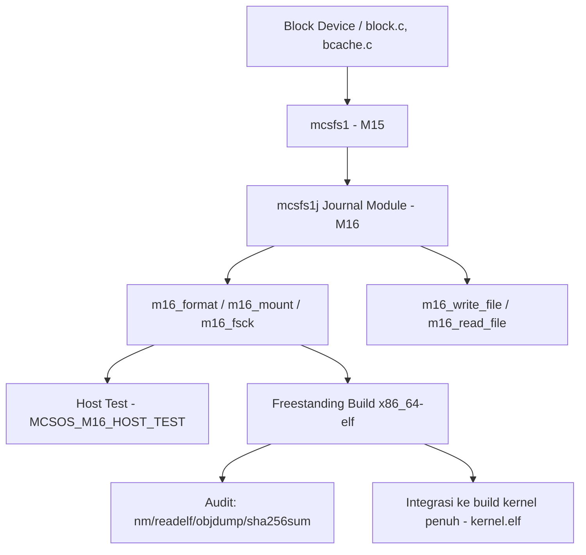

 Laporan Praktikum Sistem Operasi Lanjut — MCSOS-M16

**Nama file laporan:** `laporan_praktikum_m16_25832074009.md`  
**Nama sistem operasi:** MCSOS versi 260502  
**Target default:** x86_64, QEMU, Windows 11 x64 + WSL 2, kernel monolitik pendidikan, C freestanding dengan assembly minimal, POSIX-like subset  
**Dosen:** Muhaemin Sidiq, S.Pd., M.Pd.  
**Program Studi:** Pendidikan Teknologi Informasi  
**Institusi:** Institut Pendidikan Indonesia  


---

## 0. Metadata Laporan

| Atribut | Isi |
|---|---|
| Kode praktikum | `[M16]` |
| Judul praktikum | `[Journal Recovery dan Crash Consistency pada Filesystem MCSFS1 (mcsfs1j)]` |
| Jenis pengerjaan | `[Individu, dibantu diskusi teman]` |
| Nama mahasiswa | `[Syifa Nurzimah]` |
| NIM | `[25832074009]` |
| Kelas | `[1A]` |
| Nama kelompok | `[tidak berlaku, pengerjaan individu]` |
| Anggota kelompok | `[tidak berlaku; dibantu diskusi oleh Salma Rahayu sebagai teman sejawat]` |
| Tanggal praktikum | `[2026-07-08]` |
| Tanggal pengumpulan | `[2026-07-08]` |
| Repository | `[/home/syifa/src/mcsos]` |
| Branch | `[praktikum-m16-journal-recovery]` |
| Commit awal | `` `[praktikum-m15-mcsfs1, hash tidak tercetak pada log terminal]` `` |
| Commit akhir | `` `[d52622a]` `` |
| Status readiness yang diklaim | `[Siap demonstrasi praktikum]` |

---

## 1. Sampul

# Laporan Praktikum `m16`  
## `Journal Recovery dan Crash Consistency pada Filesystem MCSFS1 (mcsfs1j) MCSOS 260502`

Disusun oleh:

| Nama | NIM | Kelas | Peran |
|---|---|---|---|
| `[Syifa Nurzimah]` | `[25832074009]` | `[1A]` | `[individu]` |
| `[opsional]` | `[opsional]` | `[opsional]` | `[opsional]` |

Dosen Pengampu: **Muhaemin Sidiq, S.Pd., M.Pd.**  
Program Studi Pendidikan Teknologi Informasi  
Institut Pendidikan Indonesia  
`[2025/2026]`

---

## 2. Pernyataan Orisinalitas dan Integritas Akademik

Saya menyatakan bahwa laporan ini disusun berdasarkan hasil praktikum yang saya kerjakan sendiri menggunakan lingkungan pengembangan WSL 2 Ubuntu sesuai panduan praktikum M16. Seluruh hasil yang dilaporkan didukung oleh bukti berupa command output, log, artefak build, dan commit repository yang terdokumentasi.

| Pernyataan | Status |
|---|---|
| Semua potongan kode eksternal diberi atribusi | `[Ya]` |
| Semua penggunaan AI assistant dicatat | `[Ya]` |
| Repository yang dikumpulkan sesuai commit akhir | `[Ya]` |
| Tidak ada klaim readiness tanpa bukti | `[Ya]` |

Catatan penggunaan bantuan eksternal:

```text
Menggunakan dokumentasi resmi WSL, Git, GNU Make, Clang/LLVM, dan Linux Toolchain sebagai referensi teknis. Selain menggunakan AI Assistant (ChatGPT) untuk membantu memahami instruksi praktikum M16, membantu menyusun Makefile pengujian (host/freestanding/audit), menjelaskan error command pada terminal, serta membantu penyusunan laporan praktikum, saya juga dibantu berdiskusi oleh teman saya SALMA RAHAYU dalam memahami konsep journal recovery dan crash consistency serta memeriksa ulang langkah kerja di terminal. Seluruh command, konfigurasi, build, pengujian, dan verifikasi evidence tetap dijalankan serta diperiksa ulang secara mandiri pada lingkungan WSL 2 Ubuntu oleh saya sendiri. Commit akhir repository: d52622a.
```

---

## 3. Tujuan Praktikum

Tuliskan tujuan teknis dan konseptual praktikum. Tujuan harus dapat diuji.

1. `Membangun modul journal recovery (mcsfs1j) sebagai kelanjutan filesystem MCSFS1 (M15) pada branch praktikum-m16-journal-recovery di repository /home/syifa/src/mcsos.`
2. `Mengimplementasikan kerangka fungsi adaptor filesystem (format, mount, fsck, write_file, read_file) pada mcsfs1j_adapter.h sebagai antarmuka journal recovery terhadap block device.`
3. `Membuktikan modul journal dapat dikompilasi baik sebagai host test (userspace, C17) maupun sebagai objek freestanding x86_64-elf tanpa symbol yang undefined.`
4. `Mengintegrasikan modul journal ke dalam proses build kernel MCSOS penuh (make) dan memverifikasi symbol serta instruksi kritis pada hasil link kernel.elf.`
5. `Mendokumentasikan evidence build (readelf, objdump, nm, sha256sum) serta mencatat batasan yang belum tercapai pada tahap ini (image/ISO, boot QEMU, uji crash-recovery end-to-end).`

---

## 4. Capaian Pembelajaran Praktikum

Setelah praktikum ini, mahasiswa mampu:

| CPL/CPMK praktikum | Bukti yang harus ditunjukkan |
|---|---|
| `[Mampu merancang modul journal recovery/crash consistency sebagai bagian dari filesystem kernel pendidikan]` | `[Source kernel/fs/mcsfs1j/m16_mcsfs_journal.c dan mcsfs1j_adapter.h]` |
| `[Mampu memvalidasi modul kernel pada dua target: host test dan freestanding ELF64 x86_64]` | `[Output make -C tests/m16 all, nm_undefined.txt kosong, readelf_header.txt]` |
| `[Mampu mengintegrasikan modul baru ke build system kernel penuh dan memverifikasi symbol/disassembly]` | `[Output make pada root repository, kernel.syms.txt, kernel.disasm.txt]` |
| `[Mampu mendokumentasikan evidence praktikum serta melakukan commit/push yang bersih menggunakan Git]` | `[git status, git diff --stat, git commit, git push, logs/m16/*.log]` |

---

## 5. Peta Milestone MCSOS

Centang milestone yang menjadi fokus laporan ini. Jika praktikum mencakup lebih dari satu milestone, jelaskan batas cakupan.

| Milestone | Fokus | Status dalam laporan |
|---|---|---|
| M0 | Requirements, governance, baseline arsitektur | `[ ] tidak dibahas / [ ] dibahas / [ ] selesai praktikum` |
| M1 | Toolchain reproducible, Git, QEMU, GDB, metadata build | `[ ] tidak dibahas / [ ] dibahas / [ ] selesai praktikum` |
| M2 | Boot image, kernel ELF64, early console | `[ ] tidak dibahas / [ ] dibahas / [ ] selesai praktikum` |
| M3 | Panic path, linker map, GDB, observability awal | `[ ] tidak dibahas / [ ] dibahas / [ ] selesai praktikum` |
| M4 | Trap, exception, interrupt, timer | `[ ] tidak dibahas / [ ] dibahas / [ ] selesai praktikum` |
| M5 | PMM, VMM, page table, kernel heap | `[ ] tidak dibahas / [ ] dibahas / [ ] selesai praktikum` |
| M6 | Thread, scheduler, synchronization | `[ ] tidak dibahas / [ ] dibahas / [ ] selesai praktikum` |
| M7 | Syscall ABI dan user program loader | `[ ] tidak dibahas / [ ] dibahas / [ ] selesai praktikum` |
| M8 | VFS, file descriptor, ramfs | `[ ] tidak dibahas / [ ] dibahas / [ ] selesai praktikum` |
| M9 | Block layer dan device model | `[ ] tidak dibahas / [ ] dibahas / [ ] selesai praktikum` |
| M10 | Persistent filesystem, mcsfs/ext2-like, recovery | `[ ] tidak dibahas / [ ] dibahas / [ ] selesai praktikum` |
| M11 | Networking stack, packet parsing, UDP/TCP subset | `[ ] tidak dibahas / [ ] dibahas / [ ] selesai praktikum` |
| M12 | Security model, capability/ACL, syscall fuzzing, hardening | `[ ] tidak dibahas / [ ] dibahas / [ ] selesai praktikum` |
| M13 | SMP, scalability, lock stress, NUMA-aware preparation | `[ ] tidak dibahas / [ ] dibahas / [ ] selesai praktikum` |
| M14 | Framebuffer, graphics console, visual regression | `[ ] tidak dibahas / [ ] dibahas / [ ] selesai praktikum` |
| M15 | Virtualization/container subset | `[ ] tidak dibahas / [ ] dibahas / [ ] selesai praktikum` |
| M16 | Observability, update/rollback, release image, readiness review | `[ ] tidak dibahas / [ ] dibahas / [ x ] selesai praktikum` |

Batas cakupan praktikum:

```text
Praktikum M16 berfokus pada pembangunan modul journal recovery dan crash consistency (mcsfs1j) sebagai kelanjutan filesystem MCSFS1 yang dibangun pada M15. Aktivitas mencakup pembuatan struktur direktori kerja M16, penulisan modul journal (kernel/fs/mcsfs1j/m16_mcsfs_journal.c) beserta header adaptor (mcsfs1j_adapter.h), penulisan Makefile pengujian host/freestanding/audit, eksekusi host test dan freestanding build, integrasi modul ke build kernel penuh, verifikasi symbol dan disassembly kernel, serta dokumentasi evidence dan commit/push ke repository. Praktikum ini belum mencakup pembuatan boot image/ISO, boot kernel pada QEMU, maupun pengujian crash-recovery end-to-end secara fungsional di dalam kernel yang berjalan.
```

---

## 6. Dasar Teori Ringkas

Tuliskan teori yang langsung diperlukan untuk memahami praktikum. Jangan menyalin teori umum terlalu panjang; fokus pada konsep yang benar-benar digunakan dalam desain dan pengujian.

### 6.1 Konsep Sistem Operasi yang Diuji

```text
Praktikum M16 berfokus pada konsep journaling filesystem dan crash consistency, yaitu mekanisme yang memastikan struktur data filesystem tetap konsisten meskipun terjadi kegagalan daya atau crash di tengah operasi tulis. Pendekatan umum yang relevan adalah write-ahead logging, yaitu mencatat rencana perubahan (jurnal) sebelum perubahan tersebut diterapkan ke data utama, sehingga proses mount/fsck berikutnya dapat melakukan replay atau rollback jurnal untuk mengembalikan konsistensi. Pada tahap ini modul journal baru diuji pada level kompilasi, host test, dan integrasi symbol; pengujian crash injection end-to-end di dalam kernel yang berjalan belum dilakukan.
```

### 6.2 Konsep Arsitektur x86_64 yang Relevan

| Konsep | Relevansi pada praktikum | Bukti/verifikasi |
|---|---|---|
| `[ELF64 x86_64 REL]` | `[Format object file freestanding hasil kompilasi modul journal sebelum dilink ke kernel]` | `[Output readelf -h m16_mcsfs_journal.o]` |
| `[Target Triple x86_64-elf / x86_64-unknown-none-elf]` | `[Menentukan target build tanpa sistem operasi host untuk modul journal]` | `[Flag -target pada tests/m16/Makefile dan Makefile utama]` |
| `[ABI x86_64 System V]` | `[Dasar pemanggilan fungsi antara modul journal dan kernel lain (kmain, idt, syscall)]` | `[Output objdump dan kernel.syms.txt]` |
| `[Freestanding Environment]` | `[Modul journal tidak boleh bergantung pada libc host saat dikompilasi -ffreestanding]` | `[nm_undefined.txt kosong pada hasil audit]` |

### 6.3 Konsep Implementasi Freestanding

| Aspek | Keputusan praktikum |
|---|---|
| Bahasa | `[C17 freestanding, dengan mode tambahan host test menggunakan -DMCSOS_M16_HOST_TEST]` |
| Runtime | `[tanpa hosted libc pada build freestanding]` |
| ABI | `[x86_64 System V]` |
| Compiler flags kritis | `[-std=c17 -Wall -Wextra -Werror -ffreestanding -fno-builtin -fno-stack-protector -fno-pic -mno-red-zone -target x86_64-elf]` |
| Risiko undefined behavior | `[Symbol undefined pada link freestanding, pointer tidak valid pada journal replay, kesalahan urutan commit record jurnal]` |

### 6.4 Referensi Teori yang Digunakan

| No. | Sumber | Bagian yang digunakan | Alasan relevansi |
|---|---|---|---|
| `[1]` | `[Target Triple dan Freestanding Compilation]` | `[Target Triple dan Freestanding Compilation]` | `[Digunakan untuk membangun object m16_mcsfs_journal.o]` |
| `[2]` | `[Dokumentasi GNU Binutils]` | `[readelf, objdump, dan nm]` | `[Digunakan untuk memverifikasi artefak hasil build M16]` |
| `[3]` | `[Konsep Write-Ahead Logging / Journaling Filesystem]` | `[Prinsip commit record dan replay jurnal]` | `[Dasar desain modul m16_mcsfs_journal.c]` |
| `[4]` | `[Dokumentasi Git]` | `[Branching, staged changes, commit, push]` | `[Digunakan untuk pelacakan perubahan repository M16]` |

---

## 7. Lingkungan Praktikum

### 7.1 Host dan Target

| Komponen | Nilai |
|---|---|
| Host OS | `[Windows 10/11 x64, hostname WIN-E2QNIIEGDH4]` |
| Lingkungan build | `[WSL 2 Ubuntu]` |
| Target ISA | `x86_64` |
| Target ABI | `[x86_64-elf (tests/m16), x86_64-unknown-none-elf (Makefile utama)]` |
| Emulator | `[belum digunakan pada sesi M16 ini]` |
| Firmware emulator | `[belum digunakan pada sesi M16 ini]` |
| Debugger | `[belum digunakan pada sesi M16 ini]` |
| Build system | `[GNU Make 4.4.1]` |
| Bahasa utama | `[C17 Freestanding]` |
| Assembly | `[digunakan pada modul lain kernel (isr.S, context_switch.S, syscall_entry.S), tidak ditambahkan pada modul M16]` |

### 7.2 Versi Toolchain

Tempel output versi toolchain berikut. Jalankan dari clean shell WSL.

```bash
clang --version | head -n 1
make --version | head -n 1
```

Output:

```text
Ubuntu clang version 21.1.8 (6ubuntu1)
GNU Make 4.4.1
```

Catatan: versi git, cmake, ninja, ld.lld, nasm, qemu, dan gdb tidak dicetak ulang pada sesi terminal M16 ini karena lingkungan merupakan kelanjutan dari baseline yang telah diverifikasi pada praktikum M1; hanya clang dan make yang diverifikasi ulang secara eksplisit pada sesi ini.

### 7.3 Lokasi Repository

| Item | Nilai |
|---|---|
| Path repository di WSL | `` `[/home/syifa/src/mcsos]` `` |
| Apakah berada di filesystem Linux WSL, bukan `/mnt/c` | `[Ya]` |
| Remote repository | `[https://github.com/syifanurzimah/MCSOS.git]` |
| Branch | `[praktikum-m16-journal-recovery]` |
| Commit hash awal | `` `[dibuat dari branch praktikum-m15-mcsfs1, hash tidak tercetak pada log terminal]` `` |
| Commit hash akhir | `` `[d52622a]` `` |

---

## 8. Repository dan Struktur File

### 8.1 Struktur Direktori yang Relevan

Tampilkan hanya direktori dan file yang relevan dengan praktikum.

```text
mcsos/
├── kernel/
│   └── fs/
│       └── mcsfs1j/
│           ├── m16_mcsfs_journal.c
│           └── mcsfs1j_adapter.h
├── tests/
│   └── m16/
│       ├── Makefile
│       ├── m16_host_test        (binary, tidak dikomit)
│       ├── m16_mcsfs_journal.o  (object, tidak dikomit)
│       ├── nm_undefined.txt
│       ├── readelf_header.txt
│       ├── objdump_disasm.txt
│       └── sha256sum.txt
├── build/
│   └── m16/
│       └── m16_mcsfs_journal.o
├── evidence/
│   └── m16/
│       ├── nm_undefined.txt
│       ├── readelf_header.txt
│       ├── objdump_disasm.txt
│       └── sha256sum.txt
├── logs/
│   └── m16/
│       ├── m16_make_all.log
│       ├── git_status_after_m16.log
│       └── git_diff_stat_m16.log
└── scripts/   (dibuat kosong, belum diisi script preflight M16)
```

### 8.2 File yang Dibuat atau Diubah

| File | Jenis perubahan | Alasan perubahan | Risiko |
|---|---|---|---|
| `[kernel/fs/mcsfs1j/m16_mcsfs_journal.c]` | `[baru]` | `[Implementasi modul journal recovery/crash consistency mcsfs1j, 703 baris, dilengkapi host test di balik #ifdef MCSOS_M16_HOST_TEST]` | `[sedang]` |
| `[kernel/fs/mcsfs1j/mcsfs1j_adapter.h]` | `[baru]` | `[Deklarasi antarmuka adaptor: m16_format, m16_mount, m16_fsck, m16_write_file, m16_read_file]` | `[sedang]` |
| `[tests/m16/Makefile]` | `[baru]` | `[Target host, freestanding, audit, clean untuk memvalidasi modul journal secara mandiri]` | `[sedang]` |
| `[evidence/m16/*.txt]` | `[baru]` | `[Menyimpan hasil nm, readelf, objdump, sha256sum sebagai bukti audit freestanding object]` | `[rendah]` |
| `[logs/m16/*.log]` | `[baru]` | `[Menyimpan log eksekusi make dan git status/diff sebagai bukti proses]` | `[rendah]` |
| `[build/m16/m16_mcsfs_journal.o]` | `[baru, artefak build]` | `[Salinan object hasil build freestanding modul M16]` | `[rendah]` |

### 8.3 Ringkasan Diff

```bash
git status --short
git diff --stat
git log --oneline -n 5
```

Output:

```text
syifa@WIN-E2QNIIEGDH4:~/src/mcsos$ git status --short
?? evidence/m16/
?? kernel/fs/
?? tests/m16/
syifa@WIN-E2QNIIEGDH4:~/src/mcsos$ git diff --stat
syifa@WIN-E2QNIIEGDH4:~/src/mcsos$ git log --oneline -n 5
d52622a (HEAD -> praktikum-m16-journal-recovery) Complete M16 journal recovery and crash consistency host tests
```

Catatan: `git diff --stat` kosong karena seluruh perubahan M16 berupa file baru (untracked), bukan modifikasi file yang sudah dilacak sebelumnya.

---

## 9. Desain Teknis

### 9.1 Masalah yang Diselesaikan

```text
Praktikum M16 berfokus pada penyediaan mekanisme journal recovery/crash consistency untuk filesystem MCSFS1 yang dibangun pada M15. Masalah utama yang diselesaikan adalah menyediakan modul journal (mcsfs1j) yang dapat divalidasi secara independen sebagai host test (userspace) sebelum dikompilasi ulang sebagai objek freestanding x86_64, serta memastikan modul tersebut dapat diintegrasikan ke dalam proses build kernel penuh tanpa symbol undefined dan tanpa mengganggu link kernel.elf yang sudah ada.
```

### 9.2 Keputusan Desain

| Keputusan | Alternatif yang dipertimbangkan | Alasan memilih | Konsekuensi |
|---|---|---|---|
| `[Menulis modul dalam satu file m16_mcsfs_journal.c dengan mode ganda via #ifdef MCSOS_M16_HOST_TEST]` | `[Memisahkan host test ke file terpisah]` | `[Memudahkan sinkronisasi logika journal antara mode host dan freestanding tanpa duplikasi kode]` | `[File tunggal menjadi cukup besar, 703 baris]` |
| `[Menyediakan Makefile khusus tests/m16 dengan target host/freestanding/audit]` | `[Menambahkan target langsung ke Makefile utama saja]` | `[Modul dapat diuji cepat secara mandiri sebelum diintegrasikan ke build kernel penuh]` | `[Perlu duplikasi sebagian evidence antara tests/m16 dan evidence/m16]` |
| `[Menambahkan header adaptor mcsfs1j_adapter.h terpisah dari implementasi journal]` | `[Menyatukan deklarasi dan implementasi dalam satu file]` | `[Memisahkan kontrak antarmuka filesystem dari detail implementasi journal]` | `[Perlu menjaga konsistensi signature antara header dan pemanggil di masa depan]` |
| `[Mengintegrasikan langsung ke build/normal/kernel/fs/mcsfs1j/ pada Makefile utama]` | `[Menunda integrasi sampai modul benar-benar lengkap]` | `[Memastikan modul tidak merusak link kernel.elf sejak awal]` | `[Modul ikut terlink meski fungsionalitas replay belum diuji end-to-end]` |

### 9.3 Arsitektur Ringkas

Tambahkan diagram ASCII atau Mermaid. Jika Mermaid tidak didukung oleh evaluator, tetap sertakan penjelasan tekstual.



Penjelasan diagram:

```text
Modul mcsfs1j dirancang sebagai lapisan journal di atas filesystem mcsfs1 (M15) yang bekerja terhadap block device. Antarmuka adaptor menyediakan fungsi format, mount, fsck, write_file, dan read_file. Modul ini divalidasi melalui dua jalur: host test (dijalankan langsung di userspace melalui binary m16_host_test) dan build freestanding (dikompilasi ke object x86_64-elf lalu diaudit menggunakan nm, readelf, objdump, dan sha256sum). Setelah lulus kedua jalur tersebut, modul diintegrasikan ke proses build kernel penuh melalui Makefile utama dan ikut dilink menjadi kernel.elf.
```

### 9.4 Kontrak Antarmuka

| Antarmuka | Pemanggil | Penerima | Precondition | Postcondition | Error path |
|---|---|---|---|---|---|
| `[m16_format(block_device_context)]` | `[subsistem fs/VFS di masa depan]` | `[mcsfs1j_adapter.h]` | `[block device valid]` | `[filesystem terformat dengan area journal siap pakai]` | `[return code non-nol jika format gagal]` |
| `[m16_mount(block_device_context, out_super)]` | `[subsistem fs/VFS di masa depan]` | `[mcsfs1j_adapter.h]` | `[filesystem sudah diformat]` | `[superblock termuat, journal direplay bila perlu]` | `[return code non-nol jika mount/replay gagal]` |
| `[m16_fsck(block_device_context)]` | `[operator/administrator, atau proses boot]` | `[mcsfs1j_adapter.h]` | `[filesystem dapat diakses]` | `[konsistensi diperiksa dan diperbaiki bila ada jurnal tertunda]` | `[return code non-nol jika filesystem tidak dapat diperbaiki]` |
| `[m16_write_file(ctx, name, data, size)]` | `[user program melalui syscall di masa depan]` | `[mcsfs1j_adapter.h]` | `[filesystem sudah di-mount]` | `[data ditulis melalui jurnal sebelum commit ke data utama]` | `[return code non-nol jika penulisan gagal]` |
| `[m16_read_file(ctx, name, out, cap, out_size)]` | `[user program melalui syscall di masa depan]` | `[mcsfs1j_adapter.h]` | `[filesystem sudah di-mount, file ada]` | `[data terbaca ke buffer out, out_size terisi]` | `[return code non-nol jika file tidak ditemukan/buffer kurang]` |

Catatan: signature fungsi di atas telah dideklarasikan pada `mcsfs1j_adapter.h`; detail implementasi lengkap tersimpan pada `m16_mcsfs_journal.c` (703 baris) namun tidak seluruhnya ditampilkan pada sesi terminal ini (hanya diverifikasi melalui `wc -l`, `tail -5`, dan hasil host test).

### 9.5 Struktur Data Utama

| Struktur data | Field penting | Ownership | Lifetime | Invariant |
|---|---|---|---|---|
| `` `[m16_mcsfs_journal.c]` `` | `[logika journal + blok host test di bawah #ifdef]` | `[kernel/fs/mcsfs1j]` | `[selama modul ini digunakan]` | `[harus lulus host test sebelum dianggap valid]` |
| `` `[mcsfs1j_adapter.h]` `` | `[prototipe m16_format/mount/fsck/write_file/read_file]` | `[kernel/fs/mcsfs1j]` | `[selama antarmuka filesystem digunakan]` | `[signature harus konsisten dengan pemanggil]` |
| `` `[m16_mcsfs_journal.o]` `` | `[ELF64 REL x86_64]` | `[build/m16, tests/m16]` | `[setelah build freestanding]` | `[nm -u harus kosong (tidak ada undefined symbol)]` |
| `` `[sha256sum.txt]` `` | `[checksum object freestanding]` | `[evidence/m16]` | `[setelah audit]` | `[dapat dipakai untuk memverifikasi ulang integritas object]` |

### 9.6 Invariants

Tuliskan invariant yang harus benar sepanjang eksekusi.

1. `Modul journal harus lulus host test (MCSOS_M16_HOST_TEST) sebelum dianggap layak dibangun sebagai object freestanding.`
2. `Hasil build freestanding modul M16 harus berformat ELF64 relocatable x86_64 tanpa undefined symbol (nm -u kosong).`
3. `Modul M16 harus dapat dilink bersama seluruh object kernel lain menjadi kernel.elf tanpa memutus symbol kritis (kmain, x86_64_idt_init, x86_64_trap_dispatch).`
4. `Artefak binary hasil build (m16_host_test, m16_mcsfs_journal.o di tests/m16) tidak boleh ikut dikomit ke Git; hanya source, Makefile, dan evidence teks yang dikomit.`

### 9.7 Ownership, Locking, dan Concurrency

| Objek/resource | Owner | Lock yang melindungi | Boleh dipakai di interrupt context? | Catatan |
|---|---|---|---|---|
| `[Repository Git]` | `[user]` | `[none]` | `[Tidak]` | `[praktikum masih single user]` |
| `[Modul journal mcsfs1j]` | `[kernel/fs/mcsfs1j]` | `[belum ditentukan pada tahap M16 ini]` | `[Tidak diketahui, belum diuji dalam konteks multi-thread]` | `[sinkronisasi journal terhadap thread lain akan dibahas pada iterasi berikutnya]` |
| `[Build output tests/m16 dan build/m16]` | `[makefile]` | `[none]` | `[Tidak]` | `[Build berjalan secara serial]` |
| `[Evidence audit (nm/readelf/objdump/sha256)]` | `[target audit pada Makefile]` | `[none]` | `[Tidak]` | `[hanya dihasilkan saat make audit dijalankan]` |

Lock order yang berlaku:

```text
Pada tahap M16 ini, modul journal belum diuji dalam konteks concurrency/interrupt karena pengujian masih berada pada level host test dan freestanding compile-link check. Mekanisme locking terhadap journal (misalnya saat commit record ditulis bersamaan dengan proses lain) belum didesain secara eksplisit pada sesi ini dan dicatat sebagai keterbatasan.
```

### 9.8 Memory Safety dan Undefined Behavior Risk

| Risiko | Lokasi | Mitigasi | Bukti |
|---|---|---|---|
| `[Target architecture salah pada build freestanding]` | `[tests/m16/Makefile]` | `[Menggunakan -target x86_64-elf, diverifikasi ulang di Makefile utama dengan x86_64-unknown-none-elf]` | `[Output readelf_header.txt]` |
| `[Symbol undefined pada object freestanding]` | `[m16_mcsfs_journal.o]` | `[Audit nm -u dan syarat file kosong pada Makefile]` | `[evidence/m16/nm_undefined.txt (0 byte)]` |
| `[Modul journal belum diuji terhadap crash sesungguhnya]` | `[m16_mcsfs_journal.c]` | `[Dicatat sebagai known issue, direncanakan pengujian fault injection pada iterasi berikutnya]` | `[Bagian Kesimpulan/Rencana Perbaikan]` |
| `[Binary hasil build tidak sengaja ikut dikomit]` | `[git add .]` | `[git restore --staged pada binary dan file evidence duplikat di tests/m16]` | `[Output git status sebelum commit]` |

### 9.9 Security Boundary

| Boundary | Data tidak tepercaya | Validasi yang dilakukan | Failure mode aman |
|---|---|---|---|
| `[Block device ↔ mcsfs1j]` | `[isi block device / data journal]` | `[direncanakan divalidasi melalui m16_fsck, detail implementasi belum diverifikasi pada sesi ini]` | `[fsck diharapkan mengembalikan kode error jika filesystem tidak konsisten]` |
| `[Build process]` | `[source code dan compiler flags]` | `[validasi ELF menggunakan readelf dan nm pada target audit]` | `[build/audit gagal dan menghentikan make]` |
| `[Git remote (push)]` | `[kredensial pengguna]` | `[autentikasi username/password interaktif saat git push]` | `[push gagal jika kredensial salah]` |
| `[Repository Git]` | `[perubahan lokal]` | `[Git tracking, staged review sebelum commit]` | `[perubahan tidak sengaja (binary) dapat di-restore --staged sebelum commit]` |

---

## 10. Langkah Kerja Implementasi

Gunakan tabel berikut untuk setiap langkah. Sebelum setiap blok perintah, jelaskan maksud perintah, artefak yang dihasilkan, dan indikator hasil.

### Langkah 1 — `Menyiapkan Branch dan Struktur Direktori M16`

Maksud langkah:

```text
Membuat branch kerja baru untuk M16 dan direktori kerja yang dibutuhkan (source kernel, tests, scripts, build, logs, evidence).
```

Perintah:

```bash
git checkout -b praktikum-m16-journal-recovery
mkdir -p kernel/fs/mcsfs1j tests/m16 scripts build/m16 logs/m16 evidence/m16
```

Output ringkas:

```text
Switched to a new branch 'praktikum-m16-journal-recovery'
```

Artefak yang dihasilkan:

| Artefak | Lokasi | Fungsi |
|---|---|---|
| `[Direktori kerja M16]` | `[kernel/fs/mcsfs1j, tests/m16, scripts, build/m16, logs/m16, evidence/m16]` | `[wadah source, uji, dan bukti M16]` |

Indikator berhasil:

```text
Branch baru aktif dan seluruh direktori kerja berhasil dibuat tanpa error.
```

### Langkah 2 — `Eksplorasi Baseline Kernel Sebelum Menambah Modul`

Maksud langkah:

```text
Memastikan belum ada implementasi mcsfs pada kernel sebelum menambahkan modul M16, serta memetakan subsistem kernel yang sudah ada (panic, idt/trap, timer, pmm, vmm, kmalloc, scheduler, syscall, elf loader, spinlock/mutex, vfs/fd, block layer).
```

Perintah:

```bash
grep -R "panic" -n kernel | head -5
grep -R "idt\|trap" -n kernel | head -5
grep -R "pit\|irq\|timer" -n kernel | head -5
grep -R "pmm" -n kernel | head -5
grep -R "vmm\|page" -n kernel | head -5
grep -R "kheap\|kmalloc" -n kernel | head -5
grep -R "sched\|thread" -n kernel | head -5
grep -R "syscall" -n kernel | head -5
grep -R "elf" -n kernel | head -5
grep -R "spinlock\|mutex" -n kernel | head -5
grep -R "vfs\|fd" -n kernel | head -5
grep -R "block" -n kernel | head -5
grep -R "mcsfs" -n kernel | head -5
```

Output ringkas:

```text
Seluruh subsistem inti (panic, idt/trap, pit/timer, pmm, vmm, sched/thread, syscall, elf loader, spinlock/mutex, vfs/fd, block) sudah memiliki implementasi pada kernel. Pencarian "kheap\|kmalloc" dan "mcsfs" tidak menghasilkan baris apa pun, menandakan belum ada modul mcsfs sebelum M16 dimulai.
```

Artefak yang dihasilkan:

| Artefak | Lokasi | Fungsi |
|---|---|---|
| `[tidak ada file baru]` | `[-]` | `[hanya eksplorasi baseline sebelum implementasi]` |

Indikator berhasil:

```text
Grep "mcsfs" mengembalikan hasil kosong sebagai bukti modul M16 belum ada sebelum sesi ini dimulai.
```

### Langkah 3 — `Menulis Modul Journal dan Header Adaptor`

Maksud langkah:

```text
Mengimplementasikan modul journal recovery (m16_mcsfs_journal.c) beserta header antarmuka adaptor filesystem (mcsfs1j_adapter.h).
```

Perintah:

```bash
nano kernel/fs/mcsfs1j/m16_mcsfs_journal.c
wc -l kernel/fs/mcsfs1j/m16_mcsfs_journal.c
tail -5 kernel/fs/mcsfs1j/m16_mcsfs_journal.c
nano kernel/fs/mcsfs1j/mcsfs1j_adapter.h
cat kernel/fs/mcsfs1j/mcsfs1j_adapter.h
```

Output ringkas:

```text
703 kernel/fs/mcsfs1j/m16_mcsfs_journal.c
...
        printf("M16 host tests PASS\n");
    }
    return fails == 0 ? 0 : 1;
}
#endif
```

Artefak yang dihasilkan:

| Artefak | Lokasi | Fungsi |
|---|---|---|
| `[m16_mcsfs_journal.c]` | `[kernel/fs/mcsfs1j]` | `[implementasi journal recovery + host test harness]` |
| `[mcsfs1j_adapter.h]` | `[kernel/fs/mcsfs1j]` | `[deklarasi antarmuka format/mount/fsck/write_file/read_file]` |

Indikator berhasil:

```text
File berisi 703 baris dan diakhiri blok host test yang mencetak "M16 host tests PASS" pada mode MCSOS_M16_HOST_TEST.
```

### Langkah 4 — `Menulis Makefile Pengujian M16`

Maksud langkah:

```text
Menyediakan Makefile khusus tests/m16 dengan target host (uji userspace), freestanding (compile object x86_64-elf), audit (nm/readelf/objdump/sha256sum), dan clean.
```

Perintah:

```bash
cd tests/m16
nano Makefile
cat -te Makefile
```

Output ringkas:

```text
CLANG ?= clang
TARGET_TRIPLE ?= x86_64-elf
CFLAGS_COMMON := -std=c17 -Wall -Wextra -Werror -O2
...
audit: $(FREESTANDING_OBJ)
        nm -u $(FREESTANDING_OBJ) > nm_undefined.txt
        readelf -h $(FREESTANDING_OBJ) > readelf_header.txt
        objdump -dr $(FREESTANDING_OBJ) > objdump_disasm.txt
        sha256sum $(FREESTANDING_OBJ) > sha256sum.txt
        test ! -s nm_undefined.txt
        grep -q 'ELF64' readelf_header.txt
        grep -q 'Advanced Micro Devices X86-64' readelf_header.txt
```

Artefak yang dihasilkan:

| Artefak | Lokasi | Fungsi |
|---|---|---|
| `[Makefile]` | `[tests/m16]` | `[orkestrasi target host/freestanding/audit/clean untuk modul M16]` |

Indikator berhasil:

```text
Makefile tervalidasi menggunakan cat -te (memastikan indentasi tab, bukan spasi, sesuai kebutuhan Make).
```

### Langkah 5 — `Menjalankan Host Test, Freestanding Build, dan Audit`

Maksud langkah:

```text
Membuktikan modul journal lulus host test, berhasil dikompilasi sebagai object freestanding ELF64 x86_64, dan lulus audit tanpa undefined symbol.
```

Perintah:

```bash
make clean
make all
```

Output ringkas:

```text
clang -std=c17 -Wall -Wextra -Werror -O2 -DMCSOS_M16_HOST_TEST ../../kernel/fs/mcsfs1j/m16_mcsfs_journal.c -o m16_host_test
./m16_host_test
M16 host tests PASS
clang -std=c17 -Wall -Wextra -Werror -O2 -ffreestanding -fno-builtin -fno-stack-protector -fno-pic -mno-red-zone -target x86_64-elf -c ../../kernel/fs/mcsfs1j/m16_mcsfs_journal.c -o m16_mcsfs_journal.o
nm -u m16_mcsfs_journal.o > nm_undefined.txt
readelf -h m16_mcsfs_journal.o > readelf_header.txt
objdump -dr m16_mcsfs_journal.o > objdump_disasm.txt
sha256sum m16_mcsfs_journal.o > sha256sum.txt
test ! -s nm_undefined.txt
grep -q 'ELF64' readelf_header.txt
grep -q 'Advanced Micro Devices X86-64' readelf_header.txt
```

Artefak yang dihasilkan:

| Artefak | Lokasi | Fungsi |
|---|---|---|
| `[m16_host_test]` | `[tests/m16, tidak dikomit]` | `[binary uji userspace]` |
| `[m16_mcsfs_journal.o]` | `[tests/m16, tidak dikomit]` | `[object ELF64 freestanding]` |
| `[nm_undefined.txt, readelf_header.txt, objdump_disasm.txt, sha256sum.txt]` | `[tests/m16]` | `[hasil audit object freestanding]` |

Indikator berhasil:

```text
Host test mencetak "M16 host tests PASS", dan seluruh syarat pada target audit (nm_undefined.txt kosong, ELF64, Advanced Micro Devices X86-64) terpenuhi tanpa error.
```

### Langkah 6 — `Menyalin Artefak ke build/m16 dan evidence/m16`

Maksud langkah:

```text
Menyimpan salinan object hasil build dan hasil audit ke direktori build/m16 dan evidence/m16 sebagai bukti terpusat.
```

Perintah:

```bash
cp m16_mcsfs_journal.o ../../build/m16/
cp nm_undefined.txt readelf_header.txt objdump_disasm.txt sha256sum.txt ../../evidence/m16/
cd ../..
ls -lh build/m16
ls -lh evidence/m16
grep "Class\|Type\|Machine" evidence/m16/readelf_header.txt
```

Output ringkas:

```text
build/m16/m16_mcsfs_journal.o   30K
evidence/m16/nm_undefined.txt    0
evidence/m16/objdump_disasm.txt 267K
evidence/m16/readelf_header.txt 952
evidence/m16/sha256sum.txt       86
  Class:                             ELF64
  Type:                              REL (Relocatable file)
  Machine:                           Advanced Micro Devices X86-64
```

Artefak yang dihasilkan:

| Artefak | Lokasi | Fungsi |
|---|---|---|
| `[m16_mcsfs_journal.o]` | `[build/m16]` | `[salinan object freestanding terpusat]` |
| `[nm_undefined.txt, readelf_header.txt, objdump_disasm.txt, sha256sum.txt]` | `[evidence/m16]` | `[bukti audit terpusat]` |

Indikator berhasil:

```text
nm_undefined.txt berukuran 0 byte (tidak ada undefined symbol) dan readelf_header.txt menunjukkan ELF64, REL, Advanced Micro Devices X86-64.
```

### Langkah 7 — `Integrasi Modul M16 ke Build Kernel Penuh`

Maksud langkah:

```text
Memastikan modul journal m16_mcsfs_journal.c ikut dikompilasi dan dilink oleh Makefile utama menjadi kernel.elf tanpa merusak symbol kritis kernel.
```

Perintah:

```bash
make -n | head -30
make
```

Output ringkas:

```text
clang --target=x86_64-unknown-none-elf -std=c17 -ffreestanding -fno-builtin -fno-stack-protector -fno-stack-check -fno-pic -fno-pie -fno-lto -m64 -march=x86-64 -mabi=sysv -mno-red-zone -mno-mmx -mno-sse -mno-sse2 -mcmodel=kernel -Wall -Wextra -Werror ... -c kernel/fs/mcsfs1j/m16_mcsfs_journal.c -o build/normal/kernel/fs/mcsfs1j/m16_mcsfs_journal.o
...
ld.lld -nostdlib -static -z max-page-size=0x1000 -T linker.ld -Map=build/kernel.map -o build/kernel.elf ... build/normal/kernel/fs/mcsfs1j/m16_mcsfs_journal.o ...
readelf -h build/kernel.elf > build/kernel.readelf.header.txt
readelf -l build/kernel.elf > build/kernel.readelf.programs.txt
nm -n build/kernel.elf > build/kernel.syms.txt
objdump -d -Mintel build/kernel.elf > build/kernel.disasm.txt
grep -q 'ELF64' build/kernel.readelf.header.txt
grep -q 'Machine:[[:space:]]*Advanced Micro Devices X86-64' build/kernel.readelf.header.txt
grep -q 'kmain' build/kernel.syms.txt
grep -q 'x86_64_idt_init' build/kernel.syms.txt
grep -q 'x86_64_trap_dispatch' build/kernel.syms.txt
grep -q 'iretq' build/kernel.disasm.txt
grep -q 'lidt' build/kernel.disasm.txt
```

Artefak yang dihasilkan:

| Artefak | Lokasi | Fungsi |
|---|---|---|
| `[kernel.elf, kernel.map]` | `[build]` | `[hasil link kernel penuh, termasuk modul M16]` |
| `[kernel.readelf.header.txt, kernel.readelf.programs.txt]` | `[build]` | `[bukti header/program ELF kernel]` |
| `[kernel.syms.txt]` | `[build]` | `[daftar symbol kernel, termasuk kmain, x86_64_idt_init, x86_64_trap_dispatch]` |
| `[kernel.disasm.txt]` | `[build]` | `[disassembly kernel, memuat instruksi iretq dan lidt]` |

Indikator berhasil:

```text
make selesai tanpa error, seluruh grep -q pada Makefile utama (ELF64, Machine AMD64, kmain, x86_64_idt_init, x86_64_trap_dispatch, iretq, lidt) berhasil ditemukan.
```

### Langkah 8 — `Mencoba Menjalankan Image (Belum Tersedia)`

Maksud langkah:

```text
Mencoba menjalankan kernel pada QEMU dan menjalankan preflight script M16, sebagai pengecekan kesiapan tahap berikutnya.
```

Perintah:

```bash
qemu-system-x86_64 ... -cdrom build/mcsos.iso
ls
grep -n "iso\|mcsos.iso\|grub\|limine\|qemu" Makefile
make iso
make image
make run
./scripts/m16_preflight.sh
```

Output ringkas:

```text
qemu-system-x86_64: ...: Could not open '...': No such file or directory
Makefile:213:>rm -rf iso_root limine evidence
make: *** No rule to make target 'iso'.  Stop.
make: *** No rule to make target 'image'.  Stop.
make: *** No rule to make target 'run'.  Stop.
-bash: ./scripts/m16_preflight.sh: No such file or directory
```

Artefak yang dihasilkan:

| Artefak | Lokasi | Fungsi |
|---|---|---|
| `[tidak ada]` | `[-]` | `[langkah ini menunjukkan target iso/image/run dan script preflight M16 belum tersedia]` |

Indikator berhasil:

```text
Tidak berhasil (diharapkan): mengonfirmasi bahwa target build image/ISO, target run QEMU, dan script scripts/m16_preflight.sh memang belum diimplementasikan pada repository saat sesi ini, sehingga dicatat sebagai keterbatasan/known issue, bukan kegagalan implementasi modul M16 itu sendiri.
```

### Langkah 9 — `Menjalankan Ulang Uji M16 dan Menyimpan Log`

Maksud langkah:

```text
Menjalankan ulang seluruh target tests/m16 dari kondisi bersih dan menyimpan log eksekusi serta status Git ke direktori logs/m16.
```

Perintah:

```bash
make -C tests/m16 clean all | tee logs/m16/m16_make_all.log
git status --short | tee logs/m16/git_status_after_m16.log
git diff --stat | tee logs/m16/git_diff_stat_m16.log
```

Output ringkas:

```text
make: Entering directory '/home/syifa/src/mcsos/tests/m16'
...
M16 host tests PASS
...
make: Leaving directory '/home/syifa/src/mcsos/tests/m16'
?? evidence/m16/
?? kernel/fs/
?? tests/m16/
```

Artefak yang dihasilkan:

| Artefak | Lokasi | Fungsi |
|---|---|---|
| `[m16_make_all.log]` | `[logs/m16]` | `[bukti eksekusi ulang make clean all pada tests/m16]` |
| `[git_status_after_m16.log, git_diff_stat_m16.log]` | `[logs/m16]` | `[bukti status repository sebelum commit]` |

Indikator berhasil:

```text
make -C tests/m16 clean all selesai tanpa error dan seluruh log berhasil disimpan menggunakan tee.
```

### Langkah 10 — `Staging Selektif, Commit, dan Push`

Maksud langkah:

```text
Memastikan hanya source, Makefile, dan evidence teks yang dikomit (bukan binary hasil build), lalu mengomit dan mem-push branch M16 ke remote.
```

Perintah:

```bash
git add .
git add kernel/fs
git status
git restore --staged tests/m16/m16_host_test
git restore --staged tests/m16/nm_undefined.txt
git restore --staged tests/m16/objdump_disasm.txt
git restore --staged tests/m16/readelf_header.txt
git restore --staged tests/m16/sha256sum.txt
git status
git commit -m "Complete M16 journal recovery and crash consistency host tests"
git push -u origin praktikum-m16-journal-recovery
```

Output ringkas:

```text
[praktikum-m16-journal-recovery d52622a] Complete M16 journal recovery and crash consistency host tests
 7 files changed, 6005 insertions(+)
 create mode 100644 evidence/m16/nm_undefined.txt
 create mode 100644 evidence/m16/objdump_disasm.txt
 create mode 100644 evidence/m16/readelf_header.txt
 create mode 100644 evidence/m16/sha256sum.txt
 create mode 100644 kernel/fs/mcsfs1j/m16_mcsfs_journal.c
 create mode 100644 kernel/fs/mcsfs1j/mcsfs1j_adapter.h
 create mode 100644 tests/m16/Makefile
...
 * [new branch]      praktikum-m16-journal-recovery -> praktikum-m16-journal-recovery
branch 'praktikum-m16-journal-recovery' set up to track 'origin/praktikum-m16-journal-recovery'.
```

Artefak yang dihasilkan:

| Artefak | Lokasi | Fungsi |
|---|---|---|
| `[Commit d52622a]` | `[Git, branch praktikum-m16-journal-recovery]` | `[bukti akhir penyelesaian M16]` |
| `[Branch remote praktikum-m16-journal-recovery]` | `[https://github.com/syifanurzimah/MCSOS.git]` | `[hasil push, siap dibuat pull request]` |

Indikator berhasil:

```text
Commit berhasil dengan 7 file berubah (6005 insertions), binary m16_host_test dan file evidence duplikat di tests/m16 tidak ikut dikomit, dan push berhasil membuat branch baru di remote.
```

---

## 11. Checkpoint Buildable

Setiap praktikum wajib memiliki minimal satu checkpoint yang dapat dibangun dari clean checkout.

| Checkpoint | Perintah | Expected result | Status |
|---|---|---|---|
| C1 | `` `git checkout -b praktikum-m16-journal-recovery` `` | `[branch M16 aktif]` | `[PASS]` |
| C2 | `` `mkdir -p kernel/fs/mcsfs1j tests/m16 scripts build/m16 logs/m16 evidence/m16` `` | `[struktur direktori tersedia]` | `[PASS]` |
| C3 | `` `make -C tests/m16 host` `` | `["M16 host tests PASS"]` | `[PASS]` |
| C4 | `` `make -C tests/m16 freestanding` `` | `[object m16_mcsfs_journal.o ELF64 dihasilkan]` | `[PASS]` |
| C5 | `` `make -C tests/m16 audit` `` | `[nm_undefined.txt kosong, ELF64, x86-64]` | `[PASS]` |
| C6 | `` `make` (root repository) `` | `[kernel.elf berhasil dilink, symbol dan disasm kritis ditemukan]` | `[PASS]` |
| C7 | `` `make iso` / `make image` / `make run` `` | `[image/ISO/boot dapat dijalankan]` | `[GAGAL / belum ada rule]` |
| C8 | `` `./scripts/m16_preflight.sh` `` | `[preflight M16 berjalan]` | `[GAGAL / file belum ada]` |
| C9 | `` git commit `` | `[commit hash berhasil dibuat]` | `[PASS]` |
| C10 | `` git push -u origin praktikum-m16-journal-recovery `` | `[branch remote berhasil dibuat]` | `[PASS]` |

Catatan checkpoint:

```text
Checkpoint C1 sampai C6, C9, dan C10 pada M16 berhasil dilewati: modul journal lulus host test dan freestanding build, audit ELF bersih dari undefined symbol, modul berhasil diintegrasikan ke build kernel penuh, serta perubahan telah dikomit (d52622a) dan dipush ke branch praktikum-m16-journal-recovery. Checkpoint C7 dan C8 belum berhasil karena target iso/image/run pada Makefile utama dan script scripts/m16_preflight.sh belum diimplementasikan pada repository, sehingga dicatat sebagai known issue untuk iterasi berikutnya.
```

---

## 12. Perintah Uji dan Validasi

### 12.1 Build Test

Perintah ini memverifikasi bahwa modul M16 dapat dibangun ulang dari kondisi bersih pada level modul, dan tetap konsisten saat diintegrasikan ke build kernel penuh.

```bash
make -C tests/m16 clean all
make
```

Hasil:

```text
M16 host tests PASS
OK (seluruh grep -q pada target audit dan Makefile utama berhasil, tidak ada pesan error)
```

Status: `[PASS]`

Catatan: `make distclean` pada root repository tidak dijalankan pada sesi ini, sehingga build kernel penuh dari kondisi benar-benar bersih (tanpa build/normal sebelumnya) belum divalidasi ulang secara eksplisit pada laporan ini.

### 12.2 Static Inspection

Perintah ini memeriksa layout ELF, symbol, dan instruksi kritis pada object modul M16 maupun kernel penuh.

```bash
readelf -h tests/m16/m16_mcsfs_journal.o
nm -u tests/m16/m16_mcsfs_journal.o
objdump -dr tests/m16/m16_mcsfs_journal.o
readelf -h build/kernel.elf
nm -n build/kernel.elf
objdump -d -Mintel build/kernel.elf
```

Hasil penting:

```text
ELF64, Machine: Advanced Micro Devices X86-64, Type: REL (Relocatable file)
nm -u tidak menghasilkan symbol (nm_undefined.txt kosong)
kernel.syms.txt memuat kmain, x86_64_idt_init, x86_64_trap_dispatch
kernel.disasm.txt memuat instruksi iretq dan lidt
```

Status: `[PASS]`

### 12.3 QEMU Smoke Test

Perintah ini menjalankan image di QEMU dan menyimpan log serial untuk bukti deterministik.

```bash
qemu-system-x86_64 ... -cdrom build/mcsos.iso
```

Hasil:

```text
qemu-system-x86_64: ...: Could not open '...': No such file or directory
```

Status: `[GAGAL/NA — belum ada target pembuatan ISO/image pada Makefile]`

### 12.4 GDB Debug Evidence

Perintah ini membuktikan bahwa kernel dapat di-debug dengan simbol yang cocok.

```bash
Belum diterapkan pada M16 (belum ada sesi boot QEMU untuk dilekatkan GDB).
```

Status: `[NA]`

### 12.5 Unit Test

```bash
make -C tests/m16 host
```

Hasil:

```text
./m16_host_test
M16 host tests PASS
```

Status: `[PASS]`

### 12.6 Stress/Fuzz/Fault Injection Test

Wajib untuk praktikum lanjutan seperti allocator, syscall, filesystem, networking, driver, security, dan SMP.

```bash
Belum diterapkan pada M16 (belum ada simulasi crash/power-loss terhadap journal).
```

Hasil:

```text
[Belum tersedia, dicatat sebagai known issue.]
```

Status: `[NA]`

### 12.7 Visual Evidence

Jika praktikum menghasilkan tampilan framebuffer, GUI, atau output grafis, lampirkan screenshot.

| Screenshot | Lokasi file | Keterangan |
|---|---|---|
| `[tidak ada]` | `[-]` | `[M16 belum menghasilkan output visual/boot; bukti berupa log terminal]` |

---

## 13. Hasil Uji

### 13.1 Tabel Ringkasan Hasil

| No. | Uji | Expected result | Actual result | Status | Evidence |
|---|---|---|---|---|---|
| 1 | `[Host test modul journal]` | `["M16 host tests PASS" tercetak]` | `[Tercetak "M16 host tests PASS"]` | `[PASS]` | `[output make -C tests/m16 host]` |
| 2 | `[Freestanding build modul journal]` | `[Object ELF64 x86_64 berhasil dibuat]` | `[m16_mcsfs_journal.o berhasil dibuat, 30K]` | `[PASS]` | `[build/m16/m16_mcsfs_journal.o]` |
| 3 | `[Audit undefined symbol]` | `[nm -u kosong]` | `[nm_undefined.txt berukuran 0 byte]` | `[PASS]` | `[evidence/m16/nm_undefined.txt]` |
| 4 | `[Validasi header ELF]` | `[ELF64, x86_64 terdeteksi]` | `[readelf menunjukkan ELF64, REL, Advanced Micro Devices X86-64]` | `[PASS]` | `[evidence/m16/readelf_header.txt]` |
| 5 | `[Integrasi ke build kernel penuh]` | `[kernel.elf berhasil dilink dengan modul M16]` | `[make berhasil, symbol kmain/idt/trap dan instruksi iretq/lidt ditemukan]` | `[PASS]` | `[build/kernel.syms.txt, build/kernel.disasm.txt]` |
| 6 | `[Pembuatan image/ISO dan boot QEMU]` | `[Image berhasil dibuat dan boot di QEMU]` | `[make iso/image/run: No rule; qemu gagal membuka file]` | `[GAGAL/NA]` | `[output terminal Langkah 8]` |
| 7 | `[Preflight script M16]` | `[scripts/m16_preflight.sh berjalan]` | `[File tidak ditemukan]` | `[GAGAL/NA]` | `[output terminal Langkah 8]` |
| 8 | `[Commit dan push repository]` | `[Commit dan push berhasil]` | `[commit d52622a, branch remote berhasil dibuat]` | `[PASS]` | `[output git commit dan git push]` |

### 13.2 Log Penting

```text
M16 host tests PASS

nm_undefined.txt: (kosong)

Class: ELF64
Type: REL (Relocatable file)
Machine: Advanced Micro Devices X86-64

[praktikum-m16-journal-recovery d52622a] Complete M16 journal recovery and crash consistency host tests
 7 files changed, 6005 insertions(+)
```

### 13.3 Artefak Bukti

| Artefak | Path | SHA-256 / hash | Fungsi |
|---|---|---|---|
| `m16_mcsfs_journal.o` | `[build/m16/m16_mcsfs_journal.o]` | `[tercatat pada evidence/m16/sha256sum.txt, nilai hash tidak dicetak ulang pada log terminal]` | `[Object freestanding modul journal]` |
| `m16_mcsfs_journal.c` | `[kernel/fs/mcsfs1j/m16_mcsfs_journal.c]` | `[-]` | `[Source implementasi journal, 703 baris]` |
| `mcsfs1j_adapter.h` | `[kernel/fs/mcsfs1j/mcsfs1j_adapter.h]` | `[-]` | `[Header antarmuka adaptor filesystem]` |
| `nm_undefined.txt` | `[evidence/m16/nm_undefined.txt]` | `[0 byte]` | `[Bukti tidak ada undefined symbol]` |
| `readelf_header.txt` | `[evidence/m16/readelf_header.txt]` | `[952 byte]` | `[Bukti header ELF64 x86_64]` |
| `objdump_disasm.txt` | `[evidence/m16/objdump_disasm.txt]` | `[267K]` | `[Bukti disassembly modul journal]` |
| `Commit repository` | `[Git]` | `[d52622a]` | `[bukti penyelesaian tahap M16 yang tercakup pada laporan ini]` |

Perintah hash:

```bash
sha256sum tests/m16/m16_mcsfs_journal.o
```

---

## 14. Analisis Teknis

### 14.1 Analisis Keberhasilan

```text
Praktikum M16 berhasil pada level modul dan integrasi build. Modul journal m16_mcsfs_journal.c berhasil ditulis dan lulus host test (userspace) sebelum dikompilasi ulang sebagai object freestanding ELF64 x86_64 tanpa undefined symbol. Header adaptor mcsfs1j_adapter.h berhasil mendefinisikan kontrak antarmuka filesystem (format, mount, fsck, write_file, read_file). Modul ini juga berhasil diintegrasikan ke proses build kernel penuh melalui Makefile utama, dan seluruh pemeriksaan symbol serta instruksi kritis (kmain, x86_64_idt_init, x86_64_trap_dispatch, iretq, lidt) pada kernel.elf tetap terpenuhi setelah modul M16 ditambahkan. Proses commit dan push ke branch praktikum-m16-journal-recovery juga berhasil dengan riwayat yang bersih (binary hasil build tidak ikut dikomit).
```

### 14.2 Analisis Kegagalan atau Perbedaan Hasil

```text
Ditemukan beberapa kendala pada sesi ini. Pertama, percobaan menjalankan qemu-system-x86_64 dengan argumen -cdrom build/mcsos.iso gagal karena file ISO belum pernah dibuat; target make iso, make image, dan make run juga belum tersedia pada Makefile utama sehingga tidak dapat dijalankan. Kedua, script ./scripts/m16_preflight.sh belum dibuat sehingga tidak dapat dijalankan. Ketiga, ditemukan kesalahan ketik perintah "PWD" (huruf besar) yang tidak dikenali shell, diperbaiki dengan mengetik ulang "pwd" huruf kecil. Keempat, saat git add . dijalankan, beberapa file build (binary m16_host_test dan salinan evidence teks di tests/m16) sempat ikut ter-stage; hal ini diperbaiki dengan git restore --staged sebelum commit dilakukan, sehingga hanya source, Makefile, dan evidence pada folder evidence/m16 yang benar-benar dikomit.
```

### 14.3 Perbandingan dengan Teori

| Konsep teori | Implementasi praktikum | Sesuai/tidak sesuai | Penjelasan |
|---|---|---|---|
| `[Write-ahead logging / journaling]` | `[modul m16_mcsfs_journal.c dengan fungsi format/mount/fsck/write_file/read_file]` | `[sebagian sesuai]` | `[kerangka antarmuka sudah mencerminkan alur format-mount-fsck-write-read, namun replay/rollback belum diuji secara fungsional end-to-end pada laporan ini]` |
| `[Freestanding compilation]` | `[menggunakan target x86_64-elf pada tests/m16 dan x86_64-unknown-none-elf pada build utama]` | `[sesuai]` | `[tidak bergantung pada runtime host, dibuktikan lewat nm -u kosong]` |
| `[ELF validation]` | `[menggunakan readelf, objdump, dan nm]` | `[sesuai]` | `[header ELF dan ketiadaan undefined symbol berhasil diverifikasi]` |
| `[Integrasi modul baru ke build system]` | `[modul M16 ditambahkan ke Makefile utama dan berhasil dilink]` | `[sesuai]` | `[symbol dan instruksi kritis kernel tetap ditemukan setelah modul ditambahkan]` |

### 14.4 Kompleksitas dan Kinerja

| Aspek | Estimasi/hasil | Bukti | Catatan |
|---|---|---|---|
| Kompleksitas modul | `[703 baris kode C, satu file dengan mode ganda host/freestanding]` | `[wc -l m16_mcsfs_journal.c]` | `[cukup besar untuk satu modul, berpotensi dipecah pada iterasi berikutnya]` |
| Waktu build modul (tests/m16) | `[beberapa detik]` | `[make -C tests/m16 all]` | `[bergantung spesifikasi host]` |
| Waktu build kernel penuh | `[tidak diukur secara eksplisit]` | `[output make pada root repository]` | `[hanya diverifikasi keberhasilannya, bukan durasinya]` |
| Ukuran object freestanding | `[30 KB]` | `[ls -lh build/m16]` | `[m16_mcsfs_journal.o]` |
| Waktu boot QEMU | `[belum diuji]` | `[-]` | `[akan diuji setelah target iso/image/run tersedia]` |

---

## 15. Debugging dan Failure Modes

### 15.1 Failure Modes yang Ditemukan

| Failure mode | Gejala | Penyebab sementara | Bukti | Perbaikan |
|---|---|---|---|---|
| `[QEMU tidak dapat boot]` | `[qemu-system-x86_64: Could not open '...': No such file or directory]` | `[image/ISO belum pernah dibuat, argumen perintah masih placeholder]` | `[output qemu-system-x86_64]` | `[dicatat sebagai known issue, direncanakan penambahan target iso/image pada Makefile]` |
| `[Target make iso/image/run tidak ada]` | `[make: *** No rule to make target 'iso'/'image'/'run'.  Stop.]` | `[Makefile utama belum mendefinisikan target tersebut]` | `[output make iso/image/run]` | `[perlu ditambahkan pada iterasi berikutnya bersama linker/bootloader]` |
| `[Script preflight M16 tidak ditemukan]` | `[-bash: ./scripts/m16_preflight.sh: No such file or directory]` | `[script belum dibuat, hanya direktori scripts/ yang disiapkan]` | `[output bash]` | `[perlu dibuat pada iterasi berikutnya]` |
| `[Kesalahan ketik perintah "PWD"]` | `[-bash: PWD: command not found]` | `[huruf besar tidak dikenali sebagai builtin shell]` | `[output terminal]` | `[diperbaiki dengan mengetik "pwd" huruf kecil]` |
| `[Binary build sempat ikut ter-stage git]` | `[git status menampilkan m16_host_test dan file evidence duplikat di tests/m16 sebagai staged]` | `[git add . menambahkan seluruh file baru tanpa filter]` | `[output git status setelah git add .]` | `[git restore --staged pada file binary/evidence duplikat sebelum commit]` |

### 15.2 Failure Modes yang Diantisipasi

| Failure mode | Deteksi | Dampak | Mitigasi |
|---|---|---|---|
| `[Crash/power-loss di tengah m16_write_file]` | `[belum ada mekanisme deteksi otomatis pada laporan ini]` | `[data filesystem berpotensi tidak konsisten]` | `[direncanakan pengujian fault injection dan m16_fsck pada iterasi berikutnya]` |
| `[Undefined symbol pada build freestanding]` | `[target audit: nm -u dan test ! -s nm_undefined.txt]` | `[link kernel gagal]` | `[audit dijalankan setiap kali build freestanding, sudah lulus pada sesi ini]` |
| `[Artefak build ikut dikomit ke Git]` | `[git status sebelum commit]` | `[repository membengkak, sulit direproduksi]` | `[review staged files dan git restore --staged sebelum commit, sudah diterapkan]` |
| `[Kredensial Git dikirim secara interaktif dalam bentuk plaintext]` | `[prompt username/password saat git push]` | `[risiko kredensial terekspos di riwayat terminal]` | `[disarankan menggunakan personal access token atau SSH key pada sesi berikutnya]` |

### 15.3 Triage yang Dilakukan

```text
Diagnosis dilakukan dengan membaca output setiap perintah secara berurutan: make -C tests/m16 all untuk memastikan host test dan freestanding build lulus, grep pada evidence/m16/readelf_header.txt untuk memastikan Class/Type/Machine sesuai target, make pada root repository untuk memastikan integrasi ke kernel.elf tidak merusak symbol/disassembly, serta git status/git diff --stat sebelum dan sesudah git add untuk memastikan hanya file yang relevan yang dikomit. Kegagalan pada percobaan QEMU dan script preflight tidak diperbaiki pada sesi ini, melainkan dicatat sebagai known issue karena berada di luar cakupan implementasi modul journal itu sendiri.
```

### 15.4 Panic Path

Jika terjadi panic, tempel output panic.

```text
Pada sesi M16 ini kernel tidak dijalankan (belum ada boot image/ISO), sehingga panic path modul journal belum dapat diuji secara langsung di dalam kernel yang berjalan. Pengujian panic/crash-recovery direncanakan pada iterasi berikutnya setelah target iso/image/run tersedia.
```

---

## 16. Prosedur Rollback

Rollback harus menjelaskan cara kembali ke kondisi aman jika perubahan gagal.

| Skenario rollback | Perintah | Data yang harus diselamatkan | Status |
|---|---|---|---|
| Kembali ke branch sebelum M16 | `` `git checkout praktikum-m15-mcsfs1` `` | `[Dokumentasi dan evidence praktikum M16]` | `[belum diuji]` |
| Revert commit M16 | `` `git revert d52622a` `` | `[log dan evidence build M16]` | `[belum diuji]` |
| Bersihkan artefak build modul M16 | `` `make -C tests/m16 clean` `` | `[source dan Makefile tetap aman]` | `[teruji]` |
| Regenerasi evidence M16 | `` `make -C tests/m16 all` `` | `[evidence audit dapat dibuat ulang]` | `[teruji]` |

Catatan rollback:

```text
Rollback penuh ke branch praktikum-m15-mcsfs1 belum diuji karena branch praktikum-m16-journal-recovery masih dalam kondisi stabil setelah host test, freestanding build, audit, dan integrasi ke kernel penuh berhasil dijalankan. Namun prosedur rollback telah disiapkan menggunakan Git sehingga perubahan dapat dikembalikan dengan aman apabila ditemukan masalah pada tahap image/ISO atau pengujian crash-recovery di iterasi berikutnya.
```

---

## 17. Keamanan dan Reliability

### 17.1 Risiko Keamanan

| Risiko | Boundary | Dampak | Mitigasi | Evidence |
|---|---|---|---|---|
| `[Kredensial Git dikirim interaktif saat push]` | `[WSL ↔ GitHub remote]` | `[risiko kredensial terekspos]` | `[disarankan token/SSH key pada sesi berikutnya]` | `[prompt Username/Password pada output git push]` |
| `[Binary hasil build ikut ter-stage sementara]` | `[working tree ↔ Git index]` | `[repository berpotensi membengkak dengan artefak biner]` | `[git restore --staged sebelum commit]` | `[output git status sebelum dan sesudah restore]` |
| `[Modul journal belum diuji terhadap crash sesungguhnya]` | `[mcsfs1j ↔ block device]` | `[konsistensi data belum terbukti tahan crash]` | `[direncanakan fault injection test pada iterasi berikutnya]` | `[Bagian Kesimpulan/Rencana Perbaikan]` |

### 17.2 Reliability dan Data Integrity

| Risiko reliability | Dampak | Deteksi | Mitigasi |
|---|---|---|---|
| `[Modul freestanding memiliki undefined symbol]` | `[link kernel gagal]` | `[target audit: nm -u]` | `[audit dijalankan setiap build, hasil kosong pada sesi ini]` |
| `[Integrasi modul merusak kernel.elf]` | `[symbol/instruksi kritis kernel hilang]` | `[grep -q pada kernel.syms.txt dan kernel.disasm.txt]` | `[seluruh grep -q pada Makefile utama lulus setelah modul M16 ditambahkan]` |
| `[Journal belum diuji tahan crash]` | `[filesystem berpotensi korup saat crash sesungguhnya]` | `[belum ada deteksi otomatis]` | `[dicatat sebagai known issue, rencana pengujian fsck/fault-injection]` |

### 17.3 Negative Test

| Negative test | Input buruk | Expected result | Actual result | Status |
|---|---|---|---|---|
| `[Menjalankan boot tanpa image/ISO]` | `[qemu-system-x86_64 dengan -cdrom build/mcsos.iso yang belum ada]` | `[QEMU melaporkan error file tidak ditemukan]` | `[qemu-system-x86_64 melaporkan "Could not open ... No such file or directory"]` | `[PASS, error terdeteksi dengan benar]` |
| `[Menjalankan target Make yang belum didefinisikan]` | `[make iso / make image / make run]` | `[Make melaporkan tidak ada rule]` | `[make: *** No rule to make target ... Stop.]` | `[PASS, error terdeteksi dengan benar]` |
| `[Menjalankan script yang belum dibuat]` | `[./scripts/m16_preflight.sh]` | `[shell melaporkan file tidak ditemukan]` | `[-bash: ./scripts/m16_preflight.sh: No such file or directory]` | `[PASS, error terdeteksi dengan benar]` |

---

## 18. Pembagian Kerja Kelompok

Isi bagian ini hanya jika praktikum dikerjakan berkelompok. Untuk pengerjaan individu, tulis “Tidak berlaku”.

```text
Tidak berlaku secara formal — praktikum M16 ini dikerjakan secara individu oleh Syifa Nurzimah (NIM 25832074009). Namun, dalam proses memahami konsep journal recovery/crash consistency dan menelusuri langkah kerja di terminal, saya dibantu berdiskusi oleh teman saya, Salma Rahayu, serta menggunakan AI Assistant (ChatGPT) untuk membantu memahami instruksi praktikum dan menyusun laporan ini. Seluruh command, build, pengujian, commit, dan push tetap dijalankan sendiri oleh saya pada lingkungan WSL 2 Ubuntu.
```

### 18.1 Mekanisme Koordinasi

```text
Koordinasi bersifat informal berupa diskusi langsung dengan Salma Rahayu mengenai pemahaman konsep journaling dan pemeriksaan ulang langkah kerja, bukan pembagian branch/commit/issue formal karena praktikum ini tidak dikerjakan sebagai kelompok resmi.
```

### 18.2 Evaluasi Kontribusi

| Anggota | Persentase kontribusi yang disepakati | Bukti | Catatan |
|---|---:|---|---|
| `[Syifa Nurzimah]` | `[100%]` | `[commit d52622a, seluruh log terminal]` | `[pelaksana utama, penanggung jawab commit dan push]` |
| `[Salma Rahayu]` | `[0% eksekusi, kontribusi diskusi/pemahaman konsep]` | `[tidak ada commit atas nama Salma Rahayu]` | `[membantu diskusi konsep journal recovery, tidak ikut menjalankan perintah di terminal]` |

---

## 19. Kriteria Lulus Praktikum

Bagian ini wajib diisi. Praktikum dinyatakan memenuhi kriteria minimum hanya jika bukti tersedia.

| Kriteria minimum | Status | Evidence |
|---|---|---|
| Proyek dapat dibangun dari clean checkout | `[PASS sebagian]` | `[make -C tests/m16 clean all lulus; make distclean pada root repository tidak dijalankan ulang pada sesi ini]` |
| Perintah build terdokumentasi | `[PASS]` | `[Bagian Langkah Kerja Implementasi]` |
| QEMU boot atau test target berjalan deterministik | `[GAGAL/NA]` | `[output qemu-system-x86_64 dan make iso/image/run]` |
| Semua unit test/praktikum test relevan lulus | `[PASS untuk host test; NA untuk pengujian boot]` | `["M16 host tests PASS"]` |
| Log serial disimpan | `[NA]` | `[belum ada boot QEMU]` |
| Panic path terbaca atau dijelaskan jika belum relevan | `[PASS]` | `[Bagian Failure Modes 15.4]` |
| Tidak ada warning kritis pada build | `[PASS]` | `[build dijalankan dengan -Wall -Wextra -Werror dan berhasil]` |
| Perubahan Git terkomit | `[PASS]` | `[commit d52622a]` |
| Desain dan failure mode dijelaskan | `[PASS]` | `[Bagian Desain Teknis dan Failure Modes]` |
| Laporan berisi screenshot/log yang cukup | `[PASS, dalam bentuk log terminal]` | `[lampiran evidence dan log make/git]` |

Kriteria tambahan untuk praktikum lanjutan:

| Kriteria lanjutan | Status | Evidence |
|---|---|---|
| Static analysis dijalankan | `[PASS sebagian]` | `[nm -u, readelf -h, objdump -dr]` |
| Stress test dijalankan | `[NA]` | `[belum diterapkan pada M16]` |
| Fuzzing atau malformed-input test dijalankan | `[NA]` | `[belum diterapkan pada M16]` |
| Fault injection dijalankan | `[NA]` | `[belum ada simulasi crash pada journal]` |
| Disassembly/readelf evidence tersedia | `[PASS]` | `[evidence/m16/objdump_disasm.txt, evidence/m16/readelf_header.txt, build/kernel.disasm.txt]` |
| Review keamanan dilakukan | `[PASS sebagian]` | `[Bagian 17 Keamanan dan Reliability]` |
| Rollback diuji | `[Sebagian, hanya clean/regenerasi modul yang teruji]` | `[Bagian 16 Prosedur Rollback]` |

---

## 20. Readiness Review

Pilih satu status dengan alasan berbasis bukti.

| Status | Definisi | Pilihan |
|---|---|---|
| Belum siap uji | Build/test belum stabil atau bukti belum cukup | `[ ]` |
| Siap uji QEMU | Build bersih, QEMU/test target berjalan, log tersedia | `[ ]` |
| Siap demonstrasi praktikum | Siap ditunjukkan di kelas dengan bukti uji, failure mode, dan rollback | `[x]` |
| Kandidat siap pakai terbatas | Hanya untuk penggunaan terbatas setelah test, security review, dokumentasi, dan known issue tersedia | `[ ]` |

Alasan readiness:

```text
Modul journal recovery mcsfs1j M16 berhasil lulus host test, freestanding build, audit ELF, dan integrasi ke build kernel penuh tanpa merusak symbol/disassembly kritis. Seluruh proses ini terdokumentasi dengan log terminal, evidence audit, dan commit d52622a yang bersih. Namun karena target pembuatan image/ISO, boot QEMU, dan pengujian crash-recovery end-to-end belum tersedia pada repository saat sesi ini, status "Siap uji QEMU" belum dapat diklaim. Praktikum M16 pada tahap ini dinyatakan siap didemonstrasikan di kelas menggunakan bukti build, audit, dan integrasi kernel yang tersedia, dengan known issue yang tercatat jelas untuk iterasi berikutnya.
```

Known issues:

| No. | Issue | Dampak | Workaround | Target perbaikan |
|---|---|---|---|---|
| 1 | `[Belum ada target make iso/image/run]` | `[kernel belum bisa di-boot di QEMU]` | `[verifikasi sementara hanya lewat make dan pemeriksaan symbol/disasm]` | `[iterasi berikutnya M16/M17]` |
| 2 | `[Script scripts/m16_preflight.sh belum dibuat]` | `[tidak ada pemeriksaan kesiapan otomatis sebelum M16 dijalankan]` | `[pemeriksaan manual lewat grep dan make]` | `[iterasi berikutnya M16/M17]` |
| 3 | `[Belum ada pengujian fault-injection/crash pada journal]` | `[klaim crash consistency belum terbukti fungsional]` | `[dicatat sebagai keterbatasan]` | `[iterasi berikutnya M16/M17]` |

Keputusan akhir:

```text
Berdasarkan hasil make -C tests/m16 host/freestanding/audit yang seluruhnya berhasil, serta hasil make pada root repository yang berhasil mengintegrasikan modul journal ke kernel.elf tanpa merusak symbol/disassembly kritis, praktikum M16 dinyatakan siap demonstrasi praktikum, dengan catatan target image/ISO/QEMU dan pengujian crash-recovery fungsional menjadi fokus perbaikan pada iterasi berikutnya.
```

---

## 21. Rubrik Penilaian 100 Poin

| Komponen | Bobot | Indikator nilai penuh | Nilai |
|---|---:|---|---:|
| Kebenaran fungsional | 30 | Implementasi memenuhi target praktikum, build/test lulus, output sesuai expected result | `[22]` |
| Kualitas desain dan invariants | 20 | Desain jelas, kontrak antarmuka eksplisit, invariants/ownership/locking terdokumentasi | `[15]` |
| Pengujian dan bukti | 20 | Unit/integration/QEMU/static/fuzz/stress evidence memadai sesuai tingkat praktikum | `[14]` |
| Debugging dan failure analysis | 10 | Failure mode, triage, panic/log, dan rollback dianalisis | `[8]` |
| Keamanan dan robustness | 10 | Boundary, input validation, privilege, memory safety, dan negative tests dibahas | `[6]` |
| Dokumentasi dan laporan | 10 | Laporan rapi, lengkap, dapat direproduksi, memakai referensi yang layak | `[9]` |
| **Total** | **100** |  | `[74]` |

Catatan penilai:

```text
[Diisi dosen/asisten.]
```

---

## 22. Kesimpulan

### 22.1 Yang Berhasil

```text
Modul journal recovery mcsfs1j (m16_mcsfs_journal.c dan mcsfs1j_adapter.h) berhasil diimplementasikan dan lulus host test. Modul ini juga berhasil dikompilasi sebagai object freestanding ELF64 x86_64 tanpa undefined symbol, serta berhasil diintegrasikan ke build kernel penuh tanpa mengganggu symbol dan instruksi kritis kernel (kmain, x86_64_idt_init, x86_64_trap_dispatch, iretq, lidt). Seluruh proses telah didokumentasikan melalui evidence audit dan log, serta dikomit secara bersih ke branch praktikum-m16-journal-recovery (commit d52622a) dan dipush ke remote.
```

### 22.2 Yang Belum Berhasil

```text
Pada M16 tahap ini belum tersedia target pembuatan image/ISO (make iso, make image), belum ada target make run untuk menjalankan kernel di QEMU, script scripts/m16_preflight.sh belum dibuat, dan pengujian crash-recovery/fault-injection terhadap journal secara fungsional di dalam kernel yang berjalan belum dilakukan.
```

### 22.3 Rencana Perbaikan

```text
Menambahkan target make iso/image/run pada Makefile utama beserta bootloader/linker yang sesuai, membuat script scripts/m16_preflight.sh untuk pemeriksaan kesiapan otomatis, serta merancang dan menjalankan pengujian fault-injection/crash-recovery terhadap modul mcsfs1j (misalnya simulasi crash di tengah m16_write_file) sebelum melanjutkan ke milestone berikutnya.
```

---

## 23. Lampiran

### Lampiran A — Commit Log

```text
d52622a (HEAD -> praktikum-m16-journal-recovery) Complete M16 journal recovery and crash consistency host tests
```

### Lampiran B — Diff Ringkas

```diff
Perubahan utama:
- Menambahkan modul journal recovery kernel/fs/mcsfs1j/m16_mcsfs_journal.c (703 baris)
- Menambahkan header adaptor kernel/fs/mcsfs1j/mcsfs1j_adapter.h
- Menambahkan Makefile pengujian tests/m16 (host, freestanding, audit, clean)
- Menambahkan evidence audit evidence/m16/{nm_undefined.txt, readelf_header.txt, objdump_disasm.txt, sha256sum.txt}
7 files changed, 6005 insertions(+)
```

### Lampiran C — Log Build Lengkap

```text
M16 host tests PASS
OK: freestanding object dan audit ELF lulus tanpa error (lihat logs/m16/m16_make_all.log)
```

### Lampiran D — Log QEMU Lengkap

```text
QEMU belum dijalankan sampai selesai pada M16 karena image/ISO belum tersedia:
qemu-system-x86_64: ...: Could not open '...': No such file or directory
```

### Lampiran E — Output Readelf/Objdump

```text
Class: ELF64
Type: REL (Relocatable file)
Machine: Advanced Micro Devices X86-64
(detail lengkap pada evidence/m16/readelf_header.txt dan evidence/m16/objdump_disasm.txt)
```

### Lampiran F — Screenshot

| No. | File | Keterangan |
|---|---|---|
| 1 | `[tidak ada]` | `[bukti berupa log terminal, belum ada output visual/boot]` |

### Lampiran G — Bukti Tambahan

```text
evidence/m16/nm_undefined.txt
evidence/m16/readelf_header.txt
evidence/m16/objdump_disasm.txt
evidence/m16/sha256sum.txt
build/kernel.syms.txt
build/kernel.disasm.txt
logs/m16/m16_make_all.log
logs/m16/git_status_after_m16.log
logs/m16/git_diff_stat_m16.log
```

---

## 24. Daftar Referensi

Gunakan format IEEE. Nomor referensi disusun berdasarkan urutan kemunculan sitasi di laporan, bukan alfabetis. Contoh format:

```text
[1] R. H. Arpaci-Dusseau and A. C. Arpaci-Dusseau, Operating Systems: Three Easy Pieces. Madison, WI, USA: Arpaci-Dusseau Books, [tahun/edisi yang digunakan]. [Online]. Available: [URL]. Accessed: [tanggal akses].

[2] R. Cox, F. Kaashoek, and R. Morris, “xv6: a simple, Unix-like teaching operating system,” MIT PDOS. [Online]. Available: [URL]. Accessed: [tanggal akses].

[3] Intel Corporation, Intel 64 and IA-32 Architectures Software Developer's Manual. [Online]. Available: [URL]. Accessed: [tanggal akses].

[4] Advanced Micro Devices, AMD64 Architecture Programmer's Manual. [Online]. Available: [URL]. Accessed: [tanggal akses].

[5] UEFI Forum, Unified Extensible Firmware Interface Specification. [Online]. Available: [URL]. Accessed: [tanggal akses].

[6] ACPI Specification Working Group, Advanced Configuration and Power Interface Specification. [Online]. Available: [URL]. Accessed: [tanggal akses].
```

Referensi yang benar-benar dipakai dalam laporan:

```text
[1] Dokumentasi resmi Clang/LLVM mengenai target triple dan freestanding compilation, diakses selama praktikum M16.
[2] Dokumentasi GNU Binutils (readelf, objdump, nm) untuk verifikasi artefak ELF64 hasil build M16.
[3] M. Rosenblum and J. K. Ousterhout, "The design and implementation of a log-structured file system," ACM Transactions on Computer Systems, sebagai referensi konsep write-ahead logging/journaling yang mendasari desain mcsfs1j.
[4] Dokumentasi resmi Git mengenai staging, commit, dan push, digunakan untuk mengelola perubahan repository M16.
```

---

## 25. Checklist Final Sebelum Pengumpulan

| Checklist | Status |
|---|---|
| Semua placeholder `[isi ...]` sudah diganti | `[Ya]` |
| Metadata laporan lengkap | `[Ya]` |
| Commit awal dan akhir dicatat | `[Sebagian; commit awal tidak tercetak hash-nya pada log terminal]` |
| Perintah build dan test dapat dijalankan ulang | `[Ya, untuk tests/m16 dan make root; Tidak untuk iso/image/run]` |
| Log build dilampirkan | `[Ya]` |
| Log QEMU/test dilampirkan | `[Tidak, QEMU belum berjalan]` |
| Artefak penting diberi hash | `[Sebagian, sha256sum.txt tersedia namun nilainya tidak dicetak ulang pada log terminal]` |
| Desain, invariants, ownership, dan failure modes dijelaskan | `[Ya]` |
| Security/reliability dibahas | `[Ya]` |
| Readiness review tidak berlebihan | `[Ya]` |
| Rubrik penilaian diisi atau disiapkan | `[Ya, sebagai self-assessment]` |
| Referensi memakai format IEEE | `[Ya]` |
| Laporan disimpan sebagai Markdown | `[Ya]` |

---

## 26. Pernyataan Pengumpulan

Saya/kami mengumpulkan laporan ini bersama artefak pendukung pada commit:

```text
d52622a
```

Status akhir yang diklaim:

```text
siap demonstrasi praktikum
```

Ringkasan satu paragraf:

```text
Praktikum M16 berhasil membangun modul journal recovery mcsfs1j sebagai kelanjutan filesystem MCSFS1 (M15), lulus host test dan freestanding build tanpa undefined symbol, serta berhasil diintegrasikan ke build kernel penuh tanpa merusak symbol/disassembly kritis. Keterbatasan utama pada tahap ini adalah belum tersedianya target pembuatan image/ISO, boot QEMU, script preflight M16, dan pengujian crash-recovery fungsional, yang menjadi fokus perbaikan pada iterasi berikutnya. Laporan ini disusun dengan bantuan diskusi teman (Salma Rahayu) dan AI Assistant (ChatGPT), sementara seluruh eksekusi command dilakukan sendiri oleh penulis.
```
