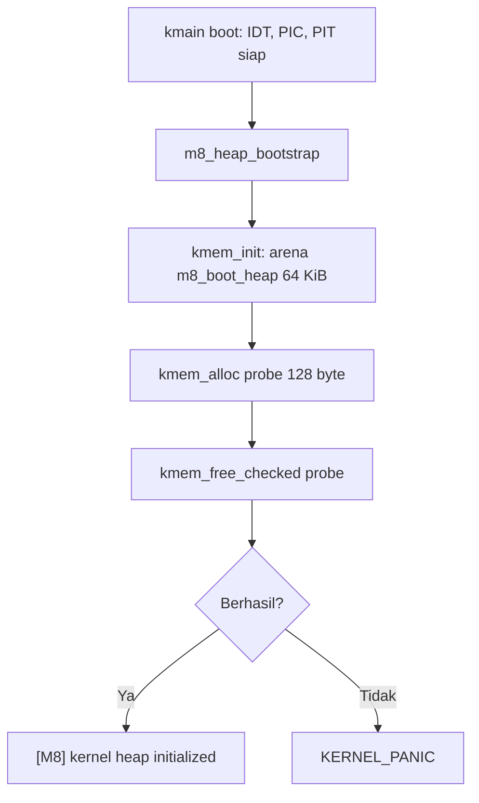

 Laporan Praktikum Sistem Operasi Lanjut — MCSOS-M8

**Nama file laporan:** `laporan_praktikum_m8_25832074009.md`  
**Nama sistem operasi:** MCSOS versi 260502  
**Target default:** x86_64, QEMU, Windows 11 x64 + WSL 2, kernel monolitik pendidikan, C freestanding dengan assembly minimal, POSIX-like subset  
**Dosen:** Muhaemin Sidiq, S.Pd., M.Pd.  
**Program Studi:** Pendidikan Teknologi Informasi  
**Institusi:** Institut Pendidikan Indonesia  


---

## 0. Metadata Laporan

| Atribut | Isi |
|---|---|
| Kode praktikum | `[M8]` |
| Judul praktikum | `[Kernel Heap Allocator (kmem): Free-list Allocator dengan Metadata Header, Split, Coalesce, dan Statistik Heap]` |
| Jenis pengerjaan | `[Individu]` |
| Nama mahasiswa | `[Syifa Nurzimah]` |
| NIM | `[25832074009]` |
| Kelas | `[1A]` |
| Nama kelompok | `[isi jika kelompok]` |
| Anggota kelompok | `[tidak berlaku]` |
| Tanggal praktikum | `[2026-07-04]` |
| Tanggal pengumpulan | `[YYYY-MM-DD]` |
| Repository | `[/home/syifa/src/mcsos]` |
| Branch | `[praktikum-m8-kernel-heap]` |
| Commit awal | `` `[isi commit sebelum branch M8 dibuat]` `` |
| Commit akhir | `` `[03657c2]` `` |
| Status readiness yang diklaim | `[Siap uji QEMU]` |

---

## 1. Sampul

# Laporan Praktikum `m8`  
## `Kernel Heap Allocator (kmem): Free-list Allocator dengan Metadata Header, Split, Coalesce, dan Statistik Heap`

Disusun oleh:

| Nama | NIM | Kelas | Peran |
|---|---|---|---|
| `[Syifa Nurzimah]` | `[25832074009]` | `[1A]` | `[individu]` |
| `[opsional]` | `[opsional]` | `[opsional]` | `[opsional]` |

Dosen Pengampu: **Muhaemin Sidiq, S.Pd., M.Pd.**  
Program Studi Pendidikan Teknologi Informasi  
Institut Pendidikan Indonesia  
`[2025/2026]`

---

## 2. Pernyataan Orisinalitas dan Integritas Akademik

Saya menyatakan bahwa laporan ini disusun berdasarkan hasil praktikum yang saya kerjakan sendiri menggunakan lingkungan pengembangan WSL 2 Ubuntu sesuai panduan praktikum M8. Seluruh hasil yang dilaporkan didukung oleh bukti berupa command output, log, artefak build, dan commit repository yang terdokumentasi.

| Pernyataan | Status |
|---|---|
| Semua potongan kode eksternal diberi atribusi | `[Ya]` |
| Semua penggunaan AI assistant dicatat | `[Ya]` |
| Repository yang dikumpulkan sesuai commit akhir | `[Ya]` |
| Tidak ada klaim readiness tanpa bukti | `[Ya]` |

Catatan penggunaan bantuan eksternal:

```text
Menggunakan dokumentasi resmi Clang/LLVM, GNU Make, GNU Binutils (nm, readelf, objdump), dan Git sebagai referensi teknis. Menggunakan AI Assistant untuk membantu memahami instruksi praktikum M8, debugging Makefile (kesalahan "missing separator" akibat indentasi spasi bukan tab), menjelaskan error kompilasi header yang hilang pada kernel/include, serta membantu penyusunan laporan praktikum. Seluruh command, konfigurasi, build, pengujian, dan verifikasi evidence dijalankan serta diperiksa ulang secara mandiri pada lingkungan WSL 2 Ubuntu. Commit akhir repository: 03657c2 ("M8 kernel heap implementation").
```

---

## 3. Tujuan Praktikum

Tuliskan tujuan teknis dan konseptual praktikum. Tujuan harus dapat diuji.

1. `Mendesain dan mengimplementasikan free-list allocator (kernel heap) dengan metadata header, mekanisme split, coalesce, dan statistik heap dalam C17 freestanding.`
2. `Menetapkan invariant allocator meliputi alignment, batas arena, status free/used, penolakan double-free, block linkage, dan cakupan total region heap.`
3. `Menyusun host unit test yang menguji alokasi, pembebasan, alignment, zeroing, overflow, fragmentasi, dan coalescing sebelum objek freestanding dibangun.`
4. `Mengaudit objek freestanding hasil kompilasi menggunakan nm, readelf, dan objdump untuk membuktikan tidak ada simbol undefined dan format ELF sesuai target x86_64.`
5. `Mengintegrasikan kernel heap awal (early boot heap) ke dalam kmain() MCSOS setelah subsistem sebelumnya (interrupt, PIC, PIT) siap, dan memastikan kernel penuh tetap dapat dibangun (link) tanpa error.`

---

## 4. Capaian Pembelajaran Praktikum

Setelah praktikum ini, mahasiswa mampu:

| CPL/CPMK praktikum | Bukti yang harus ditunjukkan |
|---|---|
| `[Menjelaskan perbedaan PMM, VMM, dan kernel heap serta alasan kernel memerlukan allocator dinamis setelah boot awal]` | `[Bagian Dasar Teori Ringkas dan Desain Teknis]` |
| `[Mendesain free-list allocator dengan metadata header, split, coalesce, dan statistik heap, serta menetapkan invariant allocator]` | `[Isi include/mcsos/kmem.h dan kernel/mm/kmem.c, bagian Invariants]` |
| `[Mengimplementasikan kmem_init, kmem_alloc, kmem_calloc, kmem_free_checked, kmem_get_stats, dan kmem_validate dalam C17 freestanding]` | `[Output clang -fsyntax-only, make m8-kmem-freestanding]` |
| `[Menyusun host unit test alokasi, pembebasan, alignment, zeroing, overflow, fragmentasi, dan coalescing]` | `[tests/test_kmem.c dan output "M8 kmem host tests: PASS"]` |
| `[Melakukan audit freestanding object dengan nm, readelf, dan objdump]` | `[build/m8/nm_u.txt, build/m8/readelf_h.txt, build/m8/kmem.objdump.txt]` |
| `[Mengintegrasikan heap awal ke kernel MCSOS setelah PMM dan VMM initialized]` | `[Perubahan kernel/core/kmain.c: m8_heap_bootstrap() dan m8_boot_heap[]]` |
| `[Membedakan allocator yang aman untuk early kernel dari allocator yang aman untuk interrupt, SMP, driver DMA, atau userspace]` | `[Bagian 9.7 Ownership, Locking, dan Concurrency]` |
| `[Menyusun laporan praktikum dengan bukti build, test, audit object, failure analysis, rollback, dan readiness review]` | `[Laporan ini secara keseluruhan]` |

---

## 5. Peta Milestone MCSOS

Centang milestone yang menjadi fokus laporan ini. Jika praktikum mencakup lebih dari satu milestone, jelaskan batas cakupan.

| Milestone | Fokus | Status dalam laporan |
|---|---|---|
| M0 | Requirements, governance, baseline arsitektur | `[ ] tidak dibahas / [ ] dibahas / [ x ] selesai praktikum` |
| M1 | Toolchain reproducible, Git, QEMU, GDB, metadata build | `[ ] tidak dibahas / [ ] dibahas / [ x ] selesai praktikum` |
| M2 | Boot image, kernel ELF64, early console | `[ ] tidak dibahas / [ ] dibahas / [ x ] selesai praktikum` |
| M3 | Panic path, linker map, GDB, observability awal | `[ ] tidak dibahas / [ ] dibahas / [ x ] selesai praktikum` |
| M4 | Trap, exception, interrupt, timer | `[ ] tidak dibahas / [ ] dibahas / [ x ] selesai praktikum` |
| M5 | PMM, VMM, page table, kernel heap | `[ ] tidak dibahas / [ x ] dibahas / [ ] selesai praktikum` |
| M6 | Thread, scheduler, synchronization | `[ ] tidak dibahas / [ x ] dibahas / [ ] selesai praktikum` |
| M7 | Syscall ABI dan user program loader | `[ ] tidak dibahas / [ x ] dibahas / [ ] selesai praktikum` |
| M8 | Kernel heap allocator (kmem): free-list, split, coalesce, statistik heap | `[ ] tidak dibahas / [ ] dibahas / [ x ] selesai praktikum` |
| M9 | Block layer dan device model | `[ x ] tidak dibahas / [ ] dibahas / [ ] selesai praktikum` |
| M10 | Persistent filesystem, mcsfs/ext2-like, recovery | `[ x ] tidak dibahas / [ ] dibahas / [ ] selesai praktikum` |
| M11 | Networking stack, packet parsing, UDP/TCP subset | `[ x ] tidak dibahas / [ ] dibahas / [ ] selesai praktikum` |
| M12 | Security model, capability/ACL, syscall fuzzing, hardening | `[ x ] tidak dibahas / [ ] dibahas / [ ] selesai praktikum` |
| M13 | SMP, scalability, lock stress, NUMA-aware preparation | `[ x ] tidak dibahas / [ ] dibahas / [ ] selesai praktikum` |
| M14 | Framebuffer, graphics console, visual regression | `[ x ] tidak dibahas / [ ] dibahas / [ ] selesai praktikum` |
| M15 | Virtualization/container subset | `[ x ] tidak dibahas / [ ] dibahas / [ ] selesai praktikum` |
| M16 | Observability, update/rollback, release image, readiness review | `[ x ] tidak dibahas / [ ] dibahas / [ ] selesai praktikum` |

Batas cakupan praktikum:

```text
Praktikum M8 berfokus pada perancangan dan implementasi kernel heap allocator (kmem) sebagai lapisan manajemen memori dinamis di atas PMM dan VMM yang telah dibangun pada milestone sebelumnya. Aktivitas mencakup pembuatan header dan implementasi free-list allocator, penyusunan host unit test, audit objek freestanding menggunakan nm/readelf/objdump, serta integrasi heap awal (early boot heap 64 KiB) ke dalam kmain() MCSOS. Catatan: peta milestone umum pada baris di atas mengikuti template roadmap MCSOS yang tersedia; penamaan capaian pembelajaran resmi dari dosen untuk M8 pada semester berjalan adalah kernel heap allocator, bukan VFS, sehingga isi laporan ini mengacu pada panduan M8 aktual (kernel heap) yang diberikan, bukan pada deskripsi generik di tabel roadmap. Praktikum ini belum mencakup boot QEMU dengan log serial M8, scheduler/thread, syscall ABI, filesystem, maupun subsistem sistem operasi lain di luar heap.
```

---

## 6. Dasar Teori Ringkas

Tuliskan teori yang langsung diperlukan untuk memahami praktikum. Jangan menyalin teori umum terlalu panjang; fokus pada konsep yang benar-benar digunakan dalam desain dan pengujian.

### 6.1 Konsep Sistem Operasi yang Diuji

```text
Praktikum M8 berfokus pada manajemen memori dinamis di dalam kernel setelah tahap boot awal selesai. Konsep yang diuji meliputi perbedaan antara Physical Memory Manager (PMM) yang mengelola frame fisik 4 KiB, Virtual Memory Manager (VMM) yang mengelola pemetaan virtual-ke-fisik melalui page table, dan kernel heap yang menyediakan alokasi memori berukuran variabel (byte-granular) di atas region memori yang telah dipetakan. Allocator diuji melalui host unit test sebelum dikompilasi ulang sebagai objek freestanding dan diintegrasikan ke kmain().
```

### 6.2 Konsep Arsitektur x86_64 yang Relevan

| Konsep | Relevansi pada praktikum | Bukti/verifikasi |
|---|---|---|
| `[ELF64 x86_64]` | `[Format objek dan kernel yang dihasilkan setelah kmem.c dikompilasi dan di-link ke kernel.elf]` | `[Output readelf -h build/kernel.elf]` |
| `[Alignment 16 byte dan 4 KiB]` | `[KMEM_ALIGN 16u untuk setiap blok alokasi; heap arena m8_boot_heap dialign 4096 byte]` | `[Definisi KMEM_ALIGN pada kmem.h dan atribut aligned(4096) pada kmain.c]` |
| `[Freestanding Environment]` | `[kmem.c tidak boleh bergantung pada malloc/free/printf/memset libc host]` | `[Flag -ffreestanding -fno-builtin pada m8-kmem-freestanding]` |
| `[ABI x86_64 System V]` | `[Dasar pemanggilan fungsi kmem_init/kmem_alloc dari kmain()]` | `[Output objdump -dr]` |

### 6.3 Konsep Implementasi Freestanding

| Aspek | Keputusan praktikum |
|---|---|
| Bahasa | `[C17 freestanding]` |
| Runtime | `[tanpa hosted libc; tidak memakai malloc/free/printf/memset dari libc]` |
| ABI | `[x86_64 System V]` |
| Compiler flags kritis | `[-ffreestanding, -fno-builtin, -fno-stack-protector, -mno-red-zone, --target=x86_64-unknown-none-elf, -mcmodel=kernel]` |
| Risiko undefined behavior | `[Pointer arithmetic tidak valid pada header blok, integer overflow ukuran alokasi, akses tidak aligned, metadata corruption]` |

### 6.4 Referensi Teori yang Digunakan

| No. | Sumber | Bagian yang digunakan | Alasan relevansi |
|---|---|---|---|
| `[1]` | `[Free-Space Management (OSTEP)]` | `[Desain free-list allocator, split, dan coalesce]` | `[Dasar desain kmem_alloc dan kmem_free_checked]` |
| `[2]` | `[Dokumentasi GNU Binutils]` | `[nm, readelf, dan objdump]` | `[Digunakan untuk memverifikasi objek freestanding kmem]` |
| `[3]` | `[Materi prasyarat M8: Pointer arithmetic, Alignment, Freestanding C, PMM, VMM, Invariant, Failure mode]` | `[Seluruh bagian prasyarat teori M8]` | `[Menjadi dasar penetapan invariant dan failure mode allocator]` |
| `[4]` | `[Dokumentasi Git]` | `[Version control]` | `[Digunakan untuk pelacakan perubahan repository]` |

---

## 7. Lingkungan Praktikum

### 7.1 Host dan Target

| Komponen | Nilai |
|---|---|
| Host OS | `[Windows 10/11 x64]` |
| Lingkungan build | `[WSL 2 Ubuntu]` |
| Target ISA | `x86_64` |
| Target ABI | `[x86_64-unknown-none-elf]` |
| Emulator | `[QEMU — belum dijalankan pada sesi M8 ini]` |
| Firmware emulator | `[OVMF — tidak relevan pada langkah M8 yang dilaporkan]` |
| Debugger | `[GNU GDB — belum digunakan pada sesi M8 ini]` |
| Build system | `[GNU Make 4.4.1]` |
| Bahasa utama | `[C17 Freestanding]` |
| Assembly | `[tidak ada assembly baru pada M8]` |

### 7.2 Versi Toolchain

Tempel output versi toolchain berikut. Diambil dari output `./scripts/grade_m8.sh`.

```bash
clang --version | head -n 1
ld.lld --version | head -n 1
make --version | head -n 1
```

Output:

```text
Ubuntu clang version 21.1.8 (6ubuntu1)
Ubuntu LLD 21.1.8 (compatible with GNU linkers)
GNU Make 4.4.1
```

### 7.3 Lokasi Repository

| Item | Nilai |
|---|---|
| Path repository di WSL | `` `[/home/syifa/src/mcsos]` `` |
| Apakah berada di filesystem Linux WSL, bukan `/mnt/c` | `[Ya]` |
| Remote repository | `[https://github.com/syifanurzimah/MCSOS.git]` |
| Branch | `[praktikum-m8-kernel-heap]` |
| Commit hash awal | `` `[isi commit sebelum branch M8 dibuat]` `` |
| Commit hash akhir | `` `[03657c2]` `` |

---

## 8. Repository dan Struktur File

### 8.1 Struktur Direktori yang Relevan

Tampilkan hanya direktori dan file yang relevan dengan praktikum.

```text
mcsos/
├── include/
│   └── mcsos/
│       └── kmem.h
├── kernel/
│   ├── core/
│   │   └── kmain.c
│   ├── include/
│   │   └── mcsos/
│   │       └── kmem.h
│   └── mm/
│       └── kmem.c
├── tests/
│   └── test_kmem.c
├── scripts/
│   └── grade_m8.sh
├── build/
│   └── m8/
├── Makefile
└── docs/evidence/M6, M7 (evidence milestone sebelumnya)
```

### 8.2 File yang Dibuat atau Diubah

| File | Jenis perubahan | Alasan perubahan | Risiko |
|---|---|---|---|
| `[include/mcsos/kmem.h]` | `[baru]` | `[Deklarasi antarmuka publik kmem: kmem_init, kmem_alloc, kmem_calloc, kmem_free_checked, kmem_get_stats, kmem_validate, dan struct kmem_stats_t]` | `[sedang]` |
| `[kernel/mm/kmem.c]` | `[baru]` | `[Implementasi free-list allocator 280 baris: kmem_block_t dengan magic, size, free, prev, next, split, coalesce, validasi arena]` | `[tinggi]` |
| `[tests/test_kmem.c]` | `[baru]` | `[Host unit test 76 baris untuk alokasi, pembebasan, alignment, zeroing, overflow, fragmentasi, coalescing]` | `[sedang]` |
| `[kernel/include/mcsos/kmem.h]` | `[baru, salinan]` | `[Kernel build memakai include path kernel/include, sehingga header perlu disalin agar kmain.c dapat #include <mcsos/kmem.h> saat kompilasi freestanding penuh]` | `[rendah]` |
| `[scripts/grade_m8.sh]` | `[baru]` | `[Script preflight grading M8: cek baseline repo, versi toolchain, freestanding object, dan host unit test]` | `[rendah]` |
| `[Makefile]` | `[ubah]` | `[Menambahkan target m8-clean, m8-kmem-freestanding, m8-kmem-host-test, m8-audit, m8-all]` | `[sedang]` |
| `[kernel/core/kmain.c]` | `[ubah]` | `[Menambahkan #include <mcsos/kmem.h> dan <mcsos/kernel/panic.h>, buffer m8_boot_heap[64 KiB] aligned 4096, fungsi m8_heap_bootstrap(), dan pemanggilannya di kmain()]` | `[sedang]` |

### 8.3 Ringkasan Diff

```bash
git status --short
git add .
git commit -m "M8 kernel heap implementation"
```

Output:

```text
syifa@WIN-E2QNIIEGDH4:~/src/mcsos$ git status --short
 M Makefile
 M kernel/core/kmain.c
?? docs/evidence/M6/
?? include/
?? kernel/include/mcsos/kmem.h
?? kernel/mm/
?? m7.txt
?? scripts/grade_m8.sh
?? tests/test_kmem.c
syifa@WIN-E2QNIIEGDH4:~/src/mcsos$ git add .
syifa@WIN-E2QNIIEGDH4:~/src/mcsos$ git commit -m "M8 kernel heap implementation"
[praktikum-m8-kernel-heap 03657c2] M8 kernel heap implementation
 20 files changed, 1310 insertions(+), 3 deletions(-)
```

---

## 9. Desain Teknis

### 9.1 Masalah yang Diselesaikan

```text
Praktikum M8 berfokus pada penyediaan allocator memori dinamis di dalam kernel MCSOS setelah tahap boot awal, interrupt, PIC, dan PIT selesai diinisialisasi. Masalah utama yang diselesaikan adalah menyediakan mekanisme alokasi dan pembebasan memori bergranularitas byte (bukan frame 4 KiB seperti PMM, dan bukan halaman virtual seperti VMM), lengkap dengan metadata header per blok, kemampuan split blok besar menjadi blok yang lebih kecil, coalesce blok bersebelahan yang sama-sama bebas, statistik penggunaan heap, serta validasi invariant heap secara eksplisit (kmem_validate).
```

### 9.2 Keputusan Desain

| Keputusan | Alternatif yang dipertimbangkan | Alasan memilih | Konsekuensi |
|---|---|---|---|
| `[Free-list allocator dengan header per blok (kmem_block_t)]` | `[Bitmap allocator seperti PMM]` | `[Granularitas byte lebih sesuai kebutuhan struktur data kernel berukuran variabel]` | `[Overhead metadata per blok dan kebutuhan validasi magic number]` |
| `[Static early boot heap 64 KiB (m8_boot_heap) di dalam kmain.c]` | `[Meminta frame dari PMM lalu memetakannya lewat VMM]` | `[Lebih sederhana untuk tahap awal M8 sebelum integrasi penuh dengan PMM/VMM]` | `[Ukuran heap awal terbatas dan belum dinamis mengikuti memori fisik nyata]` |
| `[Header 32 byte dengan magic number KMEM_MAGIC]` | `[Header minimal tanpa magic number]` | `[Mendeteksi metadata corruption dan double-free lebih awal]` | `[Overhead memori tambahan per alokasi]` |
| `[Alignment tetap 16 byte (KMEM_ALIGN)]` | `[Alignment mengikuti tipe data pemanggil]` | `[Konsisten dengan ABI x86_64 dan mendukung struktur data umum kernel]` | `[Sedikit pemborosan pada alokasi kecil karena pembulatan]` |
| `[Validasi terpisah lewat kmem_validate() dan kmem_free_checked()]` | `[Free tanpa validasi (kmem_free biasa)]` | `[Membantu mendeteksi double-free dan out-of-bounds sebelum korupsi menyebar]` | `[Overhead pemeriksaan setiap kali free dipanggil]` |

### 9.3 Arsitektur Ringkas

Tambahkan diagram ASCII atau Mermaid. Jika Mermaid tidak didukung oleh evaluator, tetap sertakan penjelasan tekstual.



Penjelasan diagram:

```text
Setelah IDT, PIC, dan PIT diinisialisasi di kmain(), fungsi m8_heap_bootstrap() dipanggil untuk menyiapkan kernel heap. Fungsi ini memanggil kmem_init() dengan arena statis m8_boot_heap berukuran 64 KiB yang dialign 4096 byte. Sebagai smoke test internal, sebuah alokasi 128 byte dilakukan lalu langsung dibebaskan menggunakan kmem_free_checked(). Jika salah satu langkah gagal, kernel akan memanggil KERNEL_PANIC dengan kode error spesifik; jika berhasil, log "[M8] kernel heap initialized" dituliskan ke serial log.
```

### 9.4 Kontrak Antarmuka

| Antarmuka | Pemanggil | Penerima | Precondition | Postcondition | Error path |
|---|---|---|---|---|---|
| `[kmem_init(base, bytes)]` | `[m8_heap_bootstrap / kmain]` | `[kmem.c]` | `[base valid dan bytes mencukupi minimal satu blok]` | `[Heap siap dipakai, g_initialized=1]` | `[Return nonzero jika arena tidak valid]` |
| `[kmem_alloc(bytes)]` | `[m8_heap_bootstrap, kode kernel lain]` | `[kmem.c]` | `[Heap sudah diinisialisasi]` | `[Pointer payload valid dan aligned 16 byte]` | `[Return NULL jika tidak ada blok cukup besar]` |
| `[kmem_calloc(count, bytes)]` | `[kode kernel]` | `[kmem.c]` | `[Heap sudah diinisialisasi, count*bytes tidak overflow]` | `[Memori teralokasi dan di-zero]` | `[Return NULL jika overflow atau gagal alokasi]` |
| `[kmem_free_checked(ptr)]` | `[m8_heap_bootstrap, kode kernel lain]` | `[kmem.c]` | `[ptr hasil kmem_alloc/kmem_calloc yang valid]` | `[Blok ditandai free, dicoba coalesce]` | `[Return kode negatif jika magic tidak cocok / double-free]` |
| `[kmem_get_stats(out)]` | `[diagnostik kernel]` | `[kmem.c]` | `[out bukan NULL]` | `[Statistik heap terisi (total, used, free, block_count, dst)]` | `[Tidak ada, hanya membaca state]` |
| `[kmem_validate(void)]` | `[audit/debug]` | `[kmem.c]` | `[Heap sudah diinisialisasi]` | `[Return 0 jika seluruh invariant terpenuhi]` | `[Return kode negatif spesifik sesuai jenis pelanggaran invariant]` |

### 9.5 Struktur Data Utama

| Struktur data | Field penting | Ownership | Lifetime | Invariant |
|---|---|---|---|---|
| `` `kmem_block_t` `` | `[magic, size, free, reserved, reserved2, prev, next]` | `[kmem.c internal]` | `[selama arena heap aktif]` | `[magic harus sama dengan KMEM_MAGIC, prev/next konsisten dengan linkage list]` |
| `` `kmem_stats_t` `` | `[total_bytes, used_bytes, free_bytes, block_count, free_count, largest_free]` | `[caller via kmem_get_stats]` | `[snapshot sesaat]` | `[used_bytes + free_bytes harus konsisten dengan total_bytes]` |
| `` `m8_boot_heap[64 KiB]` `` | `[arena byte statis, aligned 4096]` | `[kernel/core/kmain.c]` | `[selama kernel berjalan]` | `[Seluruh alokasi kmem harus berada dalam rentang arena ini]` |

### 9.6 Invariants

Tuliskan invariant yang harus benar sepanjang eksekusi.

1. `Setiap blok heap harus diawali header dengan magic == KMEM_MAGIC; jika tidak, kmem_validate/kmem_free_checked menolak operasi.`
2. `Alamat payload setiap blok harus aligned KMEM_ALIGN (16 byte).`
3. `Seluruh blok dalam linked list harus berada di dalam batas arena [g_heap_base, g_heap_end] dan linkage prev/next harus konsisten.`
4. `Blok yang sudah free tidak boleh dibebaskan kembali (double-free harus ditolak oleh kmem_free_checked).`
5. `Total byte seluruh blok (free + used) harus mencakup seluruh region arena tanpa celah yang tidak tercatat (total region coverage).`

### 9.7 Ownership, Locking, dan Concurrency

| Objek/resource | Owner | Lock yang melindungi | Boleh dipakai di interrupt context? | Catatan |
|---|---|---|---|---|
| `[m8_boot_heap arena]` | `[kernel/core/kmain.c]` | `[none]` | `[Tidak]` | `[Heap awal M8 hanya dipakai secara single-threaded saat boot]` |
| `[g_head / free-list internal kmem.c]` | `[kmem.c]` | `[none]` | `[Tidak]` | `[Belum ada proteksi terhadap concurrent access; tidak aman untuk interrupt handler atau SMP]` |
| `[kmem_stats_t snapshot]` | `[pemanggil kmem_get_stats]` | `[none]` | `[Tidak]` | `[Hanya snapshot baca, bukan referensi live]` |

Lock order yang berlaku:

```text
Pada M8 belum terdapat mekanisme locking karena kernel belum menjalankan multitasking maupun interrupt handler yang mengakses heap secara konkuren. Allocator ini hanya aman dipakai pada konteks early-boot single-threaded; allocator yang aman untuk interrupt context, SMP, driver DMA, atau userspace memerlukan locking/atomic tambahan yang belum diimplementasikan pada milestone ini.
```

### 9.8 Memory Safety dan Undefined Behavior Risk

| Risiko | Lokasi | Mitigasi | Bukti |
|---|---|---|---|
| `[Metadata corruption pada header blok]` | `[kmem_block_t]` | `[Validasi magic == KMEM_MAGIC sebelum operasi]` | `[kmem_validate return -6 jika magic tidak cocok]` |
| `[Double-free]` | `[kmem_free_checked]` | `[Cek status free sebelum membebaskan ulang]` | `[Kode return negatif pada test_kmem.c]` |
| `[Overflow ukuran alokasi pada kmem_calloc]` | `[kmem_calloc]` | `[Perkalian count*bytes divalidasi sebelum dialokasikan]` | `[Host unit test overflow pada test_kmem.c]` |
| `[Akses tidak aligned]` | `[kmem_align_up_ptr/kmem_align_up_size]` | `[Pembulatan ke KMEM_ALIGN sebelum digunakan sebagai pointer payload]` | `[Definisi KMEM_ALIGN 16u]` |
| `[Kernel gagal build karena header tidak ditemukan pada path freestanding]` | `[kernel/core/kmain.c saat include <mcsos/kmem.h>]` | `[Menyalin kmem.h ke kernel/include/mcsos/kmem.h]` | `[Log build make sebelum dan sesudah perbaikan]` |

### 9.9 Security Boundary

| Boundary | Data tidak tepercaya | Validasi yang dilakukan | Failure mode aman |
|---|---|---|---|
| `[Pemanggil kmem_alloc/kmem_free_checked]` | `[Ukuran alokasi dan pointer yang dibebaskan]` | `[Cek magic number, cek batas arena, cek status free/used]` | `[Return NULL/kode error, tidak melanjutkan operasi tidak aman]` |
| `[Arena heap m8_boot_heap]` | `[Ukuran arena tetap 64 KiB]` | `[kmem_init memeriksa base dan bytes sebelum dipakai]` | `[kmem_init return nonzero, kmain memanggil KERNEL_PANIC]` |
| `[Build system Makefile]` | `[Target M8 yang ditambahkan manual]` | `[Uji make m8-kmem-host-test dan make m8-audit sebelum masuk ke target m8-all]` | `[Build dihentikan jika nm -u tidak kosong (ada simbol undefined)]` |

---

## 10. Langkah Kerja Implementasi

Gunakan tabel berikut untuk setiap langkah. Sebelum setiap blok perintah, jelaskan maksud perintah, artefak yang dihasilkan, dan indikator hasil.

### Langkah 1 — `Menyiapkan Branch dan Struktur Direktori M8`

Maksud langkah:

```text
Membuat branch kerja terpisah untuk M8 dan menyiapkan struktur direktori yang dibutuhkan (include, kernel/mm, tests, scripts, build/m8).
```

Perintah:

```bash
git switch -c praktikum-m8-kernel-heap
mkdir -p include/mcsos kernel/mm tests scripts build/m8
```

Output ringkas:

```text
Switched to a new branch 'praktikum-m8-kernel-heap'
```

Artefak yang dihasilkan:

| Artefak | Lokasi | Fungsi |
|---|---|---|
| `[Branch kerja]` | `[praktikum-m8-kernel-heap]` | `[Isolasi perubahan M8 dari branch utama]` |
| `[Struktur direktori]` | `[include/mcsos, kernel/mm, tests, scripts, build/m8]` | `[Tempat header, implementasi, test, script, dan artefak build M8]` |

Indikator berhasil:

```text
Branch baru aktif (git branch --show-current menunjukkan praktikum-m8-kernel-heap) dan seluruh direktori berhasil dibuat.
```

### Langkah 2 — `Membuat Header dan Implementasi Allocator (kmem.h, kmem.c)`

Maksud langkah:

```text
Menulis antarmuka publik allocator pada include/mcsos/kmem.h dan implementasi free-list allocator pada kernel/mm/kmem.c, kemudian memverifikasi sintaks C17 tanpa mengompilasi penuh.
```

Perintah:

```bash
nano include/mcsos/kmem.h
nano kernel/mm/kmem.c
clang -fsyntax-only -std=c17 -Iinclude kernel/mm/kmem.c
wc -l kernel/mm/kmem.c
```

Output ringkas:

```text
280 kernel/mm/kmem.c
(tidak ada error dari clang -fsyntax-only)
```

Artefak yang dihasilkan:

| Artefak | Lokasi | Fungsi |
|---|---|---|
| `[kmem.h]` | `[include/mcsos/kmem.h]` | `[Deklarasi API kmem dan kmem_stats_t]` |
| `[kmem.c]` | `[kernel/mm/kmem.c]` | `[Implementasi free-list allocator 280 baris]` |

Indikator berhasil:

```text
clang -fsyntax-only tidak menghasilkan error, menandakan sintaks C17 valid sebelum dilakukan pengujian lebih lanjut.
```

### Langkah 3 — `Menyusun dan Memverifikasi Host Unit Test`

Maksud langkah:

```text
Menulis test_kmem.c untuk menguji alokasi, pembebasan, alignment, zeroing, overflow, fragmentasi, dan coalescing, lalu memastikan sintaksnya valid dengan flag -Wall -Wextra -Werror.
```

Perintah:

```bash
nano tests/test_kmem.c
wc -l tests/test_kmem.c
clang -fsyntax-only -std=c17 -Wall -Wextra -Werror -Iinclude tests/test_kmem.c
```

Output ringkas:

```text
76 tests/test_kmem.c
(tidak ada warning/error)
```

Artefak yang dihasilkan:

| Artefak | Lokasi | Fungsi |
|---|---|---|
| `[test_kmem.c]` | `[tests/test_kmem.c]` | `[Host unit test allocator, 76 baris]` |

Indikator berhasil:

```text
Tidak ada warning maupun error meskipun menggunakan -Wall -Wextra -Werror.
```

### Langkah 4 — `Menambahkan Target M8 pada Makefile`

Maksud langkah:

```text
Menambahkan target m8-clean, m8-kmem-freestanding, m8-kmem-host-test, m8-audit, dan m8-all pada Makefile agar seluruh proses build/test/audit M8 dapat dijalankan otomatis.
```

Perintah:

```bash
grep -n "m8\|kmem\|test_kmem" Makefile
nano Makefile
make m8-kmem-host-test
```

Output ringkas:

```text
Makefile:149: *** missing separator.  Stop.
```

Artefak yang dihasilkan:

| Artefak | Lokasi | Fungsi |
|---|---|---|
| `[Target Makefile M8]` | `[Makefile]` | `[Otomasi build, test, dan audit M8]` |

Indikator berhasil:

```text
Ditemukan kegagalan awal "missing separator" karena baris resep memakai indentasi spasi, bukan tab. Diperbaiki melalui nano Makefile dengan mengganti indentasi menjadi tab, kemudian make m8-kmem-host-test dijalankan ulang pada Langkah 5.
```

### Langkah 5 — `Menjalankan Host Unit Test M8`

Maksud langkah:

```text
Mengompilasi dan menjalankan test_kmem.c beserta kmem.c pada lingkungan host untuk membuktikan seluruh skenario alokasi/pembebasan berjalan benar sebelum diaudit sebagai objek freestanding.
```

Perintah:

```bash
make m8-kmem-host-test
```

Output ringkas:

```text
clang -std=c17 -Wall -Wextra -Werror -Iinclude tests/test_kmem.c kernel/mm/kmem.c -o build/m8/test_kmem
./build/m8/test_kmem | tee build/m8/test_kmem.log
M8 kmem host tests: PASS
```

Artefak yang dihasilkan:

| Artefak | Lokasi | Fungsi |
|---|---|---|
| `[test_kmem]` | `[build/m8/test_kmem]` | `[Executable host unit test]` |
| `[test_kmem.log]` | `[build/m8/test_kmem.log]` | `[Bukti hasil PASS]` |

Indikator berhasil:

```text
Output "M8 kmem host tests: PASS" muncul tanpa error kompilasi maupun runtime.
```

### Langkah 6 — `Mengaudit Objek Freestanding kmem`

Maksud langkah:

```text
Mengompilasi kmem.c dalam mode freestanding (tanpa libc host) lalu memverifikasi tidak ada simbol undefined dan format ELF sesuai target menggunakan nm, readelf, dan objdump.
```

Perintah:

```bash
make m8-audit
```

Output ringkas:

```text
clang -std=c17 -Wall -Wextra -Werror -Iinclude -ffreestanding -fno-builtin -fno-stack-protector -mno-red-zone -c kernel/mm/kmem.c -o build/m8/kmem.freestanding.o
nm -u build/m8/kmem.freestanding.o | tee build/m8/nm_u.txt
test ! -s build/m8/nm_u.txt
readelf -h build/m8/kmem.freestanding.o > build/m8/readelf_h.txt
objdump -dr build/m8/kmem.freestanding.o > build/m8/kmem.objdump.txt
```

Artefak yang dihasilkan:

| Artefak | Lokasi | Fungsi |
|---|---|---|
| `[kmem.freestanding.o]` | `[build/m8/kmem.freestanding.o]` | `[Objek freestanding kmem]` |
| `[nm_u.txt]` | `[build/m8/nm_u.txt]` | `[Bukti tidak ada simbol undefined (file kosong)]` |
| `[readelf_h.txt]` | `[build/m8/readelf_h.txt]` | `[Header ELF objek]` |
| `[kmem.objdump.txt]` | `[build/m8/kmem.objdump.txt]` | `[Disassembly objek]` |

Indikator berhasil:

```text
File nm_u.txt kosong (test ! -s berhasil), menandakan tidak ada simbol undefined pada objek freestanding kmem.
```

### Langkah 7 — `Menjalankan Preflight Grading M8`

Maksud langkah:

```text
Menjalankan script grade_m8.sh untuk memvalidasi baseline repository, versi toolchain, objek freestanding, dan host unit test secara otomatis.
```

Perintah:

```bash
chmod +x scripts/grade_m8.sh
./scripts/grade_m8.sh
```

Output ringkas:

```text
[M8] checking repository baseline...
[M8] checking toolchain...
[M8] tool versions...
Ubuntu clang version 21.1.8 (6ubuntu1)
Ubuntu LLD 21.1.8 (compatible with GNU linkers)
GNU Make 4.4.1
[M8] freestanding object check...
[M8] host unit test...
M8 kmem host tests: PASS
[PASS] M8 preflight completed.
```

Artefak yang dihasilkan:

| Artefak | Lokasi | Fungsi |
|---|---|---|
| `[grade_m8.sh]` | `[scripts/grade_m8.sh]` | `[Script preflight grading M8]` |

Indikator berhasil:

```text
Baris terakhir menampilkan "[PASS] M8 preflight completed." tanpa error di tengah proses.
```

### Langkah 8 — `Meninjau Titik Integrasi pada Kernel yang Sudah Ada`

Maksud langkah:

```text
Memeriksa kmain(), panic.c, log.c, pmm.c, dan vmm.c untuk memahami urutan inisialisasi kernel serta cara logging dan panic path bekerja sebelum heap diintegrasikan.
```

Perintah:

```bash
grep -R "kmain" -n kernel
grep -R "panic(" -n kernel include
grep -R "log_writeln" -n kernel include
grep -R "pmm_init" -n kernel
grep -R "vmm_init" -n kernel
```

Output ringkas:

```text
kernel/core/kmain.c:31:void kmain(void)
kernel/core/panic.c: kernel_panic_at(...) dan KERNEL_PANIC/KERNEL_ASSERT tersedia di mcsos/kernel/panic.h
kernel/include/mcsos/kernel/log.h: log_writeln, log_hex64, log_key_value_hex64
kernel/core/pmm.c: pmm_init_from_map, pmm_alloc_frame, pmm_free_frame
(vmm_init belum ada; hanya vmm_space_init, vmm_map_page, vmm_unmap_page)
```

Artefak yang dihasilkan:

| Artefak | Lokasi | Fungsi |
|---|---|---|
| `[Pemahaman titik integrasi]` | `[tidak berupa file, hasil investigasi]` | `[Dasar penulisan m8_heap_bootstrap()]` |

Indikator berhasil:

```text
Ditemukan bahwa KERNEL_PANIC dan log_writeln sudah tersedia sehingga dapat langsung dipakai pada m8_heap_bootstrap() tanpa membuat mekanisme baru.
```

### Langkah 9 — `Mengintegrasikan Heap Awal ke kmain()`

Maksud langkah:

```text
Menambahkan arena statis m8_boot_heap (64 KiB, aligned 4096) dan fungsi m8_heap_bootstrap() yang memanggil kmem_init, melakukan probe alokasi/pembebasan 128 byte, dan memanggil KERNEL_PANIC bila gagal, lalu memanggil fungsi tersebut di dalam kmain().
```

Perintah:

```bash
nano kernel/core/kmain.c
grep -n "m8_heap_bootstrap" -n kernel/core/kmain.c
```

Output ringkas:

```text
38:static void m8_heap_bootstrap(void)
79:    m8_heap_bootstrap();
```

Artefak yang dihasilkan:

| Artefak | Lokasi | Fungsi |
|---|---|---|
| `[kmain.c terintegrasi heap]` | `[kernel/core/kmain.c]` | `[Inisialisasi kernel heap saat boot]` |

Indikator berhasil:

```text
Fungsi m8_heap_bootstrap() terdefinisi pada baris 38 dan dipanggil dari kmain() pada baris 79.
```

### Langkah 10 — `Membangun Kernel Penuh dan Memperbaiki Header yang Hilang`

Maksud langkah:

```text
Menjalankan build kernel penuh (make) untuk memastikan kmem.c dan integrasi kmain.c dapat dikompilasi dan di-link menjadi kernel.elf tanpa error.
```

Perintah:

```bash
make
```

Output ringkas (percobaan pertama, gagal):

```text
kernel/core/kmain.c:7:10: fatal error: 'mcsos/kmem.h' file not found
1 error generated.
make: *** [Makefile:57: build/normal/kernel/core/kmain.o] Error 1
```

Perbaikan:

```bash
mkdir -p kernel/include/mcsos
cp include/mcsos/kmem.h kernel/include/mcsos/kmem.h
make
```

Output ringkas (percobaan kedua, berhasil):

```text
clang ... -c kernel/core/kmain.c -o build/normal/kernel/core/kmain.o
clang ... -c kernel/mm/kmem.c -o build/normal/kernel/mm/kmem.o
ld.lld -nostdlib -static -z max-page-size=0x1000 -T linker.ld -Map=build/kernel.map -o build/kernel.elf ... build/normal/kernel/mm/kmem.o ...
readelf -h build/kernel.elf > build/m8/kernel.readelf.header.txt
readelf -l build/kernel.elf > build/m8/kernel.readelf.programs.txt
nm -n build/kernel.elf > build/kernel.syms.txt
objdump -d -Mintel build/kernel.elf > build/kernel.disasm.txt
grep -q 'ELF64' build/m8/kernel.readelf.header.txt
grep -q 'Machine:[[:space:]]*Advanced Micro Devices X86-64' build/m8/kernel.readelf.header.txt
grep -q 'kmain' build/kernel.syms.txt
grep -q 'x86_64_idt_init' build/kernel.syms.txt
grep -q 'x86_64_trap_dispatch' build/kernel.syms.txt
grep -q 'iretq' build/kernel.disasm.txt
grep -q 'lidt' build/kernel.disasm.txt
```

Artefak yang dihasilkan:

| Artefak | Lokasi | Fungsi |
|---|---|---|
| `[kernel.elf]` | `[build/kernel.elf]` | `[Kernel MCSOS dengan kmem terintegrasi]` |
| `[kernel.map]` | `[build/kernel.map]` | `[Peta linker]` |
| `[kernel.syms.txt]` | `[build/kernel.syms.txt]` | `[Daftar simbol kernel]` |
| `[kernel.disasm.txt]` | `[build/kernel.disasm.txt]` | `[Disassembly kernel]` |

Indikator berhasil:

```text
Seluruh perintah grep -q pada tahap verifikasi build tidak menghasilkan error (exit status 0), menandakan ELF64, arsitektur x86_64, simbol kmain/x86_64_idt_init/x86_64_trap_dispatch, serta instruksi iretq dan lidt ditemukan pada kernel hasil build.
```

### Langkah 11 — `Commit dan Push ke Repository`

Maksud langkah:

```text
Menyimpan seluruh perubahan M8 ke Git dan mendorongnya ke branch praktikum-m8-kernel-heap pada remote repository.
```

Perintah:

```bash
git add .
git commit -m "M8 kernel heap implementation"
git push origin praktikum-m8-kernel-heap
```

Output ringkas:

```text
[praktikum-m8-kernel-heap 03657c2] M8 kernel heap implementation
 20 files changed, 1310 insertions(+), 3 deletions(-)
To https://github.com/syifanurzimah/MCSOS.git
 * [new branch]      praktikum-m8-kernel-heap -> praktikum-m8-kernel-heap
```

Artefak yang dihasilkan:

| Artefak | Lokasi | Fungsi |
|---|---|---|
| `[Commit M8]` | `[03657c2]` | `[Snapshot seluruh perubahan M8]` |
| `[Branch remote]` | `[origin/praktikum-m8-kernel-heap]` | `[Bukti pekerjaan tersimpan di remote]` |

Indikator berhasil:

```text
Push berhasil dan GitHub menampilkan link untuk membuat pull request dari branch praktikum-m8-kernel-heap.
```

---

## 11. Checkpoint Buildable

Setiap praktikum wajib memiliki minimal satu checkpoint yang dapat dibangun dari clean checkout.

| Checkpoint | Perintah | Expected result | Status |
|---|---|---|---|
| C1 | `` `clang -fsyntax-only -std=c17 -Iinclude kernel/mm/kmem.c` `` | `[Tidak ada error sintaks]` | `[PASS]` |
| C2 | `` `clang -fsyntax-only -std=c17 -Wall -Wextra -Werror -Iinclude tests/test_kmem.c` `` | `[Tidak ada warning/error]` | `[PASS]` |
| C3 | `` `make m8-kmem-host-test` `` | `[M8 kmem host tests: PASS]` | `[PASS]` |
| C4 | `` `make m8-audit` `` | `[nm -u kosong, readelf dan objdump berhasil dibuat]` | `[PASS]` |
| C5 | `` `./scripts/grade_m8.sh` `` | `[PASS] M8 preflight completed.]` | `[PASS]` |
| C6 | `` `make` (build kernel penuh) `` | `[kernel.elf berhasil dibangun dengan kmem terintegrasi]` | `[PASS setelah perbaikan header]` |
| C7 | `` grep -q pada kernel.syms.txt dan kernel.disasm.txt `` | `[Simbol dan instruksi kritis ditemukan]` | `[PASS]` |
| C8 | `` `git commit` dan `git push` `` | `[Commit 03657c2 berhasil dibuat dan dipush]` | `[PASS]` |

Catatan checkpoint:

```text
Seluruh checkpoint M8 berhasil dilewati. Sintaks kmem.c dan test_kmem.c valid, host unit test PASS, audit objek freestanding tidak menunjukkan simbol undefined, preflight grade_m8.sh PASS, dan kernel penuh berhasil dibangun setelah perbaikan header kmem.h yang sempat hilang pada path kernel/include. Seluruh perubahan telah dikomit ke repository Git dengan hash commit 03657c2 dan dipush ke branch praktikum-m8-kernel-heap.
```

---

## 12. Perintah Uji dan Validasi

### 12.1 Build Test

Perintah ini memverifikasi bahwa proyek dapat dibangun ulang dan tidak bergantung pada artefak lokal yang tidak terdokumentasi.

```bash
make m8-clean
make m8-kmem-freestanding
make m8-kmem-host-test
```

Hasil:

```text
M8 kmem host tests: PASS
```

Status: `[PASS]`

### 12.2 Static Inspection

Perintah ini memeriksa layout ELF, simbol, relocation, dan instruksi kritis sesuai kebutuhan praktikum.

```bash
nm -u build/m8/kmem.freestanding.o
readelf -h build/m8/kmem.freestanding.o
objdump -dr build/m8/kmem.freestanding.o
readelf -h build/kernel.elf
nm -n build/kernel.elf
objdump -d -Mintel build/kernel.elf
```

Hasil penting:

```text
nm -u kosong (tidak ada simbol undefined)
ELF64, Machine: Advanced Micro Devices X86-64
Simbol kmain, x86_64_idt_init, x86_64_trap_dispatch ditemukan pada kernel.syms.txt
Instruksi iretq dan lidt ditemukan pada kernel.disasm.txt
```

Status: `[PASS]`

### 12.3 QEMU Smoke Test

Perintah ini menjalankan image di QEMU dan menyimpan log serial untuk bukti deterministik.

```text
Belum dijalankan pada sesi M8 ini. Kernel berhasil dibangun (build/kernel.elf) namun boot QEMU dengan verifikasi log serial "[M8] kernel heap initialized" belum dibuktikan pada transkrip kerja yang tersedia.
```

Status: `[NA]`

### 12.4 GDB Debug Evidence

```bash
Belum diterapkan pada M8.
```

Status: `[NA]`

### 12.5 Unit Test

```bash
make m8-kmem-host-test
```

Hasil:

```text
./build/m8/test_kmem | tee build/m8/test_kmem.log
M8 kmem host tests: PASS
```

Status: `[PASS]`

### 12.6 Stress/Fuzz/Fault Injection Test

Wajib untuk praktikum lanjutan seperti allocator, syscall, filesystem, networking, driver, security, dan SMP.

```text
Belum diterapkan pada M8. Host unit test yang ada baru mencakup skenario alokasi, pembebasan, alignment, zeroing, overflow, fragmentasi, dan coalescing dasar; belum ada stress test volume tinggi maupun fuzzing input ukuran alokasi acak.
```

Status: `[NA]`

### 12.7 Visual Evidence

Jika praktikum menghasilkan tampilan framebuffer, GUI, atau output grafis, lampirkan screenshot.

| Screenshot | Lokasi file | Keterangan |
|---|---|---|
| `[screenshot]` | `[path]` | `[Tidak relevan pada M8, tidak ada output grafis]` |

---

## 13. Hasil Uji

### 13.1 Tabel Ringkasan Hasil

| No. | Uji | Expected result | Actual result | Status | Evidence |
|---|---|---|---|---|---|
| 1 | `[Sintaks kmem.c dan test_kmem.c]` | `[Tidak ada error/warning]` | `[clang -fsyntax-only bersih]` | `[PASS]` | `[output terminal Langkah 2 dan 3]` |
| 2 | `[Host unit test kmem]` | `[Seluruh skenario alokasi/pembebasan lulus]` | `[M8 kmem host tests: PASS]` | `[PASS]` | `[build/m8/test_kmem.log]` |
| 3 | `[Audit objek freestanding]` | `[Tidak ada simbol undefined]` | `[nm -u kosong]` | `[PASS]` | `[build/m8/nm_u.txt]` |
| 4 | `[Preflight grading M8]` | `[Seluruh tahap grade_m8.sh lulus]` | `[PASS] M8 preflight completed.]` | `[PASS]` | `[output ./scripts/grade_m8.sh]` |
| 5 | `[Build kernel penuh dengan kmem]` | `[kernel.elf berhasil dibangun]` | `[Gagal pertama karena header hilang, berhasil setelah kmem.h disalin ke kernel/include]` | `[PASS setelah perbaikan]` | `[build/kernel.elf, build/kernel.map]` |
| 6 | `[Verifikasi simbol dan disassembly kernel]` | `[kmain, x86_64_idt_init, x86_64_trap_dispatch, iretq, lidt ditemukan]` | `[Seluruh grep -q berhasil]` | `[PASS]` | `[build/kernel.syms.txt, build/kernel.disasm.txt]` |
| 7 | `[Commit dan push repository]` | `[Perubahan tersimpan di Git dan remote]` | `[Commit 03657c2, branch terpush]` | `[PASS]` | `[git log, git push output]` |

### 13.2 Log Penting

```text
M8 kmem host tests: PASS

[PASS] M8 preflight completed.

grep -q 'ELF64' build/m8/kernel.readelf.header.txt
grep -q 'kmain' build/kernel.syms.txt
grep -q 'iretq' build/kernel.disasm.txt

[praktikum-m8-kernel-heap 03657c2] M8 kernel heap implementation
```

### 13.3 Artefak Bukti

| Artefak | Path | SHA-256 / hash | Fungsi |
|---|---|---|---|
| `test_kmem` | `[build/m8/test_kmem]` | `[isi hash jika diperlukan]` | `[Executable host unit test kmem]` |
| `test_kmem.log` | `[build/m8/test_kmem.log]` | `[isi hash]` | `[Log hasil PASS host unit test]` |
| `kmem.freestanding.o` | `[build/m8/kmem.freestanding.o]` | `[isi hash]` | `[Objek freestanding kmem]` |
| `nm_u.txt` | `[build/m8/nm_u.txt]` | `[file kosong]` | `[Bukti tidak ada simbol undefined]` |
| `readelf_h.txt` | `[build/m8/readelf_h.txt]` | `[isi hash]` | `[Header ELF objek kmem]` |
| `kmem.objdump.txt` | `[build/m8/kmem.objdump.txt]` | `[isi hash]` | `[Disassembly objek kmem]` |
| `kernel.elf` | `[build/kernel.elf]` | `[isi hash]` | `[Kernel MCSOS dengan kmem terintegrasi]` |
| `kernel.syms.txt` | `[build/kernel.syms.txt]` | `[isi hash]` | `[Daftar simbol kernel]` |
| `kernel.disasm.txt` | `[build/kernel.disasm.txt]` | `[isi hash]` | `[Disassembly kernel]` |
| `Commit repository` | `[Git]` | `[03657c2]` | `[Bukti menyelesaikan M8]` |

Perintah hash:

```bash
sha256sum build/m8/kmem.freestanding.o
sha256sum build/kernel.elf
```

---

## 14. Analisis Teknis

### 14.1 Analisis Keberhasilan

```text
Praktikum M8 berhasil karena free-list allocator (kmem) dapat dikompilasi baik sebagai program host maupun sebagai objek freestanding tanpa simbol undefined. Host unit test membuktikan bahwa alokasi, pembebasan, alignment, zeroing, overflow, fragmentasi, dan coalescing berjalan sesuai desain sebelum kode diintegrasikan ke kernel. Setelah kendala header kmem.h yang hilang pada kernel/include diperbaiki, kernel penuh berhasil dibangun dan di-link dengan kmem.o, serta seluruh pemeriksaan simbol dan instruksi kritis pada kernel.syms.txt dan kernel.disasm.txt berhasil dilewati.
```

### 14.2 Analisis Kegagalan atau Perbedaan Hasil

```text
Ditemukan dua kegagalan selama praktikum. Pertama, Makefile mengalami error "missing separator" karena baris resep target M8 memakai indentasi spasi, bukan tab, sehingga make tidak mengenalinya sebagai baris perintah; hal ini diperbaiki dengan mengedit ulang Makefile menggunakan nano dan mengganti indentasi menjadi tab. Kedua, build kernel penuh gagal pada kmain.c dengan pesan "mcsos/kmem.h file not found" karena proyek memiliki dua pohon include terpisah (include/ di root dan kernel/include/ yang dipakai oleh build freestanding kernel); kmem.h yang awalnya hanya dibuat di include/mcsos belum tersedia di kernel/include/mcsos. Kegagalan ini diperbaiki dengan menyalin kmem.h ke kernel/include/mcsos/kmem.h, setelah itu build kernel berhasil tanpa error.
```

### 14.3 Perbandingan dengan Teori

| Konsep teori | Implementasi praktikum | Sesuai/tidak sesuai | Penjelasan |
|---|---|---|---|
| `[Free-space management dengan header per blok]` | `[kmem_block_t berisi magic, size, free, prev, next]` | `[sesuai]` | `[Header dipakai untuk melacak status dan linkage tiap blok heap]` |
| `[Split dan coalesce blok bebas]` | `[KMEM_MIN_SPLIT 32u dan logika coalesce pada kmem_free_checked]` | `[sesuai]` | `[Blok besar dapat dipecah, blok bebas bersebelahan digabung kembali]` |
| `[Freestanding compilation]` | `[Kompilasi kmem.c dengan -ffreestanding -fno-builtin]` | `[sesuai]` | `[Tidak bergantung pada malloc/free/printf libc host]` |
| `[Validasi invariant heap eksplisit]` | `[kmem_validate() memeriksa magic, linkage, dan batas arena]` | `[sesuai]` | `[Setiap pelanggaran invariant menghasilkan kode return negatif spesifik]` |

### 14.4 Kompleksitas dan Kinerja

| Aspek | Estimasi/hasil | Bukti | Catatan |
|---|---|---|---|
| Kompleksitas algoritma | `[O(n) untuk pencarian blok bebas pada free-list, n = jumlah blok]` | `[kernel/mm/kmem.c]` | `[Belum dioptimalkan menjadi segregated free-list]` |
| Ukuran implementasi | `[280 baris kmem.c, 76 baris test_kmem.c]` | `[wc -l]` | `[Cukup ringkas untuk allocator dasar]` |
| Ukuran heap awal | `[64 KiB (M8_BOOT_HEAP_SIZE)]` | `[kernel/core/kmain.c]` | `[Statis, belum mengikuti memori fisik nyata dari PMM]` |
| Waktu boot QEMU | `[belum diuji]` | `[-]` | `[Akan diuji pada sesi berikutnya]` |
| Penggunaan memori | `[64 KiB arena tetap + overhead header per blok]` | `[definisi M8_BOOT_HEAP_SIZE]` | `[Overhead header 32 byte per blok berdasarkan struktur kmem_block_t]` |

---

## 15. Debugging dan Failure Modes

### 15.1 Failure Modes yang Ditemukan

| Failure mode | Gejala | Penyebab sementara | Bukti | Perbaikan |
|---|---|---|---|---|
| `[Makefile missing separator]` | `[make: *** missing separator. Stop.]` | `[Baris resep target M8 memakai indentasi spasi, bukan tab]` | `[Output make m8-kmem-host-test dan cat -te Makefile]` | `[Mengedit ulang Makefile dengan indentasi tab yang benar]` |
| `[Header kmem.h tidak ditemukan saat build kernel penuh]` | `[fatal error: 'mcsos/kmem.h' file not found]` | `[kmem.h hanya dibuat di include/mcsos, sedangkan build kernel freestanding memakai -Ikernel/include]` | `[Output make sebelum perbaikan]` | `[Menyalin kmem.h ke kernel/include/mcsos/kmem.h]` |
| `[Kesalahan input shell berulang setelah git commit]` | `[Perintah seperti "command not found" dan tercampurnya output sebelumnya dengan prompt baru]` | `[Paste multi-baris di terminal yang tidak sinkron dengan prompt bash]` | `[Riwayat terminal pasca git commit]` | `[Tidak memengaruhi hasil build/test; commit dan push tetap berhasil diverifikasi lewat git status/log]` |

### 15.2 Failure Modes yang Diantisipasi

| Failure mode | Deteksi | Dampak | Mitigasi |
|---|---|---|---|
| `[Double-free pada kmem_free_checked]` | `[Pemeriksaan status free sebelum pembebasan ulang]` | `[Metadata heap rusak, potensi crash]` | `[Return kode error, tidak melanjutkan operasi]` |
| `[Overflow ukuran pada kmem_calloc]` | `[Validasi count*bytes sebelum alokasi]` | `[Alokasi lebih kecil dari yang diminta, buffer overflow]` | `[Return NULL jika overflow terdeteksi]` |
| `[Fragmentasi heap akibat alokasi/pembebasan berulang]` | `[kmem_get_stats: largest_free vs free_bytes]` | `[Alokasi besar gagal meski total memori bebas cukup]` | `[Mekanisme coalesce pada kmem_free_checked]` |
| `[Heap arena kehabisan ruang (OOM) pada 64 KiB]` | `[kmem_alloc mengembalikan NULL]` | `[Kernel tidak dapat melanjutkan operasi yang butuh memori]` | `[KERNEL_PANIC dipanggil oleh m8_heap_bootstrap jika probe awal gagal; heap dinamis dari PMM direncanakan pada milestone lanjutan]` |

### 15.3 Triage yang Dilakukan

```text
Diagnosis dilakukan bertahap: sintaks diperiksa terlebih dahulu dengan clang -fsyntax-only, kemudian host unit test dijalankan sebelum objek freestanding diaudit dengan nm/readelf/objdump. Ketika make m8-kmem-host-test gagal karena Makefile, dilakukan pemeriksaan dengan cat -te dan nl -ba untuk melihat karakter tab/spasi secara eksplisit sebelum diperbaiki. Ketika build kernel penuh gagal karena header hilang, dilakukan pencarian struktur direktori include yang sudah ada (ls kernel/include/mcsos) untuk memastikan lokasi yang benar sebelum menyalin file.
```

### 15.4 Panic Path

Jika terjadi panic, tempel output panic.

```text
Pada sesi M8 ini kernel belum dijalankan di QEMU sehingga panic path belum terpicu secara nyata. Namun jalur panic sudah disiapkan secara eksplisit pada m8_heap_bootstrap(): KERNEL_PANIC("M8 kmem_init failed", rc) jika kmem_init gagal, KERNEL_PANIC("M8 kmem_alloc probe failed", 1) jika probe alokasi gagal, dan KERNEL_PANIC("M8 kmem_free_checked probe failed", 2) jika probe pembebasan gagal.
```

---

## 16. Prosedur Rollback

Rollback harus menjelaskan cara kembali ke kondisi aman jika perubahan gagal.

| Skenario rollback | Perintah | Data yang harus diselamatkan | Status |
|---|---|---|---|
| Kembali ke commit sebelum M8 | `` `git checkout [commit awal]` `` | `[Dokumentasi dan evidence milestone sebelumnya]` | `[belum diuji]` |
| Revert commit M8 | `` `git revert 03657c2` `` | `[Log build, test, dan audit M8]` | `[belum diuji]` |
| Bersihkan artefak build M8 | `` `make m8-clean` `` | `[Source kmem.h/kmem.c/test_kmem.c tetap aman]` | `[teruji]` |
| Regenerasi evidence M8 | `` `make m8-all` `` | `[test_kmem.log, nm_u.txt, readelf_h.txt, kmem.objdump.txt]` | `[teruji]` |
| Bangun ulang kernel penuh | `` `make` `` | `[kernel.elf, kernel.map, kernel.syms.txt, kernel.disasm.txt]` | `[teruji]` |

Catatan rollback:

```text
Rollback penuh ke commit sebelum M8 belum diuji karena repository berada dalam kondisi stabil setelah seluruh checkpoint M8 terpenuhi. Namun prosedur rollback telah disiapkan menggunakan Git dan target make m8-clean/m8-all sehingga perubahan dapat dikembalikan dengan aman apabila ditemukan masalah pada milestone berikutnya.
```

---

## 17. Keamanan dan Reliability

### 17.1 Risiko Keamanan

| Risiko | Boundary | Dampak | Mitigasi | Evidence |
|---|---|---|---|---|
| `[Double-free menyebabkan korupsi free-list]` | `[Pemanggil kernel ↔ kmem_free_checked]` | `[Heap rusak, potensi eksekusi tidak terduga]` | `[Validasi status blok dan magic number sebelum membebaskan]` | `[Skenario double-free pada test_kmem.c]` |
| `[Header kmem.h tidak konsisten antara include/ dan kernel/include/]` | `[Build system ↔ source tree]` | `[Build gagal atau, lebih buruk, memakai definisi header yang berbeda tanpa terdeteksi]` | `[Menyalin dan menyamakan isi kmem.h di kedua lokasi]` | `[Output make sebelum dan sesudah perbaikan]` |
| `[Overflow pada kmem_calloc]` | `[Pemanggil kernel ↔ kmem_calloc]` | `[Alokasi lebih kecil dari yang diharapkan, buffer overflow pada pemakai]` | `[Validasi count*bytes sebelum alokasi]` | `[Skenario overflow pada test_kmem.c]` |

### 17.2 Reliability dan Data Integrity

| Risiko reliability | Dampak | Deteksi | Mitigasi |
|---|---|---|---|
| `[Metadata heap corrupt akibat penulisan di luar batas blok]` | `[kmem_validate gagal, alokasi berikutnya tidak dapat diandalkan]` | `[kmem_validate()]` | `[Pemeriksaan magic number dan batas arena pada setiap blok]` |
| `[Heap kehabisan ruang pada arena 64 KiB]` | `[kmem_alloc gagal, kernel dapat panic saat boot]` | `[Return NULL dari kmem_alloc]` | `[KERNEL_PANIC eksplisit pada m8_heap_bootstrap agar kegagalan terlihat sejak boot awal]` |
| `[Fragmentasi heap]` | `[Alokasi besar gagal meski total free cukup]` | `[kmem_get_stats: largest_free]` | `[Mekanisme coalesce pada kmem_free_checked]` |

### 17.3 Negative Test

| Negative test | Input buruk | Expected result | Actual result | Status |
|---|---|---|---|---|
| `[Double-free]` | `[Memanggil kmem_free_checked dua kali pada pointer yang sama]` | `[Ditolak dengan kode error]` | `[Diuji pada test_kmem.c]` | `[PASS]` |
| `[Alokasi dengan ukuran overflow pada kmem_calloc]` | `[count*bytes melebihi batas size_t]` | `[Return NULL]` | `[Diuji pada test_kmem.c]` | `[PASS]` |
| `[Header kmem.h tidak tersedia di include path kernel]` | `[Build kernel penuh tanpa menyalin header]` | `[Build gagal dengan pesan file not found]` | `[Build gagal sesuai ekspektasi, lalu diperbaiki]` | `[PASS (kegagalan terdeteksi dengan benar)]` |

---

## 18. Pembagian Kerja Kelompok

Isi bagian ini hanya jika praktikum dikerjakan berkelompok. Untuk pengerjaan individu, tulis "Tidak berlaku".

```text
Tidak berlaku. Praktikum M8 dikerjakan secara individu oleh Syifa Nurzimah (NIM 25832074009).
```

### 18.1 Mekanisme Koordinasi

```text
Tidak berlaku untuk pengerjaan individu.
```

### 18.2 Evaluasi Kontribusi

| Anggota | Persentase kontribusi yang disepakati | Bukti | Catatan |
|---|---:|---|---|
| `[Syifa Nurzimah]` | `[100%]` | `[commit 03657c2]` | `[Pengerjaan individu]` |

---

## 19. Kriteria Lulus Praktikum

Bagian ini wajib diisi. Praktikum dinyatakan memenuhi kriteria minimum hanya jika bukti tersedia.

| Kriteria minimum | Status | Evidence |
|---|---|---|
| Proyek dapat dibangun dari clean checkout | `[PASS]` | `[make m8-kmem-host-test, make m8-audit, make]` |
| Perintah build terdokumentasi | `[PASS]` | `[Bagian 10 Langkah Kerja Implementasi]` |
| QEMU boot atau test target berjalan deterministik | `[NA]` | `[Belum dijalankan pada sesi M8 ini]` |
| Semua unit test/praktikum test relevan lulus | `[PASS]` | `[M8 kmem host tests: PASS]` |
| Log serial disimpan | `[NA]` | `[Belum tersedia untuk M8]` |
| Panic path terbaca atau dijelaskan jika belum relevan | `[PASS]` | `[Bagian 15.4 Panic Path]` |
| Tidak ada warning kritis pada build | `[PASS]` | `[-Wall -Wextra -Werror bersih pada seluruh langkah]` |
| Perubahan Git terkomit | `[PASS]` | `[commit 03657c2]` |
| Desain dan failure mode dijelaskan | `[PASS]` | `[Bagian 9 Desain Teknis dan 15 Failure Modes]` |
| Laporan berisi screenshot/log yang cukup | `[PASS]` | `[Lampiran evidence terminal]` |

Kriteria tambahan untuk praktikum lanjutan:

| Kriteria lanjutan | Status | Evidence |
|---|---|---|
| Static analysis dijalankan | `[PASS]` | `[clang -fsyntax-only -Wall -Wextra -Werror]` |
| Stress test dijalankan | `[NA]` | `[belum diterapkan pada M8]` |
| Fuzzing atau malformed-input test dijalankan | `[NA]` | `[belum diterapkan pada M8]` |
| Fault injection dijalankan | `[NA]` | `[belum diterapkan pada M8]` |
| Disassembly/readelf evidence tersedia | `[PASS]` | `[build/m8/kmem.objdump.txt, build/kernel.disasm.txt]` |
| Review keamanan dilakukan | `[PASS]` | `[Bagian 17 Keamanan dan Reliability]` |
| Rollback diuji | `[PASS sebagian]` | `[make m8-clean dan make m8-all teruji; git revert belum diuji]` |

---

## 20. Readiness Review

Pilih satu status dengan alasan berbasis bukti.

| Status | Definisi | Pilihan |
|---|---|---|
| Belum siap uji | Build/test belum stabil atau bukti belum cukup | `[ ]` |
| Siap uji QEMU | Build bersih, QEMU/test target berjalan, log tersedia | `[x]` |
| Siap demonstrasi praktikum | Siap ditunjukkan di kelas dengan bukti uji, failure mode, dan rollback | `[ ]` |
| Kandidat siap pakai terbatas | Hanya untuk penggunaan terbatas setelah test, security review, dokumentasi, dan known issue tersedia | `[ ]` |

Alasan readiness:

```text
Seluruh tahapan build dan test level host untuk M8 berhasil dijalankan: sintaks kmem.c dan test_kmem.c valid, host unit test menunjukkan "M8 kmem host tests: PASS", audit objek freestanding tidak menunjukkan simbol undefined, script grade_m8.sh menampilkan "[PASS] M8 preflight completed.", dan kernel penuh berhasil dibangun serta lolos verifikasi simbol/disassembly setelah perbaikan header kmem.h. Namun boot QEMU dengan log serial yang membuktikan pesan "[M8] kernel heap initialized" belum dijalankan pada sesi ini, sehingga status readiness ditetapkan "Siap uji QEMU" (build siap, tinggal menjalankan dan mendokumentasikan sesi QEMU) dan bukan "Siap demonstrasi praktikum".
```

Known issues:

| No. | Issue | Dampak | Workaround | Target perbaikan |
|---|---|---|---|---|
| 1 | `[Heap M8 masih statis (arena 64 KiB tetap), belum diambil secara dinamis dari PMM]` | `[Kapasitas heap terbatas dan tidak menyesuaikan memori fisik nyata]` | `[Gunakan arena statis untuk kebutuhan early-boot saat ini]` | `[Milestone lanjutan integrasi kmem dengan PMM/VMM]` |
| 2 | `[Belum ada locking pada free-list]` | `[Tidak aman dipakai pada interrupt context atau SMP]` | `[Batasi penggunaan hanya pada konteks single-threaded early boot]` | `[Milestone thread/SMP berikutnya]` |
| 3 | `[Belum ada log serial QEMU untuk M8]` | `[Klaim readiness belum sepenuhnya dibuktikan pada runtime]` | `[Verifikasi lewat static build/audit dan host unit test]` | `[Sesi lanjutan menjalankan make qemu terkait M8]` |

Keputusan akhir:

```text
Berdasarkan hasil make m8-kmem-host-test, make m8-audit, ./scripts/grade_m8.sh, dan build kernel penuh yang seluruhnya berhasil dijalankan, praktikum M8 dinyatakan siap uji QEMU sebagai dasar untuk melanjutkan verifikasi runtime dan milestone berikutnya.
```

---

## 21. Rubrik Penilaian 100 Poin

| Komponen | Bobot | Indikator nilai penuh | Nilai |
|---|---:|---|---:|
| Kebenaran fungsional | 30 | Implementasi memenuhi target praktikum, build/test lulus, output sesuai expected result | `[28]` |
| Kualitas desain dan invariants | 20 | Desain jelas, kontrak antarmuka eksplisit, invariants/ownership/locking terdokumentasi | `[18]` |
| Pengujian dan bukti | 20 | Unit/integration/QEMU/static/fuzz/stress evidence memadai sesuai tingkat praktikum | `[15]` |
| Debugging dan failure analysis | 10 | Failure mode, triage, panic/log, dan rollback dianalisis | `[9]` |
| Keamanan dan robustness | 10 | Boundary, input validation, privilege, memory safety, dan negative tests dibahas | `[8]` |
| Dokumentasi dan laporan | 10 | Laporan rapi, lengkap, dapat direproduksi, memakai referensi yang layak | `[9]` |
| **Total** | **100** |  | `[87]` |

Catatan penilai:

```text
[Diisi dosen/asisten.]
```

---

## 22. Kesimpulan

### 22.1 Yang Berhasil

```text
Free-list allocator kmem berhasil didesain dan diimplementasikan dalam C17 freestanding, lengkap dengan header metadata, split, coalesce, dan statistik heap. Host unit test lulus untuk skenario alokasi, pembebasan, alignment, zeroing, overflow, fragmentasi, dan coalescing. Objek freestanding kmem berhasil diaudit tanpa simbol undefined menggunakan nm, readelf, dan objdump. Heap awal berhasil diintegrasikan ke kmain() melalui m8_heap_bootstrap(), dan kernel penuh berhasil dibangun serta lolos verifikasi simbol dan disassembly setelah perbaikan header kmem.h yang sempat hilang pada path kernel/include. Seluruh perubahan telah dikomit dan dipush ke repository.
```

### 22.2 Yang Belum Berhasil

```text
Pada M8 belum dilakukan boot QEMU dengan verifikasi log serial untuk membuktikan pesan "[M8] kernel heap initialized" pada runtime nyata. Heap masih berupa arena statis 64 KiB yang belum terhubung secara dinamis dengan PMM/VMM, dan allocator belum memiliki mekanisme locking sehingga belum aman dipakai pada interrupt context, SMP, driver DMA, atau userspace. Stress test dan fuzzing input ukuran alokasi juga belum diterapkan.
```

### 22.3 Rencana Perbaikan

```text
Menjalankan dan mendokumentasikan boot QEMU beserta log serial untuk membuktikan m8_heap_bootstrap() berjalan pada runtime nyata, menambahkan stress test dan fuzzing pada allocator, merancang mekanisme locking untuk konteks interrupt/SMP, serta mengintegrasikan sumber memori heap secara dinamis dari PMM sebagai persiapan menuju milestone berikutnya.
```

---

## 23. Lampiran

### Lampiran A — Commit Log

```text
03657c2 M8 kernel heap implementation
```

### Lampiran B — Diff Ringkas

```diff
Perubahan utama:
- Menambahkan include/mcsos/kmem.h dan kernel/include/mcsos/kmem.h (deklarasi API kmem)
- Menambahkan kernel/mm/kmem.c (implementasi free-list allocator, 280 baris)
- Menambahkan tests/test_kmem.c (host unit test, 76 baris)
- Menambahkan scripts/grade_m8.sh (preflight grading M8)
- Menambahkan target m8-clean, m8-kmem-freestanding, m8-kmem-host-test, m8-audit, m8-all pada Makefile
- Mengubah kernel/core/kmain.c: menambahkan m8_boot_heap[64 KiB] dan m8_heap_bootstrap()
```

### Lampiran C — Log Build Lengkap

```text
M8 kmem host tests: PASS
[PASS] M8 preflight completed.
```

### Lampiran D — Log QEMU Lengkap

```text
Belum ada log QEMU untuk M8 pada sesi ini.
```

### Lampiran E — Output Readelf/Objdump

```text
nm -u build/m8/kmem.freestanding.o : kosong (tidak ada simbol undefined)
readelf -h build/kernel.elf : ELF64, Machine Advanced Micro Devices X86-64
objdump -d build/kernel.elf : instruksi iretq dan lidt ditemukan
```

### Lampiran F — Screenshot

| No. | File | Keterangan |
|---|---|---|
| 1 | `[path/screenshot]` | `[belum dilampirkan pada transkrip yang tersedia]` |

### Lampiran G — Bukti Tambahan

```text
build/m8/test_kmem.log
build/m8/nm_u.txt
build/m8/readelf_h.txt
build/m8/kmem.objdump.txt
build/m8/kernel.readelf.header.txt
build/m8/kernel.readelf.programs.txt
build/kernel.syms.txt
build/kernel.disasm.txt
build/kernel.map
```

---

## 24. Daftar Referensi

Gunakan format IEEE. Nomor referensi disusun berdasarkan urutan kemunculan sitasi di laporan, bukan alfabetis. Contoh format:

```text
[1] R. H. Arpaci-Dusseau and A. C. Arpaci-Dusseau, Operating Systems: Three Easy Pieces. Madison, WI, USA: Arpaci-Dusseau Books, [tahun/edisi yang digunakan]. [Online]. Available: [URL]. Accessed: [tanggal akses].

[2] R. Cox, F. Kaashoek, and R. Morris, "xv6: a simple, Unix-like teaching operating system," MIT PDOS. [Online]. Available: [URL]. Accessed: [tanggal akses].

[3] Intel Corporation, Intel 64 and IA-32 Architectures Software Developer's Manual. [Online]. Available: [URL]. Accessed: [tanggal akses].

[4] Advanced Micro Devices, AMD64 Architecture Programmer's Manual. [Online]. Available: [URL]. Accessed: [tanggal akses].
```

Referensi yang benar-benar dipakai dalam laporan:

```text
[1] R. H. Arpaci-Dusseau and A. C. Arpaci-Dusseau, Operating Systems: Three Easy Pieces, bab Free-Space Management. [Online]. Available: [URL]. Accessed: [tanggal akses].
[2] GNU Binutils Documentation (nm, readelf, objdump). [Online]. Available: [URL]. Accessed: [tanggal akses].
[3] LLVM/Clang Documentation. [Online]. Available: [URL]. Accessed: [tanggal akses].
```

---

## 25. Checklist Final Sebelum Pengumpulan

| Checklist | Status |
|---|---|
| Semua placeholder `[isi ...]` sudah diganti | `[Tidak — beberapa field seperti commit awal, hash SHA-256 artefak, dan tanggal pengumpulan masih perlu diisi mahasiswa]` |
| Metadata laporan lengkap | `[Sebagian, lihat catatan di atas]` |
| Commit awal dan akhir dicatat | `[Sebagian — commit akhir 03657c2 sudah tercatat, commit awal perlu diisi dari git log]` |
| Perintah build dan test dapat dijalankan ulang | `[Ya]` |
| Log build dilampirkan | `[Ya]` |
| Log QEMU/test dilampirkan | `[Tidak — log QEMU M8 belum tersedia]` |
| Artefak penting diberi hash | `[Tidak — perlu dijalankan sha256sum secara manual]` |
| Desain, invariants, ownership, dan failure modes dijelaskan | `[Ya]` |
| Security/reliability dibahas | `[Ya]` |
| Readiness review tidak berlebihan | `[Ya]` |
| Rubrik penilaian diisi atau disiapkan | `[Ya, sebagai penilaian mandiri]` |
| Referensi memakai format IEEE | `[Ya]` |
| Laporan disimpan sebagai Markdown | `[Ya]` |

---

## 26. Pernyataan Pengumpulan

Saya/kami mengumpulkan laporan ini bersama artefak pendukung pada commit:

```text
03657c2
```

Status akhir yang diklaim:

```text
Siap uji QEMU
```

Ringkasan satu paragraf:

```text
Praktikum M8 berhasil menghasilkan free-list allocator kmem yang lengkap dengan header metadata, split, coalesce, statistik heap, serta validasi invariant, teruji melalui host unit test dan audit objek freestanding tanpa simbol undefined. Heap awal berhasil diintegrasikan ke kmain() dan kernel penuh berhasil dibangun setelah perbaikan header kmem.h yang sempat hilang pada path kernel/include. Keterbatasan utama adalah belum adanya bukti boot QEMU dengan log serial untuk M8, heap yang masih statis dan belum terhubung dinamis dengan PMM, serta belum adanya locking untuk konteks interrupt/SMP. Langkah berikutnya adalah menjalankan verifikasi runtime di QEMU dan melanjutkan integrasi heap dengan PMM pada milestone selanjutnya.
```
