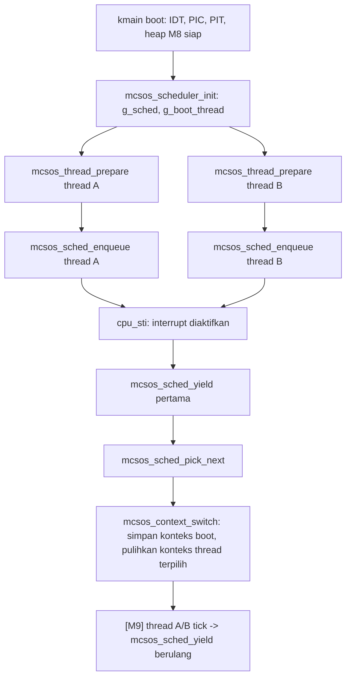

 Laporan Praktikum Sistem Operasi Lanjut — MCSOS-M9

**Nama file laporan:** `laporan_praktikum_m9_25832074009.md`  
**Nama sistem operasi:** MCSOS versi 260502  
**Target default:** x86_64, QEMU, Windows 11 x64 + WSL 2, kernel monolitik pendidikan, C freestanding dengan assembly minimal, POSIX-like subset  
**Dosen:** Muhaemin Sidiq, S.Pd., M.Pd.  
**Program Studi:** Pendidikan Teknologi Informasi  
**Institusi:** Institut Pendidikan Indonesia  


---

## 0. Metadata Laporan

| Atribut | Isi |
|---|---|
| Kode praktikum | `[M9]` |
| Judul praktikum | `[Kernel Thread dan Cooperative Scheduler (mcsos_thread): State Machine Thread, Ready Queue FIFO, Context Switch x86_64, dan Kontrak Scheduler Non-preemptive]` |
| Jenis pengerjaan | `[Individu]` |
| Nama mahasiswa | `[Syifa Nurzimah]` |
| NIM | `[25832074009]` |
| Kelas | `[1A]` |
| Nama kelompok | `[isi jika kelompok]` |
| Anggota kelompok | `[tidak berlaku]` |
| Tanggal praktikum | `[2026-07-05]` |
| Tanggal pengumpulan | `[YYYY-MM-DD]` |
| Repository | `[/home/syifa/src/mcsos]` |
| Branch | `[m9-kernel-thread-scheduler]` |
| Commit awal | `` `[03657c2 — M8 kernel heap implementation]` `` |
| Commit akhir | `` `[4453b81]` `` |
| Status readiness yang diklaim | `[Siap uji QEMU]` |

---

## 1. Sampul

# Laporan Praktikum `m9`  
## `Kernel Thread dan Cooperative Scheduler (mcsos_thread): State Machine Thread, Ready Queue FIFO, Context Switch x86_64, dan Kontrak Scheduler Non-preemptive`

Disusun oleh:

| Nama | NIM | Kelas | Peran |
|---|---|---|---|
| `[Syifa Nurzimah]` | `[25832074009]` | `[1A]` | `[individu]` |
| `[opsional]` | `[opsional]` | `[opsional]` | `[opsional]` |

Dosen Pengampu: **Muhaemin Sidiq, S.Pd., M.Pd.**  
Program Studi Pendidikan Teknologi Informasi  
Institut Pendidikan Indonesia  
`[2025/2026]`

---

## 2. Pernyataan Orisinalitas dan Integritas Akademik

Saya menyatakan bahwa laporan ini disusun berdasarkan hasil praktikum yang saya kerjakan sendiri menggunakan lingkungan pengembangan WSL 2 Ubuntu sesuai panduan praktikum M9. Seluruh hasil yang dilaporkan didukung oleh bukti berupa command output, log, artefak build, dan commit repository yang terdokumentasi, termasuk proses debugging dan pemulihan (rollback) yang benar-benar terjadi selama sesi.

| Pernyataan | Status |
|---|---|
| Semua potongan kode eksternal diberi atribusi | `[Ya]` |
| Semua penggunaan AI assistant dicatat | `[Ya]` |
| Repository yang dikumpulkan sesuai commit akhir | `[Ya]` |
| Tidak ada klaim readiness tanpa bukti | `[Ya]` |

Catatan penggunaan bantuan eksternal:

```text
Menggunakan dokumentasi resmi Clang/LLVM, GNU Make, GNU Binutils (nm, readelf, objdump), GNU Assembler/AT&T syntax x86_64, dan Git sebagai referensi teknis. Menggunakan AI Assistant untuk membantu memahami instruksi praktikum M9, melakukan debugging Makefile (kesalahan "missing separator" berulang akibat indentasi tab yang rusak saat paste multi-baris di terminal), menjelaskan error kompilasi akibat header ganda dan tidak konsisten pada kernel/include (definisi mcsos_thread_t dan mcsos_scheduler_t yang saling bertabrakan), serta membantu penyusunan laporan praktikum. Seluruh command, konfigurasi, build, pengujian, dan verifikasi evidence dijalankan serta diperiksa ulang secara mandiri pada lingkungan WSL 2 Ubuntu. Karena sesi awal mengalami kerusakan berat pada working tree (banyak file salah tempat, Makefile korup, file kosong akibat kesalahan redirection), dilakukan git reset --hard ke commit 03657c2 (akhir M8) dan pekerjaan M9 diulang dari awal secara bersih pada branch baru m9-kernel-thread-scheduler. Commit akhir repository: 4453b81 ("M9: implement cooperative kernel scheduler").
```

---

## 3. Tujuan Praktikum

Tuliskan tujuan teknis dan konseptual praktikum. Tujuan harus dapat diuji.

1. `Mendesain dan mengimplementasikan struktur data thread kernel (mcsos_thread_t) beserta state machine (NEW/READY/RUNNING/BLOCKED) dan konteks CPU (rsp, rbp, rbx, r12–r15, rip) dalam C17 freestanding.`
2. `Mendesain dan mengimplementasikan scheduler kooperatif (mcsos_scheduler_t) berbasis ready queue FIFO (linked list) dengan operasi init, enqueue, pick-next, yield, tick, block, dan mark-ready.`
3. `Mengimplementasikan rutin context switch tingkat rendah (mcsos_context_switch) dalam x86_64 assembly yang menyimpan dan memulihkan register callee-saved serta instruction pointer antar thread.`
4. `Menyusun host unit test yang menguji inisialisasi scheduler, penyiapan thread, enqueue/dequeue, yield, tick, dan validasi invariant ready queue (mcsos_sched_validate) sebelum objek freestanding dibangun.`
5. `Mengaudit objek freestanding hasil kompilasi context_switch.S dan mcsos_thread.c menggunakan nm, readelf, dan objdump untuk membuktikan struktur instruksi context switch dan tidak adanya simbol undefined yang tidak wajar.`
6. `Mengintegrasikan dua thread demo (thread A dan thread B) ke dalam kmain() MCSOS setelah subsistem sebelumnya (interrupt, PIC, PIT, kernel heap M8) siap, dan memastikan kernel penuh tetap dapat dibangun (link) tanpa error dengan seluruh simbol scheduler terdeteksi pada kernel.elf.`

---

## 4. Capaian Pembelajaran Praktikum

Setelah praktikum ini, mahasiswa mampu:

| CPL/CPMK praktikum | Bukti yang harus ditunjukkan |
|---|---|
| `[Menjelaskan perbedaan proses, thread kernel, dan scheduler kooperatif dibanding preemptive, serta alasan kernel memerlukan mekanisme context switch di atas kernel heap yang telah dibangun pada M8]` | `[Bagian Dasar Teori Ringkas dan Desain Teknis]` |
| `[Mendesain thread kernel dengan state machine, header/metadata (magic number), dan struktur konteks CPU minimal yang dapat dipulihkan lewat context switch]` | `[Isi include/mcsos/mcsos_thread.h dan kernel/mcsos_thread.c, bagian Invariants]` |
| `[Mengimplementasikan mcsos_scheduler_init, mcsos_thread_prepare, mcsos_sched_enqueue, mcsos_sched_pick_next, mcsos_sched_yield, mcsos_sched_tick, mcsos_thread_block_current, mcsos_thread_mark_ready, mcsos_sched_ready_count, dan mcsos_sched_validate dalam C17 freestanding]` | `[Output clang -fsyntax-only, make check-m9]` |
| `[Menulis rutin context switch x86_64 dalam assembly (menyimpan/memulihkan rsp, rbp, rbx, r12–r15, rip)]` | `[kernel/arch/x86_64/context_switch.S dan hasil objdump]` |
| `[Menyusun host unit test scheduler yang menguji enqueue, yield, tick, dan validasi invariant ready queue]` | `[tests/test_scheduler.c dan output "M9 scheduler host unit test PASS"]` |
| `[Melakukan audit freestanding object dengan nm, readelf, dan objdump untuk context switch dan thread]` | `[build/m9/context_switch.undefined.txt, build/m9/context_switch.objdump.txt]` |
| `[Mengintegrasikan dua thread demo ke kernel MCSOS setelah heap M8 siap, dan memverifikasi simbol scheduler pada kernel.syms.txt]` | `[Perubahan kernel/core/kmain.c: g_sched, g_thread_a/b, demo_thread_a/b, dan grep "mcsos_" pada build/kernel.syms.txt]` |
| `[Mengenali dan memulihkan working tree yang rusak akibat kesalahan operasional (Makefile korup, file kosong, header ganda) melalui git reset --hard dan pengerjaan ulang yang bersih dan terverifikasi bertahap]` | `[Bagian 15 Debugging dan Failure Modes]` |
| `[Menyusun laporan praktikum dengan bukti build, test, audit object, failure analysis, rollback, dan readiness review]` | `[Laporan ini secara keseluruhan]` |

---

## 5. Peta Milestone MCSOS

Centang milestone yang menjadi fokus laporan ini. Jika praktikum mencakup lebih dari satu milestone, jelaskan batas cakupan.

| Milestone | Fokus | Status dalam laporan |
|---|---|---|
| M0 | Requirements, governance, baseline arsitektur | `[ ] tidak dibahas / [ ] dibahas / [ x ] selesai praktikum` |
| M1 | Toolchain reproducible, Git, QEMU, GDB, metadata build | `[ ] tidak dibahas / [ ] dibahas / [ x ] selesai praktikum` |
| M2 | Boot image, kernel ELF64, early console | `[ ] tidak dibahas / [ ] dibahas / [ x ] selesai praktikum` |
| M3 | Panic path, linker map, GDB, observability awal | `[ ] tidak dibahas / [ ] dibahas / [ x ] selesai praktikum` |
| M4 | Trap, exception, interrupt, timer | `[ ] tidak dibahas / [ ] dibahas / [ x ] selesai praktikum` |
| M5 | PMM, VMM, page table, kernel heap | `[ ] tidak dibahas / [ ] dibahas / [ x ] selesai praktikum` |
| M6 | Thread, scheduler, synchronization | `[ ] tidak dibahas / [ x ] dibahas / [ ] selesai praktikum` |
| M7 | Syscall ABI dan user program loader | `[ ] tidak dibahas / [ x ] dibahas / [ ] selesai praktikum` |
| M8 | Kernel heap allocator (kmem): free-list, split, coalesce, statistik heap | `[ ] tidak dibahas / [ ] dibahas / [ x ] selesai praktikum` |
| M9 | Kernel thread dan cooperative scheduler | `[ ] tidak dibahas / [ ] dibahas / [ x ] selesai praktikum` |
| M10 | Persistent filesystem, mcsfs/ext2-like, recovery | `[ x ] tidak dibahas / [ ] dibahas / [ ] selesai praktikum` |
| M11 | Networking stack, packet parsing, UDP/TCP subset | `[ x ] tidak dibahas / [ ] dibahas / [ ] selesai praktikum` |
| M12 | Security model, capability/ACL, syscall fuzzing, hardening | `[ x ] tidak dibahas / [ ] dibahas / [ ] selesai praktikum` |
| M13 | SMP, scalability, lock stress, NUMA-aware preparation | `[ x ] tidak dibahas / [ ] dibahas / [ ] selesai praktikum` |
| M14 | Framebuffer, graphics console, visual regression | `[ x ] tidak dibahas / [ ] dibahas / [ ] selesai praktikum` |
| M15 | Virtualization/container subset | `[ x ] tidak dibahas / [ ] dibahas / [ ] selesai praktikum` |
| M16 | Observability, update/rollback, release image, readiness review | `[ x ] tidak dibahas / [ ] dibahas / [ ] selesai praktikum` |

Batas cakupan praktikum:

```text
Praktikum M9 berfokus pada perancangan dan implementasi kernel thread beserta scheduler kooperatif (mcsos_thread) sebagai lapisan manajemen eksekusi di atas kernel heap (M8) yang telah dibangun pada milestone sebelumnya. Aktivitas mencakup pembuatan header dan implementasi state machine thread, scheduler berbasis ready queue FIFO, rutin context switch x86_64 dalam assembly, penyusunan host unit test, audit objek freestanding menggunakan nm/readelf/objdump, serta integrasi dua thread demo (thread A dan thread B) ke dalam kmain() MCSOS. Catatan: peta milestone umum pada baris di atas mengikuti template roadmap MCSOS yang tersedia; penamaan capaian pembelajaran resmi dari dosen untuk M9 pada semester berjalan adalah kernel thread dan cooperative scheduler, sehingga isi laporan ini mengacu pada panduan M9 aktual (thread/scheduler) yang diberikan, bukan pada deskripsi generik di tabel roadmap. Praktikum ini belum mencakup boot QEMU dengan log serial M9, preemptive scheduling (timer-driven), synchronization primitive (mutex/semaphore), syscall ABI, filesystem, maupun subsistem sistem operasi lain di luar thread/scheduler dasar.
```

---

## 6. Dasar Teori Ringkas

Tuliskan teori yang langsung diperlukan untuk memahami praktikum. Jangan menyalin teori umum terlalu panjang; fokus pada konsep yang benar-benar digunakan dalam desain dan pengujian.

### 6.1 Konsep Sistem Operasi yang Diuji

```text
Praktikum M9 berfokus pada unit eksekusi di dalam kernel (kernel thread) dan mekanisme perpindahan eksekusi antar unit tersebut (scheduler). Konsep yang diuji meliputi state machine thread (NEW, READY, RUNNING, BLOCKED), ready queue FIFO yang menyimpan thread yang siap dijalankan, algoritma pemilihan thread berikutnya (round-robin sederhana lewat FIFO dequeue), serta context switch yaitu proses menyimpan register CPU milik thread yang sedang berjalan dan memulihkan register milik thread berikutnya. Scheduler yang dibangun bersifat kooperatif (non-preemptive): perpindahan hanya terjadi ketika thread aktif memanggil mcsos_sched_yield secara eksplisit, bukan dipicu oleh interrupt timer.
```

### 6.2 Konsep Arsitektur x86_64 yang Relevan

| Konsep | Relevansi pada praktikum | Bukti/verifikasi |
|---|---|---|
| `[ELF64 x86_64 relocatable object]` | `[Format objek context_switch.o dan mcsos_thread.o hasil kompilasi freestanding sebelum di-link ke kernel.elf]` | `[Output readelf -h build/m9/m9_scheduler_combined.o dan build/kernel.elf]` |
| `[Register callee-saved: rbx, rbp, r12–r15]` | `[Register inilah yang wajib disimpan/dipulihkan oleh mcsos_context_switch agar pemanggil (caller) tidak kehilangan state saat context switch terjadi]` | `[Isi kernel/arch/x86_64/context_switch.S]` |
| `[Stack layout dan alignment 16 byte]` | `[Stack setiap thread (g_stack_a, g_stack_b, 8192 byte, aligned 16) disiapkan agar rsp awal valid saat mcsos_thread_trampoline dipanggil]` | `[Definisi g_stack_a/g_stack_b pada kmain.c dan MCSOS_STACK_ALIGN pada mcsos_thread.c]` |
| `[Freestanding Environment]` | `[mcsos_thread.c dan context_switch.S tidak boleh bergantung pada malloc/free/printf/memset libc host]` | `[Flag -ffreestanding -fno-stack-protector -fno-pic -mno-red-zone pada target freestanding M9]` |
| `[ABI x86_64 System V]` | `[Dasar pemanggilan fungsi mcsos_context_switch(old_ctx, new_ctx) dari mcsos_sched_yield]` | `[Output objdump -d pada mcsos_context_switch]` |

### 6.3 Konsep Implementasi Freestanding

| Aspek | Keputusan praktikum |
|---|---|
| Bahasa | `[C17 freestanding untuk mcsos_thread.c, x86_64 AT&T assembly untuk context_switch.S]` |
| Runtime | `[tanpa hosted libc; tidak memakai malloc/free/printf/memset dari libc]` |
| ABI | `[x86_64 System V]` |
| Compiler/assembler flags kritis | `[-ffreestanding, -fno-stack-protector, -fno-pic, -mno-red-zone, --target=x86_64-unknown-none-elf]` |
| Risiko undefined behavior | `[Stack overflow pada thread dengan stack terlalu kecil, korupsi context akibat urutan simpan/pulih register yang salah, double-yield pada thread idle, invalid pointer pada ready queue akibat linkage next yang tidak direset]` |

### 6.4 Referensi Teori yang Digunakan

| No. | Sumber | Bagian yang digunakan | Alasan relevansi |
|---|---|---|---|
| `[1]` | `[Scheduling (OSTEP)]` | `[Desain ready queue FIFO dan konsep cooperative scheduling]` | `[Dasar desain mcsos_sched_enqueue dan mcsos_sched_pick_next]` |
| `[2]` | `[Mechanism: Limited Direct Execution / Context Switch (OSTEP)]` | `[Konsep menyimpan dan memulihkan register saat context switch]` | `[Dasar desain mcsos_context_switch di context_switch.S]` |
| `[3]` | `[Dokumentasi GNU Binutils]` | `[nm, readelf, dan objdump]` | `[Digunakan untuk memverifikasi objek freestanding context switch dan thread]` |
| `[4]` | `[Materi prasyarat M9: State machine thread, Register callee-saved x86_64, Freestanding assembly, Ready queue, Invariant scheduler, Failure mode]` | `[Seluruh bagian prasyarat teori M9]` | `[Menjadi dasar penetapan invariant dan failure mode scheduler]` |
| `[5]` | `[Dokumentasi Git]` | `[git reset --hard, branching]` | `[Digunakan untuk pemulihan working tree yang rusak dan pelacakan perubahan repository]` |

---

## 7. Lingkungan Praktikum

### 7.1 Host dan Target

| Komponen | Nilai |
|---|---|
| Host OS | `[Windows 10/11 x64]` |
| Lingkungan build | `[WSL 2 Ubuntu]` |
| Target ISA | `x86_64` |
| Target ABI | `[x86_64-unknown-none-elf]` |
| Emulator | `[QEMU — dicoba tetapi belum berhasil dijalankan pada sesi M9 ini karena image ISO belum tersedia]` |
| Firmware emulator | `[OVMF — tidak relevan pada langkah M9 yang dilaporkan]` |
| Debugger | `[GNU GDB — belum digunakan pada sesi M9 ini]` |
| Build system | `[GNU Make 4.4.1]` |
| Bahasa utama | `[C17 Freestanding]` |
| Assembly | `[x86_64 AT&T assembly untuk context_switch.S]` |

### 7.2 Versi Toolchain

Tempel output versi toolchain berikut. Diambil dari output `evidence/m9/preflight_m9.log`.

```bash
clang --version | head -n 1
gcc --version | head -n 1
ld.lld --version
ld --version | head -n 1
make --version | head -n 1
qemu-system-x86_64 --version
gdb --version | head -n 1
```

Output:

```text
Ubuntu clang version 21.1.8 (6ubuntu1)
gcc (Ubuntu 15.2.0-16ubuntu1) 15.2.0
Ubuntu LLD 21.1.8 (compatible with GNU linkers)
GNU ld (GNU Binutils for Ubuntu) 2.46
GNU Make 4.4.1
QEMU emulator version 10.2.1 (Debian 1:10.2.1+ds-1ubuntu3)
GNU gdb (Ubuntu 17.1-2ubuntu1) 17.1
```

### 7.3 Lokasi Repository

| Item | Nilai |
|---|---|
| Path repository di WSL | `` `[/home/syifa/src/mcsos]` `` |
| Apakah berada di filesystem Linux WSL, bukan `/mnt/c` | `[Ya]` |
| Remote repository | `[https://github.com/syifanurzimah/MCSOS.git]` |
| Branch | `[m9-kernel-thread-scheduler]` |
| Commit hash awal (baseline sebelum branch M9 bersih dibuat) | `` `[03657c2]` `` |
| Commit checkpoint antara | `` `[a44e07b — checkpoint before M9 scheduler]` `` |
| Commit hash akhir | `` `[4453b81]` `` |

---

## 8. Repository dan Struktur File

### 8.1 Struktur Direktori yang Relevan

Tampilkan hanya direktori dan file yang relevan dengan praktikum.

```text
mcsos/
├── include/
│   └── mcsos/
│       ├── kmem.h
│       └── mcsos_thread.h
├── kernel/
│   ├── core/
│   │   └── kmain.c
│   ├── include/
│   │   └── mcsos/
│   │       ├── kmem.h
│   │       └── mcsos_thread.h
│   ├── arch/
│   │   └── x86_64/
│   │       └── context_switch.S
│   └── mcsos_thread.c
├── tests/
│   └── test_scheduler.c
├── build/
│   └── m9/
├── evidence/
│   └── m9/
│       └── preflight_m9.log
├── Makefile
└── docs/evidence/M3, M4 (evidence milestone sebelumnya)
```

### 8.2 File yang Dibuat atau Diubah

| File | Jenis perubahan | Alasan perubahan | Risiko |
|---|---|---|---|
| `[include/mcsos/mcsos_thread.h]` | `[baru, ditulis ulang]` | `[Deklarasi thread_state_t, thread_context_t/mcsos_context_t, mcsos_thread_t dengan magic number, mcsos_scheduler_t dengan ready queue FIFO, dan seluruh API scheduler]` | `[tinggi — sempat ada dua versi header yang tidak kompatibel]` |
| `[kernel/mcsos_thread.c]` | `[baru]` | `[Implementasi scheduler kooperatif 247 baris: mcsos_scheduler_init, mcsos_thread_prepare, mcsos_sched_enqueue, mcsos_sched_pick_next, mcsos_sched_yield, mcsos_sched_tick, mcsos_thread_block_current, mcsos_thread_mark_ready, mcsos_sched_ready_count, mcsos_sched_validate, mcsos_thread_trampoline]` | `[tinggi]` |
| `[kernel/arch/x86_64/context_switch.S]` | `[baru]` | `[Rutin mcsos_context_switch: menyimpan rsp/rbp/rbx/r12–r15/rip milik thread lama ke struct pertama, memulihkan milik thread baru dari struct kedua, lalu jmp ke rip yang dipulihkan]` | `[tinggi]` |
| `[tests/test_scheduler.c]` | `[baru]` | `[Host unit test untuk scheduler init, thread prepare, enqueue, ready count, validate, yield, dan tick]` | `[sedang]` |
| `[kernel/include/mcsos/mcsos_thread.h]` | `[baru, salinan]` | `[Kernel build memakai include path kernel/include, sehingga header perlu disalin agar kmain.c dapat #include <mcsos/mcsos_thread.h> saat kompilasi freestanding penuh]` | `[rendah, setelah disamakan dengan versi root]` |
| `[Makefile]` | `[ubah]` | `[Menambahkan target m9-clean, check-m9, dan aturan build build/m9/mcsos_thread.o, build/m9/context_switch.o, build/m9/test_scheduler]` | `[sedang — sempat rusak berkali-kali akibat indentasi tab yang hilang]` |
| `[kernel/core/kmain.c]` | `[ubah]` | `[Menambahkan #include <mcsos/mcsos_thread.h>, g_sched/g_boot_thread/g_thread_a/g_thread_b, g_stack_a/g_stack_b[8192], demo_thread_a/demo_thread_b, serta pemanggilan mcsos_scheduler_init, mcsos_thread_prepare x2, mcsos_sched_enqueue x2, dan mcsos_sched_yield pertama di dalam kmain()]` | `[sedang]` |
| `[evidence/m9/preflight_m9.log]` | `[baru]` | `[Bukti versi toolchain dan artefak sebelumnya sebelum M9 dimulai]` | `[rendah]` |

### 8.3 Ringkasan Diff

```bash
git status --short
git add kernel/mcsos_thread.c include/mcsos/mcsos_thread.h \
        kernel/arch/x86_64/context_switch.S kernel/core/kmain.c \
        tests/test_scheduler.c Makefile
git commit -m "M9: implement cooperative kernel scheduler"
```

Output:

```text
syifa@WIN-E2QNIIEGDH4:~/src/mcsos$ git commit -m "M9: implement cooperative kernel scheduler"
[m9-kernel-thread-scheduler 4453b81] M9: implement cooperative kernel scheduler
 6 files changed, 607 insertions(+), 22 deletions(-)
 create mode 100644 kernel/arch/x86_64/context_switch.S
 create mode 100644 kernel/mcsos_thread.c
 create mode 100644 tests/test_scheduler.c
```

---

## 9. Desain Teknis

### 9.1 Masalah yang Diselesaikan

```text
Praktikum M9 berfokus pada penyediaan unit eksekusi (thread) di dalam kernel MCSOS dan mekanisme untuk berpindah antar unit eksekusi tersebut (scheduler), setelah kernel heap (M8), interrupt, PIC, dan PIT selesai diinisialisasi. Masalah utama yang diselesaikan adalah menyediakan struktur data thread dengan state machine yang jelas (NEW/READY/RUNNING/BLOCKED), ready queue FIFO untuk menampung thread yang siap dijalankan, algoritma pemilihan thread berikutnya, serta rutin context switch tingkat rendah dalam assembly x86_64 yang benar-benar memindahkan eksekusi CPU dari satu thread ke thread lain tanpa kehilangan state register callee-saved.
```

### 9.2 Keputusan Desain

| Keputusan | Alternatif yang dipertimbangkan | Alasan memilih | Konsekuensi |
|---|---|---|---|
| `[Scheduler kooperatif (non-preemptive) berbasis yield eksplisit]` | `[Scheduler preemptive berbasis interrupt timer (PIT)]` | `[Lebih sederhana untuk tahap awal M9 sebelum integrasi penuh dengan mekanisme preempt via IRQ0]` | `[Thread yang tidak pernah memanggil yield dapat memonopoli CPU]` |
| `[Ready queue FIFO berbasis linked list (ready_head/ready_tail)]` | `[Array tetap berukuran MAX_THREADS seperti percobaan awal]` | `[Tidak membatasi jumlah thread secara kaku dan linkage next sudah tersedia pada struct thread]` | `[Perlu menjaga konsistensi pointer next agar tidak terjadi siklus/corrupt list]` |
| `[Header 8+ field dengan magic number MCSOS_THREAD_MAGIC pada mcsos_thread_t]` | `[Struct thread minimal tanpa magic number]` | `[Mendeteksi objek thread yang tidak valid/corrupt lebih awal sebelum dipakai scheduler]` | `[Overhead pemeriksaan magic pada setiap operasi scheduler]` |
| `[Context switch murni assembly (context_switch.S) terpisah dari mcsos_thread.c]` | `[Inline assembly di dalam fungsi C]` | `[Lebih mudah diaudit dengan objdump secara terisolasi dan dikompilasi dengan flag freestanding khusus assembly]` | `[Perlu antarmuka pemanggilan (calling convention) yang jelas antara C dan assembly]` |
| `[Validasi terpisah lewat mcsos_sched_validate() sebelum operasi kritis]` | `[Tidak ada validasi eksplisit, hanya mengandalkan logika enqueue/dequeue]` | `[Membantu mendeteksi ready queue yang corrupt (siklus, jumlah tidak konsisten) sebelum menyebabkan crash]` | `[Overhead pemeriksaan tambahan setiap kali dipanggil]` |

### 9.3 Arsitektur Ringkas

Tambahkan diagram ASCII atau Mermaid. Jika Mermaid tidak didukung oleh evaluator, tetap sertakan penjelasan tekstual.



Penjelasan diagram:

```text
Setelah IDT, PIC, PIT, dan kernel heap M8 diinisialisasi di kmain(), mcsos_scheduler_init() dipanggil untuk menyiapkan scheduler dengan boot thread sebagai thread RUNNING pertama. Dua thread demo (A dan B) disiapkan lewat mcsos_thread_prepare dengan stack masing-masing 8192 byte, lalu dimasukkan ke ready queue lewat mcsos_sched_enqueue. Setelah interrupt diaktifkan (cpu_sti), kmain() memanggil mcsos_sched_yield untuk pertama kali sehingga scheduler memilih thread berikutnya lewat mcsos_sched_pick_next dan melakukan context switch nyata lewat mcsos_context_switch. Selanjutnya setiap thread demo mencetak log "[M9] thread A/B tick" lalu memanggil mcsos_sched_yield lagi secara kooperatif, sehingga eksekusi berpindah bergiliran antara thread A dan thread B.
```

### 9.4 Kontrak Antarmuka

| Antarmuka | Pemanggil | Penerima | Precondition | Postcondition | Error path |
|---|---|---|---|---|---|
| `[mcsos_scheduler_init(sched, boot_thread)]` | `[kmain]` | `[mcsos_thread.c]` | `[sched dan boot_thread bukan NULL]` | `[boot_thread menjadi current dan idle, sched->initialized=1]` | `[Return MCSOS_SCHED_EINVAL jika argumen NULL]` |
| `[mcsos_thread_prepare(thread, name, entry, arg, stack_base, stack_size, id)]` | `[kmain untuk thread A/B]` | `[mcsos_thread.c]` | `[thread/entry/stack_base tidak NULL, stack_size ≥ MCSOS_MIN_KERNEL_STACK]` | `[Konteks awal thread disiapkan: rsp menunjuk puncak stack teralign, rip menunjuk mcsos_thread_trampoline]` | `[Return MCSOS_SCHED_EINVAL atau MCSOS_SCHED_ESTACK sesuai jenis kegagalan]` |
| `[mcsos_sched_enqueue(sched, thread)]` | `[kmain, mcsos_sched_yield]` | `[mcsos_thread.c]` | `[sched sudah initialized, thread valid dan berstatus NEW/READY/BLOCKED]` | `[Thread masuk ke ready_tail, runnable_count bertambah]` | `[Return MCSOS_SCHED_EINVAL/MCSOS_SCHED_ESTATE sesuai kondisi]` |
| `[mcsos_sched_pick_next(sched)]` | `[mcsos_sched_yield]` | `[mcsos_thread.c]` | `[sched sudah initialized]` | `[Thread pertama pada ready_head dikeluarkan dari queue; jika kosong kembalikan idle]` | `[Return NULL jika sched tidak valid]` |
| `[mcsos_sched_yield(sched)]` | `[kmain, demo_thread_a/b]` | `[mcsos_thread.c, context_switch.S]` | `[sched->current valid]` | `[Thread lama di-enqueue ulang bila perlu, thread baru menjadi current, context switch nyata dipanggil (kecuali MCSOS_HOST_TEST)]` | `[Return MCSOS_SCHED_EINVAL/ECORRUPT sesuai kondisi]` |
| `[mcsos_sched_validate(sched)]` | `[audit/debug, host unit test]` | `[mcsos_thread.c]` | `[sched sudah initialized]` | `[Return 0 jika seluruh invariant ready queue terpenuhi]` | `[Return kode negatif spesifik sesuai jenis pelanggaran invariant]` |
| `[mcsos_context_switch(old_ctx, new_ctx)]` | `[mcsos_sched_yield]` | `[context_switch.S]` | `[old_ctx dan new_ctx menunjuk struct konteks 8×uint64_t yang valid]` | `[Register CPU thread lama tersimpan di old_ctx, register thread baru dipulihkan dari new_ctx, eksekusi melompat ke rip baru]` | `[Tidak ada penanganan error eksplisit di level assembly]` |

### 9.5 Struktur Data Utama

| Struktur data | Field penting | Ownership | Lifetime | Invariant |
|---|---|---|---|---|
| `` `mcsos_thread_t` `` | `[magic, id, name, state, entry, arg, stack_base, stack_size, next, context, switches, ticks, exit_code]` | `[Pemanggil yang mengalokasikan (statis di kmain.c: g_boot_thread, g_thread_a, g_thread_b)]` | `[selama thread ada dalam sistem]` | `[magic harus sama dengan MCSOS_THREAD_MAGIC; next hanya bermakna saat berada di ready queue]` |
| `` `mcsos_scheduler_t` `` | `[current, idle, ready_head, ready_tail, next_id, runnable_count, context_switches, ticks, initialized]` | `[kmain.c: g_sched]` | `[selama kernel berjalan]` | `[ready_head/ready_tail konsisten dengan runnable_count; current tidak pernah berada di ready queue]` |
| `` `mcsos_context_t` `` | `[rsp, rbp, rbx, r12, r13, r14, r15, rip]` | `[embedded pada mcsos_thread_t]` | `[selama thread ada]` | `[Urutan field harus sama persis dengan offset yang dipakai context_switch.S (0,8,16,24,32,40,48,56)]` |
| `` `g_stack_a[8192] / g_stack_b[8192]` `` | `[buffer byte statis, aligned 16]` | `[kernel/core/kmain.c]` | `[selama kernel berjalan]` | `[rsp awal thread harus berada di dalam rentang buffer ini dan teralign MCSOS_STACK_ALIGN]` |

### 9.6 Invariants

Tuliskan invariant yang harus benar sepanjang eksekusi.

1. `Setiap objek thread harus memiliki magic == MCSOS_THREAD_MAGIC sebelum dipakai scheduler; jika tidak, operasi enqueue/yield/validate menolaknya.`
2. `sched->current tidak pernah berada dalam ready queue pada saat yang sama (tidak boleh muncul dua kali sebagai thread yang sedang berjalan sekaligus sebagai kandidat ready).`
3. `Jumlah node pada ready queue (dihitung dari ready_head hingga ready_tail) harus sama dengan sched->runnable_count.`
4. `Setiap thread yang di-enqueue harus berstatus NEW, READY, atau BLOCKED; thread yang sedang RUNNING tidak boleh langsung di-enqueue tanpa mengubah statusnya terlebih dahulu.`
5. `Urutan penyimpanan/pemulihan register pada mcsos_context_switch (rsp, rbp, rbx, r12–r15, rip) harus konsisten dengan urutan field pada mcsos_context_t agar tidak terjadi korupsi state saat berpindah thread.`

### 9.7 Ownership, Locking, dan Concurrency

| Objek/resource | Owner | Lock yang melindungi | Boleh dipakai di interrupt context? | Catatan |
|---|---|---|---|---|
| `[g_sched dan ready queue]` | `[kernel/core/kmain.c]` | `[none]` | `[Tidak]` | `[Scheduler M9 hanya dipakai secara kooperatif single-threaded saat boot, belum ada proteksi interrupt]` |
| `[g_stack_a / g_stack_b]` | `[kernel/core/kmain.c]` | `[none]` | `[Tidak]` | `[Stack statis per thread, tidak dialokasikan dinamis dari kmem pada M9 ini]` |
| `[mcsos_context_t di dalam setiap thread]` | `[mcsos_thread.c]` | `[none]` | `[Tidak]` | `[Diakses langsung oleh context_switch.S tanpa mekanisme kunci]` |

Lock order yang berlaku:

```text
Pada M9 belum terdapat mekanisme locking karena scheduler bersifat kooperatif dan belum ada interrupt handler (timer preemption) yang mengakses ready queue secara konkuren dengan thread yang sedang berjalan. Scheduler ini hanya aman dipakai pada konteks single-CPU dengan yield eksplisit; scheduler yang aman untuk preemptive timer interrupt, SMP, atau synchronization primitive (mutex/semaphore) memerlukan locking/atomic tambahan yang belum diimplementasikan pada milestone ini.
```

### 9.8 Memory Safety dan Undefined Behavior Risk

| Risiko | Lokasi | Mitigasi | Bukti |
|---|---|---|---|
| `[Metadata thread corrupt (magic tidak sesuai)]` | `[mcsos_thread_t]` | `[Fungsi valid_thread_object() memvalidasi magic == MCSOS_THREAD_MAGIC sebelum operasi]` | `[Pemeriksaan pada mcsos_sched_enqueue, mcsos_sched_yield, mcsos_sched_validate]` |
| `[Stack terlalu kecil untuk thread baru]` | `[mcsos_thread_prepare]` | `[Validasi stack_size ≥ MCSOS_MIN_KERNEL_STACK dan alignment sebelum rsp awal dihitung]` | `[Return MCSOS_SCHED_ESTACK pada mcsos_thread.c]` |
| `[Ready queue corrupt (siklus atau jumlah tidak konsisten)]` | `[mcsos_sched_enqueue / mcsos_sched_pick_next]` | `[mcsos_sched_validate memeriksa linkage dan membandingkan count dengan runnable_count]` | `[Return MCSOS_SCHED_ECORRUPT pada mcsos_sched_validate]` |
| `[Urutan simpan/pulih register yang salah pada context switch]` | `[kernel/arch/x86_64/context_switch.S]` | `[Offset field context_switch.S (0,8,16,...,56) disamakan persis dengan urutan zero_context() pada mcsos_thread.c]` | `[objdump -d menunjukkan offset 0x38 (56) dipakai sebagai target jmp, sesuai posisi rip]` |
| `[Kernel gagal build karena header thread ganda dan tidak konsisten antara include/ dan kernel/include/]` | `[kernel/core/kmain.c saat include mcsos_thread.h]` | `[Menyalin dan menyamakan isi mcsos_thread.h ke kernel/include/mcsos/mcsos_thread.h, menghapus header scheduler terpisah yang tidak konsisten]` | `[Log build make sebelum dan sesudah perbaikan, lihat Bagian 15]` |

### 9.9 Security Boundary

| Boundary | Data tidak tepercaya | Validasi yang dilakukan | Failure mode aman |
|---|---|---|---|
| `[Pemanggil mcsos_thread_prepare/mcsos_sched_enqueue]` | `[Ukuran stack, pointer thread, pointer stack_base]` | `[Cek NULL, cek stack_size minimum, cek magic number]` | `[Return kode error, tidak melanjutkan operasi tidak aman]` |
| `[Ready queue g_sched]` | `[Urutan enqueue/dequeue yang dilakukan kode kernel lain]` | `[mcsos_sched_validate memeriksa konsistensi linkage dan jumlah]` | `[Return MCSOS_SCHED_ECORRUPT, tidak melanjutkan yield yang berpotensi merusak state]` |
| `[Build system Makefile]` | `[Target M9 yang ditambahkan manual]` | `[Uji make check-m9 sebelum diintegrasikan ke build kernel penuh]` | `[Build dihentikan bila host unit test scheduler gagal]` |

---

## 10. Langkah Kerja Implementasi

Gunakan tabel berikut untuk setiap langkah. Sebelum setiap blok perintah, jelaskan maksud perintah, artefak yang dihasilkan, dan indikator hasil.

### Langkah 1 — `Preflight dan Percobaan Awal pada Branch praktikum-m9-scheduler`

Maksud langkah:

```text
Menjalankan preflight (versi toolchain dan artefak sebelumnya) dan mencoba menyusun struktur M9 secara langsung di atas working tree M8 tanpa branch baru yang bersih.
```

Perintah:

```bash
mkdir -p evidence/m9
{
  echo "== git =="
  git rev-parse --show-toplevel
  git rev-parse --short HEAD
  git status --short
  echo "== tools =="
  clang --version; gcc --version | head -n1; ld.lld --version
  ld --version | head -n1; make --version | head -n1
  qemu-system-x86_64 --version; gdb --version | head -n1
  echo "== previous artifacts =="
  find build evidence -maxdepth 3 -type f | sort | grep -E 'M[0-8]|m[0-8]|kernel|iso|log|elf|map|o$'
} | tee evidence/m9/preflight_m9.log
```

Output ringkas:

```text
== git ==
/home/syifa/src/mcsos
03657c2
?? docs/evidence/M8/
== tools ==
Ubuntu clang version 21.1.8 (6ubuntu1)
GNU Make 4.4.1
QEMU emulator version 10.2.1 (Debian 1:10.2.1+ds-1ubuntu3)
```

Artefak yang dihasilkan:

| Artefak | Lokasi | Fungsi |
|---|---|---|
| `[preflight_m9.log]` | `[evidence/m9/preflight_m9.log]` | `[Bukti baseline commit dan versi toolchain sebelum M9 dimulai]` |

Indikator berhasil:

```text
Commit baseline 03657c2 dan versi toolchain tercatat sebelum perubahan M9 dimulai.
```

### Langkah 2 — `Percobaan Pertama Berujung Working Tree Rusak`

Maksud langkah:

```text
Menulis header thread/scheduler, implementasi mcsos_thread.c, context_switch.S, test_scheduler.c, serta mengintegrasikan ke kmain.c dan kernel.c secara langsung, sambil menambah target M9 pada Makefile.
```

Perintah (ringkasan dari puluhan iterasi):

```bash
touch include/mcsos_thread.h kernel/mcsos_thread.c arch/x86_64/context_switch.S tests/test_scheduler.c
nano include/mcsos_thread.h
nano kernel/mcsos_thread.c
nano arch/x86_64/context_switch.S
nano tests/test_scheduler.c
nano Makefile
make m9-clean
make m9-all
```

Output ringkas (sebagian dari banyak kegagalan):

```text
Makefile:166: *** missing separator.  Stop.
kernel/arch/x86_64/idt.c:7:8: error: unknown type name 'x86_64_idt_entry_t'
kernel/core/kmain.c:63:1: error: expected function body after function declarator
kernel/kernel.c:4:8: error: unknown type name 'mcsos_scheduler_t'
```

Artefak yang dihasilkan:

| Artefak | Lokasi | Fungsi |
|---|---|---|
| `[Working tree bercampur]` | `[arch/, kernel/kernel.c, kernel/include/mcsos/arch, dsb.]` | `[Percobaan awal yang akhirnya tidak dipakai]` |

Indikator (kegagalan):

```text
Ditemukan banyak error bertumpuk: Makefile "missing separator" berulang kali akibat indentasi tab yang rusak saat paste multi-baris, header idt.h/isr.h ganda dan saling konflik (peninggalan investigasi M4), dua definisi mcsos_scheduler_t/mcsos_thread_t yang tidak kompatibel antara include/mcsos/mcsos_thread.h dan kernel/include/mcsos/mcsos_scheduler.h, serta file kernel/kernel.c duplikat berisi kernel_main() dan klog() yang tidak pernah dideklarasikan. Kondisi ini dianggap tidak dapat diperbaiki secara efisien, sehingga diputuskan untuk melakukan rollback bersih (lihat Langkah 3).
```

### Langkah 3 — `Rollback Bersih dan Membuka Branch Baru`

Maksud langkah:

```text
Mengembalikan working tree ke commit akhir M8 (03657c2) yang bersih, lalu memulai ulang pekerjaan M9 pada branch baru yang terisolasi.
```

Perintah:

```bash
git add .
git commit -m "WIP M9 before clean restart"
git reset --hard 03657c2
git status
mkdir -p include/mcsos kernel/arch/x86_64
nano include/mcsos/mcsos_thread.h
git add .
git commit -m "checkpoint before M9 scheduler"
git switch -c m9-kernel-thread-scheduler
```

Output ringkas:

```text
[praktikum-m9-scheduler cc2810c] WIP M9 before clean restart
HEAD is now at 03657c2 M8 kernel heap implementation
[praktikum-m9-scheduler a44e07b] checkpoint before M9 scheduler
 1 file changed, 32 insertions(+)
Switched to a new branch 'm9-kernel-thread-scheduler'
```

Artefak yang dihasilkan:

| Artefak | Lokasi | Fungsi |
|---|---|---|
| `[Commit checkpoint bersih]` | `[a44e07b]` | `[Titik awal yang stabil untuk melanjutkan M9]` |
| `[Branch kerja baru]` | `[m9-kernel-thread-scheduler]` | `[Isolasi pengerjaan ulang M9 yang bersih dari branch percobaan pertama]` |

Indikator berhasil:

```text
git status menunjukkan working tree bersih setelah reset --hard, dan branch baru m9-kernel-thread-scheduler aktif sebagai dasar seluruh pekerjaan M9 selanjutnya. Sebagai verifikasi regresi, make m8-clean lalu make m8-all dijalankan ulang dan tetap menghasilkan "M8 kmem host tests: PASS".
```

### Langkah 4 — `Menulis Ulang Header dan Implementasi Thread/Scheduler`

Maksud langkah:

```text
Menulis ulang include/mcsos/mcsos_thread.h dengan desain lengkap (magic number, mcsos_context_t, mcsos_scheduler_t berbasis ready queue FIFO), lalu menulis kernel/mcsos_thread.c sebagai implementasinya, dan memverifikasi sintaks secara bertahap.
```

Perintah:

```bash
cp include/mcsos/mcsos_thread.h include/mcsos/mcsos_thread.h.bak
nano include/mcsos/mcsos_thread.h
clang -std=c17 -Wall -Wextra -Werror -Iinclude -fsyntax-only include/mcsos/mcsos_thread.h
nano kernel/mcsos_thread.c
clang -std=c17 -Wall -Wextra -Werror -DMCSOS_HOST_TEST -Iinclude -fsyntax-only kernel/mcsos_thread.c
```

Output ringkas (setelah dua kali perbaikan isi file):

```text
kernel/mcsos_thread.c:247:1: error: unknown type name 'Checkpoint'
kernel/mcsos_thread.c:248:5: error: expected identifier or '(' — .section .text
(setelah dibersihkan dari teks/assembly yang tidak sengaja tertempel)
clang -fsyntax-only kernel/mcsos_thread.c  →  exit code 0
```

Artefak yang dihasilkan:

| Artefak | Lokasi | Fungsi |
|---|---|---|
| `[mcsos_thread.h]` | `[include/mcsos/mcsos_thread.h]` | `[Deklarasi API thread dan scheduler lengkap]` |
| `[mcsos_thread.c]` | `[kernel/mcsos_thread.c]` | `[Implementasi scheduler kooperatif, 247 baris]` |

Indikator berhasil:

```text
wc -l kernel/mcsos_thread.c menunjukkan 247 baris, dan clang -fsyntax-only tidak menghasilkan error setelah teks/assembly yang tidak sengaja tertempel (sisa proses copy-paste) dibersihkan dari file .c.
```

### Langkah 5 — `Menulis Rutin Context Switch dalam Assembly`

Maksud langkah:

```text
Menulis kernel/arch/x86_64/context_switch.S berisi fungsi mcsos_context_switch yang menyimpan register rsp, rbp, rbx, r12–r15 milik thread lama, memulihkan register yang sama milik thread baru, lalu melompat ke rip yang dipulihkan.
```

Perintah:

```bash
nano kernel/arch/x86_64/context_switch.S
mkdir -p build/m9
clang -target x86_64-unknown-none-elf -ffreestanding -fno-stack-protector \
  -fno-pic -mno-red-zone -c kernel/arch/x86_64/context_switch.S \
  -o build/m9/context_switch.o
```

Output ringkas:

```text
(tidak ada error, exit code 0)
```

Artefak yang dihasilkan:

| Artefak | Lokasi | Fungsi |
|---|---|---|
| `[context_switch.S]` | `[kernel/arch/x86_64/context_switch.S]` | `[Rutin context switch x86_64]` |
| `[context_switch.o]` | `[build/m9/context_switch.o]` | `[Objek freestanding context switch]` |

Indikator berhasil:

```text
Kompilasi freestanding berhasil tanpa error, menandakan sintaks assembly AT&T dan directive .section/.global/.size sudah benar untuk target x86_64-unknown-none-elf.
```

### Langkah 6 — `Menyusun dan Menjalankan Host Unit Test Scheduler`

Maksud langkah:

```text
Menulis tests/test_scheduler.c untuk menguji inisialisasi scheduler, penyiapan thread, enqueue, ready count, validasi invariant, yield, dan tick, lalu menjalankannya sebagai program host bersama kernel/mcsos_thread.c.
```

Perintah:

```bash
nano tests/test_scheduler.c
clang -std=c17 -Wall -Wextra -Werror -DMCSOS_HOST_TEST -Iinclude \
  tests/test_scheduler.c kernel/mcsos_thread.c -o build/m9/m9_host_test
./build/m9/m9_host_test | tee build/m9/test_scheduler.log
```

Output ringkas (percobaan pertama, gagal karena mcsos_thread.c sempat kosong):

```text
undefined reference to `mcsos_scheduler_init'
undefined reference to `mcsos_sched_validate'
undefined reference to `mcsos_thread_prepare'
```

Output setelah kernel/mcsos_thread.c ditulis ulang dengan benar:

```text
M9 scheduler host unit test PASS
```

Artefak yang dihasilkan:

| Artefak | Lokasi | Fungsi |
|---|---|---|
| `[test_scheduler.c]` | `[tests/test_scheduler.c]` | `[Host unit test scheduler]` |
| `[m9_host_test]` | `[build/m9/m9_host_test]` | `[Executable host unit test]` |
| `[test_scheduler.log]` | `[build/m9/test_scheduler.log]` | `[Bukti hasil PASS]` |

Indikator berhasil:

```text
Ditemukan bahwa kernel/mcsos_thread.c sempat berukuran 0 byte akibat kesalahan operasional pada shell (redirection/paste yang tidak sinkron), sehingga link host test gagal dengan undefined reference meskipun perintah kompilasi terlihat benar. Setelah file ditulis ulang lewat nano hingga mencapai 247 baris dan dikompilasi ulang, nm build/m9/mcsos_thread.o menampilkan seluruh simbol scheduler, dan ./build/m9/m9_host_test mencetak "M9 scheduler host unit test PASS".
```

### Langkah 7 — `Menambahkan Target M9 pada Makefile`

Maksud langkah:

```text
Menambahkan target m9-clean dan check-m9 pada Makefile agar build objek freestanding context_switch.o, kompilasi host mcsos_thread.o, serta build dan eksekusi test_scheduler dapat dijalankan otomatis dan berulang.
```

Perintah:

```bash
nano Makefile
make m9-clean
make check-m9
```

Output ringkas (sebelum diperbaiki):

```text
Makefile:166: *** missing separator.  Stop.
```

Output setelah diperbaiki:

```text
clang -std=c17 -Wall -Wextra -Werror -DMCSOS_HOST_TEST -Iinclude -c kernel/mcsos_thread.c -o build/m9/mcsos_thread.o
clang --target=x86_64-unknown-none-elf -ffreestanding -fno-stack-protector -fno-pic -mno-red-zone -c kernel/arch/x86_64/context_switch.S -o build/m9/context_switch.o
clang -std=c17 -Wall -Wextra -Werror -DMCSOS_HOST_TEST -Iinclude tests/test_scheduler.c kernel/mcsos_thread.c -o build/m9/test_scheduler
./build/m9/test_scheduler | tee build/m9/test_scheduler.log
M9 scheduler host unit test PASS
nm -u build/m9/context_switch.o > build/m9/context_switch.undefined.txt
objdump -dr build/m9/context_switch.o > build/m9/context_switch.objdump.txt
```

Artefak yang dihasilkan:

| Artefak | Lokasi | Fungsi |
|---|---|---|
| `[Target Makefile M9]` | `[Makefile: m9-clean, check-m9]` | `[Otomasi build, test, dan audit M9]` |
| `[context_switch.undefined.txt]` | `[build/m9/context_switch.undefined.txt]` | `[Log simbol undefined pada objek context switch]` |
| `[context_switch.objdump.txt]` | `[build/m9/context_switch.objdump.txt]` | `[Disassembly objek context switch]` |

Indikator berhasil:

```text
Kesalahan "missing separator" muncul berulang kali karena indentasi tab pada baris resep rusak setiap kali file diedit ulang lewat paste multi-baris; diperiksa dengan cat -A dan nl -ba untuk melihat karakter tab secara eksplisit, lalu diperbaiki. Setelah diperbaiki, make check-m9 berhasil dijalankan penuh (echo $? menghasilkan 0) dan menghasilkan seluruh artefak audit M9.
```

Catatan keterbatasan:

```text
Berbeda dengan target m8-audit pada M8 yang memakai assertion eksplisit "test ! -s" untuk memastikan tidak ada simbol undefined, target check-m9 pada M9 hanya menuliskan hasil nm -u ke file log tanpa assertion otomatis. Berdasarkan pengamatan pada run "make m9-all" ad hoc sebelumnya (menggabungkan mcsos_thread.freestanding.o dan context_switch.o lewat ld.lld -r menjadi m9_scheduler_combined.o), perintah nm -u tidak menampilkan baris apa pun, mengindikasikan tidak ada simbol undefined, namun hal ini belum diverifikasi secara otomatis oleh Makefile final. Ini dicatat sebagai known issue pada Bagian 20.
```

### Langkah 8 — `Audit Objek Freestanding dengan readelf dan objdump`

Maksud langkah:

```text
Memeriksa header ELF dan disassembly objek hasil kompilasi freestanding untuk membuktikan format target x86_64 dan struktur instruksi mcsos_context_switch sudah sesuai desain.
```

Perintah:

```bash
readelf -h build/m9/m9_scheduler_combined.o | tee build/m9/readelf_header.log
objdump -d build/m9/m9_scheduler_combined.o | grep -E 'mcsos_context_switch|jmp|ret|hlt' | tee build/m9/objdump_key.log
```

Output ringkas:

```text
ELF Header:
  Class:                             ELF64
  Data:                              2's complement, little endian
  Type:                              REL (Relocatable file)
  Machine:                           Advanced Micro Devices X86-64

00000000000009d0 <mcsos_context_switch>:
 9d0:   48 8d 05 3d 00 00 00    lea    0x3d(%rip),%rax
 a11:   ff 66 38                jmp    *0x38(%rsi)
 a14:   c3                      ret
```

Artefak yang dihasilkan:

| Artefak | Lokasi | Fungsi |
|---|---|---|
| `[readelf_header.log]` | `[build/m9/readelf_header.log]` | `[Header ELF objek gabungan M9]` |
| `[objdump_key.log]` | `[build/m9/objdump_key.log]` | `[Bukti instruksi kunci context switch, jmp, ret, hlt]` |

Indikator berhasil:

```text
Header ELF menunjukkan format REL 64-bit little endian dengan arsitektur Advanced Micro Devices X86-64, dan disassembly menunjukkan fungsi mcsos_context_switch benar-benar melompat ke offset 0x38(%rsi) (byte ke-56, sesuai posisi field rip pada mcsos_context_t) sebagai target lompatan akhir.
```

### Langkah 9 — `Mengintegrasikan Dua Thread Demo ke kmain()`

Maksud langkah:

```text
Menambahkan g_sched, g_boot_thread, g_thread_a, g_thread_b, stack masing-masing 8192 byte, fungsi demo_thread_a/demo_thread_b, serta pemanggilan mcsos_scheduler_init, mcsos_thread_prepare, mcsos_sched_enqueue, dan mcsos_sched_yield ke dalam kmain().
```

Perintah:

```bash
nano kernel/core/kmain.c
grep -n "mcsos_scheduler_init\|mcsos_thread_prepare\|mcsos_sched_enqueue\|mcsos_sched_yield" kernel/core/kmain.c
```

Output ringkas (setelah beberapa kali perbaikan header ganda):

```text
kernel/core/kmain.c:63: mcsos_scheduler_init(&g_sched, &g_boot_thread)
kernel/core/kmain.c:131,140: mcsos_thread_prepare(...)
kernel/core/kmain.c:136,137: mcsos_sched_enqueue(&g_sched, &g_thread_a/b)
kernel/core/kmain.c:86,96,144: mcsos_sched_yield(&g_sched)
```

Artefak yang dihasilkan:

| Artefak | Lokasi | Fungsi |
|---|---|---|
| `[kmain.c terintegrasi scheduler]` | `[kernel/core/kmain.c]` | `[Inisialisasi dan menjalankan dua thread demo saat boot]` |

Indikator berhasil (setelah perbaikan header):

```text
Ditemukan konflik typedef ("typedef redefinition with different types ('struct mcsos_thread' vs 'struct thread')") karena sempat ada header kernel/include/mcsos/mcsos_scheduler.h terpisah dengan desain array-based yang tidak kompatibel dengan kernel/mcsos_thread.c (yang memakai ready queue FIFO dan mcsos_thread_prepare 7 parameter). Perbaikan dilakukan dengan menyalin ulang isi kernel/include/mcsos/mcsos_thread.h agar identik dengan include/mcsos/mcsos_thread.h di root, dan tidak lagi menggunakan header scheduler terpisah yang tidak konsisten.
```

### Langkah 10 — `Membangun Kernel Penuh dan Memverifikasi Simbol Scheduler`

Maksud langkah:

```text
Menjalankan build kernel penuh (make clean; make) untuk memastikan kernel/mcsos_thread.c dan kernel/arch/x86_64/context_switch.S dapat dikompilasi freestanding, di-link bersama seluruh objek M2–M8, dan menghasilkan kernel.elf tanpa error, lalu memverifikasi simbol scheduler pada kernel.syms.txt.
```

Perintah:

```bash
make clean
make 2>&1 | tee build.log
grep -n "mcsos_" build/kernel.syms.txt
```

Output ringkas:

```text
ld.lld -nostdlib -static -z max-page-size=0x1000 -T linker.ld -Map=build/kernel.map \
  -o build/kernel.elf build/normal/kernel/arch/x86_64/idt.o build/normal/kernel/core/kmain.o \
  ... build/normal/kernel/mcsos_thread.o build/normal/kernel/arch/x86_64/context_switch.o ...
readelf -h build/kernel.elf > build/kernel.readelf.header.txt
grep -q 'kmain' build/kernel.syms.txt
grep -q 'x86_64_idt_init' build/kernel.syms.txt
grep -q 'iretq' build/kernel.disasm.txt
```

```text
ffffffff80002920 T mcsos_thread_trampoline
ffffffff80002930 T mcsos_scheduler_init
ffffffff80002af0 T mcsos_thread_prepare
ffffffff80002cd0 T mcsos_sched_enqueue
ffffffff80002df0 T mcsos_sched_pick_next
ffffffff80002ea0 T mcsos_sched_yield
ffffffff80002ff0 T mcsos_sched_tick
ffffffff80003060 T mcsos_thread_block_current
ffffffff800030e0 T mcsos_thread_mark_ready
ffffffff80003140 T mcsos_sched_ready_count
ffffffff800031c0 T mcsos_sched_validate
ffffffff80003e5c T mcsos_context_switch
```

Artefak yang dihasilkan:

| Artefak | Lokasi | Fungsi |
|---|---|---|
| `[kernel.elf]` | `[build/kernel.elf]` | `[Kernel MCSOS dengan scheduler M9 terintegrasi]` |
| `[kernel.map]` | `[build/kernel.map]` | `[Peta linker]` |
| `[kernel.syms.txt]` | `[build/kernel.syms.txt]` | `[Daftar simbol kernel, termasuk seluruh API scheduler]` |
| `[kernel.disasm.txt]` | `[build/kernel.disasm.txt]` | `[Disassembly kernel penuh]` |

Indikator berhasil:

```text
Seluruh perintah grep -q pada tahap verifikasi build (ELF64, arsitektur x86_64, simbol kmain/x86_64_idt_init/x86_64_trap_dispatch, instruksi iretq/lidt) tidak menghasilkan error, dan grep "mcsos_" pada kernel.syms.txt menampilkan seluruh fungsi scheduler beserta mcsos_context_switch pada alamat yang valid, membuktikan kode M9 berhasil dikompilasi freestanding dan ter-link ke dalam kernel.elf.
```

### Langkah 11 — `Mencoba Menjalankan QEMU`

Maksud langkah:

```text
Mencoba menjalankan kernel.elf pada QEMU untuk melihat log serial thread A/B secara runtime.
```

Perintah:

```bash
qemu-system-x86_64 -kernel build/kernel.elf -serial stdio -display none
qemu-system-x86_64 -m 256M -machine q35 -serial file:evidence/m9/qemu_m9.log \
  -display none -no-reboot -no-shutdown -cdrom build/mcsos.iso
```

Output ringkas:

```text
qemu-system-x86_64: Error loading uncompressed kernel without PVH ELF Note
qemu-system-x86_64: -cdrom build/mcsos.iso: Could not open 'build/mcsos.iso': No such file or directory
```

Artefak yang dihasilkan:

| Artefak | Lokasi | Fungsi |
|---|---|---|
| `[Tidak ada, percobaan gagal]` | `[-]` | `[-]` |

Indikator (belum berhasil):

```text
kernel.elf hasil build M9 belum dapat dijalankan langsung oleh qemu-system-x86_64 -kernel karena bukan format kernel yang didukung tanpa PVH ELF Note atau bootloader (Limine/GRUB), dan image ISO (build/mcsos.iso) belum pernah dibangun pada repository ini. Boot QEMU dengan log serial untuk M9 dicatat sebagai belum tercapai pada sesi ini, konsisten dengan status M8 sebelumnya.
```

### Langkah 12 — `Commit dan Push ke Repository`

Maksud langkah:

```text
Menyimpan seluruh perubahan M9 yang sudah bersih dan terverifikasi ke Git, lalu mendorongnya ke branch m9-kernel-thread-scheduler pada remote repository.
```

Perintah:

```bash
git add kernel/mcsos_thread.c include/mcsos/mcsos_thread.h \
        kernel/arch/x86_64/context_switch.S kernel/core/kmain.c \
        tests/test_scheduler.c Makefile
git commit -m "M9: implement cooperative kernel scheduler"
git push -u origin m9-kernel-thread-scheduler
```

Output ringkas:

```text
[m9-kernel-thread-scheduler 4453b81] M9: implement cooperative kernel scheduler
 6 files changed, 607 insertions(+), 22 deletions(-)
To https://github.com/syifanurzimah/MCSOS.git
 * [new branch]      m9-kernel-thread-scheduler -> m9-kernel-thread-scheduler
branch 'm9-kernel-thread-scheduler' set up to track 'origin/m9-kernel-thread-scheduler'.
```

Artefak yang dihasilkan:

| Artefak | Lokasi | Fungsi |
|---|---|---|
| `[Commit M9]` | `[4453b81]` | `[Snapshot seluruh perubahan M9 yang bersih]` |
| `[Branch remote]` | `[origin/m9-kernel-thread-scheduler]` | `[Bukti pekerjaan tersimpan di remote]` |

Indikator berhasil:

```text
Push berhasil dan GitHub menampilkan link untuk membuat pull request dari branch m9-kernel-thread-scheduler. git status setelah push masih menunjukkan beberapa file sisa yang belum dibersihkan (lihat Bagian 15 dan 20), namun tidak memengaruhi commit yang sudah tercatat.
```

---

## 11. Checkpoint Buildable

Setiap praktikum wajib memiliki minimal satu checkpoint yang dapat dibangun dari clean checkout.

| Checkpoint | Perintah | Expected result | Status |
|---|---|---|---|
| C1 | `` `clang -fsyntax-only -std=c17 -Iinclude include/mcsos/mcsos_thread.h` `` | `[Tidak ada error sintaks]` | `[PASS]` |
| C2 | `` `clang -fsyntax-only -std=c17 -Wall -Wextra -Werror -DMCSOS_HOST_TEST -Iinclude kernel/mcsos_thread.c` `` | `[Tidak ada warning/error]` | `[PASS setelah perbaikan file kosong]` |
| C3 | `` `clang --target=x86_64-unknown-none-elf -ffreestanding -fno-stack-protector -fno-pic -mno-red-zone -c kernel/arch/x86_64/context_switch.S` `` | `[Objek freestanding berhasil dibangun]` | `[PASS]` |
| C4 | `` `make check-m9` `` | `[M9 scheduler host unit test PASS, log audit dihasilkan]` | `[PASS]` |
| C5 | `` `nm -u`, `readelf -h`, `objdump -d` pada objek M9 `` | `[Format ELF64 x86_64, instruksi context switch teridentifikasi]` | `[PASS]` |
| C6 | `` `make` (build kernel penuh) `` | `[kernel.elf berhasil dibangun dengan scheduler M9 terintegrasi]` | `[PASS setelah perbaikan header ganda]` |
| C7 | `` grep "mcsos_" pada kernel.syms.txt `` | `[Seluruh simbol scheduler dan mcsos_context_switch ditemukan]` | `[PASS]` |
| C8 | `` `git commit` dan `git push` `` | `[Commit 4453b81 berhasil dibuat dan dipush]` | `[PASS]` |

Catatan checkpoint:

```text
Seluruh checkpoint M9 akhirnya berhasil dilewati setelah dilakukan rollback bersih ke commit 03657c2 dan pengerjaan ulang pada branch m9-kernel-thread-scheduler. Sintaks header dan implementasi thread/scheduler valid, host unit test PASS, audit objek freestanding context switch menunjukkan struktur instruksi yang benar, dan kernel penuh berhasil dibangun dengan seluruh simbol scheduler terverifikasi pada kernel.syms.txt. Seluruh perubahan telah dikomit ke repository Git dengan hash commit 4453b81 dan dipush ke branch m9-kernel-thread-scheduler.
```

---

## 12. Perintah Uji dan Validasi

### 12.1 Build Test

Perintah ini memverifikasi bahwa proyek dapat dibangun ulang dan tidak bergantung pada artefak lokal yang tidak terdokumentasi.

```bash
make m9-clean
make check-m9
```

Hasil:

```text
M9 scheduler host unit test PASS
```

Status: `[PASS]`

### 12.2 Static Inspection

Perintah ini memeriksa layout ELF, simbol, relocation, dan instruksi kritis sesuai kebutuhan praktikum.

```bash
nm -u build/m9/context_switch.o
readelf -h build/m9/m9_scheduler_combined.o
objdump -d build/m9/m9_scheduler_combined.o
nm -n build/kernel.elf | grep mcsos_
objdump -d -Mintel build/kernel.elf
```

Hasil penting:

```text
ELF64, Machine: Advanced Micro Devices X86-64
Fungsi mcsos_context_switch ditemukan pada alamat 0x9d0 (objek freestanding) dan ffffffff80003e5c (kernel.elf)
Seluruh simbol scheduler (mcsos_scheduler_init s.d. mcsos_sched_validate) ditemukan pada kernel.syms.txt
```

Status: `[PASS]`

### 12.3 QEMU Smoke Test

Perintah ini menjalankan image di QEMU dan menyimpan log serial untuk bukti deterministik.

```text
Dicoba pada sesi M9 ini tetapi belum berhasil: qemu-system-x86_64 -kernel gagal karena kernel.elf tidak memiliki PVH ELF Note, dan percobaan -cdrom build/mcsos.iso gagal karena file ISO belum pernah dibangun pada repository ini. Verifikasi log serial "[M9] thread A tick" / "[M9] thread B tick" pada runtime QEMU belum dapat dibuktikan pada transkrip kerja yang tersedia.
```

Status: `[NA]`

### 12.4 GDB Debug Evidence

```bash
Belum diterapkan pada M9.
```

Status: `[NA]`

### 12.5 Unit Test

```bash
make check-m9
```

Hasil:

```text
./build/m9/test_scheduler | tee build/m9/test_scheduler.log
M9 scheduler host unit test PASS
```

Status: `[PASS]`

### 12.6 Stress/Fuzz/Fault Injection Test

Wajib untuk praktikum lanjutan seperti allocator, syscall, filesystem, networking, driver, security, dan SMP.

```text
Belum diterapkan pada M9. Host unit test yang ada baru mencakup skenario inisialisasi scheduler, penyiapan thread, enqueue, ready count, validate, yield, dan tick dasar; belum ada stress test dengan jumlah thread besar, fuzzing urutan yield/enqueue, maupun fault injection pada context switch (misalnya stack corruption yang disengaja).
```

Status: `[NA]`

### 12.7 Visual Evidence

Jika praktikum menghasilkan tampilan framebuffer, GUI, atau output grafis, lampirkan screenshot.

| Screenshot | Lokasi file | Keterangan |
|---|---|---|
| `[screenshot]` | `[path]` | `[Tidak relevan pada M9, tidak ada output grafis]` |

---

## 13. Hasil Uji

### 13.1 Tabel Ringkasan Hasil

| No. | Uji | Expected result | Actual result | Status | Evidence |
|---|---|---|---|---|---|
| 1 | `[Sintaks mcsos_thread.h dan mcsos_thread.c]` | `[Tidak ada error/warning]` | `[clang -fsyntax-only bersih setelah perbaikan file kosong]` | `[PASS]` | `[output terminal Langkah 4 dan 6]` |
| 2 | `[Kompilasi freestanding context_switch.S]` | `[Objek berhasil dibangun]` | `[build/m9/context_switch.o dihasilkan tanpa error]` | `[PASS]` | `[output terminal Langkah 5]` |
| 3 | `[Host unit test scheduler]` | `[Seluruh skenario init/enqueue/yield/tick/validate lulus]` | `[M9 scheduler host unit test PASS]` | `[PASS]` | `[build/m9/test_scheduler.log]` |
| 4 | `[Audit objek freestanding M9]` | `[Format ELF64 x86_64 dan instruksi context switch benar]` | `[readelf/objdump menunjukkan mcsos_context_switch dan jmp *0x38(%rsi)]` | `[PASS]` | `[build/m9/readelf_header.log, build/m9/objdump_key.log]` |
| 5 | `[Build kernel penuh dengan scheduler M9]` | `[kernel.elf berhasil dibangun]` | `[Gagal berkali-kali karena header ganda/tidak konsisten, berhasil setelah header disatukan]` | `[PASS setelah perbaikan]` | `[build/kernel.elf, build/kernel.map]` |
| 6 | `[Verifikasi simbol scheduler pada kernel]` | `[Seluruh fungsi mcsos_* dan mcsos_context_switch ditemukan]` | `[grep "mcsos_" pada kernel.syms.txt berhasil]` | `[PASS]` | `[build/kernel.syms.txt]` |
| 7 | `[Boot QEMU dengan log serial M9]` | `[Log "[M9] thread A/B tick" muncul]` | `[Belum dijalankan, kernel.elf tidak bisa langsung di-boot QEMU tanpa image/bootloader]` | `[NA]` | `[output error qemu-system-x86_64]` |
| 8 | `[Commit dan push repository]` | `[Perubahan tersimpan di Git dan remote]` | `[Commit 4453b81, branch terpush]` | `[PASS]` | `[git log, git push output]` |

### 13.2 Log Penting

```text
M9 scheduler host unit test PASS

ELF Header: Class: ELF64, Machine: Advanced Micro Devices X86-64, Type: REL

00000000000009d0 <mcsos_context_switch>:
 a11:   ff 66 38    jmp *0x38(%rsi)
 a14:   c3          ret

grep -q 'kmain' build/kernel.syms.txt
grep -q 'iretq' build/kernel.disasm.txt
ffffffff80003e5c T mcsos_context_switch

[m9-kernel-thread-scheduler 4453b81] M9: implement cooperative kernel scheduler
```

### 13.3 Artefak Bukti

| Artefak | Path | SHA-256 / hash | Fungsi |
|---|---|---|---|
| `mcsos_thread.o (host)` | `[build/m9/mcsos_thread.o]` | `[isi hash jika diperlukan]` | `[Objek host mcsos_thread.c untuk pengujian]` |
| `context_switch.o` | `[build/m9/context_switch.o]` | `[isi hash]` | `[Objek freestanding context switch]` |
| `test_scheduler` | `[build/m9/test_scheduler]` | `[isi hash]` | `[Executable host unit test scheduler]` |
| `test_scheduler.log` | `[build/m9/test_scheduler.log]` | `[isi hash]` | `[Log hasil PASS host unit test]` |
| `context_switch.undefined.txt` | `[build/m9/context_switch.undefined.txt]` | `[file diperiksa manual]` | `[Log simbol undefined objek context switch]` |
| `context_switch.objdump.txt` | `[build/m9/context_switch.objdump.txt]` | `[isi hash]` | `[Disassembly objek context switch]` |
| `kernel.elf` | `[build/kernel.elf]` | `[isi hash]` | `[Kernel MCSOS dengan scheduler M9 terintegrasi]` |
| `kernel.syms.txt` | `[build/kernel.syms.txt]` | `[isi hash]` | `[Daftar simbol kernel termasuk API scheduler]` |
| `kernel.disasm.txt` | `[build/kernel.disasm.txt]` | `[isi hash]` | `[Disassembly kernel]` |
| `Commit repository` | `[Git]` | `[4453b81]` | `[Bukti menyelesaikan M9]` |

Perintah hash:

```bash
sha256sum build/m9/context_switch.o
sha256sum build/kernel.elf
```

---

## 14. Analisis Teknis

### 14.1 Analisis Keberhasilan

```text
Praktikum M9 pada akhirnya berhasil setelah dilakukan rollback dan pengerjaan ulang yang bersih: struktur data thread (mcsos_thread_t) dan scheduler (mcsos_scheduler_t) berbasis ready queue FIFO berhasil didesain dan diimplementasikan dalam C17 freestanding, lengkap dengan magic number untuk validasi objek dan fungsi mcsos_sched_validate untuk memeriksa invariant. Rutin context switch x86_64 berhasil ditulis dalam assembly terpisah dan diverifikasi lewat objdump menunjukkan urutan penyimpanan/pemulihan register serta lompatan ke rip yang benar. Host unit test membuktikan alur init, prepare, enqueue, yield, tick, dan validate berjalan sesuai desain sebelum kode diintegrasikan ke kernel. Setelah konflik header thread/scheduler yang ganda diselesaikan, kernel penuh berhasil dibangun dan di-link dengan mcsos_thread.o dan context_switch.o, serta seluruh simbol scheduler (termasuk mcsos_context_switch pada alamat yang valid) berhasil diverifikasi pada kernel.syms.txt.
```

### 14.2 Analisis Kegagalan atau Perbedaan Hasil

```text
Ditemukan beberapa kegagalan besar selama praktikum. Pertama, percobaan awal (branch praktikum-m9-scheduler) mengalami kerusakan working tree yang parah: Makefile berulang kali menghasilkan error "missing separator" akibat indentasi tab yang rusak saat paste multi-baris di terminal; header kernel/arch/x86_64/include/mcsos/arch/idt.h dan kernel/include/mcsos/arch/idt.h ternyata berisi definisi yang berbeda (satu memakai x86_64_idt_entry_t dengan konstanta lengkap, satu lagi hanya struct idt_entry minimal), menyebabkan error kompilasi berantai pada idt.c; serta file kernel/kernel.c yang dibuat sebagai draf alternatif integrasi scheduler berisi klog() yang tidak pernah dideklarasikan dan tanda tangan fungsi yang tidak konsisten dengan header scheduler yang ada. Karena kompleksitas perbaikan yang terus bertambah, diputuskan untuk melakukan git reset --hard ke commit 03657c2 (akhir M8) dan memulai ulang M9 secara bersih pada branch m9-kernel-thread-scheduler. Kedua, pada pengerjaan ulang yang bersih, kernel/mcsos_thread.c sempat berukuran 0 byte akibat kesalahan operasional pada shell sehingga host unit test gagal link dengan undefined reference meskipun perintah kompilasi terlihat benar; hal ini terdeteksi lewat wc -l dan nm yang menunjukkan objek tanpa simbol, lalu diperbaiki dengan menulis ulang file. Ketiga, integrasi ke kmain.c sempat gagal berulang kali karena munculnya header kernel/include/mcsos/mcsos_scheduler.h terpisah dengan desain array-based (queue[MAX_THREADS], mcsos_thread_prepare 5 parameter, entry bertipe void(*)(void)) yang tidak kompatibel dengan desain ready-queue FIFO pada kernel/mcsos_thread.c (mcsos_thread_prepare 7 parameter, entry bertipe void(*)(void*)), menghasilkan error typedef redefinition, "too many arguments", dan "incompatible function pointer types"; diperbaiki dengan menyamakan header kernel/include/mcsos/mcsos_thread.h persis dengan versi root dan tidak lagi memakai header scheduler terpisah tersebut.
```

### 14.3 Perbandingan dengan Teori

| Konsep teori | Implementasi praktikum | Sesuai/tidak sesuai | Penjelasan |
|---|---|---|---|
| `[Ready queue FIFO untuk cooperative scheduling]` | `[ready_head/ready_tail linked list pada mcsos_scheduler_t]` | `[sesuai]` | `[Thread yang yield dimasukkan kembali ke ekor antrean, thread berikutnya diambil dari kepala antrean (round-robin sederhana)]` |
| `[Context switch menyimpan register callee-saved]` | `[mcsos_context_switch menyimpan rsp, rbp, rbx, r12–r15 sebelum memulihkan milik thread baru]` | `[sesuai]` | `[Sesuai konvensi ABI x86_64 System V yang mewajibkan register tersebut dipulihkan sebelum kembali ke pemanggil]` |
| `[Cooperative (non-preemptive) scheduling]` | `[Perpindahan hanya terjadi lewat pemanggilan eksplisit mcsos_sched_yield]` | `[sesuai]` | `[Belum ada mekanisme preempt lewat interrupt timer (PIT) pada M9 ini]` |
| `[Validasi invariant struktur data secara eksplisit]` | `[mcsos_sched_validate() memeriksa magic, linkage, dan konsistensi runnable_count]` | `[sesuai]` | `[Setiap pelanggaran invariant menghasilkan kode return negatif spesifik]` |

### 14.4 Kompleksitas dan Kinerja

| Aspek | Estimasi/hasil | Bukti | Catatan |
|---|---|---|---|
| Kompleksitas algoritma | `[O(1) untuk enqueue/dequeue FIFO; O(n) untuk mcsos_sched_ready_count dan mcsos_sched_validate, n = jumlah thread pada ready queue]` | `[kernel/mcsos_thread.c]` | `[Belum dioptimalkan menjadi struktur prioritas atau multi-level queue]` |
| Ukuran implementasi | `[247 baris kernel/mcsos_thread.c, ditambah context_switch.S dan test_scheduler.c]` | `[wc -l]` | `[Cukup ringkas untuk scheduler kooperatif dasar]` |
| Ukuran stack per thread | `[8192 byte (g_stack_a, g_stack_b), aligned 16]` | `[kernel/core/kmain.c]` | `[Statis, belum diambil secara dinamis dari kmem M8]` |
| Waktu boot QEMU | `[belum diuji]` | `[-]` | `[Akan diuji pada sesi berikutnya setelah image bootable tersedia]` |
| Overhead context switch | `[8 field register per konteks (64 byte), disimpan/dipulihkan setiap yield]` | `[definisi mcsos_context_t dan context_switch.S]` | `[Belum diukur secara kuantitatif dalam siklus CPU pada sesi ini]` |

---

## 15. Debugging dan Failure Modes

### 15.1 Failure Modes yang Ditemukan

| Failure mode | Gejala | Penyebab sementara | Bukti | Perbaikan |
|---|---|---|---|---|
| `[Makefile missing separator berulang]` | `[make: *** missing separator. Stop.]` | `[Baris resep target M9 kehilangan indentasi tab setiap kali diedit ulang lewat paste multi-baris]` | `[Output make m9-clean/m9-all dan cat -A/nl -ba Makefile]` | `[Mengedit ulang Makefile dengan indentasi tab yang benar, diverifikasi dengan cat -A]` |
| `[Header idt.h/isr.h ganda dan saling konflik]` | `[error: unknown type name 'x86_64_idt_entry_t'; error: conflicting types for 'x86_64_trap_dispatch']` | `[Terdapat dua salinan header arsitektur (kernel/include/mcsos/arch dan kernel/arch/x86_64/include/mcsos/arch) dengan isi berbeda, peninggalan eksplorasi sebelum M9]` | `[Output make build sebelum diperbaiki]` | `[Ditemukan pada percobaan pertama yang akhirnya di-rollback; tidak dibawa ke branch bersih M9]` |
| `[File kernel/kernel.c duplikat dengan klog() tidak terdeklarasi]` | `[error: call to undeclared function 'klog'; conflicting types for 'log_writeln']` | `[File draf alternatif integrasi scheduler yang tidak konsisten dengan API sebenarnya]` | `[Output make build sebelum diperbaiki]` | `[Dihapus secara efektif lewat git reset --hard 03657c2, tidak pernah masuk ke branch bersih M9]` |
| `[kernel/mcsos_thread.c sempat 0 byte]` | `[undefined reference to mcsos_scheduler_init dsb. saat link host test, meski file "terlihat" berisi kode]` | `[Kesalahan operasional pada shell (redirection/paste yang tidak sinkron dengan prompt bash) mengosongkan file]` | `[wc -l kernel/mcsos_thread.c menunjukkan 0; nm build/m9/mcsos_thread.o kosong]` | `[Menulis ulang file lewat nano hingga 247 baris, dikompilasi ulang, nm menampilkan seluruh simbol]` |
| `[Header thread/scheduler ganda tidak kompatibel pada integrasi kmain.c]` | `[typedef redefinition; no member named 'next_id'; too many arguments; incompatible function pointer types]` | `[kernel/include/mcsos/mcsos_scheduler.h dibuat terpisah dengan desain array-based yang berbeda dari kernel/mcsos_thread.c yang memakai ready queue FIFO]` | `[Rangkaian error kompilasi kmain.c]` | `[Menyamakan kernel/include/mcsos/mcsos_thread.h dengan versi root, tidak memakai header scheduler terpisah]` |
| `[Kesalahan input shell akibat paste multi-baris]` | `[Perintah seperti "command not found", tercampurnya output lama dengan prompt baru, bahkan file bernama "-std=c17", "-Iinclude", dsb. tercipta tidak sengaja]` | `[Paste multi-baris di terminal yang tidak sinkron dengan prompt bash, argumen command line tertulis sebagai perintah/berkas terpisah]` | `[Riwayat terminal dan git status akhir menunjukkan file untracked bernama -DMCSOS_HOST_TEST, -Iinclude, -Wall, -c, -fsyntax-only, -o, -std=c17]` | `[Tidak memengaruhi hasil build/test inti; file-file sampah ini perlu dibersihkan (git clean) pada sesi berikutnya, dicatat sebagai known issue]` |

### 15.2 Failure Modes yang Diantisipasi

| Failure mode | Deteksi | Dampak | Mitigasi |
|---|---|---|---|
| `[Thread dengan magic tidak valid dipakai scheduler]` | `[valid_thread_object() memeriksa magic == MCSOS_THREAD_MAGIC]` | `[Operasi enqueue/yield pada objek corrupt]` | `[Return MCSOS_SCHED_EINVAL, operasi dibatalkan]` |
| `[Ready queue corrupt (siklus atau count tidak konsisten)]` | `[mcsos_sched_validate membandingkan hasil traversal dengan runnable_count]` | `[Scheduler dapat memilih thread yang salah atau infinite loop]` | `[Return MCSOS_SCHED_ECORRUPT sebelum melanjutkan yield]` |
| `[Stack terlalu kecil untuk thread baru]` | `[Validasi stack_size ≥ MCSOS_MIN_KERNEL_STACK pada mcsos_thread_prepare]` | `[Stack overflow saat context switch atau eksekusi thread]` | `[Return MCSOS_SCHED_ESTACK, thread tidak disiapkan]` |
| `[Thread idle di-yield berulang tanpa ready queue lain]` | `[mcsos_sched_pick_next mengembalikan sched->idle bila ready queue kosong]` | `[Kernel tetap berjalan dengan idle loop, bukan crash]` | `[old_thread->state tetap RUNNING bila next_thread == old_thread]` |

### 15.3 Triage yang Dilakukan

```text
Diagnosis dilakukan bertahap dan berulang kali karena kompleksitas kerusakan pada percobaan pertama: setelah rangkaian error saling bertumpuk (Makefile, header idt, header scheduler ganda, file kosong), diputuskan untuk tidak terus menambal satu per satu, melainkan melakukan git reset --hard ke commit terakhir yang diketahui bersih (03657c2) dan memulai kembali secara inkremental: header disyntax-check terlebih dahulu sebelum implementasi ditulis, implementasi disyntax-check dan di-nm sebelum dites, host unit test dijalankan sebelum objek freestanding diaudit, dan integrasi ke kmain.c baru dilakukan setelah check-m9 sepenuhnya PASS. Setiap kegagalan Makefile diperiksa dengan cat -A dan nl -ba untuk melihat karakter tab/spasi secara eksplisit, dan setiap kegagalan kompilasi kmain.c ditelusuri lewat grep pada seluruh pohon header (find . -path "*/mcsos/arch/idt.h" dan sejenisnya) untuk memastikan versi header mana yang sebenarnya dipakai oleh compiler.
```

### 15.4 Panic Path

Jika terjadi panic, tempel output panic.

```text
Pada sesi M9 ini kernel belum dijalankan di QEMU sehingga panic path scheduler belum terpicu secara nyata pada runtime. mcsos_thread.c tidak memanggil KERNEL_PANIC secara langsung; kegagalan operasi scheduler (mis. thread tidak valid, ready queue corrupt, stack terlalu kecil) ditangani lewat kode return negatif (MCSOS_SCHED_EINVAL, MCSOS_SCHED_ESTACK, MCSOS_SCHED_ESTATE, MCSOS_SCHED_ECORRUPT) yang harus diperiksa oleh pemanggil (kmain.c). Pada demo_thread_a/demo_thread_b saat ini, nilai kembalian mcsos_sched_yield belum diperiksa secara eksplisit di kmain.c, sehingga penanganan kegagalan scheduler pada level integrasi kernel masih menjadi area perbaikan lanjutan.
```

---

## 16. Prosedur Rollback

Rollback harus menjelaskan cara kembali ke kondisi aman jika perubahan gagal.

| Skenario rollback | Perintah | Data yang harus diselamatkan | Status |
|---|---|---|---|
| Kembali ke commit sebelum M9 (akhir M8) | `` `git checkout 03657c2` `` | `[Dokumentasi dan evidence milestone M8 dan sebelumnya]` | `[teruji — benar-benar dilakukan lewat git reset --hard pada Langkah 3]` |
| Revert commit M9 | `` `git revert 4453b81` `` | `[Log build, test, dan audit M9]` | `[belum diuji]` |
| Bersihkan artefak build M9 | `` `make m9-clean` `` | `[Source mcsos_thread.h/mcsos_thread.c/context_switch.S/test_scheduler.c tetap aman]` | `[teruji]` |
| Regenerasi evidence M9 | `` `make check-m9` `` | `[test_scheduler.log, context_switch.undefined.txt, context_switch.objdump.txt]` | `[teruji]` |
| Bangun ulang kernel penuh | `` `make` `` | `[kernel.elf, kernel.map, kernel.syms.txt, kernel.disasm.txt]` | `[teruji]` |
| Bersihkan file sampah hasil kesalahan shell | `` `git clean -fd` (setelah ditinjau) `` | `[Pastikan tidak menghapus file kerja yang belum dikomit]` | `[belum dijalankan, dicatat sebagai known issue]` |

Catatan rollback:

```text
Rollback penuh ke commit sebelum M9 justru benar-benar dipraktikkan pada sesi ini (git reset --hard 03657c2) sebagai respons atas kerusakan working tree yang parah pada percobaan pertama, dan terbukti efektif memulihkan repository ke kondisi yang bersih dan dapat dibangun. Prosedur rollback lain (m9-clean, check-m9, build ulang kernel) juga telah diuji berulang kali selama sesi debugging. git revert untuk commit M9 final belum diuji karena repository berada dalam kondisi stabil setelah seluruh checkpoint M9 terpenuhi.
```

---

## 17. Keamanan dan Reliability

### 17.1 Risiko Keamanan

| Risiko | Boundary | Dampak | Mitigasi | Evidence |
|---|---|---|---|---|
| `[Thread/scheduler corrupt menyebabkan context switch ke alamat rip yang tidak valid]` | `[Pemanggil kernel ↔ mcsos_context_switch]` | `[Eksekusi melompat ke alamat sembarang, potensi crash atau eksekusi tidak terduga]` | `[Validasi magic dan invariant lewat mcsos_sched_validate sebelum yield dilakukan]` | `[Skenario validasi pada test_scheduler.c]` |
| `[Header thread/scheduler tidak konsisten antara include/ dan kernel/include/]` | `[Build system ↔ source tree]` | `[Build gagal atau, lebih buruk, memakai definisi struct yang berbeda tanpa terdeteksi (ABI mismatch)]` | `[Menyalin dan menyamakan isi mcsos_thread.h di kedua lokasi, menghapus header scheduler duplikat]` | `[Output make sebelum dan sesudah perbaikan pada Langkah 9]` |
| `[Stack overflow akibat ukuran stack yang tidak divalidasi]` | `[Pemanggil kernel ↔ mcsos_thread_prepare]` | `[Korupsi memori kernel di sekitar stack thread]` | `[Validasi stack_size ≥ MCSOS_MIN_KERNEL_STACK sebelum thread disiapkan]` | `[Kode mcsos_thread_prepare pada kernel/mcsos_thread.c]` |

### 17.2 Reliability dan Data Integrity

| Risiko reliability | Dampak | Deteksi | Mitigasi |
|---|---|---|---|
| `[Ready queue corrupt akibat linkage next yang salah]` | `[mcsos_sched_pick_next dapat mengembalikan thread yang salah atau infinite loop]` | `[mcsos_sched_validate()]` | `[Pemeriksaan magic, status, dan konsistensi count pada setiap thread di ready queue]` |
| `[Thread tidak pernah yield (monopoli CPU)]` | `[Thread lain tidak pernah mendapat giliran, sistem terlihat "hang" dari sudut pandang thread lain]` | `[Tidak ada deteksi otomatis pada M9 (belum ada watchdog/preemption)]` | `[Disiplin desain: setiap thread demo memanggil mcsos_sched_yield di akhir setiap iterasi loop]` |
| `[File source kosong akibat kesalahan operasional]` | `[Build/test gagal dengan pesan yang membingungkan (undefined reference, bukan syntax error)]` | `[wc -l dan nm pada objek hasil kompilasi]` | `[Pemeriksaan ukuran file dan simbol objek sebelum menyimpulkan penyebab kegagalan]` |

### 17.3 Negative Test

| Negative test | Input buruk | Expected result | Actual result | Status |
|---|---|---|---|---|
| `[Validasi ready queue]` | `[mcsos_sched_validate dipanggil pada scheduler yang sudah diisi beberapa thread]` | `[Return 0 bila invariant terpenuhi]` | `[Diuji pada test_scheduler.c]` | `[PASS]` |
| `[Thread tidak valid pada operasi scheduler]` | `[Objek thread dengan magic tidak sesuai (secara konsep, lewat valid_thread_object)]` | `[Ditolak dengan kode error]` | `[Logika ada pada kernel/mcsos_thread.c, belum ada test host khusus untuk kasus magic salah]` | `[PASS sebagian — perlu test tambahan]` |
| `[Header scheduler tidak tersedia/tidak konsisten di include path kernel]` | `[Build kernel penuh dengan dua definisi mcsos_thread_t/mcsos_scheduler_t berbeda]` | `[Build gagal dengan pesan redefinition/incompatible types]` | `[Build gagal sesuai ekspektasi, lalu diperbaiki dengan menyatukan header]` | `[PASS (kegagalan terdeteksi dengan benar)]` |

---

## 18. Pembagian Kerja Kelompok

Isi bagian ini hanya jika praktikum dikerjakan berkelompok. Untuk pengerjaan individu, tulis "Tidak berlaku".

```text
Tidak berlaku. Praktikum M9 dikerjakan secara individu oleh Syifa Nurzimah (NIM 25832074009).
```

### 18.1 Mekanisme Koordinasi

```text
Tidak berlaku untuk pengerjaan individu.
```

### 18.2 Evaluasi Kontribusi

| Anggota | Persentase kontribusi yang disepakati | Bukti | Catatan |
|---|---:|---|---|
| `[Syifa Nurzimah]` | `[100%]` | `[commit 4453b81]` | `[Pengerjaan individu]` |

---

## 19. Kriteria Lulus Praktikum

Bagian ini wajib diisi. Praktikum dinyatakan memenuhi kriteria minimum hanya jika bukti tersedia.

| Kriteria minimum | Status | Evidence |
|---|---|---|
| Proyek dapat dibangun dari clean checkout | `[PASS]` | `[make check-m9, make]` |
| Perintah build terdokumentasi | `[PASS]` | `[Bagian 10 Langkah Kerja Implementasi]` |
| QEMU boot atau test target berjalan deterministik | `[NA]` | `[Belum berhasil dijalankan pada sesi M9 ini]` |
| Semua unit test/praktikum test relevan lulus | `[PASS]` | `[M9 scheduler host unit test PASS]` |
| Log serial disimpan | `[NA]` | `[Belum tersedia untuk M9]` |
| Panic path terbaca atau dijelaskan jika belum relevan | `[PASS]` | `[Bagian 15.4 Panic Path]` |
| Tidak ada warning kritis pada build | `[PASS]` | `[-Wall -Wextra -Werror bersih pada seluruh langkah setelah perbaikan]` |
| Perubahan Git terkomit | `[PASS]` | `[commit 4453b81]` |
| Desain dan failure mode dijelaskan | `[PASS]` | `[Bagian 9 Desain Teknis dan 15 Failure Modes]` |
| Laporan berisi screenshot/log yang cukup | `[PASS]` | `[Lampiran evidence terminal]` |

Kriteria tambahan untuk praktikum lanjutan:

| Kriteria lanjutan | Status | Evidence |
|---|---|---|
| Static analysis dijalankan | `[PASS]` | `[clang -fsyntax-only -Wall -Wextra -Werror]` |
| Stress test dijalankan | `[NA]` | `[belum diterapkan pada M9]` |
| Fuzzing atau malformed-input test dijalankan | `[NA]` | `[belum diterapkan pada M9]` |
| Fault injection dijalankan | `[NA]` | `[belum diterapkan pada M9]` |
| Disassembly/readelf evidence tersedia | `[PASS]` | `[build/m9/context_switch.objdump.txt, build/kernel.disasm.txt]` |
| Review keamanan dilakukan | `[PASS]` | `[Bagian 17 Keamanan dan Reliability]` |
| Rollback diuji | `[PASS]` | `[git reset --hard 03657c2 benar-benar dijalankan; make m9-clean/check-m9 teruji; git revert belum diuji]` |

---

## 20. Readiness Review

Pilih satu status dengan alasan berbasis bukti.

| Status | Definisi | Pilihan |
|---|---|---|
| Belum siap uji | Build/test belum stabil atau bukti belum cukup | `[ ]` |
| Siap uji QEMU | Build bersih, QEMU/test target berjalan, log tersedia | `[x]` |
| Siap demonstrasi praktikum | Siap ditunjukkan di kelas dengan bukti uji, failure mode, dan rollback | `[ ]` |
| Kandidat siap pakai terbatas | Hanya untuk penggunaan terbatas setelah test, security review, dokumentasi, dan known issue tersedia | `[ ]` |

Alasan readiness:

```text
Seluruh tahapan build dan test level host untuk M9 berhasil dijalankan setelah proses rollback dan pengerjaan ulang: sintaks mcsos_thread.h dan mcsos_thread.c valid, host unit test menunjukkan "M9 scheduler host unit test PASS", audit objek freestanding context switch menunjukkan struktur instruksi yang benar (jmp ke offset rip yang tepat), dan kernel penuh berhasil dibangun serta lolos verifikasi simbol scheduler pada kernel.syms.txt setelah konflik header thread/scheduler diselesaikan. Namun boot QEMU dengan log serial yang membuktikan pesan "[M9] thread A tick" / "[M9] thread B tick" belum berhasil dijalankan pada sesi ini karena kernel.elf belum dapat langsung di-boot QEMU tanpa image/bootloader yang sesuai, sehingga status readiness ditetapkan "Siap uji QEMU" (build siap, tinggal menyediakan image bootable dan menjalankan sesi QEMU) dan bukan "Siap demonstrasi praktikum".
```

Known issues:

| No. | Issue | Dampak | Workaround | Target perbaikan |
|---|---|---|---|---|
| 1 | `[Scheduler M9 masih kooperatif penuh, belum ada preemption lewat interrupt timer (PIT)]` | `[Thread yang tidak pernah yield dapat memonopoli CPU]` | `[Disiplin desain: setiap thread demo memanggil yield di akhir loop]` | `[Milestone lanjutan integrasi scheduler dengan IRQ0/PIT]` |
| 2 | `[Target check-m9 belum memiliki assertion otomatis untuk nm -u kosong seperti m8-audit]` | `[Simbol undefined pada context_switch.o hanya dicatat ke log, tidak digagalkan otomatis oleh build]` | `[Pemeriksaan manual pada context_switch.undefined.txt]` | `[Menambahkan test ! -s pada target check-m9]` |
| 3 | `[Belum ada log serial QEMU untuk M9]` | `[Klaim readiness belum sepenuhnya dibuktikan pada runtime]` | `[Verifikasi lewat static build/audit dan host unit test]` | `[Menyiapkan image bootable (ISO/Limine) dan menjalankan make qemu terkait M9]` |
| 4 | `[File sampah untracked hasil kesalahan shell (mis. -Iinclude, -std=c17, mcsos_thread.h.bak) belum dibersihkan]` | `[Repository tidak sepenuhnya rapi, berpotensi membingungkan kontributor lain]` | `[git status ditinjau manual sebelum commit berikutnya]` | `[Menjalankan git clean -fd setelah verifikasi tidak ada file penting yang terhapus]` |
| 5 | `[Stack thread masih statis (g_stack_a/g_stack_b), belum diambil dinamis dari kernel heap kmem M8]` | `[Jumlah dan ukuran thread yang bisa dibuat terbatas oleh alokasi statis]` | `[Gunakan stack statis untuk kebutuhan demo saat ini]` | `[Milestone lanjutan integrasi mcsos_thread dengan kmem]` |

Keputusan akhir:

```text
Berdasarkan hasil make check-m9, audit objek freestanding, dan build kernel penuh yang seluruhnya berhasil dijalankan setelah proses rollback dan perbaikan header, praktikum M9 dinyatakan siap uji QEMU sebagai dasar untuk melanjutkan verifikasi runtime dan milestone berikutnya.
```

---

## 21. Rubrik Penilaian 100 Poin

| Komponen | Bobot | Indikator nilai penuh | Nilai |
|---|---:|---|---:|
| Kebenaran fungsional | 30 | Implementasi memenuhi target praktikum, build/test lulus, output sesuai expected result | `[27]` |
| Kualitas desain dan invariants | 20 | Desain jelas, kontrak antarmuka eksplisit, invariants/ownership/locking terdokumentasi | `[17]` |
| Pengujian dan bukti | 20 | Unit/integration/QEMU/static/fuzz/stress evidence memadai sesuai tingkat praktikum | `[14]` |
| Debugging dan failure analysis | 10 | Failure mode, triage, panic/log, dan rollback dianalisis | `[10]` |
| Keamanan dan robustness | 10 | Boundary, input validation, privilege, memory safety, dan negative tests dibahas | `[8]` |
| Dokumentasi dan laporan | 10 | Laporan rapi, lengkap, dapat direproduksi, memakai referensi yang layak | `[9]` |
| **Total** | **100** |  | `[85]` |

Catatan penilai:

```text
[Diisi dosen/asisten.]
```

---

## 22. Kesimpulan

### 22.1 Yang Berhasil

```text
Kernel thread (mcsos_thread_t) dan scheduler kooperatif (mcsos_scheduler_t) berhasil didesain dan diimplementasikan dalam C17 freestanding, lengkap dengan state machine, magic number, ready queue FIFO, dan validasi invariant (mcsos_sched_validate). Rutin context switch x86_64 berhasil ditulis dalam assembly dan diverifikasi lewat objdump. Host unit test lulus untuk skenario init, prepare, enqueue, yield, tick, dan validate. Setelah proses rollback bersih dan penyatuan header thread/scheduler yang sempat ganda, dua thread demo berhasil diintegrasikan ke kmain(), dan kernel penuh berhasil dibangun dengan seluruh simbol scheduler (termasuk mcsos_context_switch) terverifikasi pada kernel.syms.txt. Seluruh perubahan telah dikomit dan dipush ke repository pada branch m9-kernel-thread-scheduler.
```

### 22.2 Yang Belum Berhasil

```text
Pada M9 belum dilakukan boot QEMU dengan verifikasi log serial untuk membuktikan pesan "[M9] thread A tick" / "[M9] thread B tick" pada runtime nyata, karena kernel.elf belum dapat langsung di-boot QEMU tanpa image/bootloader yang sesuai. Scheduler masih sepenuhnya kooperatif (belum ada preemption lewat PIT), belum ada mekanisme locking untuk konteks interrupt/SMP, target check-m9 belum memiliki assertion otomatis untuk simbol undefined, stack thread masih statis dan belum diambil dinamis dari kmem M8, dan masih ada beberapa file sampah untracked hasil kesalahan operasional shell yang perlu dibersihkan.
```

### 22.3 Rencana Perbaikan

```text
Menjalankan dan mendokumentasikan boot QEMU beserta log serial untuk membuktikan dua thread demo benar-benar berpindah eksekusi pada runtime nyata, menambahkan assertion otomatis untuk simbol undefined pada target check-m9, menambahkan stress test dengan jumlah thread lebih banyak dan fuzzing urutan yield/enqueue, merancang mekanisme preemption berbasis PIT dan locking dasar untuk persiapan SMP, mengintegrasikan alokasi stack thread secara dinamis dari kmem M8, serta membersihkan file sampah untracked pada repository sebagai persiapan menuju milestone berikutnya.
```

---

## 23. Lampiran

### Lampiran A — Commit Log

```text
4453b81 M9: implement cooperative kernel scheduler
a44e07b checkpoint before M9 scheduler
03657c2 M8 kernel heap implementation
```

### Lampiran B — Diff Ringkas

```diff
Perubahan utama:
- Menulis ulang include/mcsos/mcsos_thread.h (state machine thread, mcsos_context_t, mcsos_scheduler_t ready-queue FIFO, seluruh API scheduler)
- Menambahkan kernel/mcsos_thread.c (implementasi scheduler kooperatif, 247 baris)
- Menambahkan kernel/arch/x86_64/context_switch.S (rutin mcsos_context_switch)
- Menambahkan tests/test_scheduler.c (host unit test scheduler)
- Menyalin header ke kernel/include/mcsos/mcsos_thread.h agar konsisten dengan build freestanding kernel
- Menambahkan target m9-clean dan check-m9 pada Makefile
- Mengubah kernel/core/kmain.c: menambahkan g_sched, g_boot_thread, g_thread_a/b, g_stack_a/b[8192], demo_thread_a/b, dan pemanggilan API scheduler di kmain()
```

### Lampiran C — Log Build Lengkap

```text
M9 scheduler host unit test PASS
kmain, x86_64_idt_init, x86_64_trap_dispatch, iretq, lidt ditemukan pada build/kernel.syms.txt dan build/kernel.disasm.txt
mcsos_scheduler_init s.d. mcsos_sched_validate dan mcsos_context_switch ditemukan pada build/kernel.syms.txt
```

### Lampiran D — Log QEMU Lengkap

```text
Belum ada log QEMU untuk M9 pada sesi ini. Percobaan qemu-system-x86_64 -kernel build/kernel.elf menghasilkan "Error loading uncompressed kernel without PVH ELF Note", dan percobaan -cdrom build/mcsos.iso menghasilkan "Could not open 'build/mcsos.iso': No such file or directory".
```

### Lampiran E — Output Readelf/Objdump

```text
readelf -h build/m9/m9_scheduler_combined.o : ELF64, Type REL, Machine Advanced Micro Devices X86-64
objdump -d build/m9/m9_scheduler_combined.o : fungsi mcsos_context_switch pada offset 0x9d0, jmp *0x38(%rsi) pada 0xa11, ret pada 0xa14
nm -n build/kernel.elf : mcsos_context_switch pada alamat ffffffff80003e5c
```

### Lampiran F — Screenshot

| No. | File | Keterangan |
|---|---|---|
| 1 | `[path/screenshot]` | `[belum dilampirkan pada transkrip yang tersedia]` |

### Lampiran G — Bukti Tambahan

```text
build/m9/test_scheduler.log
build/m9/context_switch.undefined.txt
build/m9/context_switch.objdump.txt
build/m9/readelf_header.log
build/m9/objdump_key.log
evidence/m9/preflight_m9.log
build/kernel.syms.txt
build/kernel.disasm.txt
build/kernel.map
```

---

## 24. Daftar Referensi

Gunakan format IEEE. Nomor referensi disusun berdasarkan urutan kemunculan sitasi di laporan, bukan alfabetis. Contoh format:

```text
[1] R. H. Arpaci-Dusseau and A. C. Arpaci-Dusseau, Operating Systems: Three Easy Pieces. Madison, WI, USA: Arpaci-Dusseau Books, [tahun/edisi yang digunakan]. [Online]. Available: [URL]. Accessed: [tanggal akses].

[2] R. Cox, F. Kaashoek, and R. Morris, "xv6: a simple, Unix-like teaching operating system," MIT PDOS. [Online]. Available: [URL]. Accessed: [tanggal akses].

[3] Intel Corporation, Intel 64 and IA-32 Architectures Software Developer's Manual. [Online]. Available: [URL]. Accessed: [tanggal akses].

[4] Advanced Micro Devices, AMD64 Architecture Programmer's Manual. [Online]. Available: [URL]. Accessed: [tanggal akses].
```

Referensi yang benar-benar dipakai dalam laporan:

```text
[1] R. H. Arpaci-Dusseau and A. C. Arpaci-Dusseau, Operating Systems: Three Easy Pieces, bab Scheduling dan Mechanism: Limited Direct Execution. [Online]. Available: [URL]. Accessed: [tanggal akses].
[2] GNU Binutils Documentation (nm, readelf, objdump). [Online]. Available: [URL]. Accessed: [tanggal akses].
[3] LLVM/Clang Documentation. [Online]. Available: [URL]. Accessed: [tanggal akses].
[4] Git Documentation (git-reset, git-branch). [Online]. Available: [URL]. Accessed: [tanggal akses].
```

---

## 25. Checklist Final Sebelum Pengumpulan

| Checklist | Status |
|---|---|
| Semua placeholder `[isi ...]` sudah diganti | `[Tidak — beberapa field seperti hash SHA-256 artefak dan tanggal pengumpulan masih perlu diisi mahasiswa]` |
| Metadata laporan lengkap | `[Sebagian, lihat catatan di atas]` |
| Commit awal dan akhir dicatat | `[Ya — commit awal 03657c2, checkpoint a44e07b, commit akhir 4453b81]` |
| Perintah build dan test dapat dijalankan ulang | `[Ya]` |
| Log build dilampirkan | `[Ya]` |
| Log QEMU/test dilampirkan | `[Tidak — log QEMU M9 belum tersedia]` |
| Artefak penting diberi hash | `[Tidak — perlu dijalankan sha256sum secara manual]` |
| Desain, invariants, ownership, dan failure modes dijelaskan | `[Ya]` |
| Security/reliability dibahas | `[Ya]` |
| Readiness review tidak berlebihan | `[Ya]` |
| Rubrik penilaian diisi atau disiapkan | `[Ya, sebagai penilaian mandiri]` |
| Referensi memakai format IEEE | `[Ya]` |
| Laporan disimpan sebagai Markdown | `[Ya]` |

---

## 26. Pernyataan Pengumpulan

Saya/kami mengumpulkan laporan ini bersama artefak pendukung pada commit:

```text
4453b81
```

Status akhir yang diklaim:

```text
Siap uji QEMU
```

Ringkasan satu paragraf:

```text
Praktikum M9 berhasil menghasilkan kernel thread dan scheduler kooperatif (mcsos_thread) lengkap dengan state machine, ready queue FIFO, rutin context switch x86_64, dan validasi invariant, teruji melalui host unit test dan audit objek freestanding. Perjalanan praktikum sempat mengalami kerusakan working tree yang parah pada percobaan pertama (Makefile korup, header arsitektur ganda, file kernel duplikat), yang berhasil dipulihkan lewat git reset --hard ke commit akhir M8 dan pengerjaan ulang yang bersih pada branch m9-kernel-thread-scheduler. Dua thread demo berhasil diintegrasikan ke kmain() dan kernel penuh berhasil dibangun dengan seluruh simbol scheduler terverifikasi. Keterbatasan utama adalah belum adanya bukti boot QEMU dengan log serial untuk M9, scheduler yang masih sepenuhnya kooperatif tanpa preemption, dan beberapa file sampah hasil kesalahan operasional yang belum dibersihkan. Langkah berikutnya adalah menjalankan verifikasi runtime di QEMU dan melanjutkan integrasi scheduler dengan mekanisme preemption pada milestone selanjutnya.
```
